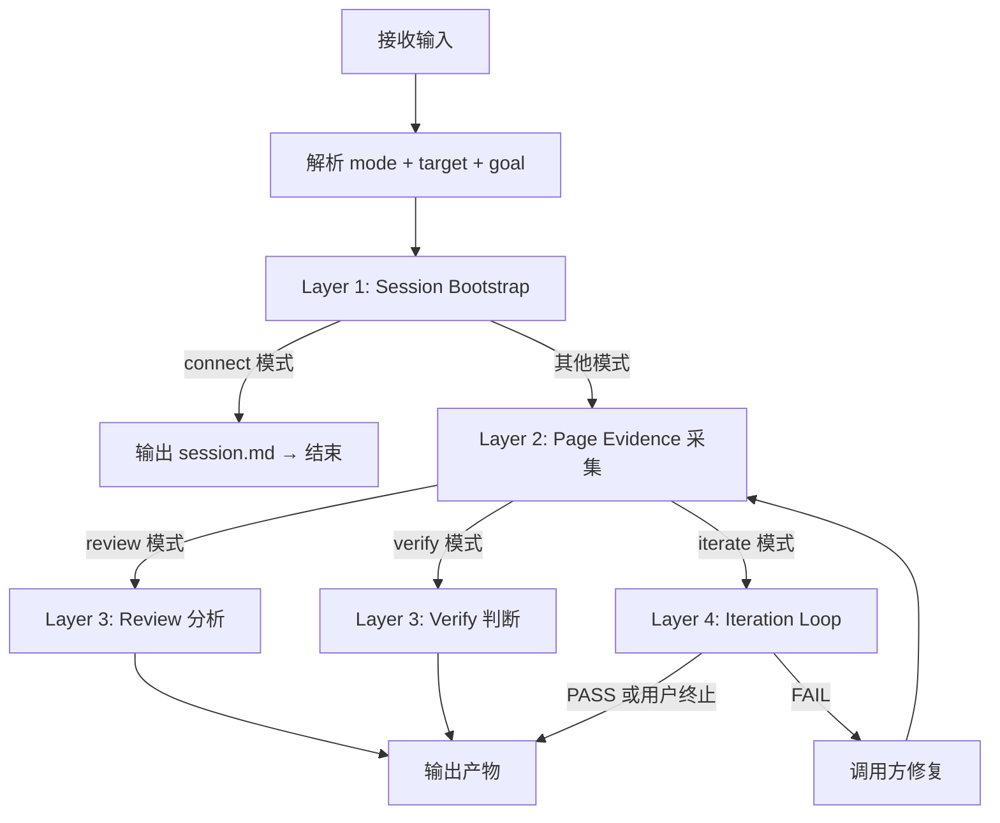
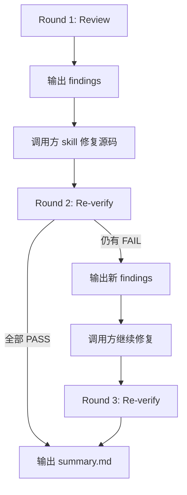

# pb-v1-brower

**版本**: 1.1.0
**状态**: 设计完成
**创建日期**: 2026-04-15
**最后更新**: 2026-04-16
**流程映射**: vNext 全流程横切（浏览器能力中台）

---

**红线声明**：浏览器是页面事实的唯一裁判，不是另一个前端 skill。绝不代替调用方做产品决策，绝不代替调用方做架构判断，绝不默认修改业务源码，绝不把"代码看起来像对的"当作通过，绝不在没有浏览器证据的情况下给出页面级 PASS。源码修复由调用方 skill 承担，本 skill 只负责观察、采集、证明。

---

## 核心规则

以下 11 条规则直接约束执行行为：

1. **浏览器事实优先** — 页面是否正确，以浏览器中的真实渲染结果为准，不以代码静态分析、设计稿描述、文字推断为准
2. **观察 + 证明，不修复** — 本 skill 输出 findings 和 verify 结论，源码修改由调用方 skill 执行。change_policy 为 caller-fixes 时严格遵守
3. **证据必须可追溯** — 每个 finding 必须附带结构化数据或截图等至少一项浏览器证据，不接受纯文字描述
4. **数据优先，截图兜底** — 功能定位优先使用结构化数据（snapshot、js、console、network、is/css 断言），截图仅用于视觉审美问题（间距、配色、字体、质感）或需要人类快速理解的证据归档。AI 识别图片不准确，能用数据定位的问题必须用数据
5. **headed 模式为准** — 连接判断以 `$B status` 输出的 `Mode: headed` 为准，不使用旧的 `Mode: cdp` 检测逻辑
6. **session 复用优先** — 优先复用已有 browser session，不重复启动浏览器。只在 session 不可用时才重建
7. **静默快速路径** — 被其他 skill 调用时，跳过教学型文案（Side Panel 指引等），只保留连接结果 + 失败恢复
8. **人机双模式** — 用户直接使用时提供可见引导和交互确认；被 skill 调用时走静默路径
9. **标准化产物** — 所有输出遵循统一目录结构和格式，便于其他 skill 机器读取
10. **失败不静默** — 连接失败、页面加载失败、验证受阻时，必须给出明确的错误信息和下一步建议
11. **默认中文输出** — 所有报告、findings、结论默认使用中文

---

## 定位差异

| 维度 | pb-v1-brower | pb-v1-demo | pb-v1-frontend | pb-v1-testing | pb-v1-reviewer |
|------|-------------|-----------|---------------|--------------|---------------|
| 核心职责 | 页面事实采集与验证 | 澄清驱动 Demo 迭代 | 视觉设计与实现 | 约束驱动测试 | 文档/规格对齐审查 |
| 是否改代码 | 否 | 是 | 是 | 否 | 否 |
| 判断依据 | 浏览器真实渲染 | 用户反馈 | 设计约束 | 验收标准 | 上游产物 |
| 产出 | findings + verify 结论 | 版本化 Demo | 生产代码 | 测试报告 | 审查报告 |
| 浏览器使用 | 核心能力 | 可选调用 | 可选调用 | 可选调用 | 可选调用 |

---

## 设计原则

1. **浏览器是唯一真相源**: 页面问题的最终判断在浏览器，不在代码、不在设计稿、不在文字描述
2. **能力中台，不是业务 skill**: 为其他 pb-v1 skill 提供统一的浏览器能力，不拥有页面产品决策
3. **观察优于干预**: 默认只观察和证明，不主动修改源码
4. **复用优于重建**: session、连接、证据都优先复用，减少重复操作
5. **证据驱动结论**: 每个 PASS/FAIL 都必须有浏览器证据支撑
6. **标准化优于自由格式**: 产物格式统一，便于跨 skill 消费
7. **结构化数据优于截图**: 功能问题用数据定位（snapshot、js、console、断言），视觉问题才用截图。数据精确、轻量、可机器消费；截图模糊、重量、仅供人类参考

---

## 四种模式

| 模式 | 用途 | 典型调用方 | 输出 |
|------|------|-----------|------|
| `connect` | 只保证浏览器 ready | 任何需要浏览器的 skill | session.md |
| `review` | 输出"页面哪里有问题" | pb-v1-demo, pb-v1-frontend | findings.json + review.md |
| `verify` | 输出"页面是否满足明确标准" | pb-v1-preview, pb-v1-reviewer, pb-v1-testing | verify.md (PASS/FAIL/BLOCKED) |
| `iterate` | 驱动多轮"发现 → 修复 → 复验"闭环 | pb-v1-frontend（视觉打磨） | 多轮 round-N 产物 + summary.md |

---

## 调用约定

1. **谁要做页面事实判断，谁先调用 pb-v1-brower**
2. **谁要改代码，谁自己改，不让 pb-v1-brower 越界**
3. **页面是否通过，以 pb-v1-brower 的 verify 结果为准**
4. **浏览器 session 由 pb-v1-brower 优先建立和修复，其他 skill 不重复造连接逻辑**

### 轻调用 vs 强调用

- **轻调用**：调用方只要求 `connect` 模式保证浏览器 ready，随后自己用 `$B` 做少量命令
- **强调用**：调用方把页面目标和验收条件交给 pb-v1-brower，由 pb-v1-brower 输出 review/verify 结论，调用方只消费产物
- **默认走强调用**，能力边界更清晰

### 与其他 pb-v1 skill 的协作

| 调用方 | 调用时机 | 推荐模式 |
|--------|---------|---------|
| pb-v1-demo | 每轮生成 demo 版本后 | review |
| pb-v1-preview | 交付前检查关键用户路径 | verify |
| pb-v1-frontend | 视觉打磨阶段 | iterate |
| pb-v1-reviewer | 需要页面事实证据时 | verify |
| pb-v1-testing | 复杂交互场景验证 | verify |

---

## 输入协议

### 最小输入

| 字段 | 类型 | 必需 | 说明 |
|------|------|------|------|
| mode | `connect` \| `review` \| `verify` \| `iterate` | 是 | 执行模式 |
| target | string | 是（connect 除外） | 页面 URL / route / local dev URL |
| goal | string | 是（connect 除外） | 本页目标，一句话 |

### 推荐输入

| 字段 | 类型 | 默认值 | 说明 |
|------|------|--------|------|
| owner_skill | string | 无 | 调用方 skill 名称，如 pb-v1-demo |
| iteration_id | string | 无 | 当前迭代编号 |
| artifact_root | string | `docs/iterations/{iteration_id}/browser` | 报告输出根目录 |
| pass_criteria | string[] | 无 | 通过条件列表（verify/iterate 模式必需） |
| focus_points | string[] | 无 | 特别关注点 |
| change_policy | `observe-only` \| `caller-fixes` | `caller-fixes` | 发现问题后的处理策略 |

### 输入示例

```yaml
mode: review
target: http://127.0.0.1:3000/dashboard
goal: 用户进入页面后 5 秒内能理解当前状态并找到下一步操作
owner_skill: pb-v1-preview
iteration_id: iter-007
artifact_root: docs/iterations/iter-007/browser
focus_points:
  - 首屏层级
  - CTA 清晰度
  - 表格溢出
change_policy: caller-fixes
```

---

## 输出协议

### 产出目录结构

```
docs/iterations/{iteration_id}/browser/
├── session.md              # 连接信息、模式、目标 URL、时间戳
├── round-1-review.md       # 第 1 轮问题与证据
├── round-1-findings.json   # 供其他 skill 机器读取
├── round-1-snapshot.txt    # 页面快照（默认采集）
├── round-1-console.log     # 控制台日志（默认采集）
├── round-1-network.log     # 网络请求日志（按需采集）
├── round-1-visual.png      # 视觉问题截图（按需采集）
├── round-1-evidence.png    # 人类证据截图（按需采集）
├── round-2-verify.md       # 第 2 轮验收结论
└── summary.md              # 最终结论
```

### findings.json 格式

```json
[
  {
    "id": "F-001",
    "severity": "critical | major | minor | cosmetic",
    "category": "layout | interaction | state | visual | text | performance | a11y",
    "title": "主表格在 1280px 下出现横向溢出",
    "evidence_type": "data",
    "evidence": ["round-1-snapshot.txt"],
    "data_evidence": {
      "docScrollWidth": 1440,
      "docClientWidth": 1280,
      "hasOverflow": true
    },
    "impact": "用户首屏看不到完整列信息",
    "suggestion": "压缩非核心列宽，或改为可折叠详情",
    "route": "/dashboard"
  },
  {
    "id": "F-002",
    "severity": "cosmetic",
    "category": "visual",
    "title": "按钮间距不协调",
    "evidence_type": "screenshot",
    "evidence": ["round-1-visual.png"],
    "impact": "视觉层级不清晰",
    "suggestion": "统一按钮间距为 16px",
    "route": "/dashboard"
  }
]
```

### 结论格式

```yaml
status: PASS | FAIL | BLOCKED
mode: review | verify | iterate
target: http://127.0.0.1:3000/dashboard
owner_skill: pb-v1-preview
round: 2
session_mode: headed
findings_count: 3
critical_count: 0
major_count: 1
next_action: 修复右侧表格横向溢出后再次验证
```

---

## 内部分层架构

```
Layer 4: Iteration Contract    — round 管理、artifacts 命名、next action 输出
Layer 3: Review / Verify Logic — review heuristics、pass/fail 判断、findings 标准化
Layer 2: Evidence Collection   — 证据采集策略：默认数据采集 + 按需截图
Layer 1: Session Bootstrap     — 发现 $B、pre-flight cleanup、connect/status/focus/disconnect
```

---

## Layer 2: 证据采集策略

### 默认采集（所有模式）

每次进入页面后，默认执行以下轻量级数据采集：

```bash
$B chain '[
  ["goto","{target}"],
  ["wait","--load"],
  ["console","--clear"],
  ["snapshot","-i","-o","{artifact_root}/round-{N}-snapshot.txt"],
  ["console","--errors","-o","{artifact_root}/round-{N}-console.log"]
]'
```

**采集内容**：
- `snapshot -i` — 页面结构、可交互元素（button/a/input）、文本锚点
- `console --errors` — 运行时 JS 错误

**不默认采集**：
- 截图（除非后续判断需要）
- network 日志（除非 focus_points 明确要求或发现接口问题）

---

### 按需采集：功能定位（优先数据）

当需要定位以下功能问题时，使用结构化数据而非截图：

#### 1. 白屏 / 空白页

```bash
# 检查 DOM 是否为空、根节点高度、关键文案是否存在
$B js '
JSON.stringify({
  bodyChildCount: document.body.children.length,
  bodyHeight: document.body.offsetHeight,
  rootHeight: document.documentElement.offsetHeight,
  hasMainContent: !!document.querySelector("main, [role=main], #root > div"),
  firstText: (document.body.innerText || "").trim().slice(0, 100)
}, null, 2)'

# 检查 console 是否有致命错误
$B console --errors
```

#### 2. 按钮不可点 / 元素不可交互

```bash
# 检查元素状态
$B is visible "button.submit"
$B is enabled "button.submit"

# 检查样式属性
$B css "button.submit" "pointer-events"
$B css "button.submit" "opacity"

# 检查元素位置和遮挡
$B js '
const btn = document.querySelector("button.submit");
if (!btn) { JSON.stringify({error: "元素不存在"}); }
else {
  const rect = btn.getBoundingClientRect();
  const style = getComputedStyle(btn);
  JSON.stringify({
    x: rect.x, y: rect.y, w: rect.width, h: rect.height,
    display: style.display,
    visibility: style.visibility,
    opacity: style.opacity,
    pointerEvents: style.pointerEvents,
    zIndex: style.zIndex
  }, null, 2);
}'
```

#### 3. 元素未显示 / 隐藏

```bash
# 检查 display/visibility/opacity
$B css "selector" "display"
$B css "selector" "visibility"
$B css "selector" "opacity"

# 检查尺寸是否为 0
$B js '
const el = document.querySelector("selector");
const rect = el?.getBoundingClientRect();
JSON.stringify({
  exists: !!el,
  width: rect?.width || 0,
  height: rect?.height || 0
}, null, 2)'
```

#### 4. 布局溢出 / 错位

```bash
# 检查横向溢出
$B js '
JSON.stringify({
  docClientWidth: document.documentElement.clientWidth,
  docScrollWidth: document.documentElement.scrollWidth,
  bodyClientWidth: document.body.clientWidth,
  bodyScrollWidth: document.body.scrollWidth,
  hasOverflow: document.documentElement.scrollWidth > document.documentElement.clientWidth
}, null, 2)'

# 检查元素是否超出容器
$B js '
const container = document.querySelector(".container");
const child = document.querySelector(".child");
const cRect = container?.getBoundingClientRect();
const chRect = child?.getBoundingClientRect();
JSON.stringify({
  containerRight: cRect?.right,
  childRight: chRect?.right,
  overflows: chRect?.right > cRect?.right
}, null, 2)'
```

#### 5. 状态错误 / 数据错误

```bash
# 检查 DOM 状态
$B is checked "input[type=checkbox]"
$B is editable "input.username"

# 检查 data attributes
$B attrs "div.status" "data-state"

# 检查文本内容
$B text "div.error-message"

# 检查 localStorage / sessionStorage
$B js 'JSON.stringify({
  token: localStorage.getItem("token"),
  user: localStorage.getItem("user")
}, null, 2)'
```

#### 6. 接口问题 / 资源加载失败

```bash
# 检查网络请求
$B network -o "{artifact_root}/round-{N}-network.log"

# 检查控制台错误（已在默认采集中）
$B console --errors
```

---

### 按需采集：视觉审美（必须截图）

以下问题**必须截图**，因为结构化数据无法表达视觉质感：

1. **间距问题**：元素间距过大/过小、padding/margin 不协调
2. **配色问题**：颜色搭配不和谐、对比度不足、品牌色偏差
3. **字体问题**：字号层级不清晰、字重不合理、字体渲染模糊
4. **质感问题**：阴影、圆角、渐变、透明度等视觉细节
5. **视觉层级**：整体布局的视觉权重分布

```bash
# 视觉问题必须截图
$B screenshot -o "{artifact_root}/round-{N}-visual.png"
```

---

### 按需采集：人类证据归档

以下场景需要补充截图，作为人类快速理解的证据：

1. **断言失败**：结构化数据已定位问题，补 1 张截图便于人类快速理解上下文
2. **最终交付**：verify PASS 时，留 1 张截图作为归档证据
3. **复杂布局问题**：虽然数据已定位，但布局复杂，截图能帮助人类快速理解

```bash
# 补充人类证据
$B screenshot -o "{artifact_root}/round-{N}-evidence.png"
```

---

### 证据类型标记

在 findings.json 中，每个 finding 必须标记证据类型：

```json
{
  "id": "F-001",
  "evidence_type": "data | screenshot | hybrid",
  "evidence": [
    "round-1-snapshot.txt",
    "round-1-console.log"
  ],
  "data_evidence": {
    "hasOverflow": true,
    "docScrollWidth": 1440,
    "docClientWidth": 1280
  }
}
```

- `data`: 纯结构化数据定位（snapshot、js、console、network、断言）
- `screenshot`: 纯截图证据（视觉问题）
- `hybrid`: 数据 + 截图（数据定位 + 人类归档）

---

## 执行流程

### 总流程



---

### Layer 1: Session Bootstrap

**目的**: 确保 headed browser 可用

#### Step 1.0: 发现 $B

```bash
_ROOT=$(git rev-parse --show-toplevel 2>/dev/null)
B=""
[ -n "$_ROOT" ] && [ -x "$_ROOT/.claude/skills/gstack/browse/dist/browse" ] && B="$_ROOT/.claude/skills/gstack/browse/dist/browse"
[ -z "$B" ] && B=~/.claude/skills/gstack/browse/dist/browse
if [ -x "$B" ]; then
  echo "READY: $B"
else
  echo "NEEDS_SETUP"
fi
```

如果 `NEEDS_SETUP`：
1. 告知用户需要一次性构建 browse（约 10 秒）
2. 运行 `cd ~/.claude/skills/gstack/browse && ./setup`

#### Step 1.1: Pre-flight Cleanup

```bash
# 清理 stale browse server
if [ -f "$(_ROOT=$(git rev-parse --show-toplevel 2>/dev/null) && echo $_ROOT)/.gstack/browse.json" ]; then
  _OLD_PID=$(cat "$(git rev-parse --show-toplevel)/.gstack/browse.json" 2>/dev/null | grep -o '"pid":[0-9]*' | grep -o '[0-9]*')
  [ -n "$_OLD_PID" ] && kill "$_OLD_PID" 2>/dev/null || true
  sleep 1
  [ -n "$_OLD_PID" ] && kill -9 "$_OLD_PID" 2>/dev/null || true
  rm -f "$(git rev-parse --show-toplevel)/.gstack/browse.json"
fi
# 清理 Chromium profile locks
_PROFILE_DIR="$HOME/.gstack/chromium-profile"
for _LF in SingletonLock SingletonSocket SingletonCookie; do
  rm -f "$_PROFILE_DIR/$_LF" 2>/dev/null || true
done
echo "Pre-flight cleanup done"
```

#### Step 1.2: 检测现有 session

```bash
$B status 2>/dev/null
```

- 如果输出包含 `Mode: headed` → session 可用，跳过 connect
- 如果输出包含 `Mode: launched` → session 可用，跳过 connect
- 如果失败或无输出 → 需要 connect

#### Step 1.3: Connect

```bash
$B connect
```

连接后验证：

```bash
$B status
```

确认输出包含 `Mode: headed`。如果不是 headed 模式，输出错误信息和恢复建议。

#### Step 1.4: 人机模式分支

- **用户直接使用**（无 owner_skill）：展示 Side Panel 引导，使用 AskUserQuestion 确认浏览器可见
- **skill 调用**（有 owner_skill）：静默路径，只输出连接结果，不展示教学文案

#### Step 1.5: 输出 session.md

```markdown
## Browser Session

- **时间**: {ISO8601}
- **模式**: headed
- **端口**: 34567
- **目标**: {target}
- **调用方**: {owner_skill | 用户直接使用}
- **状态**: connected
```

**connect 模式到此结束。其他模式继续。**

---

## Shell 调用约束

**目的**: 统一 browse 命令的 shell 调用方式，避免触发权限审批，减少跨目录写文件和复杂 shell 包装

### 链式操作标准写法

**推荐**: 使用 `browse chain '<JSON>'` 一次性完成多步操作

```bash
# 默认采集模板（不截图）
$B chain '[
  ["goto","http://127.0.0.1:3000/dashboard"],
  ["wait","--load"],
  ["console","--clear"],
  ["snapshot","-i","-o","docs/iterations/iter-007/browser/round-1-snapshot.txt"],
  ["console","--errors"]
]'
```

**关键约束**:
1. **JSON 格式**: 每个命令是一个数组 `["command", "arg1", "arg2", ...]`
2. **字符串引号**: JSON 内的 JS 字符串优先用双引号，减少转义（如 `"document.querySelector(\"button\")"` 改为 `'document.querySelector("button")'` 后在 JSON 中写成 `"document.querySelector(\"button\")"`）
3. **文件路径**: 截图/快照优先写到当前仓库的 `docs/iterations/{iteration_id}/browser/` 或 `/tmp`，避免跨目录写文件
4. **禁止 heredoc/pipe**: 不使用 `cat <<'EOF' | browse chain`，不使用 `echo '...' | browse chain`

### 单命令 fallback

当只需要一个命令时，可以直接调用：

```bash
$B goto "http://127.0.0.1:3000"
$B screenshot "docs/iterations/iter-007/browser/round-1-full.png"
```

### 证据保存约定

**控制台和网络日志**: 由调用方保存 stdout，不使用 shell 重定向

```bash
# 推荐
$B console --errors > docs/iterations/iter-007/browser/round-1-console.log

# 不推荐（复杂包装）
bash -c "$B console --errors | tee -a logs/console.log"
```

**截图和快照**: 直接在命令中指定输出路径

```bash
# 推荐（按需截图）
$B screenshot "docs/iterations/iter-007/browser/round-1-visual.png"  # 视觉问题
$B screenshot "docs/iterations/iter-007/browser/round-1-evidence.png"  # 人类归档
$B snapshot -i -o "docs/iterations/iter-007/browser/round-1-snapshot.txt"

# 不推荐（跨目录写文件）
$B screenshot "/Users/xxx/other-project/screenshot.png"
```

---

### Layer 2: Page Evidence 采集

**目的**: 打开目标页面，采集结构化证据，按需补充截图

#### Step 2.1: 导航到目标页面

```bash
$B goto {target}
```

等待页面加载完成。如果加载失败（超时、404、500），记录错误并输出 BLOCKED 结论。

#### Step 2.2: 默认数据采集（轻量级）

优先一次 chain 完成默认采集（不截图）：

```bash
$B chain '[
  ["wait","--load"],
  ["console","--clear"],
  ["snapshot","-i","-o","{artifact_root}/round-{N}-snapshot.txt"],
  ["console","--errors"]
]'
```

如果 chain 失败，降级为单命令逐条执行：

```bash
$B snapshot -i -o "{artifact_root}/round-{N}-snapshot.txt"
$B console --errors > "{artifact_root}/round-{N}-console.log"
```

**不默认采集**：
- 截图（除非后续判断需要）
- network 日志（除非 focus_points 明确要求或发现接口问题）

#### Step 2.3: 按需补充证据

根据 focus_points 和问题类型，补充结构化数据或截图：

**功能问题** → 使用 js/is/css/attrs/text 查询：
```bash
# 示例：检查按钮状态
$B is visible "button.submit"
$B is enabled "button.submit"
$B css "button.submit" "pointer-events"
```

**视觉问题** → 必须截图：
```bash
$B screenshot "{artifact_root}/round-{N}-visual.png"
```

**人类归档** → 补充 1 张截图：
```bash
$B screenshot "{artifact_root}/round-{N}-evidence.png"
```

---

### Layer 3: Review / Verify Logic

#### Review 模式

**目的**: 从多维度分析页面问题，输出结构化 findings

**Review Heuristics（评审启发式规则）**：

| # | 维度 | 检查要点 |
|---|------|---------|
| 1 | 首屏可理解性 | 用户 5 秒内能否理解当前状态并找到下一步操作 |
| 2 | 信息层级 | 主次层级是否清楚，视觉权重是否匹配内容重要性 |
| 3 | CTA 清晰度 | 主要行动按钮是否明显、可点击、文案明确 |
| 4 | 文案一致性 | 术语、语气、格式是否统一 |
| 5 | 布局完整性 | 是否有溢出、遮挡、折行异常、空白过大 |
| 6 | 状态处理 | 空态、加载态、错误态是否合理展示 |
| 7 | 表单反馈 | 输入验证、提交反馈是否清楚 |
| 8 | 响应式 | 桌面端和移动端是否都可用 |
| 9 | 核心路径 | 关键用户流程是否能走通 |
| 10 | 控制台/网络 | 是否有明显的 JS 错误、请求失败、性能问题 |

**执行步骤**：

1. 基于 Layer 2 默认采集的 snapshot + console 先做结构化分析
2. 对功能问题，优先补充 js/is/css/attrs/text 等数据证据
3. 对视觉问题，补充截图证据
4. 对每个发现的问题，生成标准化 finding（含 id、severity、category、evidence、evidence_type）
5. 输出 `round-{N}-review.md`（人类可读）和 `round-{N}-findings.json`（机器可读）

**severity 判定标准**：

| 级别 | 定义 |
|------|------|
| critical | 核心路径不可用，用户无法完成主要任务 |
| major | 功能可用但体验严重受损，影响大部分用户 |
| minor | 局部问题，不影响核心功能但影响体验 |
| cosmetic | 视觉瑕疵，不影响功能和主要体验 |

#### Verify 模式

**目的**: 判断页面是否满足明确的 pass_criteria，输出 PASS/FAIL/BLOCKED

**执行步骤**：

1. 基于 Layer 2 默认采集的 snapshot + console 先做结构化断言
2. 对每条 pass_criteria，优先使用数据断言：
   - 元素存在性 → `snapshot -i` 或 `$B js 'document.querySelector(...)'`
   - 元素可见性 → `$B is visible`
   - 元素状态 → `$B is enabled|checked|editable`
   - 样式属性 → `$B css`
   - 文本内容 → `$B text`
   - 控制台无错误 → `console --errors` 输出为空
   - 接口成功 → `$B network` 无 4xx/5xx
3. 断言通过 → 不截图，直接输出 PASS
4. 断言失败 → 补充 1 张截图作为人类证据，输出 FAIL + 失败原因
5. 页面无法加载或断言无法执行 → 输出 BLOCKED + 阻塞原因

**输出格式**：

```yaml
status: PASS | FAIL | BLOCKED
criteria_results:
  - criterion: "登录按钮在首屏可见"
    result: PASS
    evidence_type: data
    evidence: ["round-1-snapshot.txt"]
    data_evidence:
      selector: "button.login"
      visible: true
  - criterion: "控制台无 JS 错误"
    result: FAIL
    evidence_type: hybrid
    evidence: ["round-1-console.log", "round-1-evidence.png"]
    data_evidence:
      errorCount: 2
      errors: ["TypeError: Cannot read property 'x' of undefined"]
```

---

### Layer 4: Iteration Contract

**目的**: 驱动多轮"发现 → 修复 → 复验"闭环

#### iterate 模式执行流程



**执行步骤**：

1. **Round 1**: 执行 review 模式，先输出基于结构化数据的问题结论；视觉问题按需截图
2. **等待修复**: 输出 next_action，等待调用方 skill 完成修复
3. **Round N (N≥2)**: 重新采集数据证据，对上一轮 findings 逐条复验
   - 已修复 → 标记 RESOLVED
   - 未修复 → 保留，severity 不变
   - 新问题 → 追加新 finding
4. **每轮截图策略**：
   - 功能定位轮次 → 默认不截图
   - 视觉打磨轮次 → 按需截图
   - 最终归档轮次 → 补 1 张截图
5. **终止条件**：
   - 全部 findings RESOLVED → 输出 PASS
   - 用户/调用方明确终止 → 输出当前状态
   - 连续 3 轮无改善 → 建议终止并输出 BLOCKED
6. **输出 summary.md**: 汇总所有轮次的演进过程和最终结论

#### Round 产物命名规则

- `round-{N}-review.md` — 第 N 轮 review 报告
- `round-{N}-findings.json` — 第 N 轮 findings（机器可读）
- `round-{N}-verify.md` — 第 N 轮 verify 结论
- `round-{N}-snapshot.txt` — 第 N 轮页面快照（默认采集）
- `round-{N}-console.log` — 第 N 轮控制台日志（默认采集）
- `round-{N}-network.log` — 第 N 轮网络日志（按需采集）
- `round-{N}-visual.png` — 第 N 轮视觉问题截图（按需采集）
- `round-{N}-evidence.png` — 第 N 轮人类证据截图（按需采集）

---

## 失败恢复

| 故障场景 | 检测方式 | 恢复策略 |
|---------|---------|---------|
| browse server 挂掉 | `$B status` 无响应 | 执行 pre-flight cleanup → 重新 connect |
| 浏览器窗口丢失 | `$B status` 返回但无 URL | `$B focus` 尝试恢复，失败则重新 connect |
| profile lock 冲突 | connect 报 lock 错误 | 清理 SingletonLock/Socket/Cookie → 重试 |
| 页面加载超时 | goto 超时 | 重试一次，仍失败则输出 BLOCKED |
| 目标服务未启动 | goto 返回 connection refused | 提示用户启动 dev server，输出 BLOCKED |

---

## Review Heuristics 详细说明

### 1. 首屏 5 秒可理解性

- 打开页面后，通过 snapshot 检查首屏结构和文本锚点
- 判断：用户能否在 5 秒内理解"我在哪""当前状态是什么""下一步做什么"
- 如果首屏被无关信息占据、关键信息被折叠、没有明确的行动指引 → finding

### 2. 主次层级

- 通过 snapshot 和 js 查询检查视觉权重（字号、颜色、位置）是否匹配内容重要性
- 主标题 > 副标题 > 正文 > 辅助信息，层级是否清晰
- 如果所有元素视觉权重相近、重要信息不突出 → finding（需截图证明）

### 3. CTA 清晰度

- 优先检查主要行动按钮是否存在、可见、可点击
- 使用 `$B is visible`、`$B is enabled`、`$B css <selector> pointer-events` 做断言
- 按钮文案是否明确（"提交订单" vs "确定"）
- 是否有多个同等权重的 CTA 造成选择困难 → finding（视觉权重问题需截图）

### 4. 布局完整性

- 优先使用 js 检查是否有横向溢出（`scrollWidth > clientWidth`）
- 使用 js 检查元素位置判断是否有遮挡、重叠
- 检查是否有异常折行、空白过大
- 使用 snapshot 中的元素尺寸信息辅助判断
- 功能性布局问题用数据定位，视觉性布局问题（间距不协调）需截图

### 5. 控制台与网络

- 优先检查控制台是否有 JS 错误（使用 `console --errors`，排除已知的第三方库警告）
- 检查网络请求是否有 4xx/5xx 错误（使用 `network`）
- 检查是否有明显的性能问题（请求过多、响应过慢）
- 这些问题都用结构化数据定位，不需要截图

---

## 与 open-gstack-browser 的关系

本 skill 的 Layer 1 (Session Bootstrap) 直接复用 open-gstack-browser 的核心链路：

- **复用**: browse binary 发现、stale server 清理、profile lock 清理、`$B connect`、`$B status`
- **保留（用户直用时）**: Side Panel 引导（Step 3~5 的教学文案）
- **跳过（skill 调用时）**: 所有教学型文案，只保留连接结果 + 失败恢复

**关键区别**: open-gstack-browser 是"打开浏览器"的独立 skill；pb-v1-brower 是"用浏览器做页面级事实判断"的能力中台，连接只是它的第一步。
