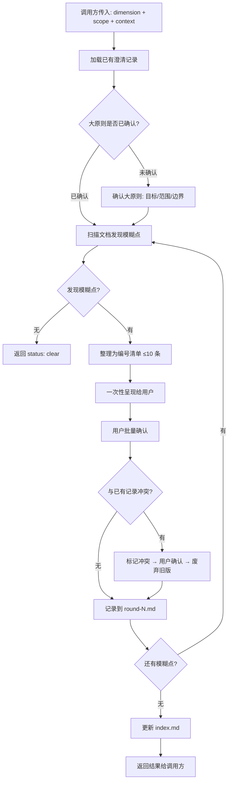

# pb-v1-clarify

**版本**: 1.0.0
**状态**: 设计完成
**创建日期**: 2026-04-16
**最后更新**: 2026-04-16
**流程映射**: vNext 全阶段（被其他 Skill 调用）

---

**红线声明**：澄清是逐步收敛约束的过程，不是一次性问卷。模糊是信号，不是缺陷——影响实现的模糊点必须澄清，不能用假设替代。但澄清要高效：先确认大原则，再批量发现模糊点，批量确认。澄清记录是后续执行的可靠参照，必须持久化、可索引、唯一版本。当后续澄清与前面冲突时，必须标记冲突、确认后保留唯一生效版本。

---

## 核心哲学

> 澄清是约束收敛：每一轮对话都在缩小实现的可能空间，直到只剩下一条确定的路径。澄清不是收集信息，是消除歧义——让"可以这样也可以那样"变成"就这样"。

### 对抗的模型惯性

| 模型惯性 | 真实情况 |
|---------|---------|
| 先做出来再说，遇到问题再改 | 方向性错误的返工成本是细节调整的 10 倍。影响实现方向的模糊点必须在动手前消除 |
| 一次把所有问题问完最高效 | 分层比一次到底高效。大原则不确认，细节讨论就是空中楼阁 |
| 用户说什么就记什么 | 未经挑战的前提是最危险的输入。"用户说需要"不等于"确实需要"，前提必须经过验证才能成为约束 |
| 问得越细越好 | 不影响实现方向的细节，做出来再调比提前讨论高效。抽象讨论"按钮放哪"不如看到实物后说"移到右边" |
| 澄清是阻碍进度的开销 | 澄清是避免无效进度的投资。困惑暴露在前比错误暴露在后成本低一个数量级 |
| 澄清完一次就够了 | 约束是活的。实现过程会暴露新的模糊点，迭代产物会改变之前的判断。澄清是贯穿始终的循环，不是一次性动作 |

### 思考框架

1. **先诊断再处方** — 在消除模糊之前，先确认问题本身是否正确。澄清的第一步不是"这个怎么做"，而是"我们在做什么、为谁做、不做什么"。大原则错了，后续所有澄清都在浪费时间。

2. **前提必须经过挑战才能成为约束** — 调用方传入的上下文是起点，不是真理。"proposal.md 中说用户需要 X"只说明有人这样写了，不说明 X 是确认的约束。澄清过程中要区分**已确认的事实**和**未经验证的假设**，只有前者可以作为后续执行的依据。

3. **模糊是信号，不是缺陷** — 发现模糊点不是质量差的证据，是理解在深入的信号。多种解释并存时，全部呈现，不默默选择一种。用户的决策比 AI 的猜测更可靠。

4. **约束收敛的终态是零假设残留** — 澄清充分的标志不是"问了很多问题"，而是"执行方不需要猜测任何决策"。每个影响实现的点都有明确的、经过确认的结论。达到这个状态就停止，过度澄清和不足澄清一样浪费。

5. **顾问式参与，不是问卷式采集** — 澄清不是让用户填表。每个模糊点应附带从文档推导的推荐选项和理由。用户的角色是决策者，不是信息提供者。"你觉得 A 还是 B？我基于 X 推荐 A"比"请问你想要什么？"有价值得多。

### 判断锚点

- **成功标准**：调用方拿到澄清结果后，可以不做任何猜测地开始执行
- **停止条件**：当前维度的所有影响实现的模糊点都有明确结论，且无活跃冲突
- **切换条件**：发现的模糊点超出当前维度 → 建议调用方在其他维度触发新一轮澄清

---

## 事实说明

以下是澄清场景中模型容易忽略的事实，作为推理原料：

1. **用户的第一版回答往往不是最终答案** — "我们需要实时推送"可能在追问后变成"其实 5 分钟刷新就够了"。第一轮澄清建立方向，后续轮次才收敛细节。不要在第一轮就锁死所有结论。

2. **文档中的描述和真实意图之间有缝隙** — proposal.md 写的是结构化的输出，不是完整的思考过程。"支持多种输入格式"可能意味着 2 种，也可能意味着 20 种。数字、范围、枚举类的描述必须追问到具体值。

3. **"都可以"是最危险的回答** — 当用户对 A/B 选项说"都行"，通常意味着两件事之一：(a) 用户没有想清楚，或 (b) 这个问题不影响他关心的东西。前者需要追问，后者可以做默认选择并记录。区分这两种情况是澄清的关键能力。

4. **冲突通常不是"前面错了"，而是"理解深入了"** — Round 3 推翻 Round 1 的结论，不是 Round 1 的失败。是因为看到了 Demo 实物、经历了架构推演之后，理解自然演进。冲突处理的心态是"更新认知"，不是"纠正错误"。

5. **跨维度的约束互相影响** — 产品维度决定"做什么"，架构维度决定"能怎么做"。一个看似合理的产品需求可能在架构层面代价巨大。澄清时要有意识地检查跨维度一致性，必要时引用其他维度的已有结论。

6. **澄清的 ROI 不是线性的** — 前 3 个模糊点的澄清可能消除 80% 的实现风险，后 7 个只消除 20%。优先澄清影响面最大的模糊点。不是所有模糊点都同等重要。

---

## 设计原则

1. **约束收敛优于信息采集** — 澄清的目标是缩小实现的可能空间，不是收集更多信息。每轮澄清后，不确定性应该可量化地减少。
2. **分层优于一次到底** — 大原则 → 影响实现的模糊点 → 不影响实现的细节（留给迭代）。层级之间有依赖关系，不可跳过。
3. **批量发现优于逐条沟通** — 同维度的模糊点一次性发现、一次性呈现。沟通效率是核心约束。
4. **前提挑战优于假设接受** — 未经验证的假设不能成为约束。每条结论必须追溯到用户确认或文档事实。
5. **唯一版本优于历史堆积** — 每个澄清结论只有一个生效版本。冲突必须解决，不留歧义。
6. **顾问式推荐优于开放式提问** — 每个模糊点附带推荐选项和理由，用户做决策者。

---

## 核心规则

1. **澄清是收敛过程** — 通过逐步明确约束，从模糊走向清晰。每轮澄清都在缩小实现的不确定性范围。目标：澄清足够明确时，后续执行零模糊点。
2. **分层澄清** — 先确认大原则（目标、范围、边界），再发现影响实现的模糊点。大原则不确认，细节澄清没有意义。
3. **批量高效** — 一次性发现同维度所有影响实现的模糊点（每批不超过 10 条），批量呈现、批量确认。不一条条来回沟通。
4. **多维度约束** — 澄清覆盖多个维度（产品、架构、交互、边界、数据等），每个维度独立管理，互相可引用。
5. **唯一生效版本** — 每个澄清结论只有一个生效版本。后续澄清与前面冲突时，标记冲突、用户确认、废弃旧版、生效新版。历史保留但标记为已废弃。
6. **持久化可索引** — 澄清按迭代/维度/轮次存储，支持后续任何 skill 回查引用。
7. **被调用，不独立触发** — 本 Skill 是工具，由其他 skill 在需要澄清时调用，传入维度和上下文。

---

## 澄清维度

| 维度 ID | 维度名称 | 澄清什么 | 典型调用方 |
|---------|---------|---------|-----------|
| product | 产品 | 用户目标、核心场景、产品边界、MVP 范围 | discovery, demo |
| architecture | 架构 | 技术选型、系统边界、模块划分、数据流 | designing |
| interaction | 交互 | 页面模块组成、交互模式、状态流转 | demo, frontend |
| boundary | 边界 | 做什么/不做什么、输入输出约束、异常处理 | drafting, discovery |
| data | 数据 | 数据结构、字段定义、实体关系、mock 规则 | drafting, implementing |
| requirement | 需求 | 功能规格、优先级、验收标准 | drafting, discovery |

调用方可传入上述维度 ID，也可传入自定义维度（如 `security`、`performance`）。

---

## 澄清场景

### 场景 A：基于文档的澄清

- **触发**：调用方在执行前发现文档中的模糊点
- **输入**：proposal.md、feature-specs 等文档
- **特征**：模糊点来自文档分析
- **流程**：标准执行流程（扫描文档 → 发现模糊点 → 批量呈现 → 用户确认）

### 场景 B：基于实物的澄清

- **触发**：用户看到 Demo/原型后给出反馈，反馈不够明确或涉及原则
- **输入**：
  - 用户反馈原文
  - 当前 Demo 的截图或 .pen 文件路径
  - 当前执行的规格摘要
- **特征**：模糊点来自用户对实物的反应
- **与场景 A 的区别**：
  - 用户已经看到了具体的东西，讨论更具象
  - 反馈可能只覆盖局部，但可能暗示更广的原则
  - 需要区分"用户明确说的"和"模型推演的"

#### 场景 B 的执行流程

1. **解析反馈**
   - 提取用户明确指出的具体问题
   - 识别反馈是否暗示更广的原则

2. **分类处理**

   **情况 1：单点问题，无原则暗示**
   - 直接转化为澄清结论
   - source_classification: `user_confirmed`
   - 示例："把这个标题改成'我的作品'" → 直接记录

   **情况 2：单点问题，暗示更广原则**
   - 用户明确指出的部分 → `user_confirmed`
   - 推演到同类场景的部分 → `model_inferred`，标记为待确认
   - 示例："去掉 9:16" →
     - `user_confirmed`: 去掉当前位置的 "9:16" 文案
     - `model_inferred`: 所有技术参数（比例、分辨率等）不出现在用户界面 → 待确认

   **情况 3：原则性反馈**
   - 提炼原则，提供推荐选项
   - 全部标记为 `model_inferred` 直到用户确认
   - 示例："这种风格不对" → 需要追问期望的风格

3. **用户语言审计**（可选，当反馈涉及术语/文案时触发）
   - 扫描当前 Demo 中的所有文本
   - 识别非用户语言的术语
   - 列为待确认的推演项

4. **输出**
   - 更新 clarification round 文件
   - 每条结论标注 source_classification

---

## 调用协议

### 调用方传入

```
{
  dimension: "product" | "architecture" | "interaction" | "boundary" | "data" | "requirement" | 自定义,
  iteration_path: "docs/iterations/xxx",        # 迭代目录路径
  scope: "本次澄清的范围描述",                    # 一句话说明澄清什么
  context: ["proposal.md", "feature-specs/"],    # 已有文档路径列表
  reference: "可选，对照/参考信息或路径",           # 可选
  artifact: {                                    # 可选，基于实物澄清时传入
    type: "demo",                                # 实物类型
    path: "demo-output/",                        # 实物路径
    screenshot: "path/to/screenshot.png",        # 截图路径（可选）
    version: "v3"                                # 当前版本
  },
  user_feedback: "用户反馈原文"                    # 可选，基于实物澄清时传入
}
```

### 返回

```
{
  round_file: "docs/iterations/xxx/clarifications/product/round-1.md",  # 本轮记录路径
  clarifications: [...],       # 本轮澄清结论列表
  conflicts: [...],            # 与已有记录的冲突项（如有）
  status: "clear" | "partial" | "blocked"
    # clear: 该维度无模糊点
    # partial: 部分澄清，还需后续轮次
    # blocked: 需要更多信息，无法继续
}
```

---

## 存储结构

```
docs/iterations/{iteration_id}/
├── proposal.md
├── feature-specs/
├── architecture.md
├── ...（现有产物）
└── clarifications/                    # 澄清目录
    ├── index.md                       # 澄清索引（全维度汇总）
    ├── product/                       # 产品维度
    │   ├── round-1.md                 # 第 1 轮澄清
    │   ├── round-2.md                 # 第 2 轮澄清
    │   └── ...
    ├── architecture/                  # 架构维度
    │   ├── round-1.md
    │   └── ...
    ├── interaction/                   # 交互维度
    │   └── ...
    ├── boundary/                      # 边界维度
    │   └── ...
    └── {自定义维度}/
        └── ...
```

---

## 文件格式

### round-N.md（每轮澄清记录）

```markdown
---
dimension: product
round: 1
scope: "OHLCV 价格接受度地图的产品边界澄清"
caller: pb-v1-discovery
status: 生效
created: 2026-04-16
updated: 2026-04-16
---

# 产品维度 - Round 1

## 大原则确认

### 目标
{本次澄清服务的目标，一句话}

### 范围
- 包含: ...
- 不包含: ...

### 参考/对照
{如有参考信息，记录在此}

---

## 澄清清单

### CLR-P-001: {澄清标题}
- **模糊点**: {描述不明确的地方}
- **影响范围**: {影响哪个模块/功能/决策}
- **推荐选项**: {从文档推导的建议}
- **结论**: {用户确认的结论}
- **来源分类**: user_confirmed | model_inferred
- **状态**: 生效 | 待确认
- **确认时间**: 2026-04-16

### CLR-P-002: {澄清标题}
- **模糊点**: ...
- **影响范围**: ...
- **推荐选项**: ...
- **结论**: ...
- **来源分类**: ...
- **状态**: ...
- **确认时间**: ...

---

## 冲突处理

{如本轮有与历史记录冲突的结论，记录在此}

### 冲突 1: CLR-P-003 与 Round 1 CLR-P-001 冲突
- **旧结论**: {Round 1 的结论}
- **新结论**: {本轮的结论}
- **用户决策**: 采用新结论
- **处理**: Round 1 CLR-P-001 标记为"已废弃（被 Round 2 CLR-P-003 替代）"
```

### index.md（澄清索引）

```markdown
# 澄清索引

## 元信息
- **迭代**: {iteration_id}
- **创建时间**: 2026-04-16
- **最后更新**: 2026-04-16
- **澄清完成度**: 产品 ✓ | 架构 ✓ | 交互 进行中 | 边界 未开始

---

## 产品维度 (product)

| ID | 标题 | 结论摘要 | 状态 | 来源 |
|----|------|---------|------|------|
| CLR-P-001 | 产品边界 | 不包含历史回测 | 生效 | round-1.md |
| CLR-P-002 | MVP 范围 | P0 仅含实时价格 | 生效 | round-1.md |
| CLR-P-003 | 数据刷新频率 | 改为 5 秒 | 生效 | round-2.md |
| ~~CLR-P-001~~ | ~~产品边界~~ | ~~不包含历史回测~~ | 已废弃(→CLR-P-005) | round-1.md |

## 架构维度 (architecture)

| ID | 标题 | 结论摘要 | 状态 | 来源 |
|----|------|---------|------|------|
| CLR-A-001 | 数据源选型 | 使用 Binance WebSocket | 生效 | round-1.md |

## 交互维度 (interaction)

...

---

## 活跃冲突（需要解决）

{如果有未解决的冲突，列在此处}

无。
```

---

## 执行流程

### 被调用时的执行流程



### Step 1: 加载上下文

1. 读取 `{iteration_path}/clarifications/index.md`（如存在）
2. 读取该维度已有的 round 文件，获取已确认的澄清结论
3. 读取调用方传入的 context 文档

### Step 2: 大原则确认

**仅在该维度首次澄清时执行**。

1. 基于 context 文档，提炼大原则：
   - 目标（一句话）
   - 范围（包含/不包含）
   - 参考/对照（如有）
2. 呈现给用户确认
3. 用户确认后记录到 round-1.md 的"大原则确认"部分

### Step 3: 批量发现模糊点

1. 一次性扫描所有 context 文档
2. 识别影响后续实现的模糊点（判断标准：如果对这个点做了错误假设，会导致实现方向错误）
3. 整理为编号清单（每批不超过 10 条），每条包含：
   - 模糊点描述
   - 影响范围
   - 从文档推导的推荐选项
4. 一次性呈现给用户
5. 用户可逐条或批量回复

**不需要澄清的**（直接做，不列入清单）：
- 文档中已明确定义的内容
- 不影响实现方向的偏好（视觉风格、措辞等）
- 能从文档直接推导的结论

### Step 4: 冲突检测

每条新结论写入前，扫描同维度已有记录：

1. **无冲突** → 直接记录
2. **有冲突** → 标记冲突，呈现新旧两版给用户：
   ```
   冲突发现：
   - 旧结论（Round 1 CLR-P-001）: 不包含历史回测
   - 新结论: 需要支持 7 天历史回测
   请确认保留哪个版本。
   ```
3. 用户确认后：
   - 旧记录状态改为"已废弃（被 CLR-X-NNN 替代）"
   - 新记录状态为"生效"
   - 两条都保留在各自的 round 文件中，但生效版本唯一

### Step 4.5: 确认门（Confirmation Gate）

每条澄清结论写入前，必须经过确认门分类。

#### 来源分类规则

| 来源 | 范围 | source_classification | 初始状态 |
|------|------|----------------------|---------|
| 用户原话 | 单点 | user_confirmed | 生效 |
| 用户原话 | 全局（用户明确说了"所有"） | user_confirmed | 生效 |
| 用户原话 + 模型推演 | 从单点扩展到同类 | model_inferred | 待确认 |
| 模型分析 | 任何 | model_inferred | 待确认 |

#### 执行规则

1. 所有 `model_inferred` 结论必须在当前 round 结束前向用户展示
2. 展示格式：
   ```
   以下是基于你的反馈推演的结论，需要你确认：

   1. [推演内容 1] — 确认 / 否决 / 修改
   2. [推演内容 2] — 确认 / 否决 / 修改
   ```
3. 用户确认 → source_classification 不变，状态改为 `生效`
4. 用户否决 → 删除该条
5. 用户修改 → 更新内容，状态改为 `生效`
6. **绝不将 `待确认` 状态的结论返回给调用方作为执行依据**

### Step 5: 持久化

1. 将本轮结论写入 `clarifications/{dimension}/round-{N}.md`
2. 更新 `clarifications/index.md`（汇总所有维度的生效结论）
3. 如有冲突处理，更新被废弃记录所在的 round 文件的状态标记

### Step 6: 继续或返回

1. 检查该维度是否还有未发现的模糊点
2. 有 → 继续 Step 3（下一批）
3. 无 → 返回结果给调用方

---

## 澄清充分性判定

### 维度级判定

一个维度的澄清被认为"充分"（clear），当且仅当：
- 大原则已确认
- 所有影响实现的模糊点已澄清（扫描后未发现新的）
- 所有冲突已解决（无活跃冲突）

### 迭代级判定

一个迭代的澄清被认为"充分"，当且仅当：
- 所有必需维度（由调用方指定）都达到 clear 状态
- index.md 中无未解决的冲突

### 判定原则

- **澄清充分 ≠ 零变更**：后续执行中仍可能发现新问题，触发新一轮澄清
- **澄清充分 = 当前已知范围内零模糊**：基于现有信息，执行方不需要猜测任何决策

---

## 与调用方的集成模式

### 模式 1: 执行前澄清（必需环节）

适用于 pb-v1-discovery、pb-v1-designing 等必须澄清的 skill。

```
调用方流程:
1. 进入 skill
2. 调用 pb-v1-clarify（传入维度和上下文）
3. 澄清返回 clear → 继续执行
4. 澄清返回 partial → 继续澄清直到 clear
5. 澄清返回 blocked → 停止，告知用户缺什么
```

### 模式 2: 迭代中澄清（按需触发）

适用于 pb-v1-demo、pb-v1-implementing 等迭代型 skill。

```
调用方流程:
1. 进入 skill，执行首轮
2. 大原则 + L2 模糊点 → 调用 pb-v1-clarify
3. 生成产出物
4. 用户验证 → 发现新问题
5. 再次调用 pb-v1-clarify（新一轮，同维度或跨维度）
6. 循环直到收敛
```

### 模式 3: 跨维度引用

任何 skill 在澄清时，可以引用其他维度已有的结论：

```
引用格式: [CLR-A-001] 数据源选型 → Binance WebSocket
来源: clarifications/architecture/round-1.md
```

---

## 职责边界

### 必须做

- 按调用方传入的维度和上下文执行澄清
- 先确认大原则，再批量发现模糊点
- 每批不超过 10 条，一次性呈现
- 检测与已有记录的冲突，标记并请用户确认
- 持久化到迭代目录下的标准结构
- 维护 index.md 索引
- 返回结构化结果给调用方

### 禁止做

- **不独立触发** — 必须由其他 skill 调用
- **不修改上游产物** — 只读 context 文档，不改 proposal.md、feature-specs 等
- **不替代执行** — 只做澄清和记录，不做设计、编码、生成
- **不保留冲突的多个生效版本** — 冲突必须解决，生效版本唯一
- **不澄清不影响实现的细节** — 偏好类问题留给调用方的迭代循环
- **不无限澄清** — 同维度最多 5 轮，超过则标记 partial 返回

---

## 异常处理

### 迭代目录不存在
1. 提示调用方：迭代目录未找到
2. 返回 blocked

### context 文档缺失
1. 列出缺失的文档
2. 返回 blocked，说明需要什么

### 用户拒绝回答
1. 标记该模糊点为"待定"
2. 继续处理其他模糊点
3. 返回 partial

### 同维度超过 5 轮
1. 强制返回当前状态
2. 在 index.md 中标注"已达轮次上限"
3. 建议调用方在执行过程中按需触发新一轮

---

## 用户语言审计

### 触发条件
- 基于实物澄清（场景 B）时，用户反馈涉及"术语"、"文案"、"命名"
- 或调用方显式请求审计（在调用协议中传入 `audit_language: true`）

### 审计清单

| 类型 | 示例 | 替代策略 |
|------|------|---------|
| 技术参数 | 9:16、1920x1080、#FFFFFF、300dpi | 用任务语言描述，或不显示 |
| 开发概念 | Demo、Mock、Placeholder、Test、Debug | 真实的业务术语 |
| 内部术语 | 后台、管理端、配置项、字段名 | 用户视角的任务语言 |
| 说明性文案 | "这是一个..."、"用于..."、"示例"、"演示" | 直接的行动指令或真实内容 |
| 分类/标签 | P0、D-01、F-001、v2.0 | 不显示，或用用户可理解的标签 |

### 执行方式

1. 获取当前 Demo 中的所有可见文本（从截图或 .pen 文件）
2. 对照审计清单逐条检查
3. 发现违规项 → 记录为澄清条目：
   - source_classification: `model_inferred`
   - 状态: `待确认`
   - 附带替代方案建议
4. 与其他澄清结论一起，在确认门中向用户展示
5. 用户确认后 → 状态改为 `生效`，返回给调用方执行

---

## Safety

- 绝不用假设替代澄清——影响实现的模糊点必须明确
- 绝不保留冲突的多个生效版本——冲突必须解决，唯一版本
- 绝不修改上游产物——proposal.md、feature-specs 等只读
- 绝不替代执行——只做澄清和记录
- 绝不在同维度无限循环——最多 5 轮
- 绝不澄清不影响实现的偏好——那是调用方迭代循环的事
- 绝不将 model_inferred 且未确认的结论标记为生效——推演必须经过用户确认
- 绝不把用户的单点反馈自动扩展为全局规则——扩展必须标记为 model_inferred 并等待确认

---

**文档状态**: 设计完成  
**版本**: 2.0.0  
**创建日期**: 2026-04-16  
**最后更新**: 2026-04-17
