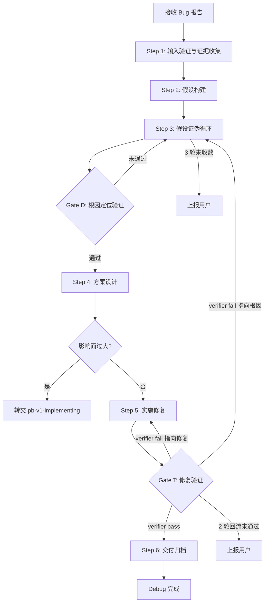
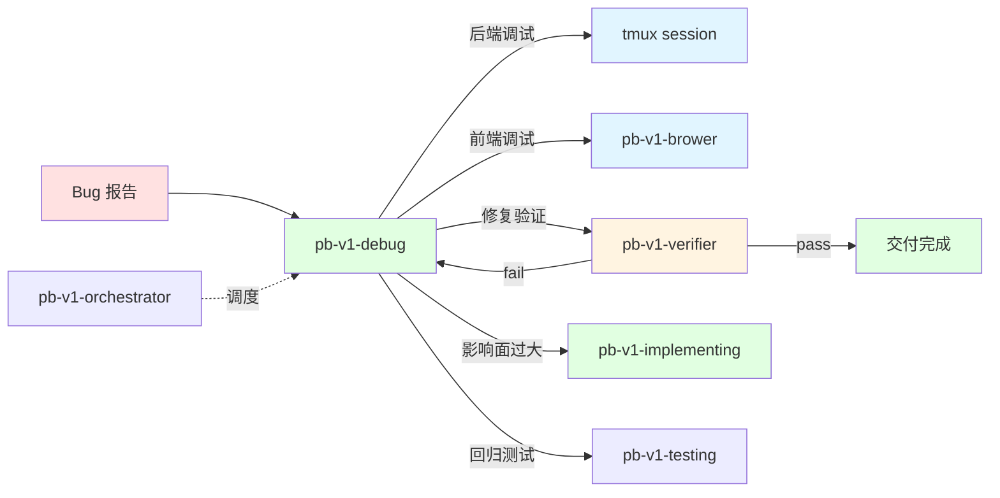

# pb-v1-debug

**版本**: 1.0.0
**状态**: 设计完成
**创建日期**: 2026-04-20
**流程映射**: vNext 全流程横切（调试能力中台）

---

**CRITICAL: 绝不跳过假设直接修复——没有经过证伪循环收敛的根因定位，任何修复都是猜测。看到报错就改报错那行是最常见的调试惯性，代价是根因未除、问题反复。**

**CRITICAL: 绝不脱离可观测环境调试——后端必须在 tmux 中执行实验，前端必须在浏览器中验证。代码静态分析不等于运行时行为，没有运行时证据的诊断是推测。**

**CRITICAL: 绝不自行判定修复完成——修复后必须调用 pb-v1-verifier 做独立验证。自己修的代码自己验证存在确认偏误，自验证不算验证。**

---

## 核心哲学

> 调试是假设的证伪循环：系统偏离了约束边界，用可观测证据构建假设，用可重复实验证伪假设，直到假设收敛为根因。修复是最小代价的约束恢复，验证是独立视角的闭环确认。

模型的调试惯性是"看到症状就直接修"——看到报错改报错那行代码，看到 UI 异常改渲染逻辑。这种惯性的代价是：修了表面症状但根因未除，过几天同一个问题换个马甲再次出现，或者修复引入了新的问题。

调试的本质不是"修复错误"，而是"证伪假设"——每一次调试操作（打日志、加断点、改输入）都是一次实验，目的是证伪当前假设或收窄假设空间。只有当假设收敛为唯一可能的根因时，才进入修复阶段。

---

## 策略哲学

### 对抗惯性表

| 模型惯性 | 真实情况 |
|---------|---------|
| 看到报错就改报错那行代码 | 报错是症状不是根因。先构建假设，用证据证伪，收敛到根因再修 |
| 调试 = 加 console.log 然后看输出 | 调试是结构化的假设-验证循环。每次操作都是一次实验，必须有明确的假设和预期结果 |
| 修复后跑一下没报错就算完成 | 修复后需要独立验证者（verifier）从产出物角度确认修复是否满足成功标准 |
| 前端问题看代码就能定位 | 前端问题的真相在浏览器。代码静态分析不等于运行时行为，必须用浏览器证据 |
| 后端问题看日志就够了 | 日志是证据之一，但需要在可控环境中重复实验。tmux 提供命令/日志/状态的同步可观测性 |
| 一次修复解决所有问题 | 每次只修一个根因，验证通过后再处理下一个。多根因同时修会导致无法归因 |

### 思考框架

1. **先构建假设，再设计实验** — 拿到 bug 报告后，第一步不是打开代码开始改，而是基于证据构建至少 2 个竞争假设，然后设计能区分它们的最小实验。每次实验的目的是排除一个假设，不是"试试看"。

2. **每次实验只验证一个变量** — 同时改多个东西无法归因。一次改一个，观察结果，记录证据。如果实验结果与预期不符，这本身就是新证据——更新假设而非忽略。

3. **根因收敛后才进入修复** — 假设空间未收敛到唯一根因时，继续实验而非开始修复。"大概率是这个原因"不够，需要"证据排除了所有其他可能"。

4. **修复验证分离** — 修复者和验证者必须是不同视角。自己修的代码自己验证存在确认偏误。修复完成后调用 pb-v1-verifier，由独立验证者从产出物角度确认。

### 判断锚点

- **何时从诊断切换到修复**: 假设空间收敛为唯一根因 + 证据链完整 + 能解释所有已观察症状
- **何时从修复切换到验证**: 回归测试从红灯变绿灯 + 全部现有测试通过
- **何时上报用户**: 3 轮证伪循环未收敛 / verifier 2 轮回流未通过 / 修复影响面超出预期
- **何时转交 pb-v1-implementing**: 修复需要架构变更 / 影响面涉及 3 个以上模块 / 工作量 > 4 小时

---

## 设计原则

1. **证据驱动，拒绝猜测**: 所有推论必须基于错误日志、堆栈信息、实验结果或代码逻辑的必然性。"可能是"不是诊断依据
2. **假设先行，实验证伪**: 先构建竞争假设，再设计最小实验区分假设。不做无假设的盲目调试
3. **可观测环境优先**: 后端在 tmux 中调试，前端在浏览器中验证。脱离运行时环境的诊断是推测
4. **最小代价修复**: 在确保修复彻底且不产生回归的前提下，选择影响面最小的方案
5. **根因驱动**: 修表面症状是禁止的，必须追到根因再修复
6. **单文档闭环**: 从问题报告到验证通过，全过程在一个 debug 文档中完成

---

## 代码原则

通过 `style.inherits: powerby-foundation` 动态加载，以下为当前原则快照。

### 修复原则
- **最小影响面**: 只在问题范围内修复，不改变系统架构
- **快速失败**: 修复后应让错误尽早暴露，不静默吞掉异常
- **回归保护**: 每次修复必须附带防止同类问题再次出现的测试

### 决策优先级
根因准确性 > 修复最小化 > 测试覆盖 > 代码整洁

---

## 事实说明

- tmux `send-keys` 发送命令后需要追加 `Enter` 键才会执行
- tmux `capture-pane` 默认只捕获可见区域，需要 `-S -` 参数捕获完整历史
- 前端 SPA 应用的路由切换不会触发页面刷新，console 日志会累积
- `pb-v1-brower` 的 Layer 2 模式（review/verify）是前端调试的标准入口
- verifier 不接收执行过程上下文，只接收产出物和成功标准

---

## 输入协议

### 必需输入

| 字段 | 来源 | 说明 |
|------|------|------|
| Bug 报告 | 用户 / orchestrator | 问题描述、复现步骤、证据（日志/堆栈/截图） |
| 相关代码 | `src/` | 问题涉及的代码 |

### 可选输入

| 字段 | 来源 | 说明 |
|------|------|------|
| 产品需求文档 | `docs/{project}/prd.md` | 确认"正确行为"定义 |
| 架构设计文档 | `docs/{project}/architecture.md` | 理解系统结构 |
| 测试套件 | `tests/` | 已有测试覆盖情况 |
| dispatch_context | orchestrator | 被调度时的目标、范围、验证方法、文档地址 |

---

## 输出协议

### 产出物

| 产物 | 路径 | 说明 |
|------|------|------|
| Debug 文档 | `docs/iterations/{id}/debug/debug-{bug-id}.md` | 单文档闭环：证据→假设→实验→根因→方案→修复→验证 |
| 修复代码 | `src/` | 最小代价修复代码 |
| 回归测试 | `tests/` | 防止同类问题再次出现的测试 |

### 完成信号

执行完成后返回结构化信号给 orchestrator：

```yaml
completion_signal:
  skill: "pb-v1-debug"
  status: enum [completed, failed, blocked, escalated]
  artifacts:
    - path: "docs/iterations/{id}/debug/debug-{bug-id}.md"
      type: "debug-report"
    - path: "src/..."
      type: "fix-code"
    - path: "tests/..."
      type: "regression-test"
  issues: optional array
    - id: string
      description: string
      severity: enum [BLOCKER, MAJOR, MINOR]
  verification:
    verifier_status: "pass | fail | partial"
    rounds: number
```

---

## 执行流程

### 总流程



### Step 1: 输入验证与证据收集

**目的**: 确认 Bug 是真实的偏离，收集初始证据

1. **收集证据** — 记录问题描述、复现步骤、错误日志/堆栈/截图
2. **需求对齐** — 查找 PRD 或需求文档，确认"正确行为"的定义。如果无法确认是 Bug（可能是"设计如此"），记录发现并请求用户决策
3. **创建 Debug 文档** — 使用 `assets/debug-report-template.md` 创建单文档，填写问题报告部分
4. **影响评估** — 评估 Bug 严重程度（P0-P3）和影响范围
5. **选择调试模式** — 根据问题性质选择后端 tmux 模式或前端浏览器模式（或两者结合）

### Step 2: 假设构建

**目的**: 基于初始证据构建竞争假设

1. **证据分析** — 从错误日志、堆栈、复现步骤中提取关键线索
2. **三层思考** — 从表现层（UI/交互/响应）、逻辑层（业务逻辑/算法）、数据层（存储/传输）三个维度分析可能的根因
3. **构建假设** — 基于证据构建至少 2 个竞争假设，每个假设包含：假设描述、支持证据、可证伪的预测
4. **设计首轮实验** — 选择能最大程度区分假设的实验

### Step 3: 假设证伪循环

**目的**: 通过实验逐步收敛假设空间

每轮循环：

1. **选择目标假设** — 选择当前最可能的假设进行证伪
2. **设计实验** — 设计最小实验，明确预期结果（假设成立时应观察到什么，不成立时应观察到什么）
3. **执行实验** — 根据调试模式执行：
   - **后端**: 在 tmux 环境中执行（见「后端 tmux 调试模式」）
   - **前端**: 调用 pb-v1-brower 执行（见「前端浏览器调试模式」）
4. **收集证据** — 记录实际结果，与预期对比
5. **更新假设** — 根据实验结果：排除被证伪的假设 / 修正假设 / 构建新假设
6. **记录** — 在 debug 文档中记录本轮实验的完整过程

**收敛判断**: 假设空间收敛为唯一根因时，进入 Gate D

**失败处理**: 3 轮循环未收敛 → 上报用户，附带已排除的假设和剩余假设

### Gate D: 根因定位验证

**触发条件**: Step 3 假设收敛后

**验证内容**:
- [ ] 根因有完整证据链（日志/堆栈/实验结果）
- [ ] 已排除至少 1 个竞争假设（有排除证据）
- [ ] 根因能解释所有已观察到的症状
- [ ] 不依赖"可能"、"应该"等猜测性词语

**通过标准**: 全部通过
**未通过处理**: 返回 Step 3 补充实验，3 次未通过则上报用户

### Step 4: 方案设计

**目的**: 设计最小代价修复方案

1. **生成备选方案** — 至少 2 个方案，评估优缺点、风险和影响面
2. **标记推荐方案** — 说明推荐理由，基于决策优先级（根因准确性 > 修复最小化 > 测试覆盖 > 代码整洁）
3. **影响面评估** — 如果修复需要架构变更或涉及 3+ 模块，转交 pb-v1-implementing
4. **用户确认**（条件触发）— 工作量 > 2 小时或涉及多模块时，必须经过用户确认

### Step 5: 实施修复

**目的**: 按确认方案执行最小代价修复

1. **编写回归测试** — 先写失败的测试用例，确认能复现问题
2. **实施修复** — 按方案执行代码修改，遵循最小影响面原则
3. **验证测试通过** — 确认回归测试从红灯变绿灯，全部现有测试通过
4. **记录变更** — 在 debug 文档中记录每处变更

### Gate T: 修复验证（pb-v1-verifier 集成）

**触发条件**: Step 5 完成后

**验证方式**: 调用 pb-v1-verifier 做独立验证

```yaml
verifier_input:
  artifact: "修复代码 + debug 文档 + 回归测试"
  success_criteria:
    - "原问题已修复（回归测试通过）"
    - "全部现有测试通过（无回归）"
    - "修复代码符合项目约定"
    - "debug 文档证据链完整"
```

**处理 verifier 结果**:
- verifier 返回 `pass` → 进入 Step 6
- verifier 返回 `fail` 且 issues 指向修复代码 → 回流 Step 5，修复后重新提交验证
- verifier 返回 `fail` 且 issues 指向根因定位 → 回流 Step 3，重新诊断
- 回流最多 2 轮，超过则上报用户

### Step 6: 交付归档

**目的**: 完成 debug 文档，清理调试环境

1. **完善 debug 文档** — 确认所有章节填写完整，状态更新为"已关闭"
2. **清理 tmux session** — 如果使用了后端调试模式，关闭 `debug-{bug-id}` session
3. **提交代码** — 修复代码 + 回归测试，提交信息解释根因和修复策略
4. **返回完成信号** — 如果被 orchestrator 调度，返回 completion_signal

---

## 工具调用原则

### 单命令单权限

每个工具的调用必须收敛为**一种稳定的命令模式**，使 Claude Code 权限系统只需注册一次。禁止多语句拼接（`A=x\n$A cmd`）、禁止同一工具出现多种调用变体。

### 工具定义与引用

工具的具体调用方式定义在 `assets/tool-*.md` 中，SKILL.md 只声明原则和引用关系。新增工具时，创建对应的 `assets/tool-{name}.md`，定义：
- 命令模式（唯一入口 + 子命令）
- 权限注册规则（一条）
- 使用示例

### 当前工具清单

| 工具 | 用途 | 定义文件 | 权限规则 |
|------|------|---------|---------|
| tmux | 后端可视化调试环境 | `assets/tool-tmux.md` | `Bash(tmux:*)` |
| browse | 前端浏览器证据采集 | `assets/tool-browse.md` | 参见 pb-v1-brower 的 $B 发现机制 |

---

## 后端 tmux 调试模式

### 适用场景

后端服务异常、API 错误、数据处理问题、性能问题、进程崩溃等需要在服务端环境中调试的场景。

### 调用方式

具体命令模式参见 `assets/tool-tmux.md`。核心流程：

1. **初始化** — 创建 `debug-{bug-id}` session，自动配置三 pane 布局（命令区/日志区/状态区）
2. **执行实验** — 向命令区发送实验命令，日志区和状态区同步观察
3. **收集证据** — 捕获 pane 输出，写入 debug 文档
4. **清理** — 调试完成后销毁 session

### 调试循环

```
假设 → 命令区执行实验 → 日志区/状态区观察结果 → 捕获证据 → 更新假设
```

---

## 前端浏览器调试模式

### 适用场景

UI 渲染异常、交互问题、样式错误、前端性能问题、网络请求异常等需要在浏览器中验证的场景。

### 调用方式

具体命令模式参见 `assets/tool-browse.md`。通过 pb-v1-brower 的能力进行证据采集：

1. **连接浏览器** — 通过 pb-v1-brower 连接 headed browser
2. **采集证据** — 结构化数据优先（snapshot/console/network），截图兜底
3. **执行实验** — 通过浏览器操作验证假设（点击、输入、导航等）
4. **记录结果** — 每轮产出 `round-{N}-verify.md`

### 调试循环

```
假设 → 浏览器打开页面 → 采集证据 → 执行交互实验 → 记录结果 → 更新假设
```

---

## 联合调试模式

当问题跨前后端时，同时启用两种模式：
- tmux 监控后端日志和 API 响应
- pb-v1-brower 观察前端表现和网络请求
- 交叉验证前后端证据，定位问题边界

---

## 职责边界

### 必须做
- 基于证据构建假设并通过实验证伪
- 在可观测环境（tmux/浏览器）中执行调试
- 单文档记录完整调试过程
- 修复后调用 pb-v1-verifier 做独立验证
- 编写回归测试防止同类问题再次出现

### 禁止做
- 跳过假设直接修复（猜测式修复）
- 脱离运行时环境做诊断（纯代码静态分析）
- 自行判定修复完成（不调用 verifier）
- 修改上游产物（proposal.md、architecture.md、tasks.md）
- 新增 bug 修复范围之外的功能（scope creep）
- 大规模重构（转交 pb-v1-implementing）

---

## 异常处理

| 场景 | 处理方式 |
|------|---------|
| 3 轮证伪循环未收敛 | 上报用户，附带已排除假设、剩余假设、已收集证据 |
| verifier 2 轮回流未通过 | 上报用户，附带 verifier 报告和修复记录 |
| 修复影响面超出预期 | 转交 pb-v1-implementing，附带根因分析和方案建议 |
| 无法确认是 Bug | 记录发现，请求用户决策（可能是"设计如此"） |
| tmux 环境创建失败 | 降级为直接 bash 执行，但必须记录命令和输出 |
| pb-v1-brower 连接失败 | 上报用户，建议手动浏览器验证 |

---

## 与其他 Skill 的交互



| 交互方 | 方向 | 内容 | 触发条件 |
|-------|------|------|---------|
| pb-v1-orchestrator | 输入 | dispatch_context（目标、范围、验证方法、文档地址） | 被调度时 |
| pb-v1-brower | 工具 | 浏览器证据采集（snapshot/console/network/screenshot） | 前端调试模式 |
| pb-v1-verifier | 工具 | 独立验证（修复代码 + debug 文档 + 回归测试 + 成功标准） | Gate T |
| pb-v1-implementing | 输出 | 根因分析 + 方案建议 | 修复影响面过大时转交 |
| pb-v1-testing | 下游 | 回归测试 | 修复完成后 |

---

## Safety

- 不跳过假设直接修复——没有证据链的修复是禁止的
- 不脱离可观测环境调试——tmux/浏览器是必需的调试环境
- 不自行判定修复完成——必须调用 pb-v1-verifier 做独立验证
- 不修改上游产物，不新增 bug 修复范围之外的功能
- 不使用 --no-verify 绕过提交钩子，不禁用测试代替修复
- 不提交无法编译的代码

---

**关键约束重申（三明治结构）**:
- 证据驱动，拒绝猜测——没有证据链的修复是禁止的
- 假设先行，实验证伪——不做无假设的盲目调试
- 修复验证分离——自验证不算验证，必须调用 pb-v1-verifier
