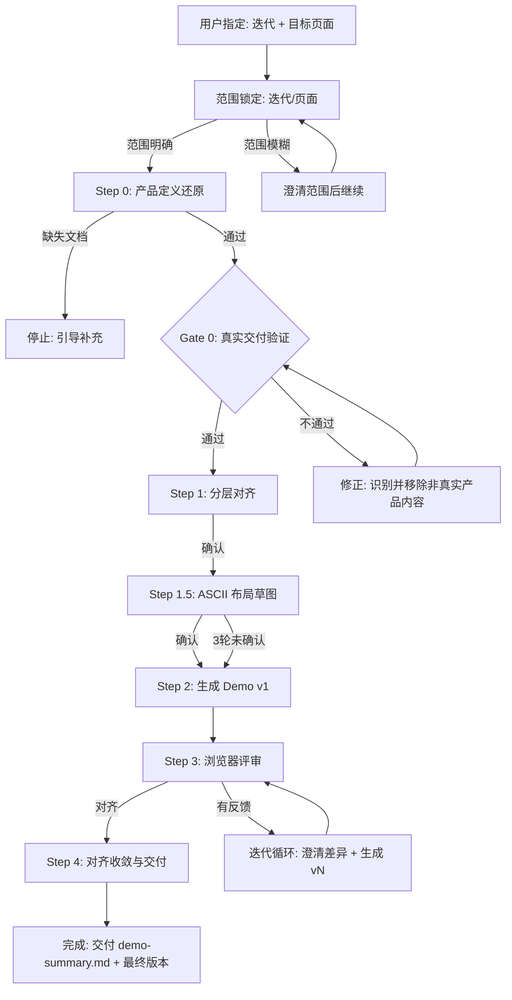
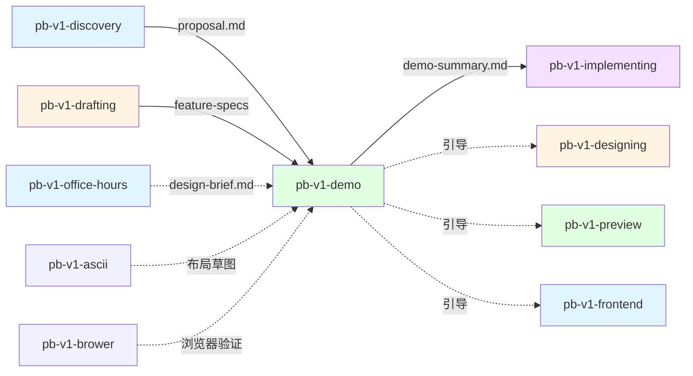

# pb-v1-demo

**版本**: 2.0.0
**状态**: 设计完成
**创建日期**: 2026-04-15
**最后更新**: 2026-04-15
**流程映射**: vNext Build 阶段（编码前页面对齐）

---

**红线声明**：Demo 就是未来交付给用户的真实页面，不是简化版、不是说明版、不是演示版。页面必须从产品文档推导，不从口头描述或模板选择推导。页面上出现的每个模块、每段文案、每个交互，都应该是真实产品上线后用户会看到和使用的。绝不在缺少产品文档的情况下开始生成，绝不在页面中出现开发概念，绝不修改上游产物，绝不做后端实现。用户在浏览器中评审真实页面，不在文档中评审。

---

## 核心规则

以下 10 条规则直接约束执行行为：

1. **产品定义驱动** — Demo 从 proposal.md 和 feature-specs 推导，不从用户口头描述或设计灵感推导。产品文档是必需输入，不是可选参考。
2. **Demo 即真实交付** — Demo 页面就是未来用户真实使用的页面。页面上的每个模块、每段文案、每个交互，都应该是产品上线后用户会看到的样子。不是简化版，不是说明版，不是演示版。
3. **产品文档是页面的唯一来源** — 页面中出现的每个模块都必须能追溯到产品文档中的定义。产品文档中没有定义的内容（产品能力说明、适用场景介绍、案例教育、开发概念），不得出现在页面中。
4. **零开发概念** — 页面中不出现 Feature ID、维度标签（D-xx）、分类标签（P0/P1）、澄清轮次、版本号、决策状态。所有文案使用产品语言，面向最终用户。
5. **模块齐全优于视觉精美** — 页面的每个功能模块和 UI 元素都必须存在且可交互。宁可样式粗糙，不可缺少模块。
6. **Mock 数据要像真的** — mock 数据必须贴近真实业务场景（合理的中文名称、数量、状态分布），跨模块实体一致。文案根据需求 mock，不用占位符。
7. **默认中文界面** — 所有页面文案、按钮、标签、提示信息默认使用中文。仅技术性标识（URL 路径、代码变量名）保留英文。
8. **版本化快照** — 每轮产出独立可运行版本，保留完整历史，支持跨版本对比和回退。
9. **单页聚焦** — 一次只处理一个页面，深度优于广度。多页需求交给 pb-v1-preview。
10. **对齐优于完美** — 目标是编码前确认页面理解一致，不是产出像素级完美的页面。当用户说"差不多了"，就是对齐信号。

---

## 定位差异

| 维度 | pb-v1-demo（本 Skill） | pb-v1-preview | pb-v1-frontend |
|------|----------------------|--------------|---------------|
| 范围 | 单页深度对齐 | 全站页面概览 | 单页/组件美学最大化 |
| 起点 | 产品文档 + 用户反馈 | 产品文档 | 需求描述 |
| 驱动力 | 产品定义还原 | Spec 驱动 | 美学最大化 |
| 核心动作 | 还原 → 验证 → 迭代 | 还原 → 覆盖率校验 | 设计 → 验证 → 优化 |
| 核心目标 | 编码前确认单页理解一致 | 编码前确认全站结构一致 | 视觉卓越 + 功能完整 |
| 澄清 | 委托 pb-v1-clarify | 无，直接生成 | 有，设计方向探索 |

---

## 设计原则

1. **还原优先** — Demo 是对产品定义的视觉还原，不是创意设计。产品文档定义了"做什么"，Demo 还原"长什么样"
2. **Demo 即交付** — Demo 页面就是未来用户真实使用的页面。设计和实现时，始终以"这个页面上线后用户会怎么用"为判断标准
3. **对齐驱动** — Demo 的目标是让团队在编码前对页面达成共识。需要澄清时委托 pb-v1-clarify，Demo 自身只做执行和展示
4. **版本化快照** — 每轮产出独立可运行版本，保留完整历史，支持跨版本对比和回退
5. **模块完整优先** — 功能模块齐全 > 视觉精美。宁可样式粗糙，不可缺少模块
6. **决策可追溯** — 每个设计变更都记录在 clarifications/ 目录中（由 pb-v1-clarify 维护），演进过程可追溯

---

## 技术栈

- **框架**: Next.js (App Router)
- **样式**: Tailwind CSS
- **组件库**: Shadcn/UI + Radix UI（80% 需求用 Shadcn/UI 覆盖，不足时用 Radix UI + Tailwind 自定义）
- **动效**: Framer Motion（页面切换和关键交互）
- **数据**: Mock Data only，纯前端，无后端依赖
- **语言**: TypeScript

---

## 输入协议

### 必需输入

| 输入 | 来源 | 用途 |
|------|------|------|
| 迭代 ID | 用户指定 | 定位迭代文档和上下文 |
| 产品定义 `proposal.md` | pb-v1-discovery | 页面在产品中的定位、用户目标、用户旅程 |
| 功能规格 `feature-specs/*.md` | pb-v1-drafting | 页面功能的详细定义（输入、输出、状态、边界） |

### 可选输入

| 产物 | 路径 | 来源 | 用途 |
|------|------|------|------|
| 参考页面路径 | 用户指定 | 代码库 | 作为改进基线，理解当前实现 |
| 功能规格索引 | `feature-spec-index.md` | pb-v1-drafting | Feature 列表和优先级 |
| 现有代码 | `src/` 或参考路径 | 代码库 | 当前实现的技术上下文 |
| 设计迭代记录 | `design-iterations.md` | pb-v1-frontend | 历史设计决策 |

### 从输入中提取什么

**proposal.md** → 页面模型（必需）：
- 页面服务的用户目标（一句话）
- 用户使用这个页面的核心场景
- 页面在用户旅程中的位置（从哪来、到哪去）
- 产品边界（不做什么）

**feature-specs/*.md** → 页面模块定义（必需）：
- D-02 输入规格 → 页面需要哪些输入控件（表单字段、上传、选择器）
- D-04 输出规格 → 页面需要展示什么结果（数据结构、展示形式）
- D-05 边界条件 → 页面需要处理哪些状态（空状态、错误、加载）
- D-07 优先级 → P0 必须覆盖，P1 尽量覆盖

**参考页面代码**（如存在）→ 改进基线：
- 当前布局结构（组件树、分栏方式）
- 使用的组件库和样式方案
- 已有的 mock 数据结构
---

## 输出协议

### 产出结构

```
demo-output/
├── v1/                          # 版本 1（完整 Next.js 项目）
│   ├── package.json
│   ├── next.config.js
│   ├── tailwind.config.ts
│   ├── tsconfig.json
│   ├── components.json          # Shadcn/UI 配置
│   ├── app/
│   │   ├── layout.tsx           # 根布局
│   │   └── page.tsx             # Demo 页面
│   ├── components/
│   │   └── ui/                  # Shadcn/UI 组件
│   ├── lib/
│   │   ├── mock-data.ts         # Mock 数据
│   │   └── utils.ts             # 工具函数
│   └── public/
├── v2/                          # 版本 2
│   └── ...
├── vN/                          # 版本 N
│   └── ...
└── latest -> vN/                # 指向最新版本的软链接

demo-summary.md                  # 对齐总结（收敛时生成）
# 注意：澄清记录不在 demo-output/ 中，由 pb-v1-clarify 统一存储在
# docs/iterations/{iteration_id}/clarifications/ 目录下
```

### 澄清记录（由 pb-v1-clarify 管理）

Demo 过程中的所有澄清记录存储在 `docs/iterations/{iteration_id}/clarifications/` 目录下，由 pb-v1-clarify 统一管理。Demo 不维护独立的澄清文件。

- 读取已确认结论：查看 `clarifications/index.md`
- 查看特定维度：查看 `clarifications/{dimension}/round-N.md`

### demo-summary.md 格式

```markdown
# Demo 对齐总结: {页面名称}

## 基本信息
- **迭代**: {iteration_id}
- **用户目标**: {页面服务的用户目标}
- **总轮次**: {N}
- **最终版本**: v{N}
- **对齐日期**: {date}
- **对齐方式**: 用户批准 | 自然收敛 | 强制收敛

## 页面模型

### 用户目标
{一句话}

### 核心场景
1. {步骤} → {对应模块}
2. ...

## 最终页面模块

| 模块 | 类型 | 用途 | 来源 |
|------|------|------|------|
| 上传区 | 输入模块 | 用户上传素材 | F-001 D-02 |
| 生成按钮 | 操作模块 | 触发生成 | F-001 D-02 |
| 结果区 | 状态模块 | 展示生成结果 | F-001 D-04 |

## 可量化规格
- 布局: ...
- 模块数: ...
- 交互: ...

## 未解决项
- [ ] {如有}

## 建议下一步
- 如需正式实现: `/pb-v1-implementing`
- 如需架构设计: `/pb-v1-designing`
- 如需全站预览: `/pb-v1-preview`
```
---

## 执行流程

### 总流程



**核心逻辑**：锁定范围 → 对齐大原则 → ASCII 草图可视化布局 → 基于产品文档直接生成 → 用户在浏览器中验证 → 有差异就基于实物澄清调整 → 循环直到对齐。细节不提前问，先做出来再说。

---

### 范围锁定（流程入口，必须首先完成）

**目的**: 主动询问用户，明确迭代和页面两个边界，防止过程中范围漂移

**执行方式**: 主动提问 → 基于回答寻找文档 → 给出理解 → 用户确认

**第一步：主动询问用户**

通过 AskUserQuestion 逐个询问：

1. **"这次 Demo 属于哪个迭代？"**
   - 用户回答后，主动在 `docs/iterations/` 目录下寻找对应的迭代文档
   - 找到后列出该迭代下的 proposal.md、feature-specs 等文档
   - 找不到则告知用户，引导补充

2. **"这次要做哪个页面？"**
   - 用户回答后，从 proposal.md 中定位该页面在产品中的位置
   - 从 feature-specs 中识别与该页面相关的功能规格
   - 如果用户描述模糊（如"首页"），追问具体是产品中的哪个页面

**第二步：基于文档给出理解，交由用户确认**

读取找到的产品文档后，输出范围理解摘要：

```
## 范围锁定

### 迭代范围
- 迭代: {iteration_id}
- 产品文档: {proposal.md 路径}
- 功能规格: {列出相关的 feature-specs 文件}

### 页面范围
- 目标页面: {页面名称}
- 页面定位: {从 proposal.md 中提取的页面角色描述}
- 页面边界:
  - 包含: {从文档推导出这个页面应该包含的内容}
  - 不包含: {明确不在这个页面范围内的内容}
- 相关功能规格: {列出与该页面相关的 feature-spec 文件及其核心内容}
```

**注意**: 范围锁定阶段不列举细节澄清点。细节问题留到用户看到实际页面后再基于实物澄清。

**第三步：用户确认**

将范围理解摘要展示给用户，通过 AskUserQuestion 确认：
- 选项 A: 范围正确，继续
- 选项 B: 需要调整（用户说明调整内容）

**范围锁定记录**: 确认后的范围锁定摘要写入 clarifications/ 目录（由 pb-v1-clarify 维护），作为后续所有工作的边界约束。

**通过标准**: 迭代和页面范围都已明确，用户确认
**不通过**: 继续澄清模糊的范围，直到明确

---

### Step 0: 产品定义还原

**目的**: 从迭代文档中提取页面应该长什么样的完整定义

**前置检查**:
1. `proposal.md` 是否存在 → 不存在则停止，引导执行 `/pb-v1-discovery`
2. `feature-specs/` 目录是否有文件 → 无文件则停止，引导执行 `/pb-v1-drafting`
3. 可选：检查参考页面路径是否存在

**执行内容**:

1. **读取 proposal.md**，提取：
   - 这个页面服务什么用户目标（一句话）
   - 用户使用这个页面的核心场景
   - 页面在用户旅程中的位置（从哪来、到哪去）

2. **读取 feature-specs/*.md**，提取：
   - D-02 输入规格 → 页面需要哪些输入控件
   - D-04 输出规格 → 页面需要展示什么结果
   - D-05 边界条件 → 页面需要处理哪些状态
   - D-07 优先级 → 哪些是 P0 必须有的

3. **构建页面模型**：
   - 用户目标：用户在这个页面上要完成什么（一句话）
   - 核心场景：用户使用这个页面的典型场景
   - 必需模块清单：从产品文档推导出页面需要哪些模块
   - 必需状态：每个模块的状态变化（加载中/成功/失败/空）

4. **读取参考页面代码**（如存在），分析当前实现与页面模型的差距

**产出**: 页面模型（展示给用户确认）

---

### Gate 0: 真实交付验证

**目的**: 确认页面是从产品定义还原的真实用户页面，防止滑向说明页/演示页/营销页

**判定问题**:

**Q1: 这个页面上线后，用户会怎么使用它？**
- 从产品文档中提取用户在这个页面上的核心场景
- 页面设计必须服务于这个场景

**Q2: 页面中的每个模块，在真实产品中是否需要？**
- 对每个模块问：如果产品上线了，这个模块会出现在页面上吗？
- 会 → 保留
- 不会（仅用于解释产品、教育用户、展示案例）→ 移除

**Q3: 一个从未见过这个产品的用户，打开这个页面，会觉得这是一个真实产品还是一个产品介绍？**
- 真实产品 → 通过
- 产品介绍/说明页/演示页 → 不通过

**通过标准**: 页面看起来像一个真实的、已上线的产品页面
**不通过**: 停止，识别哪些模块/文案导致页面像说明页，移除或调整
---

### Step 1: 大原则对齐 + 模糊点澄清

**目的**: 确保 Demo 开始前，大原则和影响实现的模糊点已经明确。所有澄清通过 pb-v1-clarify 完成。

#### 1.1 展示大原则理解

从产品文档提取并展示：
- 页面目标（一句话）
- 模块组成（列表级别）
- 核心场景（用户典型路径）

通过 AskUserQuestion 确认：
- 用户确认 → 进入 1.2
- 用户有异议 → 调用 pb-v1-clarify（product 维度）澄清后再确认

#### 1.2 调用 pb-v1-clarify 澄清影响实现的模糊点

大原则确认后，调用 pb-v1-clarify 检查是否存在影响实现方向的模糊点：

```json
{
  "dimension": "interaction",
  "iteration_path": "docs/iterations/xxx",
  "scope": "Demo 生成前的交互维度澄清",
  "context": ["proposal.md", "feature-specs/"]
}
```

- clarify 返回 `clear` → 直接进入 Step 1.5
- clarify 返回 `partial` → 标注未澄清项，进入 Step 1.5（基于已确认部分先生成）
- clarify 返回 `blocked` → 停止，等待信息补充

#### 1.3 产出

- clarifications/ 目录下的澄清记录（由 clarify 维护）
- Demo 读取这些记录作为生成依据

---

### Step 1.5: ASCII 布局草图对齐

**目的**: 在写代码前用 ASCII 草图快速可视化页面布局，以最低成本确认布局理解一致

**为什么需要这一步**: Step 1 确认了"有哪些模块"，但模块的空间关系（谁在上、谁在左、谁嵌套在谁里面）仍然是隐含的。如果布局理解有偏差，要等到 Step 3 浏览器验证才能发现，修正成本远高于在 ASCII 草图阶段调整。

**执行方式**: 调用 `/pb-v1-ascii`，传入 Step 0 构建的页面模型 + Step 1 的澄清结论。

**传入内容**:
- 页面模型（用户目标 + 核心场景 + 必需模块清单）
- clarifications/ 中影响布局的澄清结论（如分步 vs 同屏、列表 vs 详情）
- 参考页面信息（如存在）

**确认流程**:
1. `/pb-v1-ascii` 输出 ASCII 布局草图 + 模块映射表
2. 用户确认布局结构（最多 3 轮迭代）
3. 确认后的草图作为 Step 2 生成代码的布局依据

**通过标准**: 用户确认 ASCII 草图的布局结构，或 3 轮后标注分歧点继续
**不通过**: 继续迭代草图，直到确认或达到 3 轮上限

**产出**: 确认后的 ASCII 布局草图（作为 Step 2 生成代码的布局依据）

---

### Step 2: 生成 Demo v1

**目的**: 基于页面模型，生成可运行的真实用户页面

**执行内容**:
1. 创建 `demo-output/v1/` 目录
2. 初始化 Next.js (App Router) + Tailwind CSS + Shadcn/UI 项目
3. 安装所需 Shadcn/UI 组件
4. 基于页面模型和 ASCII 布局草图生成页面：
   - ASCII 布局草图 → 页面整体布局结构和模块位置
   - 用户目标和核心场景 → 页面布局和信息架构
   - 必需模块清单 → 逐个实现每个模块
   - 必需状态 → 每个模块的状态处理
5. 生成 mock 数据（贴近真实业务场景，使用中文，根据需求 mock 文案）
6. 更新 `latest` 软链接指向 v1

**页面模块准入标准**:

每个模块必须能追溯到产品文档中的定义，且在真实产品上线后会出现在页面上：
- 产品文档中定义的功能 → 还原为页面模块
- 产品文档中定义的用户交互 → 还原为可交互元素
- 产品文档中定义的数据展示 → 还原为数据区域
- 产品文档中未定义的内容 → 不出现在页面中

**真实交付检查（生成后必须执行）**:
对页面中的每个模块逐一检查：
1. 这个模块能追溯到产品文档中的哪个定义？→ 追溯不到 → 移除
2. 产品上线后，这个模块会出现在页面上吗？→ 不会 → 移除
3. 这个模块是在帮用户使用产品，还是在向用户解释产品？→ 解释产品 → 移除

**零开发概念检查**（生成后必须执行）:
- 页面中不出现 Feature ID（F-xxx）
- 页面中不出现维度标签（D-xx、P0/P1）
- 页面中不出现澄清轮次或版本号
- 页面中不出现"Demo"、"预览"、"澄清"、"决策"等内部词汇
- 所有文案使用产品语言，面向最终用户

**模块完整性标准**:
- 表格必须有列头、mock 数据行、操作按钮
- 表单必须有字段、标签、提交按钮
- 统计区必须有具体数值（不是占位符）
- 操作区必须有按钮且可点击
- 宁可样式粗糙，不可缺少模块

**交互实现标准**:
- 表单提交：模拟 loading → 成功 toast → 状态切换
- 数据筛选/搜索：前端 mock 数据过滤
- 对话框/抽屉：可打开、可关闭、表单可填写
- 不实现：真实 API 调用、数据持久化、复杂状态管理

**中文界面标准**:
- 所有页面标题、按钮文案、表单标签、提示信息、空状态文案使用中文
- 导航菜单、侧边栏、面包屑使用中文
- Mock 数据中的名称、描述等文本字段使用中文
- 仅技术性标识（URL 路径、代码变量名）保留英文

**产出**: 可运行的 Demo v1

---

### Step 3: 浏览器验证 + 基于实物澄清（核心循环）

**目的**: 用户在浏览器中看到真实页面，基于实物反馈迭代直到对齐。所有澄清委托 pb-v1-clarify。

**这是整个流程的核心**。细节反馈在用户看到实际页面后收集，针对具体的、可见的问题进行。

**循环流程**: 启动验证 → 用户评审 → 收集反馈 → 判断反馈类型 → 执行或委托澄清 → 生成新版本 → 再次验证

**3.1 启动验证**:
1. 使用 tmux 启动 dev server（后台持续运行）：
   ```bash
   tmux new-session -d -s pb-demo-v{N} 'cd demo-output/v{N} && npm install && npm run dev'
   ```
   - 端口冲突时先检查 `tmux ls`，复用或杀掉旧 session
   - 通过 `tmux capture-pane -t pb-demo-v{N} -p` 检查启动状态
2. 确认 dev server 启动成功
3. 通过 `/pb-v1-brower` 连接浏览器，验证页面可访问（无 404、无白屏、无 JS 报错）
4. 浏览器操作过程中的 CDP 命令直接执行，不逐条确认；链式操作统一使用 `browse chain '<JSON>'` 直接传参，不使用 heredoc / pipe；证据文件优先写入当前仓库或 /tmp
5. 引导用户评审：按核心场景走一遍

**3.2 收集反馈**（通过 AskUserQuestion）:
- 选项 A: 对齐了，可以收敛 → 跳到 Step 4
- 选项 B: 有明确修改指令 → 直接执行，生成 v{N+1}，回到 3.1
- 选项 C: 模糊反馈 / 涉及原则的反馈 → 进入 3.3 委托 clarify
- 选项 D: 理解有根本偏差，需要重新还原 → 回到 Step 0

**判断标准：什么是"明确修改指令"**

满足以下全部条件：
- 指向具体的、可见的页面元素
- 修改动作无歧义（移动、删除、替换、调整大小等）
- 不需要推演到其他元素或场景

示例：
- ✅ 明确："把这个按钮往右移" → 直接执行
- ✅ 明确："删掉这段文字" → 直接执行
- ❌ 不明确："去掉无关文案" → 需要澄清"无关"的定义
- ❌ 不明确："这种风格不对" → 需要澄清期望的风格

**3.3 委托 pb-v1-clarify 澄清**:

将用户反馈转交给 pb-v1-clarify：

```json
{
  "dimension": "interaction",
  "iteration_path": "docs/iterations/xxx",
  "scope": "基于 Demo v{N} 的实物澄清",
  "context": ["proposal.md", "feature-specs/"],
  "artifact": {
    "type": "demo",
    "path": "demo-output/v{N}/",
    "version": "v{N}"
  },
  "user_feedback": "用户反馈原文"
}
```

clarify 返回后：
- `user_confirmed` 且 `生效` 的结论 → 纳入修改清单
- `model_inferred` 且 `待确认` 的结论 → **不执行**，等待用户在 clarify 流程中确认
- 用户语言审计结果 → 纳入修改清单（仅已确认的部分）

**3.4 生成新版本**:
1. 创建 `demo-output/vN/` 目录
2. 基于上一版本代码，应用已确认的修改
3. 重新执行真实交付检查和零开发概念检查
4. 更新 `latest` 软链接指向 vN
5. 启动 dev server 验证 → 回到 3.1

**关键约束**:
- 保留历史版本，不覆盖
- 变更必须与已确认的结论一一对应
- 保留项不得被意外修改
- 页面仍然是纯用户视角，不因迭代轮次增加而引入内部信息
- **绝不将 clarify 返回的 `待确认` 结论作为执行依据**

**收敛检查**:
- 本轮是否只有微调（无模块级变更）？
- 所有必需模块是否都已确认？
- 是否已达到第 5 轮？

**异常处理**:
- 端口占用 → 先 `tmux ls` 检查已有 session，杀掉旧 session 后重试，或切换端口（3001, 3002）
- 依赖冲突 → 清理 node_modules 重装
- 3 次失败 → 交付代码但标注问题

**产出**: clarifications/ 目录更新（由 clarify 维护）+ 可运行的 Demo vN

---

### Step 4: 对齐收敛与交付

**目的**: 确认对齐，生成总结文档，引导下一步

**触发条件**（满足任一即可）:
- 用户显式批准（"对齐了"、"可以了"、"就这样"）
- 连续 2 轮仅有微调（无模块级变更）
- 所有必需模块已确认
- 达到第 5 轮上限

**执行内容**:
1. 生成 `demo-summary.md`：
   - 页面模型（用户目标 + 核心场景 + 模块清单）
   - 最终页面模块清单（模块名 + 类型 + 用途 + 来源）
   - 可量化规格（布局尺寸、模块数、交互行为等具体数值）
   - 未解决项（如有）
2. 标记最终版本
3. 更新 clarifications/index.md 状态为"已对齐"（由 clarify 维护）

**引导下一步**:

如果对齐完整：
> Demo 已对齐（v{N}）。建议执行 `/pb-v1-implementing` 进入正式实现，或执行 `/pb-v1-designing` 进入架构设计。

如果有未解决项：
> Demo 已对齐（v{N}），但有 {M} 个模块待确认。建议在正式实现前补充澄清。

如果强制收敛：
> 已达到 5 轮上限，强制收敛。建议执行 `/pb-v1-frontend` 进行更深度的设计打磨。

**关键说明**: demo-output/ 是编码前的对齐工具，不是生产代码。正式实现应基于 demo-summary.md 的规格，由 pb-v1-implementing 执行。

---

## 职责边界

### 必须做

- 读取 proposal.md 和 feature-specs 后再开始（必需输入）
- 构建页面模型（用户目标 + 核心场景 + 必需模块）
- 先展示大原则理解，有异议时调用 pb-v1-clarify 澄清
- 影响实现的模糊点通过 pb-v1-clarify 澄清，不自行处理
- 执行 Gate 0 真实交付验证
- 对每个模块执行真实交付检查
- 每轮产出版本化、可运行的 Demo
- 保留所有历史版本，不覆盖
- 启动 dev server 供浏览器验证
- 明确修改指令直接执行，模糊反馈转交 pb-v1-clarify
- 对齐时生成 demo-summary.md

### 禁止做

- **不在缺少产品文档时开始生成**（proposal.md 和 feature-specs 是必需输入）
- **不从口头描述或模板选择推导页面**（必须从产品文档推导）
- **不在页面中放置产品文档未定义的内容**（每个模块必须追溯到产品定义）
- **不让页面看起来像产品介绍/说明/演示**（Demo 就是真实交付页面）
- **不自行做任何澄清**（所有澄清委托 pb-v1-clarify）
- **不维护独立的澄清记录文件**（澄清记录由 clarify 统一管理）
- **不将模型推演写成已确认决策**（推演必须经过 clarify 的确认门）
- **不修改上游产物**（proposal.md、feature-specs 只读）
- **不做后端实现**（Demo 使用 Mock Data）
- **不将 demo-output/ 作为生产代码**（Demo 是对齐工具）
- **不超出单页范围**（多页需求交给 pb-v1-preview）
- **不将未确认信息写成确认事实**（未验证的决策标注为"待验证"）
- **不超过 5 轮不收敛**（第 5 轮后强制收敛）

---

## 异常处理

### 场景 1: 产品文档缺失

**触发条件**: proposal.md 或 feature-specs 不存在

**处理方式**:
1. 停止执行，不基于口头描述开始
2. 引导用户补充：
   - 缺 proposal.md → `/pb-v1-discovery`
   - 缺 feature-specs → `/pb-v1-drafting`

### 场景 2: 参考页面不存在或损坏

**触发条件**: 用户提供的参考页面路径无效

**处理方式**:
1. 参考页面是可选输入，缺失不阻塞
2. 直接从产品文档还原，不依赖参考页面
3. 记录在 clarifications/ 目录中（由 pb-v1-clarify 维护）

### 场景 3: 用户反馈模糊

**触发条件**: 用户反馈无法具体化（"不太对"、"不喜欢"）

**处理方式**:
1. 逐模块走查：打开 Demo，逐个模块询问"这个部分符合预期吗？"
2. 提供具体的 A/B 选择
3. 如果仍无法表达，生成 2 个差异明显的变体版本

### 场景 4: Demo 构建失败

**触发条件**: npm install 或 npm run dev 失败

**处理方式**:
1. 分析错误信息，修复构建问题（最多 3 次尝试）
2. 如果 Shadcn/UI 组件缺失或冲突，降级使用 Radix UI + Tailwind 自定义
3. 3 次失败后，交付代码并标注问题

### 场景 5: 用户想回退到早期版本

**处理方式**:
1. 切换 `latest` 软链接到用户指定的版本
2. 启动该版本的 dev server
3. 下一轮从该版本继续

### 场景 6: 范围蔓延

**触发条件**: 用户要求添加后端功能、多页面、或超出页面范围的功能

**处理方式**:
1. 确认用户的需求
2. 解释当前 Skill 的范围边界：单页 Demo + Mock Data
3. 引导到对应 Skill：多页面 → `/pb-v1-preview`，后端 → `/pb-v1-implementing`

### 场景 7: 用户催促

**处理方式**:
1. 第一次催促：跳过澄清，基于产品文档直接还原，标注未确认的点
2. 第二次催促：基于当前理解直接生成 Demo

### 场景 8: 5 轮未收敛

**处理方式**:
1. 强制收敛，总结所有已确认的模块
2. 列出仍未对齐的部分
3. 生成 demo-summary.md，状态标记为"强制收敛"
---

## 质量标准

### 完成定义

Demo 迭代只有满足以下**全部条件**才算完成：

- [ ] 页面模型已构建（用户目标 + 核心场景 + 必需模块）
- [ ] Gate 0 真实交付验证已通过
- [ ] clarifications/ 目录已有澄清记录（由 pb-v1-clarify 维护）
- [ ] 至少 1 个可运行的 Demo 版本在 demo-output/ 中
- [ ] 最新版本可构建且无运行时错误
- [ ] 所有必需模块在 Demo 中存在且可交互
- [ ] 用户至少在浏览器中评审过 1 个版本
- [ ] 用户显式批准 OR 满足收敛条件
- [ ] demo-summary.md 已生成（收敛时）
- [ ] 未修改任何上游产物

**真实交付检查（否决项）**:
- [ ] 页面中每个模块都能追溯到产品文档中的定义
- [ ] 页面看起来像一个真实的、已上线的产品页面，不像产品介绍/说明/演示
- [ ] 页面中不包含产品文档未定义的内容（产品能力说明、案例教育、规格解释、适用场景）
- [ ] 页面中不包含仅服务于"让用户理解产品"的模块——真实产品不会在主界面解释自己
- [ ] 页面文案中不出现内部过程词汇（Demo、预览、澄清、决策、Feature、Spec、P0/P1、维度标签、评审）
- [ ] 页面默认状态下不展示调试/评审辅助入口
- [ ] Mock 数据使用真实业务场景的中文内容，文案根据需求 mock

**最终复核**:
- [ ] 一个从未见过这个产品的用户，打开页面，会认为这是一个真实产品而不是产品介绍
- [ ] 页面上的每个元素，在产品上线后都会真实存在

### 质量优先级

模块完整性 > 可运行性 > 决策可追溯性 > 视觉保真度

### 质量指标

1. **对齐度**: 页面模块与产品文档定义的一致性
2. **真实度**: 页面是否像一个真实的已上线产品（而非说明/演示/介绍）
3. **可运行性**: 每个版本 `npm run dev` 成功，页面无白屏无报错
4. **完整性**: 所有必需模块在 Demo 中存在且可交互
5. **可追溯性**: 每个模块可追溯到产品文档中的定义

---

## 收敛条件

| 条件 | 触发方式 | 收敛类型 |
|------|---------|---------|
| 用户显式批准 | 用户说"对齐了"/"可以了"/"就这样" | 用户批准 |
| 连续 2 轮仅微调 | 连续 2 轮无模块级变更，仅样式/文案微调 | 自然收敛 |
| 必需模块全确认 | 所有必需模块已在 Demo 中确认 | 自然收敛 |
| 达到 5 轮上限 | 完成第 5 轮 | 强制收敛 |

---

## 完成状态协议

Skill 完成时必须报告以下状态之一：

- **DONE**: 用户批准或自然收敛，demo-summary.md 已生成
- **DONE_WITH_CONCERNS**: 已收敛，但有未对齐的模块（列出关注点）
- **BLOCKED**: 无法继续。说明阻塞原因（如产品文档缺失）
- **NEEDS_CONTEXT**: 缺少继续所需的信息（明确说明需要什么）

---

## 与其他 Skill 的交互



| 交互方 | 方向 | 内容 | 触发条件 |
|-------|------|------|---------|
| pb-v1-discovery | 输入（必需） | proposal.md | Demo 开始 |
| pb-v1-drafting | 输入（必需） | feature-specs/*.md | Demo 开始 |
| pb-v1-office-hours | 输入（可选） | design-brief.md | 已有前置探讨成果 |
| pb-v1-ascii | 工具（默认） | ASCII 布局草图，编码前布局对齐 | Step 1.5 布局草图 |
| pb-v1-brower | 工具（默认） | 浏览器验证，CDP 命令免确认；链式操作统一用 `browse chain '<JSON>'` | Step 3 浏览器验证 |
| pb-v1-implementing | 输出（引导） | demo-summary.md + 最终 Demo | 用户要正式实现 |
| pb-v1-designing | 输出（引导） | 建议进入架构设计 | 需求涉及架构变更 |
| pb-v1-preview | 输出（引导） | 建议全站预览 | 用户需要多页面 |
| pb-v1-frontend | 输出（引导） | 建议深度设计打磨 | 需要美学深度优化 |

---

## 职责红线

### Demo 绝不做的事情
- ❌ 解释用户反馈背后的"为什么"
- ❌ 从单点反馈推演到同类场景
- ❌ 判断哪些术语该用、哪些不该用（这是 clarify 的用户语言审计）
- ❌ 维护任何形式的澄清记录文件
- ❌ 做任何"我觉得应该..."的决策
- ❌ 把模型推演写成已确认决策

### Demo 只做的事情
- ✅ 读取已确认的规格和澄清结论
- ✅ 生成符合规格的视觉原型
- ✅ 展示原型并收集反馈
- ✅ 执行明确的修改指令
- ✅ 将模糊反馈转交给 pb-v1-clarify

---

## Safety

- 绝不在缺少产品文档时开始生成——proposal.md 和 feature-specs 是必需输入
- 绝不从口头描述或模板选择推导页面——必须从产品文档推导
- 绝不在页面中放置产品文档未定义的内容——每个模块必须能追溯到产品定义
- 绝不让页面看起来像产品介绍/说明/演示——Demo 就是真实交付页面，真实产品不会在主界面解释自己
- 绝不在页面中出现开发概念——Feature ID、维度标签、分类标签、版本号、澄清轮次
- 绝不在页面文案中使用内部词汇——Demo、预览、澄清、决策、评审等面向开发者的词汇不得出现在用户界面中
- 绝不在页面默认状态下展示调试/评审辅助入口——调试模式需手动启用（`?debug=1`）
- 绝不修改 proposal.md、feature-specs 或参考页面源码——只读输入
- 绝不做后端实现——Demo 使用 Mock Data
- 绝不将 demo-output/ 视为临时产物——Demo 就是未来交付页面的原型，质量标准按真实产品要求
- 绝不超出单页范围——多页需求交给 pb-v1-preview
- 绝不超过 5 轮不收敛——第 5 轮后强制收敛

---

**文档状态**: 设计完成
**版本**: 2.0.0
**创建日期**: 2026-04-15
**最后更新**: 2026-04-17
