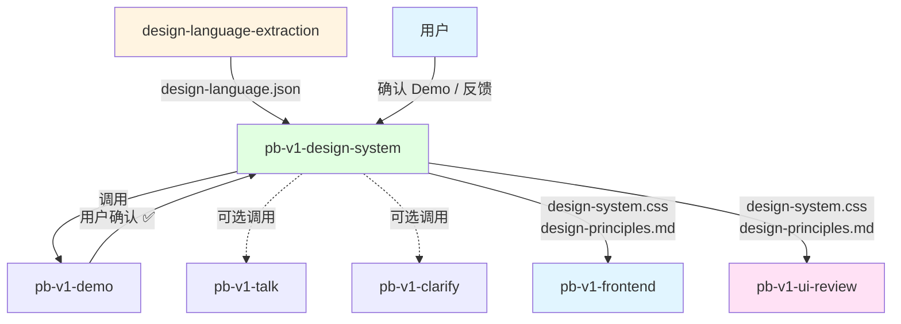

# pb-v1-design-system

**版本**: 1.0.0
**状态**: 设计完成
**创建日期**: 2026-04-18
**最后更新**: 2026-04-18
**流程映射**: vNext Build 阶段前置（设计系统建立）

---

**CRITICAL: 绝不在用户确认 Demo 前放行下游——G-DEMO 是硬门禁，未确认的设计方向进入前端会导致全量返工。**

**CRITICAL: 绝不添加 JSON 中没有的设计决策——翻译不是创造，添加不存在的 Token 会与上游设计语言产生不一致。**

**CRITICAL: 绝不产出不符合 Token 三层架构的 CSS——Seed/Map/Alias 缺一不可，残缺的 Token 体系会在主题切换时断裂。**

---

## 核心哲学

> 设计系统是约束的工程化表达——把美学意图转化为可验证的 CSS 变量和使用规则。Token 是设计决策的单一权威来源，所有视觉属性都必须从 Token 派生。

### 策略哲学

**对抗的模型惯性**：

| 模型惯性 | 真实情况 |
|---------|---------|
| 设计系统 = 写一堆 CSS 变量 | 设计系统 = Token 三层架构（Seed → Map → Alias）+ 使用规则。没有语义层的变量无法被组件稳定消费 |
| 颜色越多越灵活 | 语义色最多 6 个。颜色膨胀 = 视觉语言分裂。约束产生一致性 |
| 间距随意选择，看着舒服就行 | 间距必须基于 4px/8px 网格。"看着舒服"不是标准，网格对齐才是 |
| Token 命名随意，能用就行 | 命名是语义契约。`--color-primary` 是语义，`--blue-500` 是实现细节。组件消费语义层，不消费实现层 |
| 先出 CSS 再做 Demo | 先出 CSS + 原则文档，再通过 Demo 让用户确认方向。确认前不放行下游 |
| 设计系统一次做完 | 设计系统随项目演进。初始版本覆盖核心 Token，后续根据组件需求增量补充 |

**思考框架**：

1. **Token 三层是骨架，不是可选项** — Seed Token 定义设计意图（品牌色、基础字号），Map Token 定义梯度（色阶、字阶、间距阶梯），Alias Token 定义语义（文本主色、容器背景、边框默认色）。组件只消费 Alias 层。跳过任何一层都会导致下游实现时"找不到合适的变量"。
2. **从 JSON 到 CSS 是翻译，不是创造** — design-language.json 已经包含了所有设计决策。本 Skill 的工作是把 JSON 结构忠实翻译为 CSS 自定义属性，不添加 JSON 中没有的设计决策。
3. **设计原则从 Token 推导，不是凭空编写** — "标题用 `--font-size-2xl`，正文用 `--font-size-base`"这样的规则必须从 Token 定义中推导出来，不是独立创造的美学判断。
4. **Demo 是方向锁定机制** — 用户确认 Demo 后，设计方向锁定。后续 pb-v1-frontend 在此方向内实现，不得偏离。这是对抗"方向多次切换"问题的核心门禁。

**判断锚点**：

- **成功标准**：CSS Token 覆盖 Seed/Map/Alias 三层，设计原则文档覆盖 5 大维度（间距/颜色/字体/圆角/阴影），Demo 获得用户确认
- **切换条件**：当 design-language.json 缺失关键 Token 层时，反馈给 design-language-extraction 补充
- **停止条件**：Token 三层完整、原则文档完整、用户确认 Demo

---

## 设计原则

1. **Token 三层架构是硬约束**: Seed → Map → Alias，缺任何一层都不交付
2. **翻译优于创造**: 从 JSON 忠实转化，不添加 JSON 中没有的设计决策
3. **语义命名优于实现命名**: `--color-text-primary` 而非 `--gray-900`，`--spacing-md` 而非 `--16px`
4. **约束产生一致性**: 语义色 ≤ 6 个，间距基于 4px/8px 网格，圆角统一风格
5. **原则从 Token 推导**: 使用规则必须能追溯到具体 Token 定义
6. **Demo 是方向锁定门禁**: 用户确认前不放行下游

---

## 事实说明

以下是设计系统建立场景中模型容易忽略的事实，作为推理原料：

1. **Alias Token 是最容易被跳过但最关键的一层** — 模型倾向于直接从 Seed 生成 CSS 变量（`--color-primary: #1677ff`），跳过 Map 和 Alias。但组件需要的是 `--color-text-primary`、`--color-bg-container` 这样的语义变量，不是 `--color-primary`。没有 Alias 层，组件实现时会退化为硬编码色值。
2. **间距系统的节奏感比具体数值更重要** — 4px/8px 网格不是教条，而是保证相邻元素间距有规律的工具。如果 JSON 中的间距不在网格上，应该对齐到最近的网格点，而不是原样输出。
3. **设计原则文档的读者是 pb-v1-frontend** — 原则文档不是给人看的设计规范，而是给下游 Skill 看的实现约束。每条规则必须具体到"什么场景用什么 Token"，不能是"保持一致性"这样的模糊指导。
4. **CSS 变量命名的 kebab-case 转换有陷阱** — JSON 中的 `colorPrimary` 转为 `--color-primary` 是直觉的，但 `colorBgContainer` 应该转为 `--color-bg-container` 而不是 `--colorbgcontainer`。camelCase 到 kebab-case 的转换必须在大写字母前插入连字符。
5. **Demo 确认的粒度是"方向"不是"像素"** — 用户确认的是"整体视觉方向是否正确"（配色感觉、字体风格、间距节奏），不是"每个像素是否完美"。过度追求 Demo 完美会阻塞流程。

---

## 执行流程

### Phase 1: 输入验证与解析

**目标**: 确认 design-language.json 存在且结构完整。

**步骤**:
1. 检查 `docs/iterations/{id}/design-language.json` 是否存在
2. 使用 design-language-extraction 的 `scripts/validate_output.py` 校验 JSON 结构
3. 解析 Token 三层结构：
   - `tokens.seed` — 提取所有 Seed Token
   - `tokens.map` — 提取所有 Map Token（palette、neutrals、typographyScale、spacingScale、radiusScale、shadowScale）
   - `tokens.alias` — 提取所有 Alias Token（text、background、border、feedback、control、elevation、motion）
4. 解析辅助系统：`brand`、`principles`、`typography`、`layout`

**Gate G-INPUT**: JSON 不存在或校验失败 → 阻塞，返回 blocked 信号，要求上游 design-language-extraction 重新提取。

### Phase 2: Token 转化

**目标**: 将 JSON Token 三层结构转化为 CSS 自定义属性。

**步骤**:

**Step 2.1: Seed Token → CSS 根变量**

```css
:root {
  /* Seed Token — 设计意图源头 */
  --color-primary: #1677ff;
  --font-family-base: "Inter", sans-serif;
  --font-size-base: 14px;
  --line-height-base: 1.5715;
  --radius-base: 6px;
  --spacing-base: 8px;
}
```

命名规则：JSON camelCase → CSS kebab-case（`colorPrimary` → `--color-primary`）

**Step 2.2: Map Token → CSS 梯度变量**

```css
:root {
  /* Map Token — 梯度层 */
  /* 色阶 */
  --color-primary-1: #e6f4ff;
  --color-primary-2: #bae0ff;
  /* ... */
  --color-primary-10: #001d66;

  /* 中性色阶梯 */
  --color-neutral-1: #ffffff;
  --color-neutral-2: #fafafa;
  /* ... */
  --color-neutral-13: #000000;

  /* 字阶 */
  --font-size-xs: 12px;
  --font-size-sm: 13px;
  --font-size-base: 14px;
  --font-size-lg: 16px;
  --font-size-xl: 20px;
  --font-size-2xl: 24px;
  --font-size-3xl: 30px;

  /* 间距阶梯（4px/8px 网格） */
  --spacing-xs: 4px;
  --spacing-sm: 8px;
  --spacing-md: 16px;
  --spacing-lg: 24px;
  --spacing-xl: 32px;
  --spacing-2xl: 48px;

  /* 圆角阶梯 */
  --radius-sm: 4px;
  --radius-base: 6px;
  --radius-lg: 8px;
  --radius-xl: 12px;
  --radius-full: 9999px;

  /* 阴影阶梯 */
  --shadow-sm: 0 1px 2px rgba(0, 0, 0, 0.06);
  --shadow-base: 0 2px 8px rgba(0, 0, 0, 0.08);
  --shadow-lg: 0 8px 24px rgba(0, 0, 0, 0.12);
}
```

间距对齐规则：JSON 中的间距值对齐到最近的 4px 网格点。

**Step 2.3: Alias Token → CSS 语义变量**

```css
:root {
  /* Alias Token — 语义层（组件直接消费） */
  /* 文本 */
  --color-text-primary: rgba(0, 0, 0, 0.88);
  --color-text-secondary: rgba(0, 0, 0, 0.65);
  --color-text-tertiary: rgba(0, 0, 0, 0.45);
  --color-text-disabled: rgba(0, 0, 0, 0.25);
  --color-text-inverse: #ffffff;
  --color-text-link: var(--color-primary);
  --color-text-link-hover: var(--color-primary-4);

  /* 背景 */
  --color-bg-page: #f5f5f5;
  --color-bg-container: #ffffff;
  --color-bg-elevated: #ffffff;
  --color-bg-mask: rgba(0, 0, 0, 0.45);
  --color-bg-hover: rgba(0, 0, 0, 0.04);
  --color-bg-active: rgba(0, 0, 0, 0.08);

  /* 边框 */
  --color-border-default: #d9d9d9;
  --color-border-secondary: #f0f0f0;
  --color-border-focus: var(--color-primary);
  --color-border-danger: var(--color-error);

  /* 反馈 */
  --color-success-bg: #f6ffed;
  --color-warning-bg: #fffbe6;
  --color-error-bg: #fff2f0;
  --color-info-bg: #e6f4ff;

  /* 控件 */
  --control-height-sm: 24px;
  --control-height-md: 32px;
  --control-height-lg: 40px;
  --control-padding-inline: var(--spacing-sm);
  --control-padding-block: var(--spacing-xs);

  /* 层级 */
  --elevation-card: var(--shadow-sm);
  --elevation-popover: var(--shadow-base);
  --elevation-modal: var(--shadow-lg);

  /* 动效 */
  --motion-duration-fast: 100ms;
  --motion-duration-base: 200ms;
  --motion-duration-slow: 300ms;
  --motion-ease-enter: cubic-bezier(0.0, 0.0, 0.2, 1);
  --motion-ease-exit: cubic-bezier(0.4, 0.0, 1, 1);
}
```

**Step 2.4: 自检**

- 每个 Alias Token 是否引用了 Map 或 Seed Token（而非硬编码值）
- 间距值是否都在 4px 网格上
- 语义色是否 ≤ 6 个（primary、success、warning、error、info + 最多 1 个辅助色）
- 命名是否一致使用 kebab-case

### Phase 3: 设计原则文档生成

**目标**: 从 Token 推导使用规则，产出 `design-principles.md`。

**文档结构**:

```markdown
# 设计原则

## 1. 间距规则
- 基础网格: {spacingBase}px
- 组件内间距: --spacing-sm (8px) 或 --spacing-md (16px)
- 组件间间距: --spacing-md (16px) 或 --spacing-lg (24px)
- 区块间间距: --spacing-xl (32px) 或 --spacing-2xl (48px)
- 禁止使用不在阶梯中的间距值

## 2. 颜色使用规则
- 主色: --color-primary，用于 CTA、链接、选中态
- 文本层级: primary > secondary > tertiary > disabled
- 背景层级: page < container < elevated
- 反馈色: success/warning/error/info 仅用于对应语义场景
- 禁止直接使用 hex/rgb 值，必须引用 Token

## 3. 字体层级规则
- 页面标题: --font-size-2xl + bold
- 区块标题: --font-size-xl + semibold
- 卡片标题: --font-size-lg + medium
- 正文: --font-size-base + regular
- 辅助文本: --font-size-sm + regular
- 标签/徽章: --font-size-xs + medium

## 4. 圆角规则
- 按钮/输入框: --radius-base
- 卡片/容器: --radius-lg
- 头像/标签: --radius-full
- 弹窗/抽屉: --radius-xl

## 5. 阴影层级规则
- 卡片: --elevation-card
- 下拉/弹出: --elevation-popover
- 模态框: --elevation-modal
- 禁止自定义 box-shadow 值
```

每条规则必须引用具体 Token 变量名和值，不使用模糊描述。

### Phase 4: Demo 确认

**目标**: 通过 pb-v1-demo 生成 mock demo，让用户确认设计方向。

**步骤**:
1. 准备 Demo 输入：design-system.css + design-principles.md + 功能需求描述
2. 调用 pb-v1-demo 生成 mock demo（使用 mock 数据，不做后端）
3. Demo 展示核心视觉元素：配色、字体、间距节奏、卡片样式、按钮样式
4. 等待用户确认

**Gate G-DEMO（G1 级）**: 用户确认 Demo 后，设计方向锁定，解锁 pb-v1-frontend 实现阶段。用户不确认 → 根据反馈调整 Token 或原则，重新生成 Demo（最多 3 轮）。

---

## 输入协议

### 必需输入

| 输入 | 来源 | 说明 |
|------|------|------|
| `design-language.json` | design-language-extraction | 符合 schema.json 的结构化设计语言 |
| 功能需求描述 | proposal.md 或 feature-specs | 用于 Demo mock 的功能上下文 |

### 可选输入

| 输入 | 来源 | 说明 |
|------|------|------|
| 用户偏好 | 用户 | 对 Token 转化的特殊要求（如"间距偏紧凑"） |

### dispatch_context 格式

```yaml
dispatch_context:
  goal: "基于 design-language.json 建立 CSS 设计系统并通过 Demo 确认方向"
  scope: "Token 转化 + 设计原则 + Demo 确认"
  verification: "Token 三层完整 + 原则文档覆盖 5 维度 + 用户确认 Demo"
  doc_paths:
    - "docs/iterations/{id}/design-language.json"
    - "docs/iterations/{id}/proposal.md"
```

dispatch_context 缺少必填字段时拒绝执行，返回 blocked。

## 输出协议

### 主要产物

| 产物 | 路径 | 说明 |
|------|------|------|
| CSS Token 文件 | `docs/iterations/{id}/design-system.css` | 完整 `:root {}` 三层 Token |
| 设计原则文档 | `docs/iterations/{id}/design-principles.md` | 5 维度使用规则 |
| Demo | 通过 pb-v1-demo 产出 | mock demo 页面 |

### completion_signal 输出

执行完成后返回结构化信号给 orchestrator：

```yaml
completion_signal:
  skill: "pb-v1-design-system"
  status: enum [completed, failed, blocked]
  artifacts:
    - path: "docs/iterations/{id}/design-system.css"
      type: "design-system"
    - path: "docs/iterations/{id}/design-principles.md"
      type: "design-principles"
  issues: optional array
    - description: string
      gate_candidate: optional enum [G1, G2, G3, G4, G5]
  assumptions: optional array
    - clr_id: string
      summary: string
```

---

## 与其他 Skill 的交互



| 交互方 | 方向 | 内容 | 触发条件 |
|-------|------|------|---------|
| design-language-extraction | 输入 | design-language.json | 设计语言提取完成后 |
| pb-v1-demo | 工具 | mock demo 生成 | Phase 4 Demo 确认 |
| pb-v1-talk | 工具 | 设计方向讨论 | Token 转化中遇到歧义时 |
| pb-v1-clarify | 工具 | 设计系统维度澄清 | 需要用户决策时 |
| pb-v1-frontend | 输出 | design-system.css + design-principles.md | 用户确认 Demo 后 |
| pb-v1-ui-review | 输出 | design-system.css + design-principles.md（审查基准） | 用户确认 Demo 后 |

---

## 职责边界

### 必须做的事
- 校验 design-language.json 的结构完整性
- 将 JSON Token 三层（Seed → Map → Alias）转化为 CSS 自定义属性
- 生成 design-principles.md（从 Token 推导的使用规则）
- 调用 pb-v1-demo 生成 mock demo 供用户确认
- 在用户确认 Demo 后解锁下游

### 禁止做的事
- **不做设计语言提取**（交给 design-language-extraction）
- **不做组件实现**（交给 pb-v1-frontend）
- **不做美学审查**（交给 pb-v1-ui-review）
- **不做后端实现**
- **不修改 design-language.json**——上游产物已锁定
- **不添加 JSON 中没有的设计决策**——翻译，不创造

---

## 异常处理

### 场景 1: design-language.json 校验失败
**触发条件**: Phase 1 中 JSON 不存在或不通过 schema.json 校验
**处理方式**: 返回 blocked 信号，附带具体校验错误，要求上游 design-language-extraction 补充或修复

### 场景 2: Token 三层缺失关键字段
**触发条件**: Phase 2 中 Seed/Map/Alias 某层的 required 字段缺失
**处理方式**: 尝试从其他层推导（如从 Seed 推导 Map）；无法推导时返回 blocked，列出缺失字段

### 场景 3: Demo 确认超过 3 轮未收敛
**触发条件**: 用户连续 3 轮对 Demo 提出修改意见
**处理方式**: ESCALATED，向用户说明情况，建议回退到 design-language-extraction 重新确认设计方向

### 场景 4: pb-v1-demo 不可用
**触发条件**: pb-v1-demo 调用失败或环境不支持
**处理方式**: 降级为向用户展示 design-system.css + design-principles.md 文档，要求用户基于文档确认方向

---

## 质量标准

### 完成定义

以下条件全部满足才算完成：
- ✅ design-system.css 包含完整的 Token 三层（Seed + Map + Alias）
- ✅ 所有 Alias Token 引用 Map 或 Seed，无硬编码值
- ✅ 间距值全部对齐到 4px/8px 网格
- ✅ 语义色不超过 6 个
- ✅ CSS 变量命名遵循 kebab-case 语义命名规范
- ✅ design-principles.md 覆盖 5 大维度（间距/颜色/字体/圆角/阴影）
- ✅ 每条使用规则可追溯到具体 Token 定义
- ✅ Demo 获得用户确认（或降级确认）

---

## Safety

- 不做组件实现，不修改 design-language.json
- design-system.css 是唯一 Token 来源，不引入第二套 CSS 系统
- Alias 层必须引用 Map 或 Seed，不使用硬编码值
- 最多 3 轮 Demo 确认，3 轮未确认则 ESCALATED

---

**文档状态**: 设计完成
**版本**: 1.0.0
**创建日期**: 2026-04-18
**最后更新**: 2026-04-18
