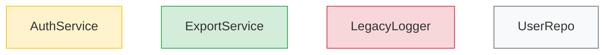

# pb-v1-designing 优化方案 v2

**版本**: 2.1.0  
**状态**: 方案设计  
**创建日期**: 2026-04-01  
**修订**: 基于用户反馈调整

---

## 核心目标调整

### 用户反馈

> "我希望此 skill 能给出更多更好的建议，我做出判断和选择。希望此 skill 更努力思考减少用户的决策成本；每次选择的过程也需要落盘，参考 office hour，即之前的选择也能为之后的选择提供判断依据。最终的目的是收敛的同时让整体方案变得更好，这个过程也需要 skill 操控更多的事情。"

### 设计哲学调整

**从**: Skill 提供选项 → 用户频繁决策  
**到**: Skill 深度思考 → 只在关键分叉点才需要用户决策

**核心原则**:
1. **Skill 是架构顾问，不是选项列表生成器**
2. **深度分析 + 强推荐** - 每个决策点都有充分论证的推荐方案
3. **决策过程落盘** - 记录每次选择的理由，形成决策链
4. **历史决策作为依据** - 后续决策基于前面的选择
5. **自主决策 vs 用户决策** - 明确的直接决策，模糊的才问用户

---

## 优化点（v2）

### 优化点 1: 决策分级机制

**问题**: 当前所有决策都问用户，增加决策负担

**优化**: 将决策分为三级，只有 L1 才需要用户决策

**决策分级**:

```markdown
### 决策分级标准

**L1 - 战略级决策（必须用户决策）**:
- 影响整体架构方向
- 有明显的利弊权衡
- 后续难以更改
- 示例: 单体 vs 微服务、SQL vs NoSQL

**L2 - 战术级决策（Skill 推荐 + 简要说明）**:
- 影响局部实现
- 有明确的最佳实践
- 后续可以调整
- 示例: JWT vs Session、Redis vs Memcached
- 处理方式: Skill 直接决策，在 architecture.md 中说明理由

**L3 - 实现级决策（Skill 直接决策）**:
- 纯技术细节
- 有标准答案
- 示例: 日志级别、命名规范
- 处理方式: 直接决策，不打扰用户
```

**产出**: 决策分级表

---

### 优化点 2: 决策日志机制（参考 office-hours）

**问题**: 决策过程没有落盘，无法追溯

**优化**: 引入决策日志，记录每次选择的理由

**实施方式**:

```markdown
### 决策日志格式

**文件**: `docs/iterations/{iteration_id}/arch_decisions.md`

```markdown
# 架构决策日志

## 决策 1: 数据库选型
- **时间**: 2026-04-01 14:30
- **级别**: L1（战略级）
- **问题**: 选择 SQL 还是 NoSQL
- **分析**:
  - 方案 A (PostgreSQL): 强一致性、事务支持、团队熟悉
  - 方案 B (MongoDB): 灵活 schema、水平扩展
- **推荐**: PostgreSQL
- **理由**: 
  1. 需求中有明确的事务要求（F-001, F-003）
  2. 团队对 PostgreSQL 更熟悉，降低风险
  3. MVP 阶段不需要极致的水平扩展
- **用户决策**: 采纳推荐（PostgreSQL）
- **影响**: 后续所有数据访问层基于 PostgreSQL

## 决策 2: 认证方案
- **时间**: 2026-04-01 14:35
- **级别**: L2（战术级）
- **问题**: JWT vs Session
- **分析**: JWT 更适合无状态 API
- **Skill 决策**: JWT
- **理由**: 
  1. 基于决策 1（PostgreSQL），无需额外的 session 存储
  2. 前后端分离架构，JWT 更合适
  3. 标准实践
- **影响**: 认证服务设计基于 JWT
```

**关键机制**:
- 每个决策都记录时间、级别、理由
- L1 决策记录用户选择
- L2/L3 决策记录 Skill 决策
- 后续决策引用前面的决策（如"基于决策 1"）
```

---
### 优化点 3: 深度分析框架

**问题**: 当前只是"列出方案"，没有深度分析

**优化**: 引入深度分析框架，每个决策都有充分论证

**分析框架**:

```markdown
### 决策分析模板

**决策点**: {问题}

**上下文**:
- 相关需求: F-001, F-003
- 相关约束: 时间紧、团队规模小
- 前置决策: 决策 1（PostgreSQL）

**方案分析**:

方案 A: {名称}
- 技术可行性: ⭐⭐⭐⭐⭐
- 实现复杂度: ⭐⭐⭐ (中)
- 团队熟悉度: ⭐⭐⭐⭐
- MVP 适用性: ⭐⭐⭐⭐⭐
- 长期可维护: ⭐⭐⭐⭐
- 优点: ...
- 缺点: ...
- 风险: ...

方案 B: {名称}
- 技术可行性: ⭐⭐⭐⭐
- 实现复杂度: ⭐⭐⭐⭐ (高)
- 团队熟悉度: ⭐⭐
- MVP 适用性: ⭐⭐⭐
- 长期可维护: ⭐⭐⭐⭐⭐
- 优点: ...
- 缺点: ...
- 风险: ...

**推荐**: 方案 A

**推荐理由**（充分论证）:
1. 基于前置决策 1（PostgreSQL），方案 A 更契合
2. MVP 阶段优先快速交付，方案 A 复杂度更低
3. 团队对方案 A 更熟悉，降低风险
4. 方案 B 的优势（长期可维护）在 MVP 阶段不是首要考虑

**如果选择方案 B 的条件**:
- 如果团队有方案 B 的经验
- 如果长期可维护性是首要考虑
- 如果有充足的时间预算
```

---
### 优化点 4: 决策链机制

**问题**: 决策之间没有关联，无法形成一致的架构

**优化**: 建立决策链，后续决策基于前面的选择

**实施方式**:

```markdown
### 决策链示例

决策 1: 数据库选型 → PostgreSQL
  ↓ 影响
决策 2: 认证方案 → JWT（因为 PostgreSQL 无需额外 session 存储）
  ↓ 影响
决策 3: 缓存策略 → Redis（因为 JWT 需要 token 黑名单）
  ↓ 影响
决策 4: 部署架构 → 容器化（因为 PostgreSQL + Redis 需要编排）

**决策链验证**:
- 每个新决策必须检查与前置决策的一致性
- 如果冲突，必须说明为什么偏离
- 决策链形成完整的架构故事
```

---

### 优化点 5: 迭代收敛机制

**问题**: 没有明确的收敛标准

**优化**: 引入迭代收敛机制，每轮都向最优方案靠近

**收敛标准**:

```markdown
### 收敛检查清单

**第 1 轮**: Scope Challenge + 初步架构
- [ ] 现有能力已盘点
- [ ] 最小变更集已确定
- [ ] 初步架构图已绘制

**第 2 轮**: 决策收敛
- [ ] L1 决策已完成（用户确认）
- [ ] L2 决策已完成（Skill 决策）
- [ ] 决策链已形成

**第 3 轮**: 可实施性验证
- [ ] 5 种中间表示已产出
- [ ] 可实施性问题已回答
- [ ] 组件与需求映射 100%

**收敛判定**: 所有检查清单通过 → 架构收敛完成
```

---

### 优化点 6: 现有代码采集与复用分析（来自 powerby-architect P3）

**问题**: 当前方案缺少对现有代码的系统性采集，直接进入架构设计容易"从零开始"或重复造轮子

**来源**: powerby-architect SKILL.md P3 阶段明确要求"扫描 src/ 目录识别现有服务"，powerby-asp-architect 阶段一要求"扫描项目 src/ 目录了解现有架构"

**优化**: 在 Scope Challenge 阶段嵌入系统性的现有代码采集

**实施方式**:

```markdown
### 现有代码采集协议

**触发条件**: 项目 src/ 目录存在（非全新项目）

**采集内容**:

1. **服务/模块清单**
   - 扫描 src/ 目录结构
   - 识别现有服务、模块、组件
   - 记录每个模块的职责和入口文件

2. **技术栈盘点**
   - 识别使用的框架、库、工具链
   - 记录版本信息
   - 评估技术栈健康度

3. **可复用性评估**（逐功能点）
   | P0 功能点 | 现有组件 | 复用策略 | 适配成本 | 风险 |
   |-----------|---------|---------|---------|------|
   | 用户登录 | AuthService | 扩展 | 低 | 低 |
   | 数据导出 | - | 新建 | - | - |
   | 权限管理 | RoleModule | 重构 | 中 | 中 |

4. **技术债务识别**
   - 已知问题（TODO/FIXME/HACK）
   - 架构约束（如单体限制、性能瓶颈）
   - 与新需求冲突的现有设计

**产出**: 嵌入 architecture.md § 2 "现有架构分析"
```

**为什么重要**: powerby-architect 和 ASP 架构师都把"先调研现有，再设计新增"作为核心原则。缺少这一步会导致架构设计脱离实际代码基础

---

### 优化点 7: 变更点标注与影响分析（来自 powerby-architect P4）

**问题**: 当前方案只产出"最终架构"，没有清晰标注"相对现有系统变了什么"

**来源**: powerby-architect P4 第 4 步"明确标注相对现有系统的 NEW/MODIFIED/REMOVED 变更"，powerby-asp-architect 要求"变更���后对比图（Mermaid）"

**优化**: 强制标注变更类型，提供前后对比

**实施方式**:

```markdown
### 变更点标注协议

**标注类型**:
- **NEW** — 全新组件，现有系统中不存在
- **MODIFIED** — 对现有组件的修改或扩展
- **REFACTORED** — 重构现有组件（职责不变，实现调整）
- **REMOVED** — 移除现有组件

**架构图标注**: 在 Mermaid 架构图中使用样式区分


**变更清单表**:

| 组件 | 变更类型 | 描述 | 影响范围 | 风险等级 |
|------|---------|------|---------|---------|
| AuthService | MODIFIED | 增加 OAuth2 支持 | F-001, F-002 | 中 |
| ExportService | NEW | 数据导出服务 | F-005 | 低 |
| LegacyLogger | REMOVED | 替换为结构化日志 | 全局 | 高 |

**风险等级判定**:
- **高**: 影响 3+ 个 Feature 或核心链路，修改量大
- **中**: 影响 1-2 个 Feature，修改量适中
- **低**: 局部变更，影响范围可控

**变更前后对比图**: 对于 MODIFIED/REFACTORED 组件，必须提供变更前后的对比说明

**产出**: 嵌入 architecture.md § 4 "架构变更点"
```

**为什么重要**: 增量架构的核心是"清楚知道改了什么"，main 分支架构师将此作为 Gate 4 的必检项

---

### 优化点 8: 架构演进决策框架

**问题**: 缺少"增量演进 vs 全新架构"的判断标准，容易在两个极端间摇摆

**来源**: powerby-architect 核心原则"基于现有架构的增量演进是默认路径。只有在充分论证现有架构无法满足需求的前���下，才考虑替换方案"

**优化**: 提供明确的演进决策框架

**实施方式**:

```markdown
### 架构演进决策树

**默认路径**: 增量演进（复用 + 扩展现有架构）

**替换条件**（必须满足以下至少 2 项才考虑替换）:
1. 现有组件的核心抽象与新需求根本矛盾（不是扩展能解决的）
2. 适配成本 > 重写成本（有量化依据）
3. 现有组件的技术债务严重到影响新需求交付
4. 现有组件的依赖已停止维护或存在安全漏洞

**决策记录**: 每个"替换"决策必须记录在 arch_decisions.md 中，包含：
- 为什么不能增量演进（具体论证）
- 替换的迁移成本评估
- 替换的回滚方案

**决策级别**: 替换决策 = L1（必须用户确认）
```

**为什么重要**: 避免两种极端——"永远在旧架构上打补丁"和"每次都推倒重来"

---

### 优化点 9: 架构疑问澄清环节（来自 ASP architect Clarification 模式）

**问题**: 当前方案从需求对齐直接跳到架构设计，缺少"架构维度的疑问澄清"

**来源**: powerby-asp-architect 阶段一明确包含"识别架构疑问点 → 逐一提出架构澄清问题 → 以'无疑问'为结束条件"

**优化**: 在需求对齐后、架构设计前，增加架构疑问澄清

**实施方式**:

```markdown
### 架构疑问澄清协议

**触发时机**: 需求对齐 + 现有代码采集完成后

**澄清类型**:

1. **技术约束疑问**
   - 现有系统的技术限制（如数据库版本、部署环境）
   - 团队技术栈熟悉度
   - 性能/安全的硬性要求

2. **需求边界疑问**
   - 功能点之间的优先级冲突
   - 非功能需求的具体指标
   - 与现有功能的兼容性要求

3. **架构方向疑问**
   - 对现有架构的演进偏好
   - 新技术引入的接受度
   - 部署架构的约束

**处理方式**:
- Skill 先基于代码采集和需求分析自行推断答案
- 无法推断的疑问才提交用户（减少打扰）
- 使用 AskUserQuestion 一次性提交所有疑问（不逐个问）
- 以"无未解疑问"为结束条件

**产出**: 架构方向摘要（含复用策略），嵌入决策日志
```

**为什么重要**: ASP 架构师将"先澄清后设计"作为强制流程，避免带着错误假设进入设计

---

### 优化点 10: Constitution Gates 验收机制（来自 ASP 审查体系）

**问题**: 当前方案的质量标准是 checklist 式的，缺少结构化的验收门禁

**来源**: powerby-asp-architect 的 Constitution Gates（Simplicity/Anti-Abstraction/Integration-First），powerby-architect 的 Gate 3/Gate 4 检查

**优化**: 在架构交付前增加结构化的自检门禁

**实施方式**:

```markdown
### Architecture Self-Check Gates

**Gate 1: Simplicity Gate**
- [ ] 方案是最简单能满足需求的设计
- [ ] 无为"未来可能"引入的过度设计
- [ ] 抽象层级 ≤ 3 层
- [ ] 如果超过 8 个文件变更，已论证必要性

**Gate 2: Fidelity Gate**
- [ ] 每个 P0 Feature 都有对应组件
- [ ] 每个组件都有明确的 Feature 映射（无孤儿组件）
- [ ] 未新增 proposal.md 中不存在的功能
- [ ] 组件与需求映射 100% 覆盖

**Gate 3: Consistency Gate**
- [ ] 接口定义完整（端点、Schema、错误码）
- [ ] 数据流无悬空依赖
- [ ] 决策链无矛盾
- [ ] 变更点标注完整

**Gate 4: Buildability Gate**
- [ ] 同步/异步边界明确
- [ ] 失败场景有降级方案
- [ ] 无单点故障（或已标注风险）
- [ ] 部署复杂度可控

**未通过处理**:
- 任一 Gate 未通过 → 在交付文档中标注原因和补救建议
- Gate 2 (Fidelity) 未通过 → 必须修复后才能交付
- 其他 Gate → 可以标注风险后交付，由 Reviewer 最终判定
```

**为什么重要**: ASP 体系通过 Constitution Gates 保证架构质量的底线，pb-v1-reviewer 的架构审查也依赖这些门禁

---

### 优化点 11: Refinery 模式支持（来自 ASP architect）

**问题**: 当前方案只有"一次性设计"，没有基于审查反馈的迭代修补机制

**来源**: powerby-asp-architect 的 Refinery 模式"读取全部历史 arch_logs/ → 只修复最新一轮问题 → 回归检查"

**优化**: 支持 Reviewer 反馈后的架构修补

**实施方式**:

```markdown
### Refinery 模式

**触发条件**: pb-v1-reviewer 架构审查返回 FAIL，需要修补

**流程**:
1. 读取 arch_logs/ 中的全部审查记录
2. 按轮次排序，识别最新一轮 BLOCKER/MAJOR 问题
3. 检查历史修复是否引入回归
4. 只修复审查指出的问题，不新增范围外设计
5. 更新 architecture.md 和 feature-specs
6. 写入 arch_logs/round-{N}-patch.md

**Patch 记录格式**:
```markdown
# Architecture Round {N} Patch Record

## 修复的问题
| 问题 ID | 严重度 | 描述 | 修复方式 |

## 回归检查
- [ ] 历史修复未被覆盖
- [ ] 新修复未引入矛盾
- [ ] 决策链仍然一致

## Self-Check Gates 重新验证
- [ ] Simplicity / Fidelity / Consistency / Buildability 仍通过
```

**关键约束**:
- 只修复审查指出的问题
- 修复不能引入新的范围外设计
- 每次 patch 必须做回归检查
```

**为什么重要**: 架构设计不是一次性的，与 Reviewer 的迭代闭环是架构收敛的核心机制

---

## 实施建议

### SKILL.md v2.0 结构变更

基于 v1.0 + 两版优化方案 + main 分支经验，SKILL.md v2.0 的主要结构变化：

**执行流程重构**:

```
Step 1: 需求对齐 + 现有代码采集（增强）
  ├── 1.1: 读取 proposal.md + feature-specs
  ├── 1.2: 扫描 src/ 识别现有服务和技术栈
  └── 1.3: 生成可复用性评估 + 技术债务识别
Step 2: Scope Challenge（新增，来自 v1 优化点 1）
Step 3: 架构疑问澄清（新增，来自 ASP architect）
  ├── 3.1: Skill 自行推断技术约束和方向
  └── 3.2: 无法推断的疑问一次性提交用户
Step 4: 架构设计 + 决策收敛（重构）
  ├── 4.1: 架构演进决策（增量 vs 全新）
  ├── 4.2: 组件设计 + 变更点标注（NEW/MODIFIED/REMOVED）
  ├── 4.3: L1 决策交互（战略级，用户决策）
  ├── 4.4: L2/L3 决策自主完成（Skill 决策）
  ├── 4.5: 决策链验证
  └── 4.6: 强制中间表示产出
Step 5: 可实施性验证 + Self-Check Gates（增强）
Step 6: 填充 D-09~D-16（保留）
Step 7: 交付（增强，含决策日志 + 变更清单）
Step 8: 通知 orchestrator（保留）
--- Refinery 模式（按需触发）---
Step R: 基于 Reviewer 反馈的架构修补
```


**新增/增强产出物**:
- `arch_decisions.md` — 决策日志（全流程记录）
- `arch_logs/round-{N}-patch.md` — Refinery 修补记录（按需）
- 5 种强制中间表示（架构图、数据流图、状态机图、依赖图、测试矩阵）
- 可实施性验证报告（嵌入 architecture.md）

**architecture.md 新增章节**:
- § 2: 现有架构分析（组件清单、技术栈、可复用性）
- § 4: 架构变更点（变更类型标注 + 前后对比 + 影响分析）
- § 9: Self-Check Gates 验收结果

**优化点来源追溯**:

| 优化点 | 来源 | 类型 |
|-------|------|------|
| 1. 决策分级 L1/L2/L3 | gstack + 用户反馈 | 新增 |
| 2. 决策日志落盘 | office-hours + 用户反馈 | 新增 |
| 3. 深度分析框架 | gstack | 新增 |
| 4. 决策链机制 | 用户反馈 | 新增 |
| 5. 迭代收敛机制 | gstack | 新增 |
| 6. 现有代码采集 | powerby-architect P3 + ASP architect | 遗漏补充 |
| 7. 变更点标注 | powerby-architect P4 + ASP architect | 遗漏补充 |
| 8. 架构演进决策框架 | powerby-architect 核心原则 | 遗漏补充 |
| 9. 架构疑问澄清 | ASP architect Clarification | 遗漏补充 |
| 10. Constitution Gates | ASP arch-reviewer + powerby-architect Gate | 遗漏补充 |
| 11. Refinery 模式 | ASP architect Refinery | 遗漏补充 |
| Scope Challenge | v1 优化方案 | 保留 |
| 强制中间表示 | v1 优化方案 | 保留 |
| 可实施性验证 | v1 优化方案 | 保留 |
| 反馈闭环 | v1 优化方案 | 保留 |
| 组件与需求映射强化 | v1 优化方案 | 保留 |

---

## 风险与缓解

### 风险 1: Skill 自主决策可能偏离用户意图

**影响**: L2/L3 决策由 Skill 自主完成，可能不符合用户期望

**缓解**:
- L2 决策仍然记录在决策日志中，用户可以随时审阅
- 决策日志在交付前作为交付物的一部分提交用户确认
- L1/L2 分级标准明确，战略级决策不会被 Skill 越权
- 用户在最终确认环节可以回溯任何 L2 决策

### 风险 2: 决策链过长导致回溯成本高

**影响**: 如果早期决策需要修改，后续决策可能需要级联调整

**缓解**:
- Scope Challenge 前置，减少后期方向性变化
- L1 决策尽早完成（第 2 轮），���后续 L2/L3 奠定基础
- 决策日志记录"如果选择另一方案的条件"，便于回溯评估
- 3 轮收敛机制限制决策复杂度

### 风险 3: 流程步骤增多导致执行时间变长

**影响**: 从 7 步扩展到 8 步 + Refinery，现有代码采集和 Gates 验收增加处理时间

**缓解**:
- 现有代码采集和需求对齐合并为一步（Step 1），并行执行
- 只对 L1/L2 决策做深度分析，L3 快速决策
- Self-Check Gates 是自动化检查，不需用户参与
- 全新项目（无 src/）可跳过代码采集和变更标注，简化流程

### 风险 4: Refinery 模式可能导致"无限修补"

**影响**: Reviewer 反复指出问题，架构一直在修补

**缓解**:
- 每轮 patch 收敛性指标：问题总数必须趋于减少
- 最多 3 轮 Refinery，超过则提交用户决策是否接受当前状态
- Refinery 只修复审查指出的问题，不扩大范围

---

## 预期收益

### 收益 1: 用户决策成本大幅降低

**量化**: L1 决策通常 2-3 个，L2 决策 5-8 个（Skill 自主），L3 决策 10+ 个（静默）

**对比**: v1 需要用户参与 10+ 个决策 → v2 只需用户参与 2-3 个关键决策

### 收益 2: 架构与现有代码的衔接质量提升

**量化**: 通过代码采集 + 复用评估 + 变更标注，确保架构设计不脱离代码现实

**价值**: 避免"架构很漂亮但不知道改了什么"和"忽略现有实现重复造轮子"

### 收益 3: 决策质量与可追溯性

**量化**: arch_decisions.md 完整记录决策历史，支持回溯和审计

**价值**: Reviewer 可基于决策日志审查架构，而非猜测决策意图

### 收益 4: 架构收敛质量提升

**量化**: 3 轮收敛 + Self-Check Gates + 可实施性验证

**价值**: 从"产出漂亮架构"变为"产出可实施、可追溯、可审查的架构"

### 收益 5: 与 Reviewer 的闭环协作

**量化**: Refinery 模式支持基于审查反馈的迭代修补，每轮收敛

**价值**: 架构设计和架构审查形成完整闭环，不再是"一次性交付"

---

## 总结

### 完整优化点清单（11 项）

| # | 优化点 | 来源 | 核心价值 |
|---|-------|------|---------|
| 1 | 决策分级 L1/L2/L3 | gstack + 用户反馈 | 降低用户决策负担 |
| 2 | 决策日志落盘 | office-hours + 用户反馈 | 决策过程可追溯 |
| 3 | 深度分析框架 | gstack | 提升决策质量 |
| 4 | 决策链机制 | 用户反馈 | 确保架构一致性 |
| 5 | 迭代收敛机制 | gstack | 明确收敛标准 |
| 6 | 现有代码采集与复用分析 | powerby-architect P3 | 不脱离代码现实 |
| 7 | 变更点标注与影响分析 | powerby-architect P4 | 清楚"改了什么" |
| 8 | 架构演进决策框架 | powerby-architect 原则 | 避免极端 |
| 9 | 架构疑问澄清 | ASP architect | 不带错误假设设计 |
| 10 | Constitution Gates | ASP arch-reviewer | 架构质量底线 |
| 11 | Refinery 模式 | ASP architect | 审查闭环 |

### 设计哲学

**从 v1.0**:
> 架构设计 = 产出架构文档

**到 v2.0**:
> 架构收敛 = 基于现有代码 → 深度思考 → 决策落盘 → 变更标注 → 质量门禁 → 审查闭环

### 与现有实现的对齐

| 能力 | powerby-architect | ASP architect | pb-v1-designing v2 |
|------|-------------------|---------------|---------------------|
| 现有代码采集 | P3 扫描 src/ | 阶段一扫描 src/ | ✅ Step 1 |
| 复用性评估 | 评估可复用性 | 逐功能点复用策略 | ✅ Step 1 |
| 架构疑问澄清 | Gate 3 检查 | Clarification 模式 | ✅ Step 3 |
| 变更点标注 | NEW/MODIFIED/REMOVED | NEW/MODIFIED/REMOVED/REFACTORED | ✅ Step 4 |
| 组件与需求映射 | 映射表 | 强制映射表 | ✅ Step 4 |
| 决策点评估 | 2-3 个决策点 | 2-3 个决策点 | ✅ Step 4 (L1) |
| Gate 检查 | Gate 3/4 | Constitution Gates | ✅ Step 5 |
| 审查后修补 | 无 | Refinery 模式 | ✅ Step R |
| 决策分级 | 无 | 无 | ✅ 新增 |
| 决策日志 | 关键决策记录 | 无 | ✅ 增强 |
| 决策链 | 无 | 无 | ✅ 新增 |

---

**文档状态**: 方案设计完成（含 main 分支经验补充）  
**下一步**: 用户确认后，应用到 pb-v1-designing SKILL.md v2.0
