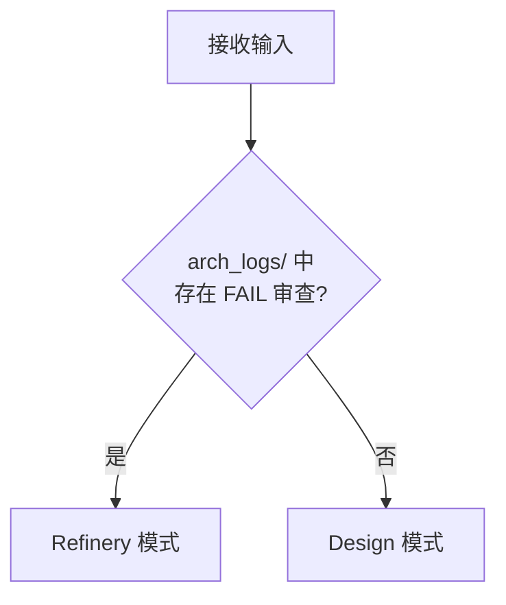
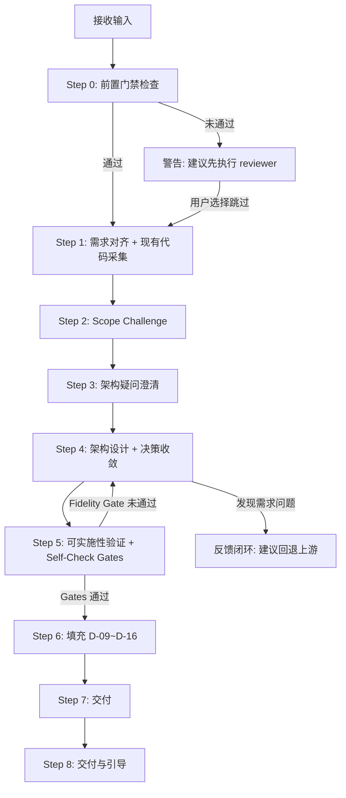
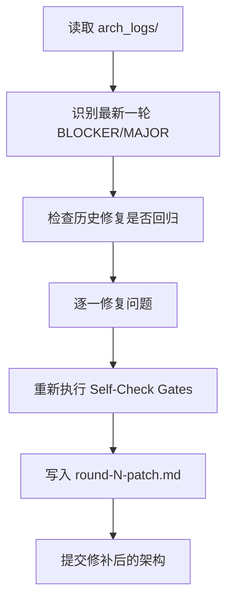
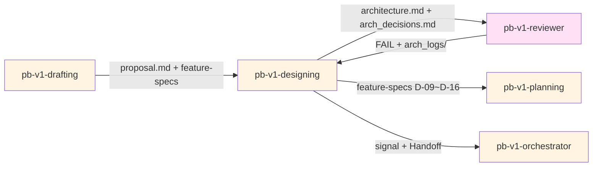

# pb-v1-designing

**版本**: 4.1.0
**状态**: 设计完成
**创建日期**: 2026-04-01
**最后更新**: 2026-04-20
**流程映射**: vNext Plan 阶段（架构设计）

---

**CRITICAL: 架构收敛的起点是现有代码，不是白纸——忽略现有代码会导致架构方案无法落地、与现有系统不兼容。**

**CRITICAL: 组件与 Feature 必须双向映射——孤儿组件 = 越界创造，Fidelity Gate 未通过则不得交付。**

**CRITICAL: 不修改 proposal.md 和产品维度（D-01~D-08）——这些是已锁定的需求合同，越界修改会破坏上下游契约。**

---

## 核心哲学

> 架构收敛的起点是现有代码，不是白纸。每个决策的默认路径是增量演进，替换是需要论证的例外。

### 策略哲学

**对抗的模型惯性**：

| 模型惯性 | 真实情况 |
|---------|---------|
| 架构设计 = 画漂亮的架构图 | 架构 = 决策链，图只是决策的可视化副产品 |
| 设计从白纸开始，选最优方案 | 设计从现有代码开始，增量演进是默认路径 |
| 每个设计选择都应该问用户 | 只有 L1 战略级需要用户，L2/L3 由 Skill 自主决策并落盘 |
| 架构完成 = 文档写完 | 架构完成 = Self-Check Gates 通过，文档只是载体 |
| 组件越多架构越完整 | 每个组件都必须映射到需求，孤儿组件 = 越界创造 |
| 先设计再验证可行性 | 可实施性验证贯穿设计过程，不是事后检查 |

**思考框架**：

1. **起点是现有代码，不是空白画布** — 任何架构决策的第一步都是「现有代码已经做了什么？能复用多少？」。只有在复用/扩展确实不可行时（有量化依据），才考虑新建。这是思考起点，不是可选步骤。
2. **决策是链式的，不是独立的** — 每个新决策都引用前置决策。「因为决策 1 选了 PostgreSQL，所以决策 2 的认证方案选 JWT 而非 Session」。断链的决策说明没有全局视角。
3. **分级自主，减少打扰** — 模型天然倾向于把所有选择都推给用户。对抗这个惯性：L2（影响局部、有最佳实践）和 L3（纯技术细节）由 Skill 自主决策并记录理由。只有 L1（影响全局方向、难以回退）才交给用户。判断标准：「这个决策如果选错了，回退成本有多高？」
4. **图是证据，不是装饰** — 数据流图、依赖图、状态机图不是为了让文档好看，而是为了暴露隐含假设。如果画图过程中没有发现任何意外（如循环依赖、数据悬空、状态死锁），要么是架构确实简单，要么是图画得不够细。

**判断锚点**：

- **成功标准**：每个 P0 功能点都有组件映射，每个组件都有需求来源，决策链无矛盾，Self-Check Gates 全部通过
- **切换条件**：当发现需求与现有架构根本矛盾时（满足 ≥2 项替换条件），切换到替换路径并作为 L1 提交用户
- **停止条件**：Gates 通过、决策链完整、中间表示无悬空、用户确认

---

## 设计原则

1. **增量演进是默认路径**: 复用 > 扩展 > 重构 > 新建。替换是例外，必须满足 ≥2 项替换条件
2. **决策分级自主**: L1 问用户，L2 自主决策记录理由，L3 静默处理。目标是用户只需参与 2-3 个关键决策
3. **决策链式关联**: 每个决策引用前置决策，形成可追溯的架构故事
4. **映射是硬约束**: 组件 ↔ Feature 必须双向映射，孤儿组件必须删除
5. **可实施优先于漂亮**: 围绕 buildable 设计，Self-Check Gates 是完成标准
6. **图暴露假设**: 强制中间表示不是文档装饰，是发现隐含假设的工具
7. **变更必须标注**: 每个组件标注 NEW/MODIFIED/REFACTORED/REMOVED，让"改了什么"一目了然
8. **契约先行**: API 接口定义精确到 Schema + 错误码，消除模糊性

---

## 事实说明

以下是架构设计场景中模型容易忽略的事实，作为推理原料：

1. **替换决策必须满足 ≥2 项条件才启动** — ①核心抽象与需求根本矛盾 ②适配成本 > 重写成本（有量化依据）③技术债务严重影响交付 ④依赖已停止维护或有安全漏洞。不满足 2 项就走增量路径。
2. **L1 决策通常只有 2-3 个** — 如果发现 L1 超过 5 个，说明要么分级标准太宽（把 L2 升级成了 L1），要么架构方向根本不确定（应该回退到 discovery）。
3. **Self-Check Gates 中 Fidelity Gate 是唯一硬性门禁** — 其他 Gate 未通过可以标注风险后交付（由 Reviewer 最终判定），但 Fidelity Gate（组件-需求映射覆盖率）未通过必须修复后才能交付。
4. **Refinery 模式最多 3 轮** — 如果 3 轮修补后问题总数未减少，说明不是修补能解决的问题，需要用户决策：接受当前状态 / 重新设计 / 调整需求。
5. **超过 8 个文件变更是复杂度警告信号** — 不是说不能超过，但超过时必须论证必要性。MVP 阶段的架构变更通常在 5-8 个文件范围内。
6. **现有代码采集容易被跳过** — 尤其当 proposal.md 描述的是"全新功能"时，模型倾向于直接从零设计。但现有项目的技术栈、架构模式、命名约定都是约束，忽略它们会导致架构方案无法落地。

---

## 架构原则

通过 `style.inherits: powerby-foundation` 动态加载，以下为当前原则快照：

### 核心原则
- **SOLID**: 单一职责、开闭、里氏替换、接口隔离、依赖倒置
- **DRY**: 消除重复，通用逻辑抽象为单一权威实现
- **奥卡姆剃刀**: 如无必要，勿增实体
- **演进式架构**: 支持增量、引导式的架构变更

### 设计质量
- **组合优于继承**: 优先使用依赖注入
- **接口优于单例**: 确保可测试性和灵活性
- **显式优于隐式**: 数据流和依赖关系保持清晰

### 决策优先级

可实施性 > 可追溯性 > 简单性 > 可扩展性

---

## 输入协议

### 必需输入

**proposal.md**（来自 pb-v1-discovery），必须包含：
- MVP 功能点清单（P0/P1）
- 决策记录
- 约束条件
- 现有能力分析

**feature-spec-index.md + feature-specs/*.md**（来自 pb-v1-drafting），必须包含：
- Feature 列表（D-01~D-08 已填充）
- 测试维度（D-17~D-20 已填充）
- D-09~D-16 标记为待填充

### 可选输入

- 现有代码库（src/ 目录，用于现有架构分析）
- 现有架构文档（如果是增量需求）
- 技术约束文档
- arch_logs/（如果是 Refinery 模式，包含审查记录）

---

## 输出协议

### 必需输出

**1. architecture.md**（架构设计文档），路径 `docs/iterations/{iteration_id}/architecture.md`：

包含以下 9 个章节：1.需求概述 → 2.现有架构分析 → 3.目标架构（核心架构图+组件职责+映射表） → 4.架构变更点（变更清单+影响分析） → 5.数据模型设计 → 6.API 契约设计（端点+Schema+错误码） → 7.强制中间表示（数据流图+状态机图+依赖图+测试矩阵） → 8.非功能需求 → 9.Self-Check Gates 验收

---

**2. arch_decisions.md**（决策日志），路径 `docs/iterations/{iteration_id}/arch_decisions.md`：

包含决策链概览 + 每个决策的记录（时间、级别L1/L2/L3、上下文、方案分析、推荐+理由、决策结果、对后续决策的影响）。每个决策引用前置决策形成链式关联。

---

**3. 更新 feature-specs/*.md**（填充 D-09~D-16：性能、安全、幂等、事务、可观测、降级、依赖、实现映射）

### 条件输出（Refinery 模式）

**arch_logs/round-{N}-patch.md**（修补记录）：包含修复的问题清单、回归检查结果、Self-Check Gates 重新验证结果。

---

## 执行流程

### 任务记录协议（执行可观测性）

**协议依据**: docs/pb-v1-task-tracking-protocol.md

本 Skill 遵循任务记录协议。执行时必须：

1. **模式判定完成后** → 创建任务记录文件 `/tmp/pb-v1-{iteration_id}-designing.md`，将后续 Step 规划为子任务写入
2. **每个 Step 开始时** → 更新对应子任务状态为 🔄 running
3. **每个 Step 完成时** → 更新对应子任务状态为 ✅ done
4. **交付完成后** → 删除任务记录文件

---

### 模式判定



- **Design 模式**: 首次架构设计（Step 1 ~ Step 8）
- **Refinery 模式**: 基于审查反馈的修补（Step R）

---

### 总流程（Design 模式）



---

### Step 0: 前置门禁检查

**检查项**: prd_review 审查报告

**执行逻辑**:
1. 查找 `docs/iterations/{iteration_id}/review-logs/prd_review.md`
2. 如果文件存在且 frontmatter 中 `result: PASS` → 继续执行 Step 1
3. 如果文件存在且 `result: FAIL` → 警告 "上游 PRD 审查未通过，存在未解决的 BLOCKER/MAJOR"
4. 如果文件不存在 → 警告 "功能规格尚未经过 PRD 审查"

**未通过处理**:
使用 AskUserQuestion 询问：
- A. 先执行 `/pb-v1-reviewer` 进行 PRD 审查（推荐）
- B. 跳过审查，接受风险继续

用户选择 B 时，在本 Skill 产出文件（architecture.md）头部追加：
`⚠️ 前置门禁跳过: prd_review 未执行，功能规格未经对齐验证`

---

### Step 1: 需求对齐 + 现有代码采集

**目的**: 100% 准确理解功能点，同时盘点现有代码能力

**执行内容**:

1. **读取上游产物**
   - 读取 proposal.md 和 feature-spec-index.md
   - 结构化复述：核心业务目标、关键功能点（P0）、关键用户流程

2. **现有代码采集**（如 src/ 目录存在）
   - 扫描 src/ 目录结构，识别现有服务、模块、组件
   - 盘点技术栈：框架、库、工具链及版本
   - 逐功能点评估可复用性：

   | P0 功能点 | 现有组件 | 复用策略 | 适配成本 | 风险 |
   |-----------|---------|---------|---------|------|
   | ... | ... | 复用/扩展/新建 | 高/中/低 | 高/中/低 |

   - 识别技术债务：TODO/FIXME/HACK、架构约束、与新需求冲突的设计

**产出**: 需求理解复述 + 现有能力清单

---

### Step 2: Scope Challenge

**目的**: 在设计前先挑战范围，减少不必要的复杂度

**强制回答的问题**:

1. **最小变更集**
   - 最小变更集是什么？
   - 如果超过 8 个文件或 2 个新服务，是否有复杂度 smell？
   - 能否通过配置而非代码解决？

2. **架构模式检查**
   - 每个引入的新架构模式是否已检查现有实现？
   - 是否在重复造轮子？

3. **依赖检查**
   - 是否引入新的外部依赖？依赖的稳定性如何？
   - 是否有替代方案？

**产出**: Scope Challenge 结论（嵌入决策日志）

---

### Step 3: 架构疑问澄清

**目的**: 解决架构维度的疑问，不带错误假设进入设计

**执行内容**:

1. **Skill 自行推断**（基于代码采集和需求分析）
   - 技术约束（数据库版本、部署环境、性能硬性要求）
   - 需求边界（非功能需求指标、兼容性要求）
   - 架构方向（演进偏好、新技术接受度）

2. **无法推断的疑问调用 pb-v1-clarify 进行架构维度澄清**
   - 调用 pb-v1-clarify 批量澄清架构疑问：
     ```
     调用 pb-v1-clarify:
       dimension: "architecture"
       iteration_path: "docs/iterations/{iteration_id}"
       scope: "架构设计前的技术约束和方向澄清"
       context: ["proposal.md", "feature-specs/"]
     ```
   - 澄清返回 clear → 基于澄清结论进入设计
   - 澄清返回 partial → 继续澄清直到 clear
   - 澄清返回 blocked → 使用 AskUserQuestion 直接询问用户

3. **用户确认**
   - 提交 Step 1 的需求复述 + Step 2 的 Scope 结论 + 架构方向摘要
   - 获得用户确认后进入设计

**产出**: 架构方向摘要（含复用策略），记录到决策日志

---

### Step 3.5: 系统交互确认（前置确认）

**目的**: 在进入架构设计之前，用可视化图展示"我理解的系统现状和架构约束"，让用户提前发现理解偏差。架构理解偏差是最贵的返工——模块边界画错，整个架构方案需要重来。

**展示格式**（必须是可视化的，不是纯文字列表）:

```
## 系统交互确认

### 模块边界与数据流
{Mermaid 图：系统包含哪些模块，模块之间的调用关系和数据流向}
{标注每个接口的输入/输出}
{区分：已有模块（实线）vs 新增模块（虚线）}

### 外部依赖
{Mermaid 图或 ASCII 图：哪些外部服务/API/数据库}
{标注依赖方向和数据格式}

### 关键技术决策前提
{列出架构方案依赖的技术假设}
{标注：✓ 代码验证 / ✓ 用户确认 / ⚠ 待验证}

以上是我理解的系统现状和架构约束，确认后进入架构设计。
```

**确认流程**:
- 用户确认 → 进入 Step 4 架构设计
- 用户指出偏差 → 修正理解 → 重新展示 → 再确认
- 偏差涉及需求层面 → 转交 pb-v1-clarify（architecture 维度）

---

### Step 4: 架构设计 + 决策收敛

**目的**: 将功能点还原为技术架构，通过决策链收敛方案

**执行内容**:

#### 4.1 架构演进决策

**默认路径**: 增量演进（复用 + 扩展现有架构）

**替换条件**（必须满足至少 2 项才考虑替换）:
1. 现有组件的核心抽象与新需求根本矛盾
2. 适配成本 > 重写成本（有量化依据）
3. 技术债务严重到影响新需求交付
4. 依赖已停止维护或存在安全漏洞

**关键约束**: 替换决策 = L1（必须用户确认）

#### 4.2 组件设计 + 变更点标注

1. **技术选型** — 评估技术栈、架构模式
2. **组件设计** — 定义组件职责、接口
3. **架构图绘制** — 使用 Mermaid 绘制，标注变更类型：
   - **NEW** — 全新组件
   - **MODIFIED** — 修改/扩展现有组件
   - **REFACTORED** — 重构现有组件
   - **REMOVED** — 移除现有组件
4. **组件与需求映射** — 强制映射表：

   | 组件 | 职责 | 负责的 Feature | 变更类型 | 复用/新增 |
   |------|------|---------------|---------|----------|
   | ... | ... | F-001, F-002 | MODIFIED | 扩展现有 |

5. **变更清单** — 含影响范围和风险等级：

   | 组件 | 变更类型 | 描述 | 影响范围 | 风险等级 |
   |------|---------|------|---------|---------|
   | ... | ... | ... | ... | 高/中/低 |

6. **数据模型设计** — 核心实体和关系
7. **API 契约设计** — 端点、请求/响应 Schema、错误码

#### 4.3 L1 决策交互（战略级，用户决策）

**决策分级标准**:

| 级别 | 标准 | 处理方式 |
|------|------|---------|
| **L1** | 影响整体架构方向、后续难以更改 | 深度分析 + AskUserQuestion |
| **L2** | 影响局部实现、有最佳实践 | Skill 直接决策，记录理由 |
| **L3** | 纯技术细节、有标准答案 | Skill 静默决策 |

**L1 决策分析模板**:

```markdown
决策点: {问题}
上下文: 相关需求、约束、前置决策
方案 A: {名称}
- 技术可行性 / 实现复杂度 / 团队熟悉度 / MVP 适用性
- 优点 / 缺点 / 风险
方案 B: {名称}
- 同上维度
推荐: 方案 A
推荐理由: {充分论证，引用前置决策}
如果选择方案 B 的条件: {列出}
```

#### 4.4 L2/L3 决策自主完成

- L2 决策：Skill 直接决策，在 arch_decisions.md 中记录分析和理由
- L3 决策：Skill 静默决策，记录结果即可
- 所有决策引用前置决策，形成决策链

#### 4.5 决策链验证

- 每个新决策检查与前置决策的一致性
- 如果冲突，必须说明偏离原因
- 决策链形成完整的架构故事

#### 4.6 强制中间表示产出

**必须产出**:
1. **数据流图**（Mermaid Flowchart）— 数据如何在组件间流动
2. **状态机图**（Mermaid State Diagram，如适用）— 核心实体的状态转换
3. **依赖图**（Mermaid Graph）— 组件依赖关系 + 外部依赖
4. **测试矩阵**（表格）— 每个组件的测试策略

**产出**: architecture.md 初稿 + arch_decisions.md

---

### Step 5: 可实施性验证 + Self-Check Gates

**目的**: 验证架构可实施，通过质量门禁

#### 5.1 可实施性验证

**强制回答的问题**:
1. **同步 vs 异步** — 哪些操作异步？如何通知结果？
2. **重试与幂等** — 哪些需要重试？如何保证幂等？
3. **失败场景** — 每个组件的失败场景？降级方案？
4. **数据持久化** — 何时持久化？失败如何处理？
5. **单点故障** — 在哪？如何缓解？
6. **安全边界** — 认证在哪层？敏感数据如何保护？

#### 5.2 Self-Check Gates

**Gate 1: Simplicity Gate**
- [ ] 方案是最简单能满足需求的设计
- [ ] 无为"未来可能"引入的过度设计
- [ ] 抽象层级 ≤ 3 层
- [ ] 如果超过 8 个文件变更，已论证必要性

**Gate 2: Fidelity Gate**（必须通过）
- [ ] 每个 P0 Feature 都有对应组件
- [ ] 每个组件都有明确的 Feature 映射（无孤儿组件）
- [ ] 未新增 proposal.md 中不存在的功能
- [ ] 组件与需求映射 100% 覆盖

**Gate 3: Consistency Gate**
- [ ] 接口定义完整（端点、Schema、错误码）
- [ ] 数据流无悬空依赖
- [ ] 决策链无矛盾
- [ ] 变更点标注完整

**Gate 4: Buildability Gate**
- [ ] 同步/异步边界明确
- [ ] 失败场景有降级方案
- [ ] 无单点故障（或已标注风险）
- [ ] 部署复杂度可控

**未通过处理**:
- Gate 2 未通过 → 回到 Step 4 修复
- 其他 Gate 未通过 → 在 architecture.md 中标注原因和风险，由 Reviewer 最终判定

**产出**: Gates 验收结果（嵌入 architecture.md § 9）

---

### Step 6: 填充 D-09~D-16

**目的**: 将架构决策填充到 feature-specs

**执行内容**:
1. 遍历所有 Feature
2. 基于 architecture.md 和 arch_decisions.md 填充 D-09~D-16
3. 确保每个 Feature 的架构维度完整

**关键约束**:
- 不修改 D-01~D-08（产品维度）
- 不修改 D-17~D-20（测试维度）
- 只填充架构维度

**产出**: 更新后的 feature-specs/*.md

---

### Step 7: 交付

**目的**: 生成最终交付物

**交付物清单**:
1. `architecture.md` — 完整架构设计（含 Gates 验收）
2. `arch_decisions.md` — 决策日志（完整决策链）
3. `feature-specs/*.md` — 更新的架构维度（D-09~D-16）
4. `feature-spec-index.md` — 更新的架构维度完整度

**交付确认**: 提交用户审阅最终架构方案和决策日志

---

### Step 8: Handoff

**目的**: 报告执行结果，交还 orchestrator 决策下一步

**执行内容**:

1. **构建 completion_signal**
   - status: completed（architecture.md + arch_decisions.md 已生成，Gates 通过，用户确认）/ failed / blocked
   - artifacts: architecture.md、arch_decisions.md、feature-specs/*.md（D-09~D-16 已填充）
   - issues: 如有问题（如 Gate 未通过但标注风险），逐条填写（含 severity 和 points_to_upstream）

2. **写入 signal 文件**
   将 completion_signal 写入 `docs/iterations/{iteration_id}/signals/designing.yaml`

3. **输出状态摘要**（一行，给用户）
   - completed: `✅ Designing 完成，产出: architecture.md + arch_decisions.md`
   - failed: `❌ Designing 失败: {reason}`
   - blocked: `⚠️ Designing 受阻: {reason}`

4. **调用 orchestrator**
   通过 Skill 工具调用 `/pb-v1-orchestrator`

---

### Step R: Refinery 模式（按需触发）

**触发条件**: pb-v1-reviewer 架构审查返回 FAIL，arch_logs/ 中存在审查记录

**执行流程**:



**关键约束**:
- 读取全部历史 arch_logs/，避免回归
- 只修复审查指出的问题，不新增范围外设计
- 每次 patch 必须做回归检查和 Gates 重新验证
- 最多 3 轮 Refinery，超过则提交用户决策

**产出**: 更新的 architecture.md + arch_logs/round-{N}-patch.md

---

## 职责边界

### 必须做的事

- 读取 proposal.md 和 feature-specs
- 扫描现有代码，评估复用性和技术债务
- 执行 Scope Challenge，挑战范围和复杂度
- 澄清架构疑问后再开始设计
- 设计技术架构（组件、接口、数据模型）
- 标注变更类型（NEW/MODIFIED/REMOVED）
- 按 L1/L2/L3 分级处理决策，所有决策落盘
- 产出强制中间表示（数据流图、依赖图等）
- 执行可实施性验证和 Self-Check Gates
- 填充 feature-specs 的 D-09~D-16
- 生成 architecture.md 和 arch_decisions.md
- 支持 Refinery 模式（基于审查反馈修补）

### 禁止做的事

- **不修改需求**（proposal.md 已锁定）
- **不修改产品维度**（D-01~D-08 已锁定）
- **不修改测试维度**（D-17~D-20 已锁定）
- **不做工程规划**（交给 pb-v1-planning）
- **不做代码实现**（交给 pb-v1-implementing）
- **不新增功能**（严禁越界创造，每个组件必须映射到需求）
- **不做 Review 审查**（交给 pb-v1-reviewer）
- **不为假设的未来需求过度设计**

---

## 异常处理

### 场景 1: 上游产物缺失

**触发条件**: proposal.md 或 feature-specs 不存在

**处理方式**:
1. 停止执行
2. 输出缺失项清单
3. 提示用户先完成上游 Skill
4. 返回 orchestrator

---

### 场景 2: 技术不可行

**触发条件**: 发现功能点在技术上无法实现

**处理方式**:
1. 记录不可行的原因和具体约束
2. 提供替代方案或降级方案
3. 在 arch_decisions.md 中记录为 L1 决策
4. 建议回退到 pb-v1-discovery 调整需求

---

### 场景 3: L1 决策无法收敛

**触发条件**: 多个战略级方案无法选择

**处理方式**:
1. 调用 pb-v1-clarify 辅助收敛架构决策：
   ```
   调用 pb-v1-clarify:
     dimension: "architecture"
     iteration_path: "docs/iterations/{iteration_id}"
     scope: "L1 战略级架构决策无法收敛"
     context: ["proposal.md", "feature-specs/", "architecture.md"]
   ```
2. 澄清返回 clear → 基于澄清结论选择方案
3. 澄清返回 partial/blocked → 提供深度分析（多维评分 + 充分论证）
4. 明确推荐方案和理由
5. 列出"如果选择另一方案的条件"
6. 通过 AskUserQuestion 请求用户决策
7. 记录决策依据到 arch_decisions.md

---

### 场景 4: 架构设计发现需求问题（反馈闭环）

**触发条件**:
- Scope Challenge 发现功能点定义不清
- 可实施性验证发现需求矛盾
- 依赖分析发现缺失功能

**处理方式**:
1. 记录发现的问题
2. 标注影响的 Feature
3. 在 arch_decisions.md 中记录
4. 建议回退到 pb-v1-discovery 或 pb-v1-drafting
5. 向用户说明需要回退的原因和影响范围

---

### 场景 5: Refinery 超过 3 轮未收敛

**触发条件**: 架构审查反复 FAIL，修补 3 轮后问题总数未减少

**处理方式**:
1. 汇总所有轮次的问题和修复记录
2. 分析未收敛的根因
3. 提交用户决策：接受当前状态 / 重新设计 / 调整需求

---

### 场景 6: 现有架构与新需求根本矛盾

**触发条件**: 增量演进无法满足需求，需要替换方案

**处理方式**:
1. 提供充分论证（满足替换条件的至少 2 项）
2. 评估迁移成本和回滚方案
3. 作为 L1 决策提交用户
4. 记录到 arch_decisions.md

---

## 决策机制

### 决策分级标准

| 级别 | 定义 | 示例 | 处理方式 |
|------|------|------|---------|
| **L1 战略级** | 影响整体方向，后续难以更改 | 单体 vs 微服务、SQL vs NoSQL、替换现有组件 | 深度分析 + 用户决策 |
| **L2 战术级** | 影响局部实现，有最佳实践 | JWT vs Session、Redis vs Memcached | Skill 决策 + 记录理由 |
| **L3 实现级** | 纯技术细节，有标准答案 | 日志级别、命名规范、错误码格式 | Skill 静默决策 |

### 决策链机制

- 每个决策引用前置决策（如"基于决策 1"）
- 决策链验证：无矛盾、无悬空引用
- 决策链形成完整的架构故事

### 决策日志规范

- 每个决策记录：时间、级别、上下文、方案分析、推荐、理由、结果、影响
- L1 记录用户选择
- L2 记录 Skill 决策和理由
- L3 记录结果即可

---

## 质量标准

### 完成定义

架构设计只有满足以下**全部条件**才算完成：

- [ ] architecture.md 已生成，包含全部 9 个章节
- [ ] arch_decisions.md 已生成，决策链完整
- [ ] 所有 P0 功能点都有组件映射
- [ ] 每个组件都有明确的 Feature 映射（无孤儿组件）
- [ ] 变更点标注完整（NEW/MODIFIED/REMOVED）
- [ ] 4 种强制中间表示已产出
- [ ] Self-Check Gates 全部通过（或已标注风险）
- [ ] 所有 Feature 的 D-09~D-16 已填充
- [ ] feature-spec-index.md 架构维度完整度已更新
- [ ] 用户已确认架构设计

### 架构质量

1. **可追溯性**: 每个组件可追溯到功能点，每个决策可追溯到前置决策
2. **清晰性**: 组件职责明确，接口定义精确，变更标注完整
3. **模块化**: 高内聚、低耦合
4. **完整性**: D-09~D-16 无遗漏，中间表示无缺失
5. **可实施性**: Self-Check Gates 全部通过
6. **决策质量**: L1 有深度分析，决策链无矛盾

---

## 与其他 Skill 的交互



| 交互方 | 方向 | 内容 | 触发条件 |
|-------|------|------|---------|
| pb-v1-drafting | 输入 | proposal.md + feature-specs (D-01~D-08, D-17~D-20) | designing 开始 |
| pb-v1-clarify | 工具 | 架构维度澄清（技术约束、方向、L1 决策） | Step 3 疑问澄清、场景 3 决策未收敛 |
| pb-v1-reviewer | 输入 | arch_logs/ (审查报告，FAIL 时) | Refinery 模式触发 |
| pb-v1-orchestrator | 输出 | completion_signal + Handoff 调用 | designing 完成后 |

---

## 自推进协议（pb-v1-protocol 对接）

### dispatch_context 接收

当被 orchestrator 通过 Agent 工具调度时，接收 dispatch_context：

```yaml
dispatch_context:
  goal: string          # 如 "将功能规格转化为技术架构"
  scope: string         # 如 "架构设计，不涉及工程规划和实现"
  verification: string  # 如 "architecture.md + arch_decisions.md 已生成，Gates 通过"
  doc_paths:
    - string            # 如 "docs/iterations/015/feature-specs/"
```

dispatch_context 缺少必填字段时拒绝执行，返回 blocked。

### completion_signal 输出

执行完成后返回结构化信号给 orchestrator：

```yaml
completion_signal:
  skill: "pb-v1-designing"
  status: enum [completed, failed, blocked]
  artifacts:
    - path: "docs/iterations/{id}/architecture.md"
      type: "architecture"
    - path: "docs/iterations/{id}/arch_decisions.md"
      type: "arch-decisions"
    - path: "docs/iterations/{id}/feature-specs/FT-*.md"
      type: "feature-spec"
  issues: optional array
    - id: string
      description: string
      severity: enum [BLOCKER, MAJOR, MINOR]
      points_to_upstream: boolean
      gate_candidate: optional enum [G1, G2, G3, G4, G5]
  assumptions: optional array
    - clr_id: string
      summary: string
```

---

## Safety

- 不修改测试维度（D-17~D-20）——已锁定，由 drafting 阶段定义
- 不做工程规划（交给 pb-v1-planning）、不做代码实现（交给 pb-v1-implementing）
- 不新增需求中不存在的功能——每个组件必须映射到 Feature
- 不为假设的未来需求过度设计——YAGNI
- Fidelity Gate 未通过时不交付——组件-需求映射覆盖率是硬性门禁

---

**文档状态**: 设计完成  
**版本**: 4.1.0  
**创建日期**: 2026-04-01  
**最后更新**: 2026-04-20
