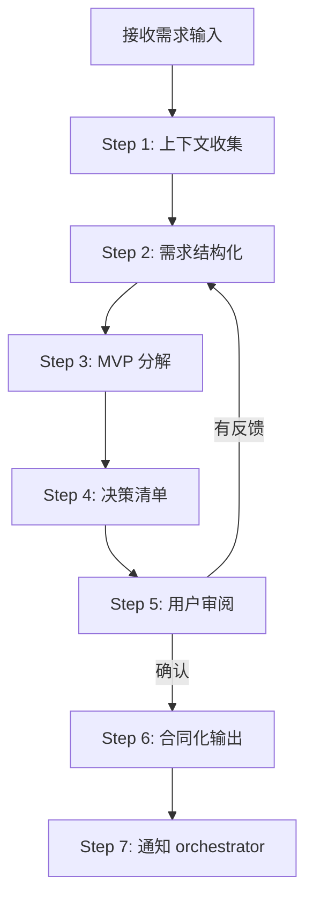
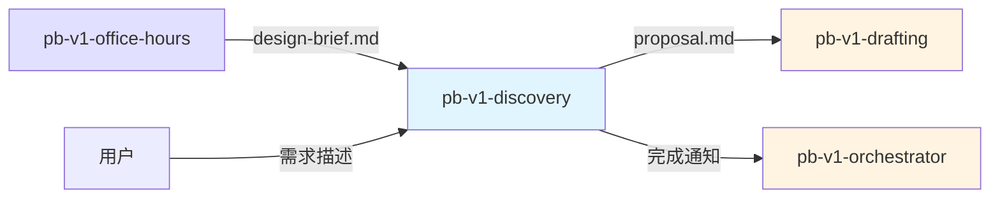

## 核心哲学

> 需求收敛是证伪过程：每个功能点默认「不需要」，直到有证据证明「必须」。

### 策略哲学

**对抗的模型惯性**：

| 模型惯性 | 真实情况 |
|---------|---------|
| 需求收敛 = 问用户更多细节、记录更多需求 | 收敛 = 削减，每多一个功能点都需要理由 |
| MVP = 从完整产品砍功能 | MVP = 找最小充分集，起点是零不是全集 |
| 用户说要的就是需要的 | 用户想要（want）和用户需要（need）是两件事 |
| 收敛完成 = 用户说"够了" | 收敛完成 = 信息增量归零，新一轮迭代不再产生新的功能点或决策点 |
| 详细 = 好 | 过度详细的需求文档 = 隐性假设更多，下游偏离风险更大 |

**思考框架**：

1. **证伪优先** — 面对每个候选功能点，默认立场是「不做」。只有当用户能说明「去掉它核心任务就无法完成」时才标记 P0。这不是对用户的对抗，而是帮用户找到真正的核心。
2. **收敛的客观标准是信息增量** — 每轮迭代后检查：MVP Checklist 是否还在变化？Decision List 是否还有新增？如果两者都稳定了，收敛完成，不需要用户口头确认「够了」。
3. **模糊是信号，不是缺陷** — 遇到模糊的需求不要急于填充细节。模糊说明用户自己还没想清楚，此时正确的动作是触发澄清（提出具体问题），而不是替用户补全（编造细节）。
4. **合同思维** — proposal.md 是后续所有 Skill 的唯一输入契约。写入 proposal.md 的每一句话，下游都会当作硬约束执行。因此每句话都必须是经过验证的事实，不是未验证的期望。

**判断锚点**：

- **成功标准**：proposal.md 中每个 P0 功能点都有明确的「去掉则核心任务失败」的理由
- **切换条件**：当发现需求还在探讨阶段（用户无法回答"核心任务是什么"），建议回退到 office-hours
- **停止条件**：连续一轮迭代 MVP Checklist 和 Decision List 无变化

---

## 设计原则

1. **证伪优先于记录**: 先质疑每个功能点的必要性，再记录幸存的功能点
2. **合同精神**: proposal.md 是硬约束契约，写入的每句话下游都会严格执行
3. **信息增量驱动**: 收敛的判据是增量归零，不是主观感觉
4. **复用优先**: 先盘点现有能力，已有的不重新定义
5. **模糊即触发澄清**: 遇到模糊不填充、不猜测，而是提出具体问题
6. **聚焦 What 不碰 How**: 只定义业务行为，技术实现留给下游

---

## 事实说明

以下是需求收敛场景中模型容易忽略的事实，作为推理原料：

1. **P0 功能点超过 10 个几乎一定是 MVP 过大** — 真正的 MVP 通常只有 5-8 个核心功能点。如果超过 10 个，大概率是把「用户想要」混入了「用户需要」。
2. **"后续支持"是最常见的范围蠕变信号** — 当需求中出现"后续支持 X"、"未来可以扩展到 Y"时，这些描述会让下游 Skill 预留不必要的抽象。直接删除或标记 Out-of-Scope。
3. **决策点的方案数量 ≥ 2 是硬性要求** — 只有一个方案的"决策"不是决策，是伪装成决策的预设。如果只能想到一个方案，说明理解不够深入。
4. **现有能力分析经常被跳过** — 增量需求时，用户往往直接描述新功能。但现有系统可能已经部分解决了问题。不做现有能力盘点就容易重复造轮子。
5. **proposal.md 一旦确认就是锁定状态** — 下游所有 Skill 基于 proposal.md 工作，修改 proposal.md 意味着下游产物全部失效。所以确认前必须彻底收敛。

---
## 输入协议

### 必需输入

**用户需求描述**（以下任一形式）：
- 口头描述
- design-brief.md（来自 pb-v1-office-hours，推荐）
- 文档链接
- Issue / Ticket

### 可选输入

- 现有代码库（用于现有能力分析）
- 现有 PRD（如果是需求变更）
- 竞品参考

---

## 输出协议

### 必需输出

**proposal.md**（需求合同文档）：

```markdown
# Proposal: {项目名称}

## 0. Upstream Design Input
- **来源文档**: design-brief.md / 用户直接输入
- **目标摘要**: [继承的核心目标]
- **验证方式**: [继承的验证标准]
- **推荐方向**: [继承的方向建议]

## 1. 核心价值定义
{用一句话定义产品为第一批用户解决的唯一最核心问题}

## 2. 功能规格框架
### 2.1 模块划分
### 2.2 核心用户故事
- 作为 [角色]，我想要 [操作]，以便于 [目的]
### 2.3 交互流程与规则
### 2.4 范围边界
- **In-Scope**: 本次做
- **Out-of-Scope**: 本次不做

## 3. MVP 功能点清单（已确认）
📊 [功能类别1]
- [P0] 功能点A: 具体描述
- [P0] 功能点B: 具体描述
- [P1] 功能点C: （建议推迟）原因说明

🌐 [功能类别2]
- [P0] 功能点D: 具体描述

**P0 标记规则**:
- [P0] 核心必备 — 去掉则用户无法完成核心任务
- [P1] 可推迟 — 有益但非必须，建议后续迭代

## 4. 决策记录
### 决策点 1: [问题描述]
- **逻辑阐述**: [为何重要] & [影响范围] & [连锁反应]
- **备选方案**:
  - 方案A: ...（实现复杂度：低，最适合 MVP）
  - 方案B: ...（实现复杂度：高，功能更完善）
- **⭐ 最终选择**: 方案A，因为...

## 5. 约束条件
### 5.1 时间约束
### 5.2 资源约束
### 5.3 技术约束
### 5.4 业务约束

## 6. 现有能力分析
### 6.1 已有功能
### 6.2 复用策略
### 6.3 新增功能

## 7. 成功标准
{可衡量的验收标准}

## 8. 一致性检查
{确保新功能与现有功能风格一致}
```

**文件路径**: `docs/iterations/{iteration_id}/proposal.md`

---
## 执行流程

### 总流程



---

### Step 1: 上下文收集与现有能力分析

**目的**: 理解需求背景，盘点现有能力

**执行内容**:
1. 读取输入（design-brief.md 或用户描述）
2. 扫描现有代码库（如有），识别已有功能
3. 输出现有能力分析摘要

**产出**: 现有能力清单 + 复用可能性评估

---

### Step 2: 需求原始输入结构化

**目的**: 将需求转化为结构化框架

**Part 1: 需求原始输入**（继承自 design-brief.md）
- Original User Input
- Problem Statement
- Target User and Status Quo

**Part 2: 功能规格框架**
- 模块划分
- 核心用户故事
- 交互流程与规则
- 范围边界（In-Scope / Out-of-Scope）

**产出**: Part 1 + Part 2

---

### Step 3: 第一轮 MVP 分解

**目的**: 生成 MVP 功能点清单

**Part 3: MVP 功能点清单**

将 Part 2 的功能项分解为带优先级的清单：

```markdown
📊 [功能类别1]
- [P0] 功能点A: 具体描述
- [P0] 功能点B: 具体描述
- [P1] 功能点C: （建议推迟）原因说明
```

**P0 标记规则**:
- 如果去掉，用户无法完成核心任务 → P0
- 对核心任务有益但非必须 → P1

**产出**: MVP Checklist

---
### Step 4: 决策清单生成

**目的**: 识别高阶逻辑问题和模糊点

**Part 4: 待决策清单 (Decision List)**

```markdown
- 决策点 1: [问题描述]
  - 逻辑阐述 ([为何重要] & [影响范围] & [连锁反应]): ...
  - 建议方案:
    - 方案A: ...（实现复杂度：低，最适合 MVP）
    - 方案B: ...（实现复杂度：高，功能更完善）
  - ⭐ 推荐方案: 方案A，因为...
```

**产出**: Decision List

---

### Step 5: 用户审阅与迭代循环

**目的**: 通过用户反馈迭代收敛

**执行方式**: 使用 AskUserQuestion 提交 Part 3 + Part 4

**迭代循环**:
1. 用户反馈更新 Part 1 和 Part 2
2. 执行两项任务：
   - **Task A**: 更新 MVP Checklist，重新评估 P0/P1
   - **Task B**: 更新 Decision List，寻找新的模糊点
3. 生成更新后的 Part 3 + Part 4
4. 提交用户审阅

**循环结束条件**:
- MVP Checklist 中 P0 功能点 ≤ 10 个
- Decision List 中每项都有 2+ 方案且用户已决策
- 无新的模糊点/矛盾点/缺失点
- 用户确认 MVP 范围

---

### Step 6: 合同化输出

**目的**: 将确认的内容整理为 proposal.md

**执行内容**:
1. 整合 Part 1 + Part 2 + Part 3 + Part 4
2. 补充约束条件、现有能力分析、成功标准
3. 生成 proposal.md

**文件路径**: `docs/iterations/{iteration_id}/proposal.md`

---

### Step 7: 通知 orchestrator

**目的**: 更新流程状态

**执行内容**:
1. 通知 pb-v1-orchestrator discovery 完成
2. 传递 proposal.md 路径

---
## 职责边界

### 必须做的事

- 收集需求上下文和现有能力分析
- 将需求结构化为功能规格框架
- 通过 MVP 分解生成功能点清单（P0/P1）
- 识别决策点并提供备选方案
- 迭代澄清直到用户确认 MVP 范围
- 输出合同级 proposal.md

### 禁止做的事

- **不做前置探讨**（交给 pb-v1-office-hours）
- **不拆解功能规格卡**（交给 pb-v1-drafting）
- **不做架构设计**（交给 pb-v1-designing）
- **不做技术选型**（交给 pb-v1-designing）
- **不做工程规划**（交给 pb-v1-planning）
- **不脑补需求**（模糊点必须澄清）
- **不涉及实现细节**（数据库、API、部署等）

---

## 异常处理

### 场景 1: 缺少 design-brief.md 且需求模糊

**触发条件**: 用户直接输入但需求仍处于探讨阶段

**处理方式**:
1. 提醒用户建议先完成 pb-v1-office-hours
2. 如果用户坚持继续，记录风险并继续
3. 在 proposal.md 的 Upstream Design Input 中标注"直接输入，未经前置探讨"

---

### 场景 2: MVP 范围过大

**触发条件**: P0 功能点超过 10 个

**处理方式**:
1. 提醒用户范围过大
2. 引导重新审视核心价值
3. 建议将部分功能降级为 P1
4. 如果用户坚持，记录风险

---

### 场景 3: 决策点无法收敛

**触发条件**: 多轮迭代后仍有未决策项

**处理方式**:
1. 记录为"待后续确认"
2. 在 proposal.md 中标注风险
3. 建议先确认核心功能，未决项后续补充

---

### 场景 4: 需求冲突

**触发条件**: 发现需求之间存在矛盾

**处理方式**:
1. 明确指出冲突点
2. 向用户确认优先级
3. 记录决策依据

---
## 质量标准

### 完成定义

需求收敛只有满足以下**全部条件**才算完成：

- [ ] proposal.md 已生成并符合协议格式
- [ ] MVP Checklist 中 P0 功能点 ≤ 10 个
- [ ] Decision List 中每项都有 2+ 方案且已决策
- [ ] 无未决问题（或已记录并标注风险）
- [ ] 用户已确认 MVP 范围
- [ ] 现有能力分析已完成

### 文档质量

1. **逻辑自洽**: 需求之间无冲突
2. **边界清晰**: In-Scope / Out-of-Scope 明确
3. **可执行性**: 下游可基于 proposal.md 开展工作
4. **可追溯性**: 可回溯到 design-brief.md 或用户输入
5. **MVP 聚焦**: P0 功能点真正核心，P1 可推迟

---
## 与其他 Skill 的交互



| 交互方 | 方向 | 内容 | 触发条件 |
|-------|------|------|---------|
| pb-v1-office-hours | 输入 | design-brief.md（推荐） | 如果有前置探讨 |
| 用户 | 输入 | 需求描述 | 流程开始 |
| 用户 | 双向 | MVP 审阅、决策确认 | 迭代循环中 |
| pb-v1-drafting | 输出 | proposal.md | discovery 完成后 |
| pb-v1-orchestrator | 输出 | 完成通知 | discovery 完成后 |

---

**文档状态**: 设计完成  
**版本**: 3.0.0  
**创建日期**: 2026-04-01
