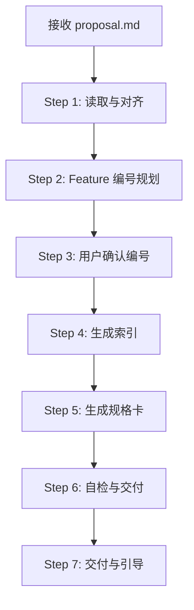
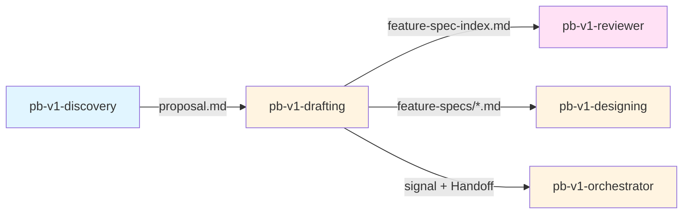

# pb-v1-drafting

**版本**: 3.2.0
**状态**: 设计完成
**创建日期**: 2026-04-01
**最后更新**: 2026-04-20
**流程映射**: vNext Plan 阶段（产品规格）

---

**CRITICAL: 只填产品维度（D-01~D-08）和测试维度（D-17~D-20），绝不填充架构维度（D-09~D-16）——越界填充会与 designing 产生冲突且破坏职责分离。**

**CRITICAL: 每个维度条目必须可转化为测试用例——无法验证的规格是噪音，浪费下游所有 Skill 的精力。**

**CRITICAL: Feature 必须双向追溯到 proposal.md——无源头的 Feature 是越界创造，proposal.md 中遗漏的功能点是质量缺陷。**

---

## 核心哲学

> 规格是可验证的契约，不是描述。每个维度的价值等于它能生成的测试用例数量。

### 策略哲学

**对抗的模型惯性**：

| 模型惯性 | 真实情况 |
|---------|---------|
| 规格 = 尽可能详细的功能描述 | 规格 = 可验证的契约，无法转化为测试的描述是噪音 |
| 拆解 = 均匀分解，每个 Feature 篇幅相当 | 粒度由可验证性决定，复杂 Feature 天然更长 |
| 写得越多越好，覆盖越全越好 | 每个维度都有成本——下游必须逐个处理。噪音维度浪费下游精力 |
| 先写完所有 Feature 再统一检查 | 边写边验证追溯性，发现问题时回溯成本最低 |
| D-09~D-16 留空 = 简单标记"待填充" | 留空的维度必须保持结构完整，让 designing 能直接填入而不需重建结构 |

**思考框架**：

1. **可验证性是唯一标尺** — 写下一个维度条目时，问自己：这条能直接转化为一个测试用例吗？如果不能，它要么太模糊（需要拆细），要么是噪音（应该删除）。
2. **追溯性是强制约束** — 每个 Feature 必须回溯到 proposal.md 中的具体功能点。没有源头的 Feature 是越界创造。proposal.md 中有但 Feature 中没有的功能点是遗漏。两者都是缺陷。
3. **粒度由行为独立性决定** — 如果一个 Feature 包含两个独立可验证的行为（改一个不影响另一个），它应该拆成两个。如果两个行为总是一起变化，它们应该合在一个 Feature 里。
4. **产品维度和测试维度是同一件事的两面** — D-01~D-08 定义"系统应该怎样"，D-17~D-20 定义"怎么证明系统确实这样"。两者必须对称——每个 D-01~D-08 的条目都有对应的 D-17~D-20 验证方法。

**判断锚点**：

- **成功标准**：每个 P0 功能点都有且仅有一个 Feature 卡，每个 Feature 卡的产品维度和测试维度完全对称
- **切换条件**：当 proposal.md 中功能点描述模糊到无法拆解时，建议回退到 discovery 澄清
- **停止条件**：Feature 数量与 proposal.md 的 P0 功能点数量一致，且每个 Feature 的 D-01~D-08 和 D-17~D-20 互相验证

---

## 设计原则

1. **可验证优于详尽**: 每个维度条目必须能转化为测试用例，否则删除
2. **追溯是硬约束**: Feature ↔ proposal.md 功能点必须双向可追溯
3. **粒度由行为独立性决定**: 独立可验证 = 独立 Feature
4. **产品与测试对称**: D-01~D-08 的每条都有 D-17~D-20 的验证方法
5. **结构完整留空**: D-09~D-16 保持 markdown 结构完整，方便 designing 填入
6. **编号一旦分配不可变更**: Feature ID 是跨 Skill 的引用锚点

---

## 事实说明

以下是规格拆解场景中模型容易忽略的事实，作为推理原料：

1. **Feature 数量与 P0 功能点数量应该接近** — 如果 Feature 数量远大于 P0 功能点数量，说明拆得过细；远小于则说明有遗漏或过度合并。一个 P0 功能点通常对应 1-2 个 Feature。
2. **D-05 异常行为是最容易被敷衍的维度** — 模型倾向于写 "系统错误 → HTTP 500" 了事。但真正有价值的异常行为定义是具体的业务异常（如"账号已锁定"、"余额不足"），这些直接影响前端交互设计。
3. **D-06 边界值是测试密度最高的区域** — 绝大多数 bug 出现在边界条件。如果 D-06 写得空泛（如"不超过限制"），测试维度就无法生成有效的边界测试用例。
4. **D-17~D-20 不是 D-01~D-08 的复述** — 测试维度需要具体到测试数据、测试步骤、预期结果。"验证用户登录功能"不是有效的测试维度，"使用 testuser/password123 登录返回 200 和有效 token"才是。
5. **产品维度不涉及实现** — D-01~D-08 描述的是"用户看到什么行为"，不是"系统内部怎么实现"。如果发现自己在写数据库表结构或 API 路由，说明越界了。

---
## 输入协议

### 必需输入

**proposal.md**（来自 pb-v1-discovery）：
- MVP 功能点清单（P0/P1）
- 决策记录
- 约束条件

### 可选输入

- feature-specification-standard.md（D-01~D-20 维度定义）
- 现有 feature-specs（如果是增量需求）

---

## 输出协议

### 必需输出

**1. feature-spec-index.md**（功能规格索引）：

```markdown
# 功能规格索引

## 1. 功能概览

| Feature ID | 功能名称 | 关联 REQ | 功能类型 | 状态 | 产品维度 | 架构维度 | 测试维度 |
|------------|---------|---------|---------|------|---------|---------|---------|
| F-001 | 用户登录 | REQ-001 | 核心功能 | DRAFT | D-01~D-08 ✓ | D-09~D-16 ⏳ | D-17~D-20 ✓ |
| F-002 | 密码重置 | REQ-002 | 核心功能 | DRAFT | D-01~D-08 ✓ | D-09~D-16 ⏳ | D-17~D-20 ✓ |

## 2. 状态统计

- 总计: 10 个 Feature
- DRAFT: 10 个
- 产品维度完整: 10 个
- 架构维度完整: 0 个（待 pb-v1-designing）
- 测试维度完整: 10 个

## 3. 功能分组

### 3.1 按优先级
- P0: 8 个
- P1: 2 个

### 3.2 按功能类型
- 核心功能: 8 个
- 辅助功能: 2 个

## 4. 追溯矩阵（简化版）

| REQ ID | Feature ID | 状态 |
|--------|-----------|------|
| REQ-001 | F-001 | DRAFT |
| REQ-002 | F-002 | DRAFT |
```

**文件路径**: `docs/iterations/{iteration_id}/feature-spec-index.md`

---
**2. feature-specs/{feature-id}.md**（功能规格卡）：

```markdown
# Feature: F-001 — 用户登录

## 基本信息
- Feature ID: F-001
- 关联 REQ: REQ-001
- 优先级: P0
- 状态: DRAFT
- 功能类型: 核心功能

---

## 产品维度（Product Dimensions）

### D-01: 功能标识 (Identification)
- Feature ID: F-001
- 功能名称: 用户登录
- 所属模块: 用户认证
- 关联需求: REQ-001

### D-02: 输入规格 (Input)
- 用户名: string, 必填, 4-20字符
- 密码: string, 必填, 8-32字符
- 记住我: boolean, 可选, 默认false

### D-03: 前置条件 (Preconditions)
- 用户已注册
- 用户账号未被锁定
- 系统认证服务可用

### D-04: 正常输出 (Output)
- 登录成功: { token: string, userId: string, expiresIn: number }
- HTTP 200

### D-05: 异常行为 (Exceptions)
- ERR-001: 用户名或密码错误 → HTTP 401
- ERR-002: 账号已锁定 → HTTP 403
- ERR-003: 系统错误 → HTTP 500

### D-06: 边界值 (Boundaries)
- 用户名最短4字符，最长20字符
- 密码最短8字符，最长32字符
- 连续失败5次后锁定账号

### D-07: 后置条件 (Postconditions)
- 生成有效的认证 token
- 记录登录日志
- 更新最后登录时间

### D-08: 副作用 (Side Effects)
- 清除之前的 token（如果存在）
- 触发登录事件通知

---

## 测试维度（Test Dimensions）

### D-17: Oracle (测试预言)
- 正确的用户名密码 → 返回有效 token
- 错误的密码 → 返回 401 错误
- 锁定的账号 → 返回 403 错误

### D-18: Fixture (测试装置)
- 预置用户: testuser / password123
- 预置锁定用户: lockeduser / password123
- Mock 认证服务

### D-19: TestGroups (测试分组)
- 正常流程测试
- 异常流程测试
- 边界值测试
- 安全测试

### D-20: Coverage (覆盖率)
- 输入验证: 100%
- 异常路径: 100%
- 边界条件: 100%

---

## 架构维度（待填充）

### D-09: 性能要求
⏳ 待架构阶段填充

### D-10: 安全约束
⏳ 待架构阶段填充

### D-11: 幂等性
⏳ 待架构阶段填充

### D-12: 事务性
⏳ 待架构阶段填充

### D-13: 可观测性
⏳ 待架构阶段填充

### D-14: 降级策略
⏳ 待架构阶段填充

### D-15: 依赖关系
⏳ 待架构阶段填充

### D-16: 实现映射
⏳ 待架构阶段填充
```

**文件路径**: `docs/iterations/{iteration_id}/feature-specs/F-{seq}.md`

---
## 执行流程

### 任务记录协议（执行可观测性）

**协议依据**: docs/pb-v1-task-tracking-protocol.md

本 Skill 遵循任务记录协议。执行时必须：

1. **Step 1 完成后** → 创建任务记录文件 `/tmp/pb-v1-{iteration_id}-drafting.md`，将 Step 2-7 规划为子任务写入
2. **每个 Step 开始时** → 更新对应子任务状态为 🔄 running
3. **每个 Step 完成时** → 更新对应子任务状态为 ✅ done
4. **Step 7 交付完成后** → 删除任务记录文件

---

### 总流程



---

### Step 1: 读取与对齐

**目的**: 理解 proposal.md 的功能点

**执行内容**:
1. 读取 `proposal.md`
2. 提取 MVP 功能点清单（P0/P1）
3. 读取 `feature-specification-standard.md`（了解 D-01~D-20）

**产出**: 功能点列表

---

### Step 2: Feature 编号规划

**目的**: 为每个功能点分配 Feature ID

**编号规则**:
- 格式: `F-{seq}`，如 F-001, F-002
- 按优先级排序: P0 在前，P1 在后
- 按功能类型分组: 核心功能、辅助功能

**产出**: Feature 编号计划

---

### Step 3: 用户确认编号

**目的**: 确保编号方案合理

**执行方式**: 使用 AskUserQuestion 提交编号计划

**产出**: 确认的编号方案

---

### Step 3.5: 功能边界确认（前置确认）

**目的**: 在生成 feature-specs 之前，用可视化图展示"我理解的功能边界和拆解结果"，让用户提前发现理解偏差。feature 拆解错了（漏拆、错拆、边界不清），下游 demo/implementing 都会偏。

**展示格式**（必须是可视化的，不是纯文字列表）:

```
## 功能边界确认

### 功能拆解图
{Mermaid 图：从 proposal 中的 P0 功能点拆解出的 feature 列表}
{标注 feature 之间的依赖关系（A 依赖 B 先完成）}
{标注哪些是新增、哪些是对现有功能的修改}

### 每个 Feature 的输入输出
| Feature | 输入 | 处理 | 输出 |
|---------|------|------|------|
| F-001 | ... | ... | ... |
| F-002 | ... | ... | ... |

### 关键状态流转
{关键 feature 的状态机图（Mermaid stateDiagram）}
{初始态 → 中间态 → 终态，标注触发条件}

以上是我理解的功能边界和拆解结果，确认后生成 feature-specs。
```

**确认流程**:
- 用户确认 → 进入 Step 4 生成 feature-spec-index.md
- 用户指出偏差 → 修正理解 → 重新展示 → 再确认
- 偏差涉及 proposal 层面 → 建议回到 pb-v1-discovery 修正

---
### Step 4: 生成 feature-spec-index.md

**目的**: 生成功能规格索引

**执行内容**:
1. 创建功能概览表
2. 统计状态（总计、DRAFT、完整度）
3. 按优先级和类型分组
4. 生成追溯矩阵

**产出**: `feature-spec-index.md`

---

### Step 5: 生成 feature-specs/*.md

**目的**: 为每个 Feature 生成规格卡

**执行内容**:
1. 遍历 Feature 列表
2. 为每个 Feature 填充 D-01~D-08（产品维度）
3. 为每个 Feature 填充 D-17~D-20（测试维度）
4. D-09~D-16 标记为"⏳ 待架构阶段填充"

**关键约束**:
- 只填产品和测试维度
- 不涉及性能、安全、架构等实现细节
- 每个维度必须可验证

**产出**: `feature-specs/F-{seq}.md`

---

### Step 6: 自检与交付

**目的**: 验证输出完整性

**检查清单**:
- [ ] 所有 P0 功能点都有对应 Feature 卡
- [ ] Feature ID 无冲突
- [ ] feature-spec-index.md 与 feature-specs/*.md 一致
- [ ] 每个 Feature 的 D-01~D-08 和 D-17~D-20 已填充
- [ ] D-09~D-16 标记为待填充

**如果自检不通过**: 修复问题后重新自检

---

### Final Step: Handoff

**目的**: 报告执行结果，交还 orchestrator 决策下一步

**执行内容**:

1. **构建 completion_signal**
   - status: completed（feature-spec-index.md + feature-specs/*.md 已生成且自检通过）/ failed / blocked
   - artifacts: `[{path: "feature-spec-index.md", type: "feature-spec-index"}, {path: "feature-specs/F-*.md", type: "feature-spec"}]`
   - issues: 如有问题，逐条填写（含 severity 和 points_to_upstream）

2. **写入 signal 文件**
   将 completion_signal 写入 `docs/iterations/{iteration_id}/signals/drafting.yaml`

3. **输出状态摘要**（一行，给用户）
   - completed: `✅ Drafting 完成，产出: feature-spec-index.md + {n} 个 feature-specs`
   - failed: `❌ Drafting 失败: {reason}`
   - blocked: `⚠️ Drafting 受阻: {reason}`

4. **调用 orchestrator**
   通过 Skill 工具调用 `/pb-v1-orchestrator`

---
## 职责边界

### 必须做的事

- 读取 proposal.md 并提取功能点
- 规划 Feature 编号方案
- 生成 feature-spec-index.md
- 生成 feature-specs/*.md（D-01~D-08, D-17~D-20）
- 确保 Feature 与 proposal.md 一一对应
- 标记 D-09~D-16 为待填充

### 禁止做的事

- **不做需求收敛**（交给 pb-v1-discovery）
- **不填充架构维度**（D-09~D-16 交给 pb-v1-designing）
- **不做架构设计**（交给 pb-v1-designing）
- **不做工程规划**（交给 pb-v1-planning）
- **不做代码实现**（交给 pb-v1-implementing）
- **不修改 proposal.md**（已锁定）

---

## 异常处理

### 场景 1: proposal.md 缺失或不完整

**触发条件**: proposal.md 不存在或 MVP Checklist 为空

**处理方式**:
1. 停止执行
2. 提示用户先完成 pb-v1-discovery
3. 返回 orchestrator

---

### 场景 2: 功能点描述模糊

**触发条件**: 功能点无法转化为明确的 D-01~D-08

**处理方式**:
1. 调用 pb-v1-clarify 进行需求/边界维度澄清：
   ```
   调用 pb-v1-clarify:
     dimension: "requirement"
     iteration_path: "docs/iterations/{iteration_id}"
     scope: "功能点描述模糊，无法转化为 D-01~D-08"
     context: ["proposal.md"]
   ```
2. 澄清返回 clear → 基于澄清结论继续拆解
3. 澄清返回 blocked → 提示用户回到 pb-v1-discovery 补充

---

### 场景 3: Feature 数量过多

**触发条件**: P0 功能点超过 15 个

**处理方式**:
1. 提醒用户范围过大
2. 建议重新审视 MVP
3. 如果用户坚持，记录风险并继续

---
## 质量标准

### 完成定义

规格拆解只有满足以下**全部条件**才算完成：

- [ ] feature-spec-index.md 已生成
- [ ] 所有 P0 功能点都有对应 Feature 卡
- [ ] 每个 Feature 的 D-01~D-08 已填充
- [ ] 每个 Feature 的 D-17~D-20 已填充
- [ ] D-09~D-16 标记为"⏳ 待架构阶段填充"
- [ ] Feature ID 无冲突且稳定
- [ ] 索引与规格卡一致

### 规格质量

1. **可追溯性**: 每个 Feature 可追溯到 proposal.md
2. **可验证性**: 每个维度可转化为测试用例
3. **完整性**: D-01~D-08 和 D-17~D-20 无遗漏
4. **一致性**: 索引与规格卡信息一致
5. **边界清晰**: 产品维度不涉及架构实现

---

## 与其他 Skill 的交互



| 交互方 | 方向 | 内容 | 触发条件 |
|-------|------|------|---------|
| pb-v1-discovery | 输入 | proposal.md | drafting 开始 |
| pb-v1-clarify | 工具 | 需求/边界维度澄清 | 功能点描述模糊时 |
| pb-v1-orchestrator | 输出 | completion_signal + Handoff 调用 | drafting 完成后 |

---

## 自推进协议（pb-v1-protocol 对接）

### dispatch_context 接收

当被 orchestrator 通过 Agent 工具调度时，接收 dispatch_context：

```yaml
dispatch_context:
  goal: string          # 如 "将 proposal.md 拆解为功能规格卡"
  scope: string         # 如 "只填 D-01~D-08 和 D-17~D-20"
  verification: string  # 如 "feature-spec-index.md + feature-specs/*.md 已生成"
  doc_paths:
    - string            # 如 "docs/iterations/015/proposal.md"
```

dispatch_context 缺少必填字段时拒绝执行，返回 blocked。

### completion_signal 输出

执行完成后返回结构化信号给 orchestrator：

```yaml
completion_signal:
  skill: "pb-v1-drafting"
  status: enum [completed, failed, blocked]
  artifacts:
    - path: "docs/iterations/{id}/feature-spec-index.md"
      type: "feature-spec-index"
    - path: "docs/iterations/{id}/feature-specs/FT-*.md"
      type: "feature-spec"
  issues: optional array
    - description: string
      gate_candidate: optional enum [G1, G2, G3, G4, G5]
  assumptions: optional array
    - clr_id: string
      summary: string
```

---

## Safety

- 不填充架构维度（D-09~D-16），不修改 proposal.md
- 不涉及技术实现细节（数据库、API 路由、部署架构）
- 不新增 proposal.md 中没有的功能点
- 已分配的 Feature ID 不可变更（跨 Skill 引用锚点）

---

**文档状态**: 设计完成  
**版本**: 3.1.0  
**创建日期**: 2026-04-01  
**最后更新**: 2026-04-20
