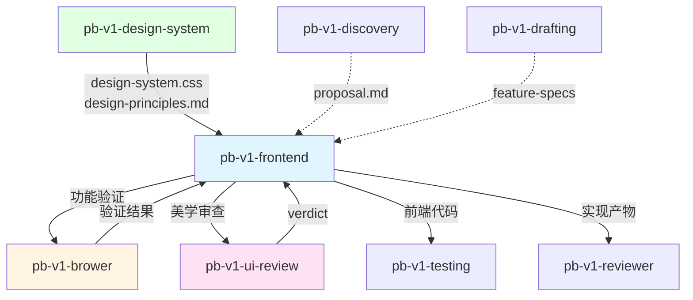

# pb-v1-frontend

**版本**: 3.0.0
**状态**: 设计完成
**创建日期**: 2026-04-02
**最后更新**: 2026-04-18
**流程映射**: vNext Build 阶段（前端实现）

---

**CRITICAL: 无 design-system.css 不开始实现——缺少 Token 基准的实现会产生不可修复的视觉不一致。**

**CRITICAL: 所有视觉属性必须引用 Token 变量，零硬编码——硬编码数值脱离设计系统，主题切换时会产生视觉断裂。**

**CRITICAL: 声明后不得引入第二套 CSS 系统——双轨冲突会导致视觉语言在页面内部分裂，修复成本极高。**

---

## 核心哲学

> 前端实现是设计约束还原：在设计系统的 Token 约束下，将产品需求忠实还原为功能完整、视觉一致的前端代码。美学方向已由上游锁定，实现者的职责是精准执行。

### 策略哲学

**对抗的模型惯性**：

| 模型惯性 | 真实情况 |
|---------|---------|
| 前端实现 = 先选美学方向再写代码 | 美学方向已由 pb-v1-design-system 锁定，实现者只做还原 |
| 可以同时用 CSS Variables 和 Tailwind | 单一 CSS 系统是硬约束，声明后不得引入第二套 |
| 一次性写完整个页面再验证 | 原子→区块→页面分层实现，每层完成后必须通过功能验证 + 美学审查 |
| 间距/颜色/圆角可以随手写数值 | 所有视觉属性必须引用 Token 变量，硬编码数值 = 违规 |
| 功能做完就算完成 | 功能验证 + 美学审查都通过才算完成 |
| 浏览器验证不可用就跳过 | 不可用时降级为用户手动截图确认，不得跳过 |

**思考框架**：

1. **Token 是唯一的视觉属性来源** — 每个 `color`、`padding`、`border-radius`、`font-size`、`box-shadow` 都必须引用 `design-system.css` 中的变量。写下 `padding: 16px` 时，应该写 `padding: var(--spacing-md)`。硬编码数值意味着脱离设计系统，后续修改时会产生不一致。
2. **分层实现是增量验证的基础** — 原子组件（Button/Input/Card）→ 区块组件（Hero/Nav/Pricing）→ 页面组合。每层完成后验证，问题在最小范围内暴露和修复。一次性写完整个页面再验证 = 问题无法追溯。
3. **功能验证和美学审查是独立的两件事** — 功能验证（pb-v1-brower）检查"交互是否正确、元素是否存在、状态是否完整"。美学审查（pb-v1-ui-review）检查"视觉属性是否来自 Token、间距是否有节奏、层级是否清晰"。两者关注点不同，必须分开做。
4. **design-principles.md 是实现指南** — 它告诉你"标题用什么 Token、正文用什么 Token、卡片间距用什么 Token"。实现前先读它，实现时对照它。

**判断锚点**：

- **成功标准**：所有功能点已实现 + 所有视觉属性引用 Token + 功能验证通过 + 美学审查 PASS + 代码生产级可用
- **切换条件**：当发现 design-system.css 缺少必要 Token 时，反馈给 pb-v1-design-system 补充
- **停止条件**：三层全部通过验证、用户确认交付

---

## 设计原则

1. **Token 合规是底线**: 所有视觉属性引用 CSS 变量，零硬编码数值
2. **单一 CSS 系统**: 声明后不得引入第二套，CSS Variables 和 Tailwind 二选一
3. **分层实现，增量验证**: 原子→区块→页面，每层有独立的验证门禁
4. **功能完整还原**: 每个功能点、交互流程、边界条件都必须在实现中体现
5. **设计原则是实现指南**: 实现前读 design-principles.md，实现时对照它
6. **验证不可跳过**: pb-v1-brower 不可用时降级为用户手动截图，不得跳过

---

## 事实说明

以下是前端实现场景中模型容易忽略的事实，作为推理原料：

1. **CSS 双轨冲突是最常见的实现缺陷** — 模型在实现过程中容易"顺手"引入 Tailwind class 来快速解决布局问题，即使项目已声明使用 CSS Variables。两套系统的字体、间距、颜色互相覆盖，视觉语言在页面内部分裂。声明单一系统后，必须在每次写样式时检查是否违反。
2. **硬编码数值的诱惑在"微调"时最强** — 模型在大结构上会记得用 Token，但在微调间距、调整颜色透明度时容易写死数值。`padding: 12px` 看起来无害，但它不在 4px/8px 网格上，也不在 Token 系统中。正确做法是找到最近的 Token（`--spacing-sm: 8px` 或 `--spacing-md: 16px`）。
3. **原子组件的质量决定了页面的质量** — 如果 Button 的 padding、font-size、border-radius 没有正确引用 Token，那么所有使用 Button 的区块和页面都会继承这个问题。原子层的 Token 合规性审查是最高优先级。
4. **区块组件的间距是视觉节奏的关键** — 区块内部元素的间距、区块之间的间距，决定了页面的"呼吸感"。这些间距必须来自 Token 的间距阶梯，不能随意选择。
5. **pb-v1-brower 不可用时不等于验证不需要** — 浏览器验证工具可能因为环境问题不可用。此时必须降级为要求用户手动打开浏览器截图确认，而不是跳过验证。跳过验证 = 盲改。

---

## 执行流程

### 任务记录协议（执行可观测性）

**协议依据**: docs/pb-v1-task-tracking-protocol.md

本 Skill 遵循任务记录协议。执行时必须：

1. **Phase 1 完成后** → 创建任务记录文件 `/tmp/pb-v1-{iteration_id}-frontend.md`，将后续 Phase 规划为子任务写入
2. **每个 Phase 开始时** → 更新对应子任务状态为 🔄 running
3. **每个 Phase 完成时** → 更新对应子任务状态为 ✅ done
4. **交付完成后** → 删除任务记录文件

---

### Phase 1: 前置检查

**目标**: 确认设计系统就绪，声明 CSS 系统。

**步骤**:
1. 检查 `design-system.css` 是否存在且包含完整的 Token 三层（Seed/Map/Alias）
2. 检查 `design-principles.md` 是否存在且包含 5 大维度使用规则
3. 读取 design-principles.md，理解 Token 使用规则
4. 声明本次实现使用的 CSS 系统（CSS Variables 或 Tailwind），记录在实现文档中
5. 如果使用 Tailwind，确认 Tailwind 配置已对接 design-system.css 中的 Token

**Gate G-PREREQ**: design-system.css 或 design-principles.md 不存在 → 阻塞，要求先运行 pb-v1-design-system。

**产出**: CSS 系统声明（记录在实现文档中）

### Phase 2: 需求理解

**目标**: 从产品文档提取功能约束，规划组件清单。

**步骤**:
1. 读取 proposal.md 和 feature-specs（如果存在）
2. 提取所有功能点和交互要求
3. 将功能点映射为三层组件清单：
   - 原子组件：Button、Input、Card、Badge、Tag、Avatar 等
   - 区块组件：Hero、Navigation、Pricing、FAQ、Footer 等
   - 页面组合：完整页面的区块排列和布局
4. 标注每个组件需要的 Token（从 design-principles.md 查找）

**产出**: 三层组件清单 + Token 映射

### Phase 3: 原子组件实现

**目标**: 实现所有原子级组件，每个组件 Token 合规。

**步骤**:
1. 按组件清单逐个实现原子组件
2. 每个组件的视觉属性必须引用 design-system.css 中的 Token：
   - 颜色 → `var(--color-*)`
   - 间距 → `var(--spacing-*)`
   - 字号 → `var(--font-size-*)`
   - 圆角 → `var(--radius-*)`
   - 阴影 → `var(--shadow-*)`
3. 实现组件的所有状态（default/hover/active/focus/disabled）
4. 确保响应式和可访问性（键盘导航、ARIA 属性、对比度）

**验证**:
- 功能验证：调用 pb-v1-brower 检查每个组件的交互和状态
- 美学审查：调用 pb-v1-ui-review（scope: component）检查 Token 合规性

**Gate G-ATOM**: 功能验证通过 + ui-review verdict = PASS → 进入 Phase 4。FAIL → 修复后重新审查，最多 3 轮。

**降级策略**: pb-v1-brower 不可用时，要求用户手动打开浏览器，逐个组件截图确认。

### Phase 4: 区块组件实现

**目标**: 将原子组件组合为区块级组件。

**步骤**:
1. 按组件清单逐个实现区块组件
2. 区块内部使用已验证的原子组件，不重复实现
3. 区块间距和布局引用 Token 的间距阶梯和布局系统
4. 实现区块的响应式行为（断点适配）

**验证**:
- 功能验证：调用 pb-v1-brower 检查区块的交互和布局
- 美学审查：调用 pb-v1-ui-review（scope: component）检查区块的 Token 合规性和视觉节奏

**Gate G-BLOCK**: 功能验证通过 + ui-review verdict = PASS → 进入 Phase 5。FAIL → 修复后重新审查，最多 3 轮。

### Phase 5: 页面组合

**目标**: 将区块组件组装为完整页面。

**步骤**:
1. 按页面布局规划组装区块组件
2. 处理页面级布局（整体结构、区块间距、滚动行为）
3. 处理页面级交互（导航锚点、滚动动画、页面转场）
4. 最终响应式检查（桌面/平板/手机三个断点）

**验证**:
- 功能验证：调用 pb-v1-brower 做完整页面的功能验证
- 美学审查：调用 pb-v1-ui-review（scope: page）做页面级美学审查（包含整体美学维度）

**Gate G-PAGE**: 功能验证通过 + ui-review verdict = PASS → 进入 Phase 6。FAIL → 修复后重新审查，最多 3 轮。

### Phase 6: 交付确认

**目标**: 确认实现满足所有要求。

**完成定义**（全部条件必须满足）:
- ✅ 所有功能点已实现（对照 feature-specs 或 proposal.md）
- ✅ 所有视觉属性引用 Token，零硬编码数值
- ✅ 单一 CSS 系统，无双轨冲突
- ✅ 三层验证全部通过（G-ATOM + G-BLOCK + G-PAGE）
- ✅ 响应式适配（桌面/平板/手机）
- ✅ 可访问性基线（键盘导航、ARIA、对比度）
- ✅ 代码可直接运行

**产出**: 前端代码 + 功能验证清单 + 美学审查报告

---

## 输入协议

### 必需输入

| 输入 | 来源 | 说明 |
|------|------|------|
| `design-system.css` | pb-v1-design-system | 完整 Token 三层 CSS 变量 |
| `design-principles.md` | pb-v1-design-system | Token 使用规则 |

### 可选输入

| 输入 | 来源 | 说明 |
|------|------|------|
| `proposal.md` | pb-v1-discovery | 需求合同 |
| `feature-specs/*.md` | pb-v1-drafting | 功能规格卡 |
| 需求描述 | 用户 | 直接描述的功能需求 |

### dispatch_context 格式

```yaml
dispatch_context:
  goal: "基于设计系统实现 {页面/组件} 的前端代码"
  scope: "功能范围描述"
  verification: "三层验证全部通过（功能验证 + 美学审查）"
  doc_paths:
    - "docs/iterations/{id}/design-system.css"
    - "docs/iterations/{id}/design-principles.md"
    - "docs/iterations/{id}/proposal.md"  # 可选
    - "docs/iterations/{id}/feature-specs/"  # 可选
```

dispatch_context 缺少 design-system.css 或 design-principles.md 路径时拒绝执行，返回 blocked。

---

## 输出协议

### completion_signal 输出

执行完成后返回结构化信号给 orchestrator：

```yaml
completion_signal:
  skill: "pb-v1-frontend"
  status: enum [completed, failed, blocked]
  artifacts:
    - path: "前端代码目录"
      type: "frontend-code"
    - path: "feature-checklist.md"
      type: "feature-checklist"
    - path: "ui-review-report.md"
      type: "ui-review-report"
  issues: optional array
    - description: string
      gate_candidate: optional enum [G1, G2, G3, G4, G5]
  assumptions: optional array
    - clr_id: string
      summary: string
```

---

## 与其他 Skill 的交互



| 交互方 | 方向 | 内容 | 触发条件 |
|-------|------|------|---------|
| pb-v1-design-system | 输入 | design-system.css + design-principles.md | 前置必需 |
| pb-v1-discovery | 输入 | proposal.md | 可选，需求收敛完成后 |
| pb-v1-drafting | 输入 | feature-specs/*.md | 可选，规格拆解完成后 |
| pb-v1-brower | 工具 | 功能验证 | Phase 3/4/5 每层完成后 |
| pb-v1-ui-review | 工具 | 美学审查（组件级/页面级） | Phase 3/4/5 每层完成后 |
| pb-v1-testing | 输出 | 前端代码 + 功能验证清单 | 实现完成后 |
| pb-v1-reviewer | 输出 | 实现产物 + 审查报告 | 需要审查时 |

---

## 职责边界

### 必须做的事
- 验证 design-system.css 和 design-principles.md 存在且完整
- 声明并锁定单一 CSS 系统（CSS Variables 或 Tailwind）
- 按原子→区块→页面分层顺序实现前端代码
- 所有视觉属性引用 Token 变量，零硬编码
- 每层完成后调用 pb-v1-brower 做功能验证
- 每层完成后调用 pb-v1-ui-review 做美学审查
- 实现响应式适配和可访问性基线

### 禁止做的事
- **不做美学方向选择**（交给 pb-v1-design-system）
- **不做设计语言提取**（交给 design-language-extraction）
- **不做需求定义**（交给 pb-v1-discovery / pb-v1-drafting）
- **不做后端实现**
- **不修改 design-system.css 或 design-principles.md**——上游产物已锁定
- **不引入第二套 CSS 系统**——声明后锁定

---

## 异常处理

### 场景 1: design-system.css 不存在或不完整
**触发条件**: Phase 1 前置检查发现 Token 文件缺失或三层不完整
**处理方式**: 返回 blocked 信号，要求先运行 pb-v1-design-system

### 场景 2: Token 不足以覆盖实现需求
**触发条件**: 实现过程中发现 design-system.css 缺少必要的 Token（如缺少某个语义色）
**处理方式**: 记录缺失 Token 清单，反馈给 pb-v1-design-system 补充；不得用硬编码值替代

### 场景 3: pb-v1-brower 不可用
**触发条件**: 浏览器验证工具因环境问题无法连接
**处理方式**: 降级为要求用户手动打开浏览器截图确认，不得跳过验证

### 场景 4: 分层验证连续 3 轮 FAIL
**触发条件**: 同一层（原子/区块/页面）的 ui-review 连续 3 轮 FAIL
**处理方式**: 停止实现，记录失败过程和 findings 汇总，ESCALATED 给用户决策

### 场景 5: CSS 双轨冲突
**触发条件**: 实现过程中发现代码中混入了第二套 CSS 系统
**处理方式**: 立即清理违规代码，回退到单一系统；记录冲突位置和原因

---

## 质量标准

### 完成定义

以下条件全部满足才算完成：
- ✅ 所有功能点已实现（对照 feature-specs 或 proposal.md）
- ✅ 所有视觉属性引用 Token，零硬编码数值
- ✅ 单一 CSS 系统，无双轨冲突
- ✅ 三层验证全部通过（G-ATOM + G-BLOCK + G-PAGE）
- ✅ 响应式适配（桌面/平板/手机三个断点）
- ✅ 可访问性基线（键盘导航、ARIA 属性、对比度）
- ✅ 代码可直接运行
- ✅ 用户确认交付

---

## Safety

- 美学方向由 pb-v1-design-system 锁定，不做美学方向选择
- 每层（原子/区块/页面）完成后必须通过功能验证 + 美学审查
- 验证工具不可用时降级为用户手动截图确认，不跳过
- 不做需求定义、后端实现，不修改 design-system.css

---

**文档状态**: 设计完成
**版本**: 3.0.0
**创建日期**: 2026-04-02
**最后更新**: 2026-04-18
