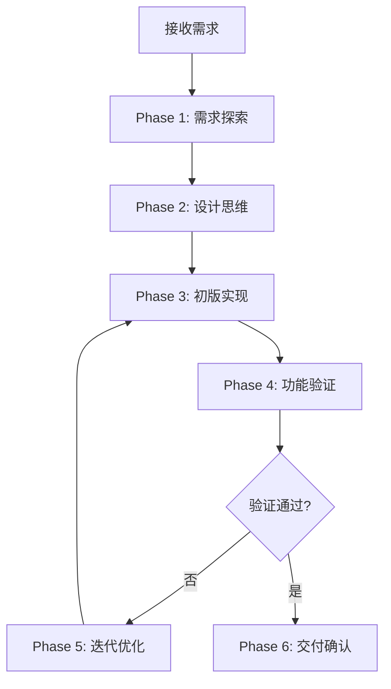
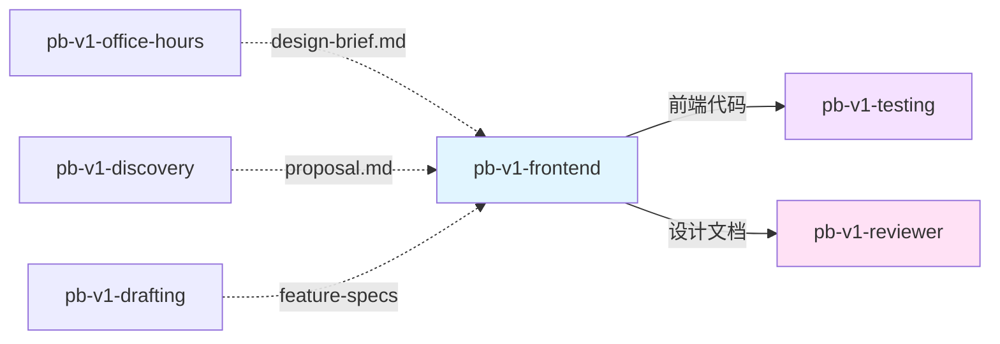

# pb-v1-frontend

**版本**: 2.0.0
**状态**: 设计完成
**创建日期**: 2026-04-02
**最后更新**: 2026-04-09
**流程映射**: vNext Build 阶段（前端专项）

---

**红线声明**：前端设计是约束收敛下的美学最大化，不是模板选择。绝不使用通用 AI 模板（Inter/Roboto/紫色渐变），绝不跳过需求探索直接设计，绝不忽略功能验证，绝不做后端实现。

---

## 核心哲学

> 前端设计是约束收敛：美学不是装饰，而是在功能、交互、技术约束下的最大化表达。每个设计决策都应该能追溯到具体约束。

前端设计不是"先做功能，再加美学"，而是一个约束收敛过程。产品需求定义了功能边界，用户场景定义了交互边界，技术环境定义了实现边界——**美学方向是在这些约束下的最大化表达，不是独立存在的装饰**。

这个哲学对抗的模型惯性是：把美学当作可选的"锦上添花"，或者把设计当作从模板库中选择。真实情况是：**约束越清晰，设计空间越明确**。通用 AI 模板之所以平庸，是因为它们试图在没有约束的情况下提供"安全"的美学——但没有约束的美学就是噪音。

判断一个前端设计是否成功的标准：
- **可追溯性**：每个设计决策（字体、配色、布局、动效）都能追溯到具体的产品约束或用户场景
- **约束对齐**：功能完整还原 + 交互流程完整 + 技术实现可行
- **美学最大化**：在约束边界内，选择了最大胆、最独特的美学方向并精准执行

### 策略哲学

**对抗的模型惯性**：

| 模型惯性 | 真实情况 |
|---------|---------|
| 前端设计 = 选一个好看的模板 | 设计 = 理解问题 + 选择美学方向 + 精准执行 |
| 用 Inter/Roboto 字体最安全 | 安全 = 平庸。独特的字体选择是设计辨识度的核心 |
| 紫色渐变 + 白底 = 现代感 | 这是最典型的 AI 通用模板，必须避免 |
| 先做功能，美学是锦上添花 | 美学服务于功能，但不是可选项。糟糕的视觉 = 糟糕的产品 |
| 每个设计都要创新突破 | 创新的前提是理解约束。产品需求优先，美学在约束内最大化 |
| 设计一次就定稿 | 好设计来自迭代。第一版是起点，通过反馈逐步收敛到最优解 |

**思考框架**：

1. **需求优先，美学服务** — 在编码前，先深度理解：这个界面解决什么问题？谁在用？核心任务是什么？美学方向必须服务于这些答案，而不是独立存在。
2. **选择大胆的美学方向并精准执行** — 极简主义和极繁主义都可以成功，关键是意图明确、执行精准。模糊的折中方案最容易沦为平庸。
3. **功能完整还原是底线** — 每个交互、每个状态、每个边界条件都必须在设计中体现。视觉再惊艳，功能缺失就是失败。
4. **迭代是必经之路** — 第一版设计记录初始方向，后续版本基于反馈优化。记录每次变更的理由，让设计演进可追溯。

**判断锚点**：

- **成功标准**：功能完整还原 + 视觉独特且精致 + 代码生产级可用 + 有明确的设计记忆点
- **切换条件**：当发现需求理解不足时，回退到 discovery 或 office-hours 澄清
- **停止条件**：功能验证通过 + 美学方向确认 + 代码质量达标 + 用户确认

---

## 设计原则

1. **需求驱动设计**: 从产品文档中提取设计约束，而不是从模板库中选择
2. **美学方向明确**: 每个设计都有清晰的概念方向（极简/极繁/复古/工业等），不做模糊折中
3. **功能完整还原**: 每个功能点、交互流程、边界条件都必须在设计中体现
4. **避免通用模板**: 拒绝 Inter/Roboto 字体、紫色渐变、系统字体、可预测布局
5. **迭代优化记录**: 记录每轮设计变更和理由，让演进过程可追溯
6. **代码生产级**: 不只是视觉稿，而是可运行、可维护、性能优化的代码

---

## 设计思维（Design Thinking）

在编写代码之前，必须先理解上下文并确定一个**大胆的美学方向**：

### 1. Purpose（目的）
- **这个界面解决什么问题？**
- **谁会使用它？**
- **核心任务是什么？**

从产品文档（proposal.md / feature-specs）中提取：
- 目标用户画像
- 核心用户故事
- 关键交互流程
- 成功标准

### 2. Tone（风格）

选择一个**极端风格**，不做模糊折中：

| 风格类型 | 特征 | 适用场景 |
|---------|------|---------|
| **Brutally Minimal** | 极致简约、大量留白、单色调 | 工具类产品、专业软件 |
| **Maximalist Chaos** | 信息密集、色彩丰富、层次复杂 | 创意平台、社交媒体 |
| **Retro-Futuristic** | 复古元素 + 未来感、霓虹色、像素风 | 游戏、娱乐应用 |
| **Organic/Natural** | 柔和曲线、自然色调、手绘质感 | 健康、生活方式产品 |
| **Luxury/Refined** | 精致细节、高级感、克制配色 | 高端品牌、金融产品 |
| **Playful/Toy-like** | 圆润形状、明亮色彩、趣味动画 | 儿童产品、休闲应用 |
| **Editorial/Magazine** | 大字体、网格布局、杂志排版 | 内容平台、新闻网站 |
| **Brutalist/Raw** | 粗犷、原始、打破常规 | 艺术项目、实验性产品 |
| **Art Deco/Geometric** | 几何图形、对称、装饰性 | 奢侈品、文化项目 |
| **Soft/Pastel** | 柔和色彩、渐变、轻盈感 | 设计工具、创意应用 |
| **Industrial/Utilitarian** | 功能优先、网格系统、工业感 | 企业软件、B2B 产品 |

**关键**：选择一个清晰的概念方向并精准执行。大胆的极繁主义和精致的极简主义都可行——关键在于**意图**，而非强度。

### 3. Constraints（约束）

技术要求：
- 框架选择（HTML/CSS/JS、React、Vue 等）
- 性能要求（加载时间、动画流畅度）
- 可访问性标准（WCAG 合规）
- 设备适配（响应式、移动端优先）

### 4. Differentiation（差异化）

**是什么让这个设计令人难忘？**
- 人们会记住的**一件事**是什么？
- 这个设计的**独特记忆点**在哪里？

---

## 前端美学指南（Frontend Aesthetics Guidelines）

### 1. Typography（字体）

**原则**：选择美观、独特且引人注目的字体。

**避免**：
- ❌ Inter、Roboto、Arial、系统字体
- ❌ 所有设计都用同一个字体（如 Space Grotesk）

**推荐**：
- ✅ 将醒目的标题字体与精致的正文字体搭配
- ✅ 选择出人意料、富有个性的字体
- ✅ 字体选择要与美学方向一致

**示例组合**：
- 极简风：Helvetica Neue + Inter（但要调整字重和间距）
- 复古风：Courier New + Georgia
- 现代感：Montserrat + Open Sans
- 艺术感：Playfair Display + Lato

### 2. Color & Theme（色彩与主题）

**原则**：坚持统一的美学风格，使用 CSS 变量保持一致性。

**配色策略**：
- **主色调 + 鲜明点缀色** > 平淡均匀的配色
- 使用 CSS 变量定义色彩系统
- 深色/浅色主题都要考虑

**避免**：
- ❌ 白色背景 + 紫色渐变（最典型的 AI 模板）
- ❌ 过度使用渐变
- ❌ 颜色分布均匀、没有主次

**推荐**：
- ✅ 60-30-10 配色法则（主色 60%、辅色 30%、点缀色 10%）
- ✅ 使用色彩心理学（蓝色=信任、红色=紧急、绿色=成功）
- ✅ 考虑色彩无障碍（对比度 ≥ 4.5:1）

### 3. Motion（动效）

**原则**：使用动画实现特效和微交互，专注于高冲击力时刻。

**优先级**：
1. **CSS-only 动画**（HTML 项目优先）
2. **Motion 库**（React 项目推荐 Framer Motion）
3. **JavaScript 动画**（复杂交互）

**策略**：
- **精心编排的页面加载** + 错落有致的动画延迟（animation-delay）> 分散的微交互
- 使用滚动触发（scroll-triggered）和悬停状态（hover states）制造惊喜
- 动画时长：快速反馈 150-200ms，页面转场 300-500ms

**避免**：
- ❌ 过度动画导致性能问题
- ❌ 无意义的装饰性动画
- ❌ 阻塞用户操作的动画

### 4. Spatial Composition（空间构成）

**原则**：出人意料的布局，打破常规。

**技巧**：
- **不对称布局**：打破左右对称的刻板印象
- **重叠元素**：创造层次感和深度
- **对角线流动**：引导视觉动线
- **打破网格**：部分元素突破网格限制
- **留白策略**：大量留白（极简）OR 控制密度（极繁）

**避免**：
- ❌ 可预测的居中对称布局
- ❌ 千篇一律的卡片网格
- ❌ 缺乏视觉层次

### 5. Backgrounds & Visual Details（背景与视觉细节）

**原则**：营造氛围和深度，而非仅仅使用纯色。

**技巧**：
- 渐变网格（Gradient Meshes）
- 噪点纹理（Noise Textures）
- 几何图案（Geometric Patterns）
- 分层透明（Layered Transparencies）
- 戏剧性阴影（Dramatic Shadows）
- 装饰性边框（Decorative Borders）
- 自定义光标（Custom Cursors）
- 颗粒叠加（Grain Overlays）

**避免**：
- ❌ 单调的纯色背景
- ❌ 过度使用阴影导致视觉混乱
- ❌ 与整体美学不符的装饰元素

---

## 事实说明

以下是前端设计场景中模型容易忽略的事实，作为推理原料：

1. **第一版设计几乎从不是最终版** — 好设计来自迭代。第一版的价值是建立方向，后续版本基于反馈优化。不要期望一次到位。

2. **功能缺失比视觉平庸更致命** — 视觉再惊艳，如果缺少关键交互或边界处理，设计就是失败的。功能完整还原是底线。

3. **响应式不是可选项** — 移动端流量占比超过 50%。不考虑响应式的设计在现代 Web 中不可接受。

4. **可访问性是法律要求** — WCAG 2.1 AA 级是最低标准。色彩对比度、键盘导航、屏幕阅读器支持都必须考虑。

5. **性能影响用户留存** — 页面加载超过 3 秒，53% 的用户会离开。动画再炫酷，卡顿就是灾难。

6. **CSS 变量是一致性的关键** — 硬编码颜色值会导致维护噩梦。使用 CSS 变量定义设计系统。

7. **字体加载会阻塞渲染** — 使用 `font-display: swap` 避免 FOIT（Flash of Invisible Text）。

8. **动画要考虑 prefers-reduced-motion** — 部分用户会因为动画感到不适。尊重系统设置。

---

## 输入协议

### 必需输入

**用户需求描述**（以下任一形式）：
- 口头描述（组件、页面、应用需求）
- proposal.md（来自 pb-v1-discovery）
- feature-specs/*.md（来自 pb-v1-drafting）
- 设计简报或线框图

### 可选输入

- 品牌指南（Logo、色彩、字体规范）
- 竞品参考（学习而非抄袭）
- 现有设计系统（如需扩展）
- 技术栈约束（框架、库、浏览器支持）

---

## 输出协议

### 必需输出

**1. 生产级代码**：

```
frontend-output/
├── index.html          # 主页面（或组件入口）
├── styles.css          # 样式文件（或 CSS-in-JS）
├── script.js           # 交互逻辑（或 React/Vue 组件）
├── assets/             # 图片、字体等资源
└── README.md           # 使用说明和设计说明
```

**代码要求**：
- 可直接运行，无需额外配置
- 代码注释清晰，说明关键设计决策
- 使用 CSS 变量定义设计系统
- 响应式布局（移动端优先）
- 可访问性合规（WCAG 2.1 AA）

**2. 设计迭代记录**（design-iterations.md）：

```markdown
# 设计迭代记录

## 版本 1.0 - 初始设计
**日期**: YYYY-MM-DD
**美学方向**: [选择的风格]
**关键决策**:
- 字体选择: [字体名称] - 理由: [...]
- 配色方案: [主色/辅色/点缀色] - 理由: [...]
- 布局策略: [对称/不对称/网格] - 理由: [...]

**功能覆盖**:
- ✅ 功能点 A: [实现方式]
- ✅ 功能点 B: [实现方式]

**已知问题**:
- [ ] 问题 1: [描述]

## 版本 1.1 - 优化迭代
**日期**: YYYY-MM-DD
**变更内容**:
- 调整 X: [原因] → [新方案]
- 优化 Y: [原因] → [新方案]

**反馈来源**:
- 用户反馈: [...]
- 功能验证: [...]
```

**3. 功能验证清单**（feature-checklist.md）：

```markdown
# 功能验证清单

## 核心功能
- [ ] 功能 A: [描述] - 对应 feature-spec: F-001
- [ ] 功能 B: [描述] - 对应 feature-spec: F-002

## 交互流程
- [ ] 流程 1: [步骤] - 状态: [...]
- [ ] 流程 2: [步骤] - 状态: [...]

## 边界条件
- [ ] 空状态处理
- [ ] 错误状态处理
- [ ] 加载状态处理

## 可访问性
- [ ] 键盘导航
- [ ] 屏幕阅读器支持
- [ ] 色彩对比度 ≥ 4.5:1

## 性能
- [ ] 首屏加载 < 3s
- [ ] 动画流畅度 ≥ 60fps
```

---

## 执行流程

### 总流程



---

### Phase 1: 需求探索

**目的**: 深度理解产品需求和设计约束

**执行内容**:
1. 读取上游文档（proposal.md / feature-specs/*.md）
2. 提取关键信息：
   - 目标用户画像
   - 核心用户故事
   - 关键交互流程
   - 功能边界（In-Scope / Out-of-Scope）
   - 技术约束
3. 识别设计约束：
   - 必须支持的设备/浏览器
   - 性能要求
   - 可访问性要求
   - 品牌规范

**产出**: 需求理解文档（嵌入 design-iterations.md）

---

### Phase 2: 设计思维

**目的**: 确定美学方向和设计策略

**执行内容**:
1. **Purpose（目的）**：
   - 这个界面解决什么问题？
   - 谁会使用它？
   - 核心任务是什么？

2. **Tone（风格）**：
   - 选择一个极端风格（极简/极繁/复古/工业等）
   - 确保风格与产品定位一致

3. **Constraints（约束）**：
   - 框架选择
   - 性能要求
   - 可访问性标准

4. **Differentiation（差异化）**：
   - 确定设计的独特记忆点
   - 一句话描述设计的核心特征

**产出**: 设计方向文档（嵌入 design-iterations.md v1.0）

---

### Phase 3: 初版实现

**目的**: 将设计思维转化为可运行的代码

**执行内容**:
1. **结构搭建**：
   - HTML 语义化结构
   - CSS 变量定义设计系统
   - JavaScript 交互逻辑框架

2. **视觉实现**：
   - 字体选择和排版
   - 配色方案实现
   - 布局和空间构成
   - 背景和视觉细节

3. **交互实现**：
   - 动画和微交互
   - 响应式适配
   - 状态管理（加载/错误/空状态）

4. **优化**：
   - 性能优化（懒加载、代码分割）
   - 可访问性优化（ARIA 标签、键盘导航）

5. **启动 dev server**（如需浏览器验证）：
   ```bash
   tmux new-session -d -s pb-frontend-dev 'cd {project_root} && npm run dev'
   ```
   - 通过 `tmux capture-pane -t pb-frontend-dev -p` 检查启动状态
   - 端口冲突时先 `tmux ls` 检查已有 session

**产出**: 可运行的代码 + README.md

---

### Phase 4: 功能验证

**目的**: 确保设计完整还原了功能定义

**执行内容**:
1. 通过 `/pb-v1-brower`（mode: review）进行视觉和交互验证：
   - 浏览器操作过程中的 CDP 命令直接执行，不逐条确认；链式操作统一使用 `browse chain '<JSON>'` 直接传参，不使用 heredoc / pipe；证据文件优先写入当前仓库或 /tmp
   - 逐页面检查视觉效果和交互流程
2. 对照 feature-specs 逐项检查：
   - 每个功能点是否实现
   - 每个交互流程是否完整
   - 每个边界条件是否处理

3. 生成功能验证清单（feature-checklist.md）

4. 识别缺失或不完整的部分

**产出**: feature-checklist.md + 问题清单

---

### Phase 5: 迭代优化

**目的**: 基于反馈优化设计

**执行内容**:
1. 收集反馈来源：
   - 功能验证结果
   - 用户反馈（如有）
   - 性能测试结果
   - 可访问性测试结果

2. 确定优化方向：
   - 功能补全
   - 视觉优化
   - 性能优化
   - 交互优化

3. 更新代码和文档

4. 通过 `/pb-v1-brower`（mode: iterate）进行迭代验证：
   - 验证优化后的视觉效果和交互
   - CDP 命令直接执行，不逐条确认；链式操作统一使用 `browse chain '<JSON>'` 直接传参，不使用 heredoc / pipe；证据文件优先写入当前仓库或 /tmp

5. 记录迭代过程（design-iterations.md 新增版本）

**产出**: 优化后的代码 + 迭代记录

---

### Phase 6: 交付确认

**目的**: 确认设计满足所有要求

**执行内容**:
1. 最终检查：
   - 功能完整性
   - 代码质量
   - 性能指标
   - 可访问性合规

2. 生成交付文档：
   - README.md（使用说明）
   - design-iterations.md（设计演进）
   - feature-checklist.md（功能验证）

3. 用户确认

**产出**: 完整的交付包

---

## 职责边界

### 必须做的事

- 深度理解产品需求和设计约束
- 选择明确的美学方向并精准执行
- 完整还原所有功能点和交互流程
- 处理所有边界条件（空状态/错误/加载）
- 实现响应式布局和可访问性
- 记录设计迭代过程和决策理由
- 生成生产级、可维护的代码

### 禁止做的事

- **不使用通用 AI 模板**（Inter 字体、紫色渐变、系统字体）
- **不跳过需求探索直接设计**（必须先理解问题）
- **不忽略功能验证**（视觉再好，功能缺失就是失败）
- **不硬编码设计参数**（必须使用 CSS 变量）
- **不忽略性能和可访问性**（这是底线要求）
- **不做需求定义**（交给 pb-v1-discovery）
- **不做后端实现**（交给 pb-v1-implementing）

---

## 异常处理

### 场景 1: 需求不清晰

**触发条件**: 无法从输入中提取明确的功能定义或设计约束

**处理方式**:
1. 列出不清晰的部分
2. 建议回退到 pb-v1-discovery 或 pb-v1-office-hours
3. 或通过 AskUserQuestion 澄清

---

### 场景 2: 功能验证失败

**触发条件**: feature-checklist.md 中有未完成项

**处理方式**:
1. 识别缺失的功能点
2. 进入 Phase 5 迭代优化
3. 补全功能后重新验证

---

### 场景 3: 性能不达标

**触发条件**: 首屏加载 > 3s 或动画卡顿

**处理方式**:
1. 使用浏览器 DevTools 分析瓶颈
2. 优化策略：
   - 图片压缩和懒加载
   - 代码分割和按需加载
   - CSS/JS 压缩
   - 减少动画复杂度
3. 重新测试

---

### 场景 4: 可访问性不合规

**触发条件**: 色彩对比度 < 4.5:1 或缺少键盘导航

**处理方式**:
1. 使用可访问性检查工具（如 axe DevTools）
2. 修复问题：
   - 调整色彩对比度
   - 添加 ARIA 标签
   - 实现键盘导航
   - 添加 focus 样式
3. 重新验证

---

## 质量标准

### 完成定义

前端设计只有满足以下**全部条件**才算完成：

**功能完整性**：
- [ ] 所有 feature-specs 中的功能点已实现
- [ ] 所有交互流程已实现
- [ ] 所有边界条件已处理（空/错误/加载状态）

**视觉质量**：
- [ ] 有明确的美学方向（不是模糊折中）
- [ ] 避免了通用 AI 模板（Inter/Roboto/紫色渐变）
- [ ] 字体选择独特且与风格一致
- [ ] 配色方案有主次之分
- [ ] 布局有独特性（不是千篇一律的网格）

**代码质量**：
- [ ] 代码可直接运行，无需额外配置
- [ ] 使用 CSS 变量定义设计系统
- [ ] 代码注释清晰，说明关键决策
- [ ] 无明显的代码异味（重复、硬编码等）

**响应式与可访问性**：
- [ ] 移动端适配完成
- [ ] 色彩对比度 ≥ 4.5:1
- [ ] 键盘导航可用
- [ ] 屏幕阅读器支持

**性能**：
- [ ] 首屏加载 < 3s
- [ ] 动画流畅度 ≥ 60fps
- [ ] 图片已优化（压缩、懒加载）

**文档完整性**：
- [ ] README.md（使用说明）
- [ ] design-iterations.md（设计演进）
- [ ] feature-checklist.md（功能验证）

---

## 与其他 Skill 的交互



| 交互方 | 方向 | 内容 | 触发条件 |
|-------|------|------|---------|
| pb-v1-office-hours | 输入 | design-brief.md | 需求探讨完成后 |
| pb-v1-discovery | 输入 | proposal.md | 需求收敛完成后 |
| pb-v1-drafting | 输入 | feature-specs/*.md | 规格拆解完成后 |
| pb-v1-brower | 工具 | 视觉和交互验证，CDP 命令免确认；链式操作统一用 `browse chain '<JSON>'` | Phase 4 功能验证、Phase 5 迭代优化 |
| pb-v1-testing | 输出 | 前端代码 + 功能验证清单 | 设计完成后 |
| pb-v1-reviewer | 输出 | 设计文档 + 迭代记录 | 需要审查时 |

---

## Safety

- 绝不使用通用 AI 模板——Inter/Roboto 字体、紫色渐变、系统字体是禁区
- 绝不跳过需求探索直接设计——必须先理解问题再选择美学方向
- 绝不忽略功能验证——视觉再好，功能缺失就是失败
- 绝不硬编码设计参数——必须使用 CSS 变量定义设计系统
- 绝不忽略响应式和可访问性——这是底线要求，不是可选项
- 绝不做需求定义或后端实现——交给对应的上游/下游 Skill

---

**文档状态**: 设计完成  
**版本**: 2.0.0  
**创建日期**: 2026-04-02  
**最后更新**: 2026-04-09
