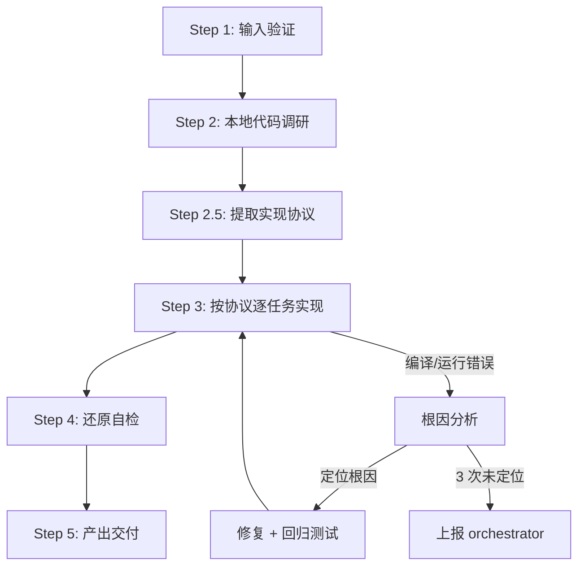

# pb-v1-implementing 优化方案

**版本**: 3.0.0  
**状态**: 方案设计  
**创建日期**: 2026-04-01

---

## 核心哲学

### 研发的本质

> 先用计划锁定约束，再用实现把代码一步步压进正确边界里，直到代码、测试、验证、文档、主干状态一起闭环。

实现不是创造，是**约束还原**——上游的需求、架构、工程规划已经把"做什么"和"怎么做"锁死了。implementing 的职责是：在这些约束的边界内，写出最短路径的正确代码。

### 设计原则

1. **协议先行**: 先定义协议，再写实现。协议是约束的契约，所有参与者共同遵守
2. **约束即边界**: 上游产物是硬约束，不可越界、不可缩水、不可自由发挥
3. **本地优先**: 先研究项目中已有的代码模式，复用优于重写
4. **一次做对**: 每个任务交付即完整——代码、测试、验证同步闭环
5. **根因驱动**: 遇到问题先定位根因，禁止 patch-on-patch
6. **静默执行**: 约束明确时直接还原，如无必要不打扰用户

---

## 优化背景

基于以下参考资料：
- gstack ETHOS.md（Boil the Lake、Search Before Building）
- ~/.claude/CLAUDE.md（SOLID、零假设、小步提交、TDD）
- PowerBy vNext 核心理念（执行是约束还原的过程）

---

## 优化点

### 1. 协议先行的约束显性化

**问题**: 当前版本直接进入代码实现，约束分散在多个文档中，缺少统一协议

**优化**: 引入**实现协议**（Implementation Protocol），在实现前将所有约束收敛为一份可执行的契约

**核心思路**:
- 约束不是新增的文档负担——它已经存在于上游产物中
- 实现协议是对上游约束的**提取和确认**，而非额外设计
- 所有参与者（实现者、审查者、测试者）共同遵守同一份协议

**实现协议** (`protocol.md`):

```markdown
# 实现协议

## 约束来源
- architecture.md → 模块划分、接口定义、技术选型
- tasks.md → 任务拆解、依赖顺序、验收标准

## 工程约束
- 技术栈: [从 architecture.md 提取]
- 性能要求: [从 architecture.md 提取]
- 兼容性: [从 architecture.md 提取]

## 数据流
- [从 architecture.md 中的数据流设计提取，Mermaid 图]

## 状态机（如适用）
- [从 architecture.md 中的状态设计提取，Mermaid 图]

## 测试矩阵
| 场景 | 输入 | 预期输出 | 边界条件 |
|------|------|---------|---------|
| [从 tasks.md 验收标准推导] | | | |

## 还原检查清单
- [ ] 模块 → 代码目录
- [ ] 接口 → 代码接口
- [ ] 数据结构 → 代码类型
```

**执行流程变更**:
```
Step 2: 代码调研
  ↓
Step 2.5: 提取实现协议（从上游产物中提取，非新增设计）
  ↓
Step 3: 按协议逐任务实现
```

---

### 2. Boil the Lake：一次做对

**问题**: 当前版本允许"最小实现"，可能导致 80% 半成品

**优化**: 重新定义"完成"——交付即闭环

**完成定义**:

| 维度 | 标准 | 验证方式 |
|------|------|---------|
| 功能完整性 | 架构设计中的接口 100% 实现 | 对照 protocol.md 还原检查清单 |
| 测试完整性 | protocol.md 测试矩阵 100% 覆盖 | 运行测试 + 覆盖率工具 |
| 边界条件 | 测试矩阵中的边界条件全覆盖 | 检查 protocol.md |
| 异常处理 | 所有异常路径有处理和测试 | 代码审查 + 测试验证 |
| 对齐还原 | 模块/接口/数据结构与架构设计一致 | protocol.md 还原检查清单 |

**禁止**:
- "测试留到下个 PR"
- "差不多能跑就行"
- "这个边界情况很少见，先不管"

**实施方式**: Step 3 中，每个 Task 的交付物 = 代码 + 测试 + 验证，三者同步完成

---

### 3. Search Before Building：本地优先调研

**问题**: 当前版本的"代码调研"不够结构化

**优化**: 以本地代码为核心的结构化调研

**必须做（本地调研）**:

1. **扫描项目现有实现**: 找到 3 个与本次任务最相似的既有实现
2. **识别通用模式**: 命名规范、目录结构、错误处理方式、测试方式
3. **确认已有能力**: 项目已引入的库、工具、框架内置能力
4. **复用判断**: 哪些能直接复用？哪些需要适配？哪些必须新写？

**可选做（外部调研，仅在本地无解时）**:

- 标准库/框架文档
- 社区最佳实践
- 第一性原理分析

**产出**: 调研结论直接记录在 `implementation.md` 的对应 Task 中，不单独出文档

**原则**: 本地有解用本地，本地无解查外部，外部无解从原理推导

---

### 4. 根因驱动的异常处理

**问题**: 当前版本对编译错误的处理不够系统

**优化**: 所有 Fix 必须有根因，禁止盲修

**处理流程**:
1. **收集证据**: 错误日志、堆栈、复现步骤
2. **提出假设**: 至少 2 个可能原因
3. **验证假设**: 通过测试或日志验证
4. **定位根因**: 确认唯一根因
5. **修复 + 回归测试**: 修复根因并添加防止复发的测试

**3 次规则**: 同一问题 3 次尝试仍未定位根因 → 停止，记录失败过程，上报 orchestrator

**禁止**:
- 不定位根因就改代码
- 用 workaround 掩盖问题
- 删除/跳过失败的测试

---

### 5. 代码原则（外部引用）

**问题**: 当前版本对代码质量的要求不够具体，且原则散落在多处

**优化**: 建立可引用的代码原则列表，Skill 运行时动态加载

**原则来源**: `~/.claude/CLAUDE.md` 中与代码实现相关的原则

**当前原则清单**:

#### 架构原则
- **SOLID**: 单一职责、开闭、里氏替换、接口隔离、依赖倒置
- **DRY**: 消除重复，通用逻辑抽象为单一权威实现
- **奥卡姆剃刀**: 如无必要，勿增实体。选择最简单的方案
- **组合优于继承**: 优先使用依赖注入
- **接口优于单例**: 确保可测试性和灵活性
- **显式优于隐式**: 数据流和依赖关系保持清晰

#### 代码质量
- **意图清晰优于炫技**: 编写"无聊"且一目了然的代码
- **命名即文档**: 变量/函数名应自解释，无需注释即可理解
- **避免过早抽象**: 只在必要时进行抽象
- **拒绝奇技淫巧**: 永远选择最直接、最易懂的方案

#### 实现流程
- **TDD**: 红灯 → 绿灯 → 重构
- **小步提交**: 每次提交可编译且通过测试
- **借鉴优于重写**: 先研究项目中的既有模式

#### 错误处理
- **快速失败**: 提供有描述性的错误信息
- **包含调试上下文**: 方便定位问题
- **在合适的层级处理错误**: 不静默吞掉异常

#### 决策优先级
可测试性 > 可读性 > 一致性 > 简单性 > 可逆性

**引用机制**: Skill 执行时通过 `style.inherits: powerby-foundation` 加载全局原则，通过 `style.local: implementing` 加载实现类局部原则。原则列表可动态补充，新增原则通过更新 foundation 即可全局生效。

---

## 优化后的执行流程



### 各步骤与优化点的映射

| 步骤 | 优化点融入 | 产物 |
|------|-----------|------|
| Step 1: 输入验证 | - | 验证通过/缺失清单 |
| Step 2: 代码调研 | 本地优先调研 | 调研结论（内嵌 implementation.md） |
| Step 2.5: 实现协议 | 协议先行 | `protocol.md` |
| Step 3: 逐任务实现 | 一次做对 + 代码原则 + 根因驱动 | 代码 + 测试（每 Task 同步） |
| Step 4: 还原自检 | protocol.md 还原检查清单 | 自检报告 |
| Step 5: 产出交付 | - | 代码 + implementation.md |

---

## 实施建议

### 升级路径

**Phase 1: 立即应用**（不破坏现有流程）
- 优化点 4: 根因驱动异常处理
- 优化点 5: 代码原则引用机制

**Phase 2: 渐进融入**（需要调整流程）
- 优化点 1: 协议先行（新增 Step 2.5）
- 优化点 3: 本地优先调研

**Phase 3: 标准提升**（提高完成定义）
- 优化点 2: Boil the Lake（一次做对）

### 风险与缓解

| 风险 | 缓解措施 |
|------|---------|
| protocol.md 变成形式主义 | 协议内容从上游产物提取，不是额外设计 |
| 100% 标准导致交付变慢 | 从核心模块开始试点，积累模板 |
| 本地调研找不到参考 | 降级到外部调研，记录原因 |

---

## 总结

### 核心改进

```
约束锁定（上游）→ 协议提取 → 按协议实现 → 还原验证 → 闭环交付
```

1. **协议先行**: 实现前提取统一协议，所有参与者遵守同一契约
2. **一次做对**: 代码 + 测试 + 验证同步交付，杜绝半成品
3. **本地优先**: 先调研项目已有模式，复用优于重写
4. **根因驱动**: Fix 必须有证据和假设验证，禁止盲修
5. **原则可引用**: 代码原则外部化，Skill 运行时动态加载，可持续补充

### 与旧版本的关键差异

| 维度 | v1.0（旧） | v3.0（新） |
|------|-----------|-----------|
| 约束管理 | 散落在多个文档 | 协议先行，统一契约 |
| 完成标准 | "可编译可运行" | "代码+测试+验证闭环" |
| 代码调研 | 非结构化扫描 | 本地优先，结构化调研 |
| 异常处理 | 3 次编译失败上报 | 根因分析流程 |
| 代码原则 | 内嵌在 Skill 中 | 外部引用，动态加载 |
| 用户交互 | 可能过度打扰 | 静默执行，约束明确不打扰 |

---

**文档状态**: 方案设计完成  
**版本**: 3.0.0  
**下一步**: 应用到 SKILL.md v2.0.0
