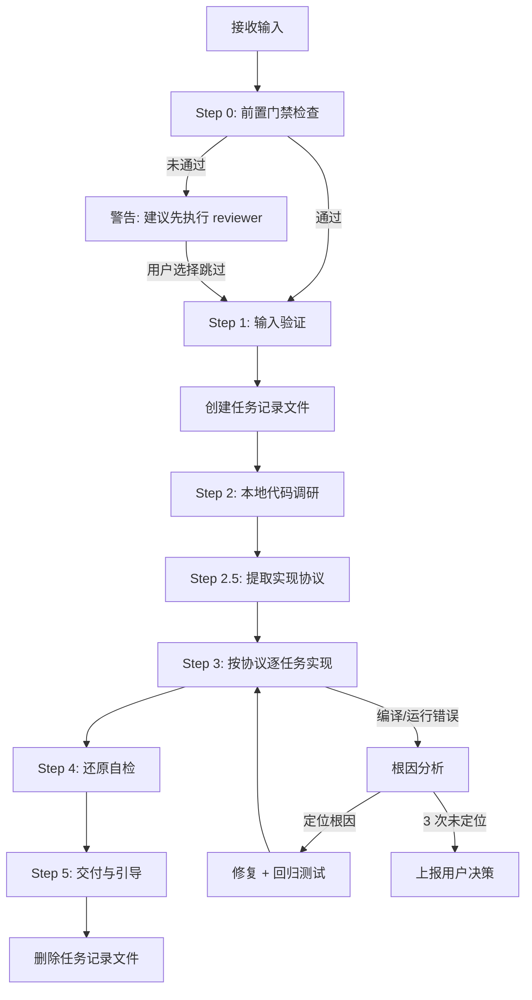
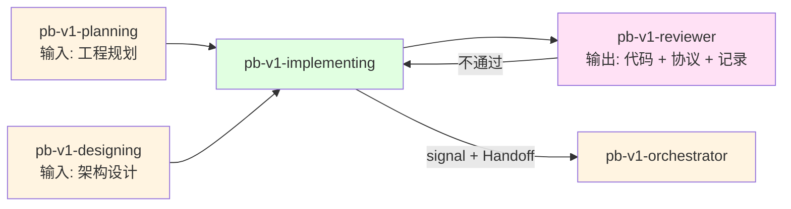

# pb-v1-implementing

**版本**: 3.0.0
**状态**: 设计完成
**创建日期**: 2026-04-01
**最后更新**: 2026-04-09
**流程映射**: vNext Build 阶段（实现与还原）

---

**CRITICAL: 绝不修改上游产物（proposal.md、architecture.md、tasks.md）——这些是已锁定的契约，越界修改会破坏全链路一致性。**

**CRITICAL: 绝不新增 tasks.md 之外的功能——scope creep 是最常见的实现缺陷，每行代码都必须追溯到任务定义。**

**CRITICAL: 绝不跳过协议提取直接写代码——protocol.md 是实现、审查、测试的共同基准，跳过会导致三方对齐断裂。**

---

## 核心哲学

> 先用计划锁定约束，再用实现把代码一步步压进正确边界里，直到代码、测试、验证、文档、主干状态一起闭环。

实现不是创造，是**约束还原**。上游的需求、架构、工程规划已经把"做什么"和"怎么做"锁死了。implementing 的职责是：在这些约束的边界内，写出最短路径的正确代码。

---

## 设计原则

1. **协议先行**: 先从上游产物提取实现协议，再写代码。协议是约束的契约，实现者、审查者、测试者共同遵守
2. **约束即边界**: 上游产物是硬约束——不可越界、不可缩水、不可自由发挥
3. **本地优先**: 先研究项目中已有的代码模式，复用优于重写
4. **一次做对**: 每个任务交付即完整——代码、测试、验证同步闭环
5. **根因驱动**: 遇到问题先定位根因，禁止 patch-on-patch
6. **静默执行**: 约束明确时直接还原，如无必要不打扰用户

---

## 代码原则

通过 `style.inherits: powerby-foundation` 动态加载，以下为当前原则快照。原则可持续补充，更新 foundation 即全局生效。

### 架构原则
- **SOLID**: 单一职责、开闭、里氏替换、接口隔离、依赖倒置
- **DRY**: 消除重复，通用逻辑抽象为单一权威实现
- **奥卡姆剃刀**: 如无必要，勿增实体
- **组合优于继承**: 优先使用依赖注入
- **接口优于单例**: 确保可测试性和灵活性
- **显式优于隐式**: 数据流和依赖关系保持清晰

### 代码质量
- **意图清晰优于炫技**: 编写"无聊"且一目了然的代码
- **命名即文档**: 变量/函数名应自解释，无需注释即可理解
- **避免过早抽象**: 只在必要时进行抽象
- **拒绝奇技淫巧**: 永远选择最直接、最易懂的方案

### 实现流程
- **TDD**: 红灯 → 绿灯 → 重构
- **小步提交**: 每次提交可编译且通过测试
- **借鉴优于重写**: 先研究项目中的既有模式

### 错误处理
- **快速失败**: 提供有描述性的错误信息
- **包含调试上下文**: 方便定位问题
- **在合适的层级处理**: 不静默吞掉异常

### 决策优先级

可测试性 > 可读性 > 一致性 > 简单性 > 可逆性

---

## 输入协议

### 必需输入

**工程规划文档** (`tasks.md`)，必须包含：

```markdown
## 任务列表

### Task 1: [任务名称]
- **目标**: [明确的可交付成果]
- **输入**: [依赖的上游产物]
- **输出**: [本任务的产出]
- **实现方案**: [具体的技术方案]
- **验收标准**: [如何判断完成]
- **依赖**: [依赖的其他任务]

### Task 2: ...
```

**架构设计文档** (`architecture.md`)，作为对齐基准：
- 模块划分
- 接口定义
- 技术选型
- 数据结构
- 数据流设计
- 状态设计（如适用）

### 可选输入

- 现有代码库（用于借鉴模式）
- PRD（用于理解业务上下文）

---

## 输出协议

### 必需输出

**1. 实现协议** (`protocol.md`)

从上游产物中提取的统一契约，所有参与者共同遵守：

```markdown
# 实现协议

## 约束来源
- architecture.md → 模块划分、接口定义、技术选型
- tasks.md → 任务拆解、依赖顺序、验收标准

## 工程约束
- 技术栈: [从 architecture.md 提取]
- 性能要求: [从 architecture.md 提取]
- 兼容性: [从 architecture.md 提取]

## 数据流
[从 architecture.md 中的数据流设计提取，Mermaid 图]

## 状态机（如适用）
[从 architecture.md 中的状态设计提取，Mermaid 图]

## 测试矩阵
| 场景 | 输入 | 预期输出 | 边界条件 |
|------|------|---------|---------|
| [从 tasks.md 验收标准推导] | | | |

## 还原检查清单
- [ ] 模块 → 代码目录
- [ ] 接口 → 代码接口
- [ ] 数据结构 → 代码类型
```

**2. 代码实现**，满足以下标准：

| 维度 | 标准 |
|------|------|
| 功能完整性 | 架构设计中的接口 100% 实现 |
| 测试完整性 | protocol.md 测试矩阵 100% 覆盖 |
| 边界条件 | 测试矩阵中的边界条件全覆盖 |
| 异常处理 | 所有异常路径有处理和测试 |
| 对齐还原 | 模块/接口/数据结构与架构设计一致 |

**3. 实现记录** (`implementation.md`)：

```markdown
## 实现记录

### Task 1: [任务名称]
- **状态**: 已完成
- **调研结论**: [本地调研发现的可复用模式/已有能力]
- **实现文件**: 
  - `src/module1/feature.ts`
  - `src/module1/feature.test.ts`
- **关键决策**: 
  - 使用 X 库实现 Y 功能（原因：项目已有依赖）
- **遗留问题**: 无

### Task 2: ...
```

---

## 执行流程

### 任务记录协议（执行可观测性）

**协议依据**: docs/pb-v1-task-tracking-protocol.md

本 Skill 遵循任务记录协议。执行时必须：

1. **Step 1 完成后** → 创建任务记录文件 `/tmp/pb-v1-{iteration_id}-implementing.md`，将 Step 2-5 规划为子任务写入
2. **每个 Step 开始时** → 更新对应子任务状态为 🔄 running
3. **每个 Step 完成时** → 更新对应子任务状态为 ✅ done
4. **Step 5 Handoff 完成后** → 删除任务记录文件

---

### 总流程



---

### Step 0: 前置门禁检查

**检查项**: plan_review 审查报告

**执行逻辑**:
1. 查找 `docs/iterations/{iteration_id}/review-logs/plan_review.md`
2. 如果文件存在且 frontmatter 中 `result: PASS` → 继续执行 Step 1
3. 如果文件存在且 `result: FAIL` → 警告 "上游工程审查未通过，存在未解决的 BLOCKER/MAJOR"
4. 如果文件不存在 → 警告 "工程规划尚未经过工程审查"

**未通过处理**:
使用 AskUserQuestion 询问：
- A. 先执行 `/pb-v1-reviewer` 进行工程审查（推荐）
- B. 跳过审查，接受风险继续

用户选择 B 时，在本 Skill 产出文件（implementation.md）头部追加：
`⚠️ 前置门禁跳过: plan_review 未执行，工程规划未经对齐验证`

---

### Step 1: 输入验证

**目的**: 确保输入完整且可执行

**检查清单**:
- [ ] 工程规划文档存在且任务列表完整
- [ ] 架构设计文档存在且模块/接口定义清晰
- [ ] 每个任务都有明确的验收标准
- [ ] 任务之间的依赖关系无环

**如果验证失败**: 立即停止，输出缺失项清单，返回 pb-v1-orchestrator

---

### Step 2: 本地代码调研

**目的**: 以本地代码为核心，识别可复用模式，避免重复造轮子

**必须做**:

1. **扫描项目现有实现**: 找到 3 个与本次任务最相似的既有实现
2. **识别通用模式**: 命名规范、目录结构、错误处理方式、测试方式
3. **确认已有能力**: 项目已引入的库、工具、框架内置能力
4. **复用判断**: 哪些能直接复用？哪些需要适配？哪些必须新写？

**可选做**（仅在本地无解时）:
- 标准库/框架文档
- 社区最佳实践
- 第一性原理分析

**原则**: 本地有解用本地，本地无解查外部，外部无解从原理推导

**产出**: 调研结论记录在 `implementation.md` 的对应 Task 中

---

### Step 2.5: 提取实现协议

**目的**: 从上游产物中提取统一约束契约，作为实现和审查的共同基准

**执行内容**:

1. 从 `architecture.md` 提取：模块划分、接口定义、技术选型、数据流、状态机
2. 从 `tasks.md` 提取：任务拆解、依赖顺序、验收标准
3. 推导测试矩阵：基于验收标准 + 数据流 + 状态机，列出全量测试场景
4. 生成还原检查清单：模块→目录、接口→代码接口、数据结构→类型

**产出**: `protocol.md`

**关键约束**: 协议内容是**提取**，不是**设计**。如果发现上游产物中缺少信息导致协议无法提取，立即停止，上报 pb-v1-orchestrator

---

### Step 3: 按协议逐任务实现

**目的**: 按工程规划文档中的任务顺序，在协议约束下逐个实现

**执行规则**:

1. **按依赖顺序执行**: 先实现无依赖的任务，再实现有依赖的任务
2. **每 Task 闭环交付**: 代码 + 测试 + 验证同步完成，不拆到下个 PR
3. **对齐协议**: 每个任务实现后，检查是否与 protocol.md 一致
4. **单任务完成后立即提交**: 每完成一个 Task，立即 git commit

**单任务执行步骤**:


1. **阅读任务**: 理解目标、实现方案、验收标准
2. **编写代码**: 按实现方案编写代码，遵循代码原则
3. **编写测试**: 覆盖 protocol.md 测试矩阵中的对应场景
4. **编译验证**: 使用 tmux 执行编译和测试（后台运行，不阻塞）：
   ```bash
   # 编译验证
   tmux new-session -d -s pb-impl-build 'cd {project_root} && {build_command}'
   # 测试执行
   tmux new-session -d -s pb-impl-test 'cd {project_root} && {test_command}'
   ```
   - 通过 `tmux capture-pane -t pb-impl-build -p` 检查编译输出
   - 通过 `tmux capture-pane -t pb-impl-test -p` 检查测试输出
5. **前端验证**（仅涉及前端代码时）：
   - 使用 tmux 启动 dev server：`tmux new-session -d -s pb-impl-dev 'cd {project_root} && npm run dev'`
   - 通过 `/pb-v1-brower`（mode: verify）验证页面效果
   - 浏览器操作过程中的 CDP 命令直接执行，不逐条确认；链式操作统一使用 `browse chain '<JSON>'` 直接传参，不使用 heredoc / pipe；证据文件优先写入当前仓库或 /tmp
   - 非前端任务不调用 brower
6. **对齐协议**: 检查模块/接口/数据结构是否与 protocol.md 一致
7. **提交代码**: git commit，信息格式见提交规范

**遇到模糊点时**: 
- 先调用 pb-v1-clarify 尝试收敛：
  ```
  调用 pb-v1-clarify:
    dimension: "requirement"  # 或 "data"，视模糊点类型而定
    iteration_path: "docs/iterations/{iteration_id}"
    scope: "实现过程中发现的规格模糊点"
    context: ["protocol.md", "architecture.md"]
  ```
- 澄清返回 clear → 基于澄清结论继续实现
- 澄清返回 blocked → 记录模糊点和影响范围，返回 pb-v1-orchestrator 决策

---

### Step 4: 还原自检

**目的**: 基于 protocol.md 做全面还原验证

**自检清单**:

| 检查项 | 标准 | 来源 |
|-------|------|------|
| 功能完整 | 架构设计中的接口 100% 实现 | protocol.md 还原检查清单 |
| 测试完整 | 测试矩阵 100% 覆盖 | protocol.md 测试矩阵 |
| 边界覆盖 | 所有边界条件有测试 | protocol.md 测试矩阵 |
| 异常覆盖 | 所有异常路径有处理和测试 | protocol.md 测试矩阵 |
| 模块一致 | 代码模块划分与架构设计一致 | protocol.md 还原检查清单 |
| 接口一致 | 接口定义与架构设计一致 | protocol.md 还原检查清单 |
| 规范遵循 | 符合项目现有代码规范 | Step 2 调研结论 |
| 可编译 | 代码无语法错误，编译成功 | 编译工具 |
| 测试通过 | 所有测试绿灯 | 测试框架 |

**如果自检不通过**: 修复问题后重新自检，不交付给下游

---

### Step 5: Handoff

**目的**: 报告执行结果，交还 orchestrator 决策下一步

**执行内容**:

1. **构建 completion_signal**
   - status: completed（所有任务验收标准通过，自检通过）/ failed / blocked
   - artifacts: protocol.md、implementation.md、代码文件
   - issues: 如有问题，逐条填写（含 severity 和 points_to_upstream）

2. **写入 signal 文件**
   将 completion_signal 写入 `docs/iterations/{iteration_id}/signals/implementing.yaml`

3. **输出状态摘要**（一行，给用户）
   - completed: `✅ Implementing 完成，产出: protocol.md + implementation.md + 代码`
   - failed: `❌ Implementing 失败: {reason}`
   - blocked: `⚠️ Implementing 受阻: {reason}`

4. **调用 orchestrator**
   通过 Skill 工具调用 `/pb-v1-orchestrator`

---

## 职责边界

### 必须做的事

- 提取实现协议（protocol.md）
- 按协议逐任务实现代码
- 每个 Task 同步交付代码 + 测试 + 验证
- 确保代码对齐还原架构设计
- 遵循项目现有代码规范和代码原则
- 每个任务完成后立即提交
- 记录实现过程（implementation.md）

### 禁止做的事

- **不做需求探讨**（交给 pb-v1-discovery）
- **不做产品规格**（交给 pb-v1-drafting）
- **不做架构设计**（交给 pb-v1-designing）
- **不做工程规划**（交给 pb-v1-planning）
- **不做 Review 审查**（交给 pb-v1-reviewer）
- **不做额外功能**: 不实现工程规划之外的功能
- **不做重构优化**: 不对现有代码做与本次任务无关的重构
- **不猜测模糊点**: 遇到不明确的地方立即停止
- **不在协议中设计**: protocol.md 是提取，不是设计

---

## 异常处理

### 场景 1: 输入不完整

**触发条件**: 工程规划文档或架构设计文档缺失/不完整

**处理方式**:
1. 停止执行
2. 输出缺失项清单
3. 返回 pb-v1-orchestrator

---

### 场景 2: 任务描述模糊

**触发条件**: 任务的目标、实现方案或验收标准不明确

**处理方式**:
1. 先调用 pb-v1-clarify 尝试收敛模糊点：
   ```
   调用 pb-v1-clarify:
     dimension: "requirement"
     iteration_path: "docs/iterations/{iteration_id}"
     scope: "任务描述模糊，无法确定实现方向"
     context: ["tasks.md", "protocol.md"]
   ```
2. 澄清返回 clear → 基于澄清结论继续实现
3. 澄清返回 blocked → 停止当前任务，记录模糊点和影响范围，返回 pb-v1-orchestrator 建议回退到 pb-v1-planning

---

### 场景 3: 架构设计不可实现

**触发条件**: 实现过程中发现架构设计在技术上不可行

**处理方式**:
1. 停止当前任务
2. 记录不可行的原因和具体约束
3. 提出最小修改建议（不做架构设计，只提供信息）
4. 返回 pb-v1-orchestrator，建议回退到 pb-v1-designing

---

### 场景 4: 编译/运行错误（根因分析）

**触发条件**: 代码编译失败或运行时错误

**处理方式（根因分析流程）**:
1. **收集证据**: 错误日志、堆栈、复现步骤
2. **提出假设**: 至少 2 个可能原因
3. **验证假设**: 通过测试或日志验证
4. **定位根因**: 确认唯一根因
5. **修复 + 回归测试**: 修复根因并添加防止复发的测试

**3 次规则**: 同一问题 3 次尝试仍未定位根因 → 停止

**停止后处理**:
1. 记录：尝试了什么、具体错误信息、失败原因分析
2. 记录：2-3 个替代方案（如有）
3. 返回 pb-v1-orchestrator

**禁止**:
- 不定位根因就改代码
- 用 workaround 掩盖问题
- 删除/跳过失败的测试

---

### 场景 5: 协议无法提取

**触发条件**: 上游产物中缺少必要信息，导致 protocol.md 无法完整提取

**处理方式**:
1. 停止 Step 2.5
2. 记录缺失的约束项和对应的上游文档
3. 返回 pb-v1-orchestrator，建议补充上游产物

---

## 提交规范

### Commit Message 格式

```
<type>(<scope>): <subject>

<body>

<footer>
```

**type**:
- `feat`: 新功能实现
- `fix`: 修复实现过程中发现的问题
- `test`: 新增或修改测试
- `refactor`: 实现过程中必要的小重构

**scope**: 对应架构设计中的模块名

**subject**: 对应工程规划中的任务名称

**示例**:
```
feat(auth): 实现用户登录接口

- 基于 protocol.md 中 auth 模块的接口定义
- 使用 JWT token 方案（项目已有 jsonwebtoken 依赖）
- 对应 tasks.md Task 3
- 测试覆盖: 正常登录、密码错误、用户不存在、token 过期

Task: Task 3 - 用户登录接口
```

---

## 质量标准

### 完成定义

一个 Task 只有满足以下**全部条件**才算完成：

- [ ] 代码实现对齐 protocol.md 还原检查清单
- [ ] 测试覆盖 protocol.md 测试矩阵中的对应场景
- [ ] 边界条件和异常路径全覆盖
- [ ] 代码遵循代码原则（通过 `style.inherits` 加载）
- [ ] 符合项目现有代码规范
- [ ] git commit 信息关联到 Task
- [ ] 编译通过，所有测试绿灯

### 代码质量

遵循代码原则中的标准，核心要求：

1. **可读性**: 代码意图清晰，命名即文档
2. **一致性**: 与项目现有代码风格一致
3. **简单性**: 选择最直接、最易懂的实现方案
4. **安全性**: 不引入 OWASP Top 10 漏洞
5. **可测试性**: 代码结构支持单元测试

### 提交质量

1. **原子提交**: 每个 commit 对应一个 Task
2. **闭环提交**: 每个 commit 包含代码 + 测试
3. **可编译**: 每个 commit 都可编译通过，测试全绿
4. **信息完整**: commit message 包含任务关联

---

## 与其他 Skill 的交互



| 交互方 | 方向 | 内容 | 触发条件 |
|-------|------|------|---------|
| pb-v1-planning | 输入 | 工程规划文档 (tasks.md) | 开始实现前 |
| pb-v1-designing | 输入 | 架构设计文档 (architecture.md) | 开始实现前 |
| pb-v1-clarify | 工具 | 实现维度澄清（规格模糊、任务描述不清） | 遇到模糊点时 |
| pb-v1-brower | 工具 | 前端实现验证，CDP 命令免确认；链式操作统一用 `browse chain '<JSON>'` | 涉及前端代码时 |
| pb-v1-reviewer | 输入 | Build Review 报告 | Review 不通过时 |
| pb-v1-orchestrator | 输出 | completion_signal + Handoff 调用 | implementing 完成后 |
| pb-v1-orchestrator | 双向 | 流程状态和异常上报 | 贯穿全过程 |

---

## 自推进协议（pb-v1-protocol 对接）

### dispatch_context 接收

当被 orchestrator 通过 Agent 工具调度时，接收 dispatch_context：

```yaml
dispatch_context:
  goal: string          # 如 "按 tasks.md 实现代码"
  scope: string         # 如 "只实现 P0 任务"
  verification: string  # 如 "所有 P0 任务验收标准通过，代码已提交"
  doc_paths:
    - string            # 如 "docs/iterations/015/tasks.md"
```

dispatch_context 缺少必填字段时拒绝执行，返回 blocked。

### completion_signal 输出

执行完成后返回结构化信号给 orchestrator：

```yaml
completion_signal:
  skill: "pb-v1-implementing"
  status: enum [completed, failed, blocked]
  artifacts:
    - path: "docs/iterations/{id}/implementation/protocol.md"
      type: "protocol"
    - path: "docs/iterations/{id}/implementation/implementation.md"
      type: "implementation-record"
    - path: "src/..."
      type: "code"
  issues: optional array
    - id: string
      description: string
      severity: enum [BLOCKER, MAJOR, MINOR]
      points_to_upstream: boolean
      gate_candidate: optional enum [G1, G2, G3, G4, G5]
  assumptions: optional array
    - clr_id: string
      summary: string
```

---

## Safety

- 不修改上游产物，不新增 tasks.md 之外的功能
- protocol.md 是提取不是设计，发现架构问题反馈上游
- 不使用 --no-verify 绕过提交钩子，不禁用测试代替修复
- 不提交无法编译的代码

---

**文档状态**: 设计完成  
**版本**: 3.0.0  
**创建日期**: 2026-04-01  
**最后更新**: 2026-04-09
