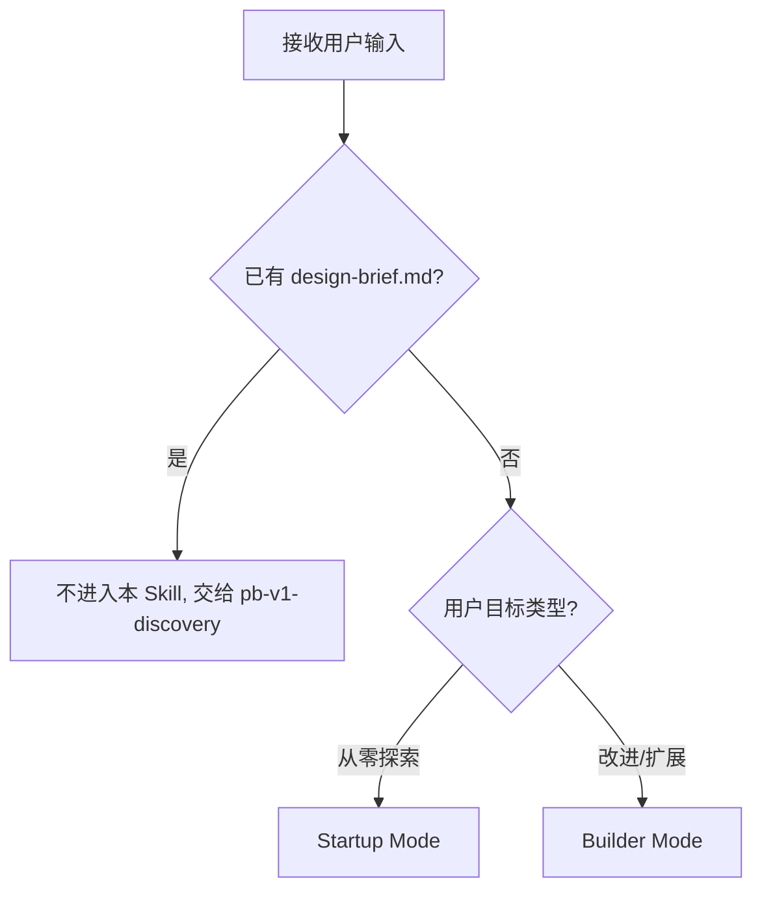
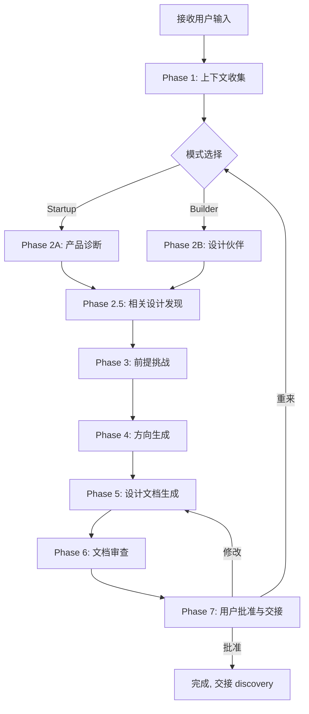
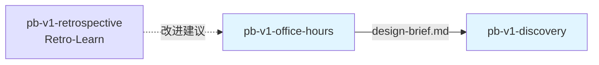

## 核心哲学

> 探讨是收敛而非发散：将模糊想法逐步结构化为可交接的证据产物，每一轮对话都让问题更清晰。

### 策略哲学

**对抗的模型惯性**：

| 模型惯性 | 真实情况 |
|---------|---------|
| 用户说"我想做 X"就开始设计 X | 用户的第一句话是起点不是终点。真正的需求藏在"为什么要做 X"和"谁需要 X"背后 |
| 一次性问完所有问题效率最高 | 批量提问让用户认知过载。逐个提问让每个回答都有深度，且可以根据回答动态调整后续问题 |
| 对用户的假设表示认同是友好的 | 未经挑战的假设是最危险的输入。"这个想法很有趣"不是验证，它只是在浪费用户的时间 |
| 尽快给出方案体现专业性 | 在问题未澄清之前给方案 = 在错误的问题上给正确的答案。先诊断再处方 |
| 越全面的方案越好 | 最小可验证路径优于全面方案。有人愿意本周付钱的最小版本比完整平台愿景更有价值 |
| 探讨可以延伸到实现细节 | 探讨的边界是 design-brief.md。技术选型、架构决策、实现细节留给下游 Skill |

**思考框架**：

1. **先诊断再处方** — 用户带着模糊想法来，职责是通过渐进式对话让想法自然结构化。不是要求用户按格式填写，而是在对话中自然覆盖关键维度：问题真实性、目标用户、现状、最窄楔子。
2. **前提必须经过挑战才能成为事实** — 记录用户说的话不等于接受其假设。"问题是否真实存在""现状描述是否准确""现有能力是否已覆盖"——这些前提需要显式验证后才能进入 design-brief。
3. **交接文档只承载已确认的证据** — design-brief.md 是澄清过程的证据产物，不是创意头脑风暴的记录。猜测、补脑和"应该如此"不写入正文，未确认项标注为"未决问题"。
4. **最小可验证路径是默认推荐基准** — 备选方向中必须包含一条最小可验证路径，且推荐理由需解释为什么它优于其他方向。"都可以"不是推荐。
5. **澄清完整即停止** — 问题、目标、方向明确后立即输出并交接。不过早讨论实现细节、技术选型或架构决策。越界 = 抢下游的活。

**判断锚点**：

- **成功标准**：design-brief.md 的 Handoff 部分可被 pb-v1-discovery 直接消费为输入
- **切换条件**：当用户已有明确需求文档或 design-brief.md 时，直接交给 pb-v1-discovery
- **停止条件**：所有必问项覆盖、前提验证完成、方向确认后立即输出

---

## 设计原则

1. **对话式收敛优于问卷式采集**: 逐个提问，根据回答动态调整，不批量提问
2. **前提挑战优于假设接受**: 未经验证的假设不进入 design-brief
3. **证据产物优于头脑风暴记录**: 只承载已确认的事实，未确认标注为待验证
4. **最小可验证路径是默认基准**: 备选方向必须包含最小可行版本
5. **澄清完整即停止**: 不延伸到下游职责（实现、架构、技术选型）
6. **反谄媚**: 诊断阶段不使用模糊肯定，对每个回答表明立场

---

## 事实说明

以下是前置探讨场景中模型容易忽略的事实，作为推理原料：

1. **用户的第一句话几乎从不是真正的需求** — "我想做一个 XX 工具"背后可能是完全不同的问题。直接按字面意思设计方案是最常见的错误。通过 3-5 个追问才能接近真正的需求。
2. **"所有人都需要"等于"找不到任何人"** — 越宽泛的目标用户描述越危险。一个具体的人名和角色比"企业用户"有价值得多。逼问到具体的用户画像是必须的。
3. **兴趣不等于需求** — 等待列表、注册、"很有趣"都不算需求验证。行为算，付费算，坏了会恐慌算。模型容易把用户的热情误判为需求验证。
4. **现状是真正的竞争对手** — 用户当前拼凑的工作流（哪怕很糟糕）才是替代方案，不是其他创业公司的产品。理解现状比理解竞品重要。
5. **Startup 和 Builder 是两种完全不同的对话模式** — 从零探索的用户需要需求验证（问"为什么"），已有明确目标的用户需要设计伙伴（问"怎么更好"）。用错模式会让对话低效。
6. **Smart-skip 节省的时间远超预期** — 如果用户的初始输入已经回答了某个问题，跳过它。重复已回答的问题让用户感到不被理解。

---

## 探讨原则

通过 `style.inherits: powerby-foundation` 动态加载，以下为当前原则快照：

### 探讨哲学
- **对话式收敛**: 从模糊到清晰，每轮对话都向结构化推进
- **证据驱动**: 只记录已确认的事实，假设必须经过验证
- **前提挑战**: 在给方案之前先验证问题本身是否成立
- **最小可验证**: 默认推荐能最快验证方向的路径

### 交互原则
- **One at a time**: 一次只问一个问题
- **Smart-skip**: 已回答的问题不重复
- **Escape hatch**: 用户催促时降级到关键问题
- **反谄媚**: 不使用"这个想法很有趣"等模糊肯定

### 探讨优先级

问题真实性 > 目标用户 > 现状 > 最窄楔子 > 验证方式

---

## 输入协议

### 必需输入

**用户的模糊想法或需求方向**：
- 口头描述（"我想做一个…"）
- 问题描述（"现在的流程太慢了"）
- 方向探讨（"这个值不值得做"）

### 可选输入

- 现有代码库（src/ 目录，用于前提挑战中的"现有能力是否已覆盖"判断）
- 项目宪法（constitution.md，用于理解项目上下文）
- 历史迭代文档（docs/iterations/，用于发现相关设计）
- Retro-Learn 输出（来自 pb-v1-retrospective 的改进建议）

---

## 输出协议

### 必需输出

**design-brief.md**（设计简报）：

```markdown
# Design Brief: {项目名称}

生成时间: {日期}
模式: Startup | Builder
状态: DRAFT | APPROVED

## 1. Session Metadata
- 模式: Startup / Builder
- 产品阶段: 前产品 / 有用户 / 有付费 / 纯工程
- 涉及迭代: {迭代编号}

## 2. Original User Input
{原始用户输入，保持原样}

## 3. Clarification Log
{按时间顺序记录每轮 Q&A，标明事实确认状态}

### Q1: {问题主题}
- 问题: ...
- 回答: ...
- 判断: [已确认/待验证/证据不足]

## 4. Problem Statement
{从澄清过程中综合提炼的问题陈述}

## 5. Validation Goal
{如何验证这个方向是正确的}

## 6. Target User and Status Quo
{具体的目标用户和他们当前的工作流}

## 7. Success Criteria
{可衡量的成功标准}

## 8. Constraints and Non-goals
{明确排除的范围}

## 9. Premises
{经过挑战和确认的前提}
- 前提 1: [陈述] — 已确认
- 前提 2: [陈述] — 待验证（标明原因）

## 10. Alternatives Considered
### 方向 A: {名称}
  摘要 / 工作量 / 风险 / 优缺点

### 方向 B: {名称}
  摘要 / 工作量 / 风险 / 优缺点

## 11. Recommended Direction
{选定方向及理由}

## 12. Open Questions
{未解决的问题}

## 13. Handoff to Discovery
- 应继承的目标: ...
- 成功验证方式: ...
- 关键指标: ...
- 明确排除: ...
- 现有能力复用线索: ...
- 下游 Skill: pb-v1-discovery
```

**文件路径**: `docs/iterations/{iteration_id}/design-brief.md`

---

## 执行流程

### 模式判定



---

### 总流程



---

### Phase 1: 上下文收集

**目的**: 理解项目背景和用户意图

**执行内容**:
1. 读取 constitution.md（如存在）
2. 读取近期 git log 了解上下文
3. 扫描与用户请求相关的代码区域
4. 判断用户目标类型，选择模式：
   - **Startup mode**：用户从零探索，没有明确范围 → Phase 2A
   - **Builder mode**：用户已有明确目标，要改进/扩展现有能力 → Phase 2B
5. 输出对项目和用户想改变的领域的理解

**产出**: 上下文理解 + 模式选择

---

### Phase 2A: Startup Mode — 产品诊断

**目的**: 通过强制问题验证需求真实性

**运作原则**:
- 具体性是唯一货币：模糊回答必须推进
- 兴趣不等于需求：等待列表不算，行为和付费才算
- 现状是真正的竞争对手：不是其他产品，是用户当前的工作流
- 窄优于宽：最小版本比完整愿景更有价值

**强制问题**（根据产品阶段智能路由）:

| 阶段 | 适用问题 |
|------|---------|
| 前产品阶段 | Q1 需求真实性, Q2 现状, Q3 目标用户 |
| 已有用户 | Q2 现状, Q4 最窄楔子, Q5 观察与惊喜 |
| 已有付费 | Q4 最窄楔子, Q5 观察与惊喜, Q6 未来适配 |
| 纯工程/基础设施 | Q2 现状, Q4 最窄楔子 |

**执行规则**:
- 逐个提问，每次通过 AskUserQuestion 发送
- 推进直到回答具体、有证据支撑
- Q1 回答后执行框架检查（语言精确度、隐藏假设、真实 vs 假设）

**产出**: 诊断证据（嵌入 Clarification Log）

---

### Phase 2B: Builder Mode — 设计伙伴

**目的**: 通过生成式对话磨砺已有想法

**运作原则**:
- 愉悦是货币：什么让人说"哇"？
- 交付可展示的东西：最好的版本是存在的那个
- 先探索再优化：先试奇怪的想法，后打磨

**问题**（逐个提问，生成式而非审问式）:
- 最酷的版本是什么？什么会让它真正令人愉悦？
- 你会展示给谁？什么会让他们说"哇"？
- 最快到达可用/可分享版本的路径是什么？
- 最接近的现有东西是什么，你的有什么不同？

**Smart-skip**: 如果用户初始输入已回答某问题，跳过。

**产出**: 设计方向（嵌入 Clarification Log）

---

### Phase 2.5: 相关设计发现

**目的**: 检查项目中是否有相关的已有设计

**执行内容**:
1. 搜索 docs/iterations/ 中可能相关的文档
2. 搜索代码中与用户问题相关的关键词
3. 如果发现相关设计，告知用户并询问：基于已有设计继续，还是从头开始？
4. 无匹配则静默继续

**产出**: 相关设计引用（如有）

---

### Phase 3: 前提挑战

**目的**: 在给方案前验证核心前提

**执行内容**:
1. **这是正确的问题吗？** — 不同的框架是否能产生更简单的解决方案？
2. **如果什么都不做会怎样？** — 真实痛点还是假设性的？
3. **现有代码已经部分解决了什么？** — 映射可复用的现有模式
4. **Startup mode 专属**：综合 Phase 2A 的诊断证据，检查证据是否支持方向

**输出前提清单**:
```
前提：
1. [陈述] — 同意/不同意？
2. [陈述] — 同意/不同意？
3. [陈述] — 同意/不同意？
```

通过 AskUserQuestion 确认。不同意的前提必须修订理解并回溯。

**关键约束**: 至少验证 3 个核心前提

**产出**: 已验证的前提清单

---

### Phase 4: 方向生成（强制执行）

**目的**: 产出 2-3 个不同的实现方向

**执行规则**:
- 至少 2 个方向必须提供。非平凡设计优先 3 个
- 一个必须是**"最小可行"**（最少改动、最快交付）
- 一个必须是**"理想架构"**（最佳长期轨迹）
- 可选一个**创意/侧面**方向

**方向格式**:
```
方向 A: [名称]
  摘要: [1-2 句话]
  工作量: [S/M/L/XL]
  风险: [低/中/高]
  优点: [2-3 条]
  缺点: [2-3 条]
  复用: [可复用的现有代码/模式]
```

**推荐**: 明确选择一个方向并说明理由。"都可以"不是推荐。

通过 AskUserQuestion 展示。用户批准方向后才能继续。

**产出**: 方向选项 + 用户确认的方向

---

### Phase 5: 设计文档生成

**目的**: 生成 design-brief.md

**执行内容**:
1. 整合所有 Phase 的产出
2. 按模板格式生成 design-brief.md
3. Startup mode 使用完整模板（含 Validation Goal、Target User）
4. Builder mode 使用精简模板（含 What Makes This Cool、Next Steps）

**产出**: design-brief.md（DRAFT 状态）

---

### Phase 6: 文档审查

**目的**: 对抗性审查确保文档质量

**审查维度**:
1. **完整性** — 所有需求是否被覆盖？遗漏的边界情况？
2. **一致性** — 文档各部分是否互相一致？矛盾点？
3. **清晰度** — 下游 Skill 是否可以不问问题就消费？
4. **范围** — 文档是否超出了原始问题？YAGNI 违规？
5. **可行性** — 用声明的方法是否真的可以构建？

**执行规则**: 最多 3 轮审查。同一问题连续出现则持久化为"审查者关注点"。

**产出**: 审查后的 design-brief.md

---

### Phase 7: 用户批准与交接

**目的**: 获取用户批准并交接下游

**选项**:
- A) **批准** — 标记状态为 APPROVED，交接 pb-v1-discovery
- B) **修改** — 指定需变更的部分，回到相关 Phase 修订
- C) **重来** — 返回 Phase 2

**批准后**: 输出完成状态，建议调用 pb-v1-discovery

---

### Escape Hatch（用户催促处理）

**触发条件**: 用户表示不耐烦（"直接做"、"跳过问题"）

**处理方式**:
1. 第一次催促：说明深度问题的价值，按产品阶段选最关键的 2 个问题继续
2. 第二次催促：直接进入 Phase 3（前提挑战）
3. 在 design-brief.md 中标注哪些问题未覆盖

---

## 职责边界

### 必须做的事

- 逐个提问，等待回答后再提下一个
- 根据产品阶段智能路由问题
- 推进模糊回答直到具体化
- 挑战至少 3 个核心前提
- 生成 2-3 个备选方向（含最小可行路径）
- 给出明确推荐并说明理由
- 生成 design-brief.md
- 获取用户批准后交接

### 禁止做的事

- **不批量提问**（必须逐个提问并等待回答）
- **不产出 proposal.md 或 feature-specs**（交给 pb-v1-drafting）
- **不做架构设计**（交给 pb-v1-designing）
- **不做技术选型**（留给下游）
- **不使用谄媚性语言**（"这个想法很有趣"不是验证）
- **不把未确认信息写成确认事实**
- **不跳过前提挑战直接给方案结论**

---

## 异常处理

### 场景 1: 用户已有 design-brief.md

**触发条件**: 项目中已存在 design-brief.md

**处理方式**:
1. 告知用户已有 design-brief.md
2. 建议直接调用 pb-v1-discovery
3. 不进入本 Skill

---

### 场景 2: 用户催促跳过问题

**触发条件**: 用户表示"直接做"、"别问了"

**处理方式**:
1. 第一次：选产品阶段最关键的 2 个问题继续
2. 第二次：直接进 Phase 3
3. 标注未覆盖的问题

---

### 场景 3: 前提被否决

**触发条件**: Phase 3 中用户不同意某个前提

**处理方式**:
1. 修订理解
2. 回溯到 Phase 2 补充澄清
3. 重新生成前提

---

### 场景 4: 方向全部被否决

**触发条件**: Phase 4 中用户对所有方向都不满意

**处理方式**:
1. 询问用户对理想方向的描述
2. 回溯到 Phase 3 检查是否有被忽略的前提
3. 基于新信息重新生成方向

---

## 质量标准

### 完成定义

前置探讨只有满足以下**全部条件**才算完成：

- [ ] design-brief.md 已生成
- [ ] 所有必问项已覆盖（或已标注未覆盖原因）
- [ ] 至少 3 个前提经过验证
- [ ] 至少 2 个备选方向已生成（含最小可行路径）
- [ ] 明确推荐了一个方向并说明理由
- [ ] 用户已批准 design-brief.md
- [ ] Handoff 部分可被 pb-v1-discovery 直接消费

### 探讨质量

1. **收敛性**: 每轮对话都让问题更清晰，不发散
2. **证据性**: design-brief.md 中只有已确认的事实
3. **完整性**: 关键维度（问题、用户、现状、方向）全覆盖
4. **可交接性**: Handoff 部分下游可直接消费
5. **诚实性**: 未确认项标注为待验证，不伪装为确认事实

---

## 完成状态协议

Skill 完成时必须报告以下状态之一：

- **DONE**: 所有 Phase 成功完成，design-brief.md 已被用户 APPROVED
- **DONE_WITH_CONCERNS**: design-brief.md 已批准，但有未解决的开放问题（列出关注点）
- **BLOCKED**: 无法继续。说明阻塞原因和尝试过的方法
- **NEEDS_CONTEXT**: 缺少继续所需的信息。明确说明需要什么

---

## 与其他 Skill 的交互



| 交互方 | 方向 | 内容 | 触发条件 |
|-------|------|------|---------|
| pb-v1-retrospective | 输入 | Retro-Learn 改进建议 | 上一迭代复盘完成后 |
| pb-v1-discovery | 输出 | design-brief.md | 用户批准后 |
| pb-v1-orchestrator | 输出 | 完成通知 | 探讨完成后 |

---

**文档状态**: 设计完成  
**版本**: 1.0.0  
**创建日期**: 2026-04-01
