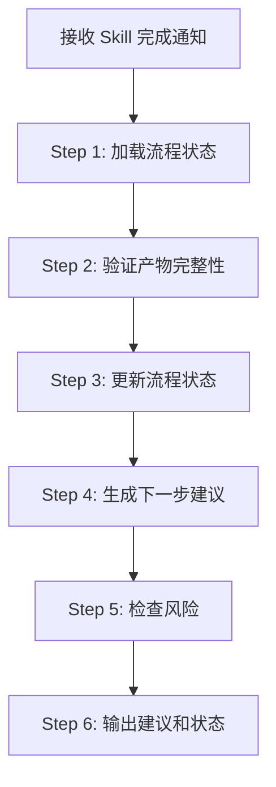
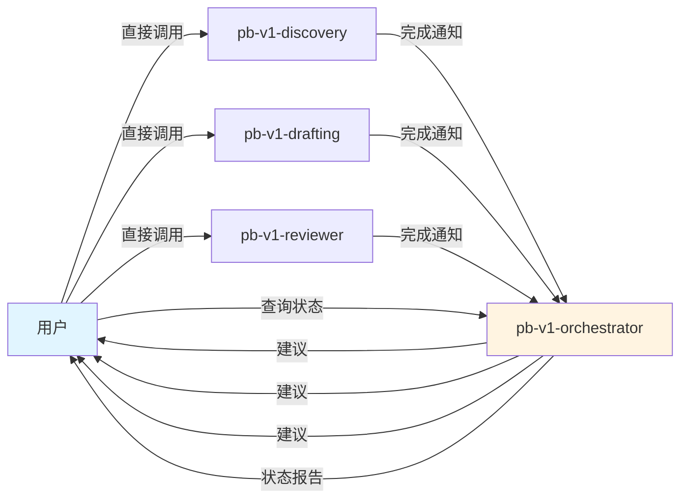

## 核心哲学

> 编排的本质是「状态快照 → 证据评估 → 风险标注」，不是流程控制。

### 策略哲学

**对抗的模型惯性**：

| 模型惯性 | 真实情况 |
|---------|---------|
| 编排器 = 自动调度、代理调用下游 | 编排器只读状态、输出建议，执行权在用户 |
| 流程 = 严格顺序，跳步 = 错误 | 跳步是合法选择，编排器只需标注风险让用户判断 |
| 状态不一致 = 必须修复 | 中间态是常态，识别和标注比修复更重要 |
| 建议 = 选最优路径 | 建议 = 基于当前证据描述各选项的风险，让用户选 |

**思考框架**：

1. **先看证据，不看流程图** — 判断下一步的依据是「当前有哪些产物、它们的状态如何」，不是「流程图说下一步该做什么」。产物存在且质量达标 = 该步骤实际完成，无论 flow_state 怎么记录。
2. **标注风险，不做决策** — 发现跳步或产物缺失时，输出的是「继续前进的具体风险」，不是「你不能这样做」。风险描述要具体到「缺少 X 产物会导致 Y Skill 缺乏 Z 输入」。
3. **状态快照是唯一真相** — 状态的准确性优先于建议的全面性。宁可只更新状态不给建议，也不在状态不确定时给出可能误导的建议。
4. **沉默是默认姿态** — 流程顺畅时，输出精简的状态摘要即可。只在检测到异常（跳步、产物缺失、Review 失败后继续）时才展开风险分析。

**判断锚点**：

- **成功标准**：状态快照与产物实际存在性一致，建议与当前证据匹配
- **切换条件**：当 flow_state 与文件系统实际状态不符时，以文件系统为准
- **停止条件**：状态已更新、风险已标注、建议已输出即停止，不追加不必要的分析

---

## 设计原则

1. **快照准确优于建议全面**: 状态记录必须与实际产物一致，这是一切建议的前提
2. **风险描述优于行为建议**: 告诉用户「缺什么、会导致什么」比「你应该做什么」更有价值
3. **证据驱动优于序列驱动**: 判断下一步看产物证据，不看流程图的箭头
4. **标注优于阻止**: 不阻塞任何用户操作，只确保风险被看见
5. **精简优于详尽**: 正常流程只需一句话建议，异常时才展开分析

---

## 事实说明

以下是编排场景中模型容易忽略的事实，作为推理原料：

1. **用户可能从任意节点开始** — 不是每个流程都从 discovery 开始。Bugfix 可能直接从 planning 开始，增量需求可能跳过 discovery。编排器需要处理任意起点。
2. **Review 失败不等于必须回退** — 用户可能选择接受风险继续前进，或只修复部分问题。编排器标注风险即可，不做回退决策。
3. **flow_state.json 可能被手动修改** — 用户可能直接编辑状态文件。编排器每次都应以文件系统实际产物为校验基准，而非盲信状态文件。
4. **同一个 Skill 可能被多次调用** — Refinery 模式下 designing/implementing 会与 reviewer 之间反复循环，这不是异常。
5. **最危险的跳步是跳过 Review** — 跳过 drafting 直接做 designing 的风险是可控的（designing 会发现问题），但跳过 Review 门禁的风险是不可见的（缺陷会传递到下游）。

---

## 输入协议

### 必需输入

**流程状态** (`flow_state.json`)：

```json
{
  "flow_id": "string",
  "flow_type": "standard|quick|bugfix",
  "current_phase": "Think|Plan|Build|Test|Ship|Reflect",
  "current_skill": "pb-v1-discovery",
  "completed_skills": ["pb-v1-discovery"],
  "pending_skills": ["pb-v1-drafting", "pb-v1-reviewer", ...],
  "review_results": {
    "prd_review": "passed|failed|pending",
    "arch_review": "passed|failed|pending",
    "plan_review": "passed|failed|pending",
    "impl_review": "passed|failed|pending"
  },
  "artifacts": {
    "需求澄清文档": "path/to/discovery.md",
    "PRD": "path/to/prd.md",
    "架构设计": "path/to/architecture.md",
    "工程规划": "path/to/tasks.md",
    "代码实现": "path/to/src/",
    "测试报告": "path/to/test-report.md",
    "发布记录": "path/to/release.md"
  },
  "checkpoint": {
    "last_completed_skill": "pb-v1-discovery",
    "timestamp": "ISO8601"
  }
}
```

**上游 Skill 输出**：
- 上一个 Skill 的执行结果（成功/失败/部分成功）
- 产出的 artifacts 路径
- 错误信息（如有）

### 可选输入

- 用户指令（主动触发 Review、跳过某个 Skill、修改流程类型）

---

## 输出协议

### 必需输出

**流程建议** (`flow_suggestion.md`)：

```markdown
## 当前状态
- 流程类型: standard
- 当前阶段: Plan
- 最后完成: pb-v1-discovery
- 已完成: pb-v1-discovery

## 下一步建议
**建议调用**: `/pb-v1-drafting`

**原因**: pb-v1-discovery 已完成，产出需求澄清文档，现在应该起草 PRD

**输入准备**:
- 需求澄清文档: `docs/iterations/xxx/discovery.md`

## 风险提醒
无
```

**状态更新日志** (`flow_state_log.md`)：

```markdown
## 状态变更记录

### [2026-04-01 11:30:00] pb-v1-discovery 完成
- **状态变更**: current_skill: pb-v1-discovery → pb-v1-drafting (建议)
- **产物**: docs/iterations/xxx/discovery.md
- **下一步**: 建议调用 pb-v1-drafting
```

---

## 执行流程

### 总流程



---

### Step 1: 加载流程状态

**目的**: 获取当前流程的完整状态

**执行内容**:
1. 读取 `flow_state.json`
2. 如果不存在，初始化新流程状态
3. 验证流程 ID 和类型

**产出**: 内存中的流程状态对象

---

### Step 2: 验证状态一致性

**目的**: 确保流程状态与实际产物一致

**检查清单**:
- [ ] `artifacts` 中声明的文件是否存在
- [ ] `completed_skills` 中的 Skill 是否都有对应产出
- [ ] `checkpoint` 的时间戳是否合理
- [ ] `review_results` 与实际 Review 报告是否一致

**如果验证失败**: 
- 记录不一致项
- 决策是否需要回退到上一个 checkpoint
- 如果无法自动修复，暂停流程并通知用户

---

### Step 3: 更新流程状态

**目的**: 记录 Skill 完成情况，更新流程状态

**更新内容**:
1. 将完成的 Skill 加入 `completed_skills`
2. 更新 `artifacts`（记录新产出的文件路径）
3. 更新 `review_results`（如果是 Review Skill）
4. 更新 `checkpoint`

**持久化**: 写入 `flow_state.json`

---

### Step 4: 生成下一步建议

**目的**: 根据流程类型和当前状态，建议下一个 Skill

**建议逻辑**:

#### 4.1 标准流程建议

```
pb-v1-discovery 完成 → 建议 pb-v1-drafting
pb-v1-drafting 完成 → 建议 pb-v1-reviewer (PRD Review)
pb-v1-reviewer (PRD 通过) → 建议 pb-v1-designing
pb-v1-reviewer (PRD 不通过) → 建议重新 pb-v1-drafting
pb-v1-designing 完成 → 建议 pb-v1-reviewer (架构 Review)
pb-v1-reviewer (架构通过) → 建议 pb-v1-planning
pb-v1-reviewer (架构不通过) → 建议重新 pb-v1-designing
pb-v1-planning 完成 → 建议 pb-v1-reviewer (工程 Review)
pb-v1-reviewer (工程通过) → 建议 pb-v1-implementing
pb-v1-reviewer (工程不通过) → 建议重新 pb-v1-planning
pb-v1-implementing 完成 → 建议 pb-v1-reviewer (实现 Review)
pb-v1-reviewer (实现通过) → 建议 pb-v1-testing
pb-v1-reviewer (实现不通过) → 建议重新 pb-v1-implementing
pb-v1-testing 完成 → 建议 pb-v1-shipping
pb-v1-shipping 完成 → 流程完成
```

**产出**: 建议内容（下一个 Skill 名称、原因、输入准备）

---

### Step 5: 检查风险

**目的**: 检测流程异常或跳步风险

**检查项**:
- 是否跳过了必要的 Skill（如直接从 discovery 跳到 implementing）
- 是否跳过了 Review 门禁
- 产物是否缺失（如 PRD 不存在但要开始架构设计）
- Review 不通过但继续前进

**风险等级**:
- **警告**: 跳过可选 Skill（如 office-hours）
- **错误**: 跳过必需 Skill 或 Review 门禁

**产出**: 风险提醒列表

---

### Step 6: 输出建议和状态

**目的**: 生成用户可读的建议文档

**输出内容**:
1. 当前状态摘要
2. 下一步建议（Skill 名称、原因、输入准备）
3. 风险提醒（如有）
4. 追加状态变更日志

**输出格式**: `flow_suggestion.md` + `flow_state_log.md`

---

## 职责边界

### 必须做的事

- 维护流程状态（`flow_state.json`）
- 记录每个 Skill 的完成情况和产物
- 根据流程类型生成下一步建议
- 检查跳步和缺失产物的风险
- 提供清晰的建议文档
- 支持查询当前状态

### 禁止做的事

- **不代理调用其他 Skill**（用户直接调用）
- **不控制 Skill 的执行**（只建议，不强制）
- **不阻止用户跳步**（只提醒风险）
- **不修改任何产物内容**（PRD、架构、代码等）
- **不做 Review 审查**（交给 pb-v1-reviewer）
- **不执行任何具体工作**（需求、设计、实现等）

---

## 异常处理

### 场景 1: 流程状态不一致

**触发条件**: `flow_state.json` 中声明的产物文件不存在

**处理方式**:
1. 记录缺失的产物
2. 在建议中标注风险等级为"错误"
3. 建议用户补全缺失的产物或回退到对应 Skill

---

### 场景 2: 跳过必需 Skill

**触发条件**: 用户直接调用下游 Skill，跳过了上游必需 Skill

**处理方式**:
1. 检测到跳步
2. 在建议中标注风险等级为"错误"
3. 提醒用户缺少哪些前置 Skill
4. 不阻止执行，但记录风险

---

### 场景 3: Review 不通过后继续前进

**触发条件**: pb-v1-reviewer 返回不通过，但用户继续调用下游 Skill

**处理方式**:
1. 检测到 Review 不通过
2. 在建议中标注风险等级为"错误"
3. 提醒用户应该回退修复
4. 不阻止执行，但记录风险

---

### 场景 4: 用户查询当前状态

**触发条件**: 用户调用 orchestrator 查询进度

**处理方式**:
1. 读取 `flow_state.json`
2. 生成当前状态摘要
3. 提供下一步建议

---

## 流程类型与 Skill 序列

### 标准流程

```
pb-v1-discovery → pb-v1-drafting → pb-v1-reviewer (PRD Review)
  → pb-v1-designing → pb-v1-reviewer (架构 Review)
  → pb-v1-planning → pb-v1-reviewer (工程 Review)
  → pb-v1-implementing → pb-v1-reviewer (实现 Review)
  → pb-v1-testing → pb-v1-shipping
```

### 快速流程

```
pb-v1-discovery → pb-v1-drafting → pb-v1-designing → pb-v1-planning
  → pb-v1-reviewer (Plan Review)
  → pb-v1-implementing → pb-v1-reviewer (Build Review)
  → pb-v1-testing → pb-v1-shipping
```

### Bugfix 流程

```
pb-v1-discovery (问题诊断) → pb-v1-planning (修复规划)
  → pb-v1-reviewer (Plan Review)
  → pb-v1-implementing (修复实现) → pb-v1-reviewer (Build Review)
  → pb-v1-testing (回归测试) → pb-v1-shipping
```

---

## 质量标准

### 完成定义

一次状态更新只有满足以下**全部条件**才算完成：

- [ ] 流程状态已更新并持久化到 `flow_state.json`
- [ ] 产物路径已记录到 `artifacts`
- [ ] 下一步建议已生成
- [ ] 风险检查已完成
- [ ] 状态变更日志已追加

### 建议质量

1. **准确性**: 建议符合流程类型的 Skill 序列
2. **完整性**: 包含下一步 Skill、原因、输入准备
3. **风险识别**: 准确检测跳步和缺失产物
4. **可追溯性**: 每次状态变更都有日志记录
5. **易读性**: 建议文档清晰易懂

---

## 与其他 Skill 的交互



| 交互方 | 方向 | 内容 | 触发条件 |
|-------|------|------|---------|
| 所有原子 Skill | 输入 | Skill 完成通知 + 产物路径 | Skill 执行完成后 |
| orchestrator | 输出 | 下一步建议 + 风险提醒 | 收到完成通知后 |
| 用户 | 输入 | 查询当前状态 | 用户主动查询 |
| orchestrator | 输出 | 状态摘要 + 建议 | 收到查询请求后 |

---

**文档状态**: 设计完成  
**版本**: 2.0.0  
**创建日期**: 2026-04-01
