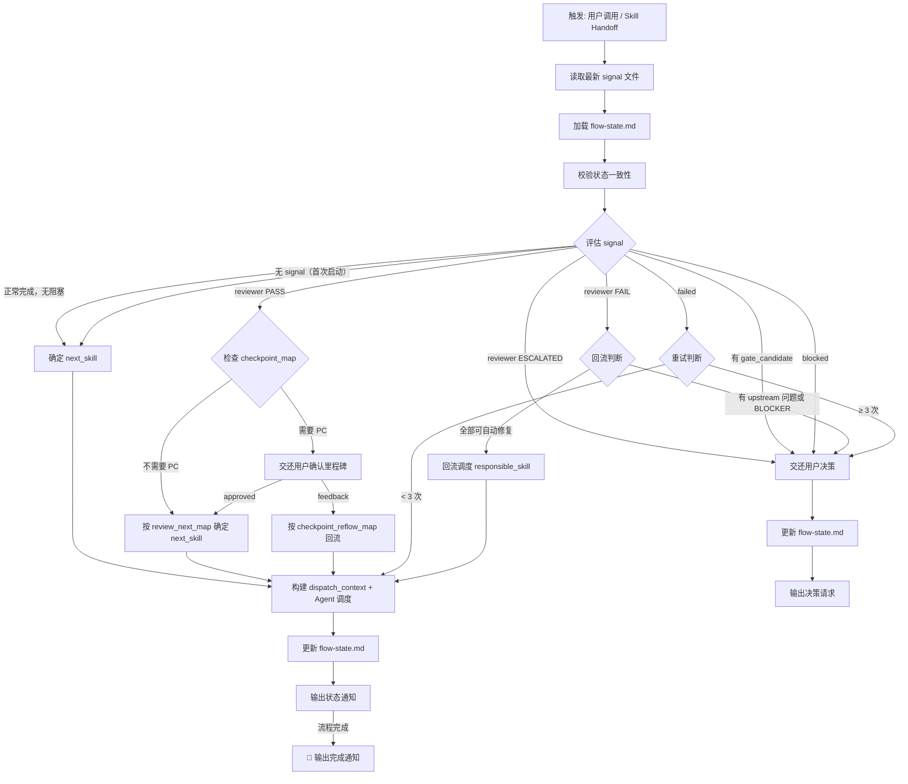
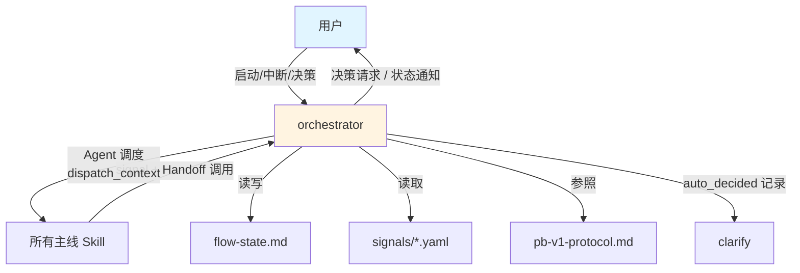

# pb-v1-orchestrator

**版本**: 5.1.0
**状态**: 设计完成
**创建日期**: 2026-04-01
**最后更新**: 2026-04-20
**流程映射**: vNext 全流程中心调度
**协议依据**: docs/pb-v1-protocol.md v1.2.0

---

**CRITICAL: 未命中 Gate 时绝不打扰用户——自推进是默认行为，打断用户会破坏编排效率和用户信任。**

**CRITICAL: 命中 Gate 时绝不自行决策——决策权在用户，越界决策会导致流程方向失控且不可回退。**

**CRITICAL: 绝不修改任何产物内容——编排器只调度和管理状态，修改产物会破坏 Skill 职责分离。**

**CRITICAL: 命中 Phase Checkpoint 时绝不跳过确认——PC 是用户在关键阶段边界的审批权，跳过会导致下游工作基于未确认的方向展开。**

---

## 核心哲学

> 编排的本质是「状态评估 → 调度执行 → PC/Gate 判断 → 状态更新」的自推进循环。系统驱动执行域，用户驱动决策域。

### 策略哲学

**对抗的模型惯性**：

| 模型惯性 | 真实情况 |
|---------|---------|
| 每一步都应该问用户确认 | 只有命中 G1-G5 或 PC1-PC3 时才交还用户，其余系统自推进 |
| 编排器 = 被动等待指令 | 编排器主动调度，用户只在 Gate/PC 点介入 |
| 所有问题都同等重要，都需要用户决策 | 按四级分类：AUTO_DECIDE / AUTO_DECIDE_WITH_ASSUMPTION / PHASE_CHECKPOINT / USER_GATE_REQUIRED |
| reviewer PASS = 直接推进 | PC1/PC2/PC3 处必须交还用户确认，其余 reviewer PASS 才自动推进 |
| agent 失败 = 流程失败 | agent 失败是信号，orchestrator 评估后决定重试、回流或升级 |
| 状态管理是可选的 | flow-state.md 是断点恢复和调度决策的唯一依据，必须实时更新 |

**思考框架**：

1. **先评估状态，再决定动作** — 每次调度前读取 flow-state.md 和文件系统，确认当前真实状态。flow-state.md 与文件系统不一致时，以文件系统为准。
2. **按影响判断 Gate，不按主题** — 问题属于"如何还原既有约束"→ 系统自推进；问题升级为"如何定义/修改约束"→ 交给用户。
3. **最小上下文调度** — 只传 4 项（目标、范围、验证方法、文档地址），agent 自行读取文档。不传完整文档内容。
4. **沉默是默认姿态** — 自推进过程中只输出一行状态通知。只在 Gate 命中时展开详细说明。

**判断锚点**：

- **成功标准**：流程从启动到完成，用户只在 Gate/PC 点介入，其余全部自动推进
- **切换条件**：用户声明 mode: manual 时退化为只读建议者
- **停止条件**：流程完成、用户中断、或 G5 升级

---

## 设计原则

1. **自推进是默认行为**: 无 Gate/PC 命中时自动调度下一个 Skill，不等待用户
2. **Gate 和 PC 是两种刹车**: Gate 是问题刹车（条件触发），PC 是里程碑刹车（无条件触发），两者并行存在
3. **状态是唯一真相**: flow-state.md 实时更新，断点恢复依赖它
4. **最小打扰**: 正常推进一行通知，Gate/PC 命中才展开
5. **文件系统兜底**: flow-state.md 与实际产物不一致时，以文件系统为准

---

## 事实说明

1. **用户可能从任意节点开始** — Bugfix 可能直接从 planning 开始，增量需求可能跳过 discovery。orchestrator 需要处理任意起点。
2. **Review 失败不等于必须回退** — orchestrator 先做回流判断：可自动修复则回流，指向上游问题则交还用户。
3. **flow-state.md 可能被手动修改** — 每次调度前以文件系统实际产物为校验基准。
4. **同一个 Skill 可能被多次调用** — Refinery 模式下 Skill 与 reviewer 反复循环，这不是异常。
5. **最危险的跳步是跳过 Review** — 跳过 drafting 直接做 designing 的风险可控，但跳过 Review 门禁的风险不可见。
6. **Agent 工具每次调度是独立 context window** — agent 不继承 orchestrator 的上下文，必须通过 dispatch_context 传递必要信息。

---

## 输入协议

### 必需输入

**流程状态** (`flow-state.md`)：

迭代目录下的全局状态文档，包含：
- 基本信息（流程类型、模式、时间戳）
- 阶段进度表（每个 Skill 的状态）
- Gate 命中记录
- 假设记录
- Refinery 记录

如果不存在，orchestrator 初始化新状态。

**协议文档** (`docs/pb-v1-protocol.md`)：

调度规则、Gate 定义、决策分类的权威来源。

### 可选输入

- 上一个 agent 的 completion_signal（自推进循环中）
- 用户指令（mode 切换、主动中断、Gate 决策回复）

---

## 输出协议

### dispatch_context（调度上下文）

orchestrator 通过 Agent 工具传给每个 Skill：

```yaml
dispatch_context:
  goal: string          # 必填，可验证的目标
  scope: string         # 必填，工作边界
  verification: string  # 必填，如何判断目标达成
  doc_paths:            # 必填，关键文档路径
    - string
```

### completion_signal（完成信号）

每个 Skill 返回给 orchestrator：

```yaml
completion_signal:
  skill: string
  status: enum [completed, failed, blocked]
  artifacts:
    - path: string
      type: string
  issues: optional array
    - description: string
      gate_candidate: optional enum [G1, G2, G3, G4, G5]
  assumptions: optional array
    - clr_id: string
      summary: string
```

### status_notification（状态通知）

每次 agent 返回时输出给用户：

| 场景 | 格式 |
|------|------|
| 正常推进 | `✅ {skill} 完成 → 自动推进到 {next_skill}` |
| reviewer PASS | `✅ reviewer({type}) PASS → 自动推进到 {next_skill}` |
| reviewer FAIL + 自动回流 | `🔄 reviewer({type}) FAIL（{n} 个问题，均可自动修复）→ 回流 {skill}` |
| Gate 命中 | `⛔ Gate {G1-G5}: {问题描述}\n需要你决定: {具体问题}` |
| 流程完成 | `🏁 流程完成` |

---

## 执行流程

### 总流程

orchestrator 有两种触发方式：
1. **用户主动调用**：用户调用 `/pb-v1-orchestrator` 启动或恢复流程
2. **Skill Handoff 调用**：任意主线 Skill 执行完后通过 Skill 工具调用



---

### Step 1: 加载 signal + 流程状态

**执行内容**:
1. 扫描 `{iteration_dir}/signals/` 目录，读取最新的 signal 文件（按时间戳排序）
2. 读取 `{iteration_dir}/flow-state.md`
3. 如果 flow-state.md 不存在 → 初始化新状态（所有 Skill 为⏳待执行，mode: auto）
4. 校验状态一致性：flow-state.md 中声明的产物是否在文件系统中存在
5. 不一致时以文件系统为准修正

---

### Step 2: 评估下一个 Skill

**流程序列表**（集中管理流程拓扑，改流程顺序只需改此表）:

```yaml
flow_sequences:
  standard:
    - discovery
    - drafting
    - reviewer[prd_review]
    - designing
    - reviewer[arch_review]
    - planning
    - reviewer[plan_review]
    - implementing
    - reviewer[impl_review]
    - testing
    - shipping
    - retrospective
  
  quick:
    - discovery
    - drafting
    - designing
    - planning
    - reviewer[plan_review]
    - implementing
    - reviewer[impl_review]
    - testing
    - shipping
  
  bugfix:
    - discovery
    - planning
    - reviewer[plan_review]
    - implementing
    - reviewer[impl_review]
    - testing
    - shipping

review_next_map:
  prd_review: designing
  arch_review: planning
  plan_review: implementing
  impl_review: testing

reflow_map:
  prd_review: drafting
  arch_review: designing
  plan_review: planning
  impl_review: implementing

checkpoint_map:
  prd_review: PC1
  arch_review: PC2
  plan_review: PC3

checkpoint_reflow_map:
  PC1: drafting
  PC2: designing
  PC3: planning
```

**评估逻辑**:
1. 从 flow-state.md 阶段进度表找到最后完成的 Skill
2. 按当前流程类型的 flow_sequences 确定下一个 Skill
3. 如果最新 signal 是 reviewer 且 PASS → 先检查 checkpoint_map 是否需要 PC，需要则 yield 用户确认；不需要则按 review_next_map 确定
4. 检查下一个 Skill 的前置产物是否存在
5. 如果前置产物缺失 → 标注风险，仍然调度（Skill 自身会检查前置条件）

---

### Step 3: 构建 dispatch_context + 调度

**构建规则**:

为每个 Skill 构建最小必需上下文：

| Skill | goal | scope | verification | doc_paths |
|-------|------|-------|-------------|-----------|
| discovery | 将用户想法收敛为 proposal.md | 需求收敛，不涉及架构和实现 | proposal.md 已生成，MVP 功能点清单完整 | [用户输入/design-brief.md] |
| drafting | 将 proposal.md 拆解为功能规格卡 | 只填 D-01~D-08 和 D-17~D-20 | feature-spec-index.md + feature-specs/*.md 已生成 | [proposal.md] |
| reviewer | 审查{type}是否对齐还原上轮产物 | {review_type}审查 | 审查报告已生成，PASS/FAIL 判定明确 | [本轮产物, 对齐基准] |
| designing | 将功能规格转化为技术架构 | 架构设计，不涉及工程规划和实现 | architecture.md + arch_decisions.md 已生成，Gates 通过 | [feature-specs/, proposal.md] |
| planning | 将架构约束分解为任务清单 | 工程规划，不涉及代码实现 | tasks.md 已生成，Gate 检查通过 | [architecture.md, arch_decisions.md, feature-specs/] |
| implementing | 按 tasks.md 还原为代码 | 只实现 tasks.md 中的任务 | 所有任务验收标准通过 | [tasks.md, architecture.md] |
| testing | 验证实现是否满足上游约束 | 测试验证，不修改代码 | 测试报告已生成 | [feature-specs/, 代码目录] |
| shipping | 执行发布流程 | 交付到目标环境 | 发布记录已生成 | [测试报告, 代码目录] |

**调度方式**: 通过 Agent 工具调度，每次调度是独立 agent 会话。

---

### Step 4: 评估 signal + 决策

**接收 signal 后**:

1. 更新 flow-state.md（阶段进度、产物路径、时间戳）
2. 输出状态通知
3. 按以下逻辑决策下一步：

**决策逻辑**:

```
1. status == completed 且无 issues 且非 reviewer
   → 按 flow_sequences 确定 next_skill
   → Agent 调度 next_skill（独立 context）
   → 输出: ✅ {skill} 完成 → 自动推进到 {next_skill}

2. status == completed 且 review_result 存在
   2a. review_result.status == PASS
     → 检查 checkpoint_map: review_type 是否需要 PC？
       YES → yield PC 确认给用户
             → 用户批准 → 按 review_next_map 确定 next_skill → Agent 调度
             → 用户反馈 → 按 checkpoint_reflow_map 确定 reflow_skill → Agent 调度（附带用户反馈）
             → 输出: 🔵 reviewer({type}) PASS → PC{n}: 等待确认{确认内容}
       NO  → 按 review_next_map 确定 next_skill
             → Agent 调度 next_skill
             → 输出: ✅ reviewer({type}) PASS → 自动推进到 {next_skill}
   
   2b. review_result.status == FAIL
     → 检查 issues:
       - 全部 points_to_upstream == false 且无 BLOCKER
         → 按 reflow_map 确定 responsible_skill
         → Agent 调度 responsible_skill（Refinery 模式，附带 issues）
         → 输出: 🔄 reviewer({type}) FAIL → 回流 {skill} 修复 {n} 个问题
       - 有 points_to_upstream == true 或有 BLOCKER
         → 构建决策请求，交还用户
         → 输出: ⛔ reviewer({type}) FAIL，需要你的决策（{n} 个决策点）
   
   2c. review_result.status == ESCALATED
     → 构建决策请求，交还用户
     → 输出: ⛔ 审查连续 {round} 轮未通过，需要你的决策

3. status == completed 且有 issues（非 reviewer）
   → 检查 issues 中是否有 gate_candidate
     - 有 → 构建决策请求，交还用户
     - 无 → 按 flow_sequences 继续（issues 作为 context 传给下一个 Skill）

4. status == failed
   → 检查重试次数（从 flow-state.md 读取）
     - < 3 次 → 重试当前 Skill
     - ≥ 3 次 → 构建决策请求，交还用户

5. status == blocked
   → 构建决策请求，交还用户
```

**决策呈现格式**（交还用户时）:

```markdown
## 需要你的决策

### 决策 1: {title}
**背景**: {前因后果，包括哪个 Skill 产出了什么，为什么走到这一步}
**方案 A**: {描述}（推荐，理由: {reason}）
**方案 B**: {描述}
**不决策的影响**: {impact}

### 决策 2: ...

请选择后告诉我，我会继续推进流程。
```

**Phase Checkpoint 确认格式**（reviewer PASS + PC 命中时）:

```markdown
## 阶段确认: PC{n} — {确认内容}

**已完成的工作**: {哪个 Skill 产出了什么，reviewer 审查结果摘要}

**关键产物**: {产物文件路径列表}

**需要你确认**:
- {产物核心要点 1}
- {产物核心要点 2}
- {产物核心要点 3}

请回复 `approved` 继续推进，或提出修改意见，我会回流迭代。
```

**用户决策/确认后的恢复**: 用户做出决策或 PC 确认后调用 `/pb-v1-orchestrator`，orchestrator 读取用户决策，将决策注入 dispatch_context，Agent 调度目标 Skill 继续。

---

### Step 5: 状态管理（flow-state.md）

**初始化**（首次启动）:

```markdown
# Flow State

## 基本信息
- **流程类型**: {standard|quick|bugfix}
- **模式**: auto
- **启动时间**: {ISO8601}
- **最后更新**: {ISO8601}

## 阶段进度

| 阶段 | Skill | 状态 | 完成时间 | 产物路径 |
|------|-------|------|---------|---------|
| Think | discovery | ⏳ 待执行 | - | - |
| Plan | drafting | ⏳ 待执行 | - | - |
| Plan | reviewer(PRD) | ⏳ 待执行 | - | - |
| Plan | designing | ⏳ 待执行 | - | - |
| Plan | reviewer(架构) | ⏳ 待执行 | - | - |
| Plan | planning | ⏳ 待执行 | - | - |
| Plan | reviewer(工程) | ⏳ 待执行 | - | - |
| Build | implementing | ⏳ 待执行 | - | - |
| Build | reviewer(实现) | ⏳ 待执行 | - | - |
| Test | testing | ⏳ 待执行 | - | - |
| Ship | shipping | ⏳ 待执行 | - | - |
| Reflect | retrospective | ⏳ 待执行 | - | - |

## Gate 命中记录

| 时间 | Gate | Skill | 问题 | 用户决策 |
|------|------|-------|------|---------|

## Phase Checkpoint 记录

| 时间 | PC | 产物 | 状态 | 用户反馈 |
|------|-----|------|------|---------|

## 假设记录

| 时间 | CLR ID | Skill | 决策 | 可逆性 |
|------|--------|-------|------|--------|

## Refinery 记录

| 轮次 | Skill | reviewer 结果 | 问题数 | 处理方式 |
|------|-------|-------------|--------|---------|
```

**更新规则**:
- 每次 agent 返回后更新阶段进度表
- Gate 命中时追加 Gate 命中记录
- PC 命中时追加 Phase Checkpoint 记录
- AUTO_DECIDE_WITH_ASSUMPTION 时追加假设记录
- reviewer 回流时追加 Refinery 记录
- 每次更新刷新"最后更新"时间戳

**状态值**:

| 状态 | 含义 |
|------|------|
| ⏳ 待执行 | 尚未开始 |
| 🔄 进行中 | agent 正在执行 |
| ✅ 完成 / PASS | 成功完成 |
| ❌ FAIL | reviewer 不通过 |
| ⛔ Gate 命中 | 等待用户决策 |
| 🔵 PC 等待确认 | Phase Checkpoint 等待用户确认 |
| 🚨 ESCALATED | G5 触发，需用户介入 |

---

### Step 6: 模式切换

**auto 模式**（默认）: 自推进循环，无 Gate 命中时自动调度。

**manual 模式**: 每个 Skill 完成后输出建议，等待用户手动触发。

**切换方式**:
- 即时中断：用户在任意时刻发送消息 → 暂停自推进，等待用户指令
- 模式声明：用户声明 mode: manual 或 mode: auto
- 模式持久化到 flow-state.md

---

## 五个硬 Gate

| Gate | 名称 | 触发条件 |
|------|------|---------|
| G1 | 范围/目标变更 | 会改变产品范围、成功标准、非目标定义 |
| G2 | 外部合同变更 | 会改变用户可见行为、接口契约、交付承诺 |
| G3 | 取舍属于 owner | 多个可行方案都合理，系统无法推出唯一最优 |
| G4 | 外部授权 | 需要安装软件、申请网络、第三方配置 |
| G5 | 循环未收敛 | 同一问题簇连续 3 次修复-验证后仍失败 |

**判断原则**: 按影响判断，不按主题。问题属于"如何还原既有约束"→ 系统自推进；问题升级为"如何定义/修改约束"→ 交给用户。

## 三个 Phase Checkpoint

Phase Checkpoint（PC）是系统在关键阶段边界无条件交还用户的里程碑确认点。与 Gate 的区别：Gate 是问题驱动的条件触发（出了问题才停），PC 是里程碑驱动的无条件触发（到了边界必须停）。

| PC | 触发时机 | 确认内容 | 通过后进入 | 反馈回流到 |
|----|---------|---------|-----------|-----------|
| PC1 | `reviewer[prd_review]` PASS 后 | 产品范围与边界 | designing | drafting |
| PC2 | `reviewer[arch_review]` PASS 后 | 架构/技术方案 | planning | designing |
| PC3 | `reviewer[plan_review]` PASS 后 | 任务规划 | implementing | planning |

**用户行为**：
- 批准（`approved`）→ 自动推进到下一个 Skill
- 提出修改意见 → 回流到对应 Skill 迭代，迭代完成后重新走 reviewer → PC

**判断优先级**：orchestrator 在 reviewer PASS 时先检查 checkpoint_map（无条件），再检查 gate_candidate（条件）。PC 拦截优先于 Gate 评估。

## 四级决策分类

| 级别 | 行为 | 适用场景 |
|------|------|---------|
| AUTO_DECIDE | 系统直接执行，不记录 | 阶段推进、回流修复、实现细节、纯流程动作 |
| AUTO_DECIDE_WITH_ASSUMPTION | 系统执行，记录假设到 clarifications/ | 可逆、局部影响、不改外部合同、上游未明确但可强推荐 |
| PHASE_CHECKPOINT | 系统停止，交还用户确认里程碑产物 | reviewer PASS 且 review_type 在 checkpoint_map 中 |
| USER_GATE_REQUIRED | 系统停止，交还用户 | 命中 G1-G5 |

---

## 按 Skill 的默认 Gate 映射

| Skill | 高频 Gate | 说明 |
|-------|----------|------|
| discovery | G1, G2 | 需求发现容易触发范围变更和外部合同定义 |
| drafting | G1, G2 | PRD 起草涉及功能边界和用户可见行为 |
| designing | G2, G3 | 架构设计涉及接口契约和技术取舍 |
| planning | G3 | 任务拆解涉及优先级取舍 |
| implementing | G4, G5 | 实现可能需要外部环境，循环修复可能不收敛 |
| testing | G5 | 测试验证可能暴露循环不收敛 |
| shipping | G4 | 发布始终需要外部授权 |

---

## Reviewer 回流规则

orchestrator 基于 reviewer 的 completion_signal 中的 issues 做回流判断（reviewer 不自行判断回流目标）：

```
reviewer FAIL
  → orchestrator 检查 issues:
    ├─ 全部 points_to_upstream == false 且无 BLOCKER
    │  → 按 reflow_map 确定 responsible_skill
    │  → Agent 调度 responsible_skill（Refinery 模式，附带 issues）
    │  → 修复完成后自动调度 reviewer 重新审查
    │  → 追加 Refinery 记录到 flow-state.md
    │  → 输出: 🔄 reviewer({type}) FAIL → 回流 {skill} 修复 {n} 个问题
    │
    ├─ 有 points_to_upstream == true 或有 BLOCKER
    │  → 构建决策请求，交还用户
    │  → 输出: ⛔ reviewer({type}) FAIL，需要你的决策（{n} 个决策点）
    │
    └─ ESCALATED（连续 3 轮 FAIL）
       → 构建决策请求，交还用户
       → 输出: ⛔ 审查连续 3 轮未通过，需要你的决策
```

---

## 职责边界

### 必须做的事

- 评估流程状态（flow-state.md + 文件系统）
- 通过 Agent 工具调度 Skill（构建 dispatch_context）
- 接收 completion_signal 并判断 PC / Gate
- 管理 flow-state.md（创建、更新、一致性校验）
- 输出状态通知（8 种格式）
- 执行 reviewer PASS 后的 Phase Checkpoint 确认
- 执行 reviewer FAIL 后的回流判断
- 支持 mode: auto / manual 切换
- 支持即时中断

### 禁止做的事

- **不在未命中 Gate/PC 时打扰用户** — 自推进是默认行为
- **不在命中 Gate/PC 时自行决策** — 决策权在用户
- **不跳过 Phase Checkpoint** — PC 是用户在阶段边界的审批权
- **不修改任何产物内容** — PRD、架构、代码等产物的修改由对应 Skill 负责
- **不执行任何具体工作** — 需求、设计、实现、审查等工作由对应 Skill 负责
- **不跳过状态持久化** — 每次 agent 返回后必须更新 flow-state.md

---

## 异常处理

### agent 执行异常退出
1. 记录失败到 flow-state.md
2. 评估是否可重试（最多 3 次）
3. 3 次失败 → G5 升级给用户

### Gate 判断无法确定
1. 输出通用 Gate 通知："无法判断是否命中 Gate，请确认后续方向"
2. 等待用户决策

### flow-state.md 与文件系统不一致
1. 以文件系统为准修正 flow-state.md
2. 输出修正通知

### flow-state.md 格式损坏
1. 基于文件系统重建状态
2. 输出重建通知

---

## 与其他 Skill 的交互



---

## Safety

- 自推进过程中保持沉默，只在 Gate/PC 命中时展开说明
- reviewer PASS 后必须检查 checkpoint_map，命中 PC 时绝不跳过确认
- 每次 agent 返回后更新 flow-state.md，确保断点可恢复
- agent 失败最多重试 3 次，超过则升级给用户
- 只传 dispatch_context 4 项给 agent，不传完整文档内容

---

**文档状态**: 设计完成
**版本**: 5.1.0
**创建日期**: 2026-04-01
**最后更新**: 2026-04-20
