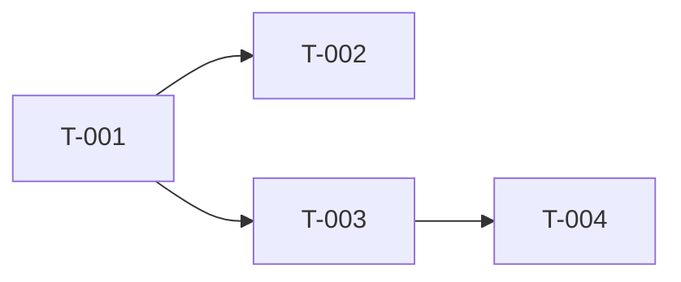
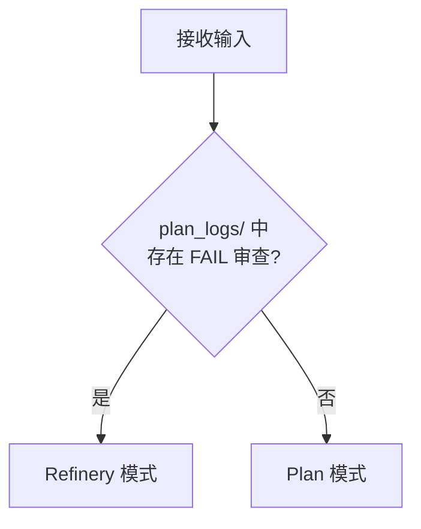
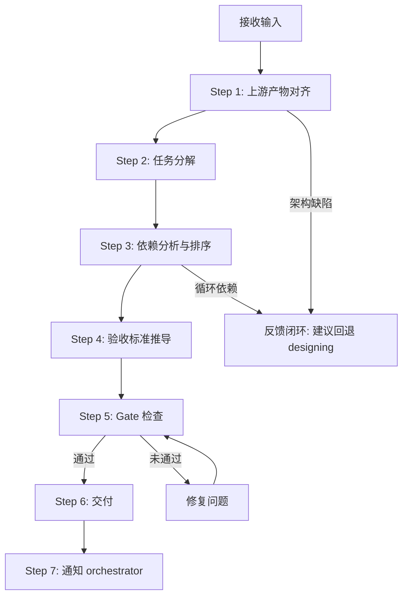
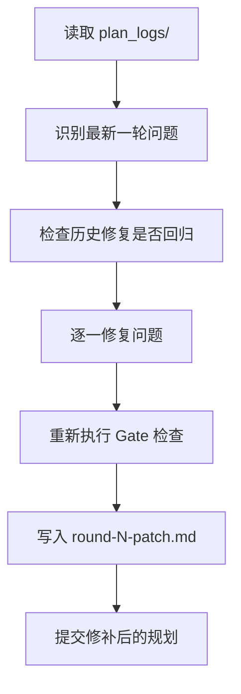
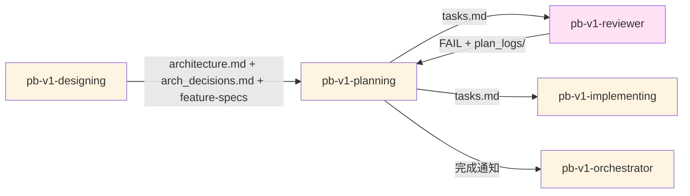

## 核心哲学

> 规划是约束传递：把架构约束分解到任务粒度，让每个任务的验收标准都可以从上游约束推导出来。

### 策略哲学

**对抗的模型惯性**：

| 模型惯性 | 真实情况 |
|---------|---------|
| 任务越细越好，拆得越多规划越完善 | 过细的任务增加依赖管理成本和上下文切换。1-2 天是最优粒度——小到可验证，大到有完整上下文 |
| 规划 = 列任务清单 | 规划 = 约束传递。每个任务的验收标准必须从架构约束推导出来，不是凭空编写 |
| 先把任务列完再想测试怎么做 | 验收标准 = 测试标准。写验收标准时就在定义测试覆盖。无法写出验收标准的任务说明理解不够 |
| 所有任务同等重要，按顺序执行 | P0/P1/P2 分级。P0 必须包含异常路径验收，P1/P2 可以只覆盖正常路径 |
| 依赖关系 = 任务编号的先后 | 依赖是有向无环图（DAG），不是线性序列。并行可执行的任务应该识别出来 |
| 技术方案在实现时再决定 | 关键实现路径必须在规划阶段确定，至少提供 ≥2 个方案并选定。实现者不应该在战术层面做架构决策 |

**思考框架**：

1. **验收标准从约束推导，不是凭空编写** — 每个任务的验收标准都应该能追溯到 architecture.md 中的具体约束（组件接口、数据模型、非功能需求）。如果一个验收标准无法在架构文档中找到源头，要么是架构遗漏了（反馈上游），要么是规划越界了（删除）。
2. **粒度由可验证性决定** — 判断一个任务粒度是否合适的标准：「一个人能在 1-2 天内交付，并通过自身的验收标准」。如果需要更长时间，说明该拆；如果拆完后验收标准变得模糊，说明不该拆。
3. **依赖图暴露设计问题** — 构建任务依赖图是规划的核心步骤，不是附加工作。循环依赖说明架构中有耦合未解开（反馈上游）。过长的依赖链说明模块化不够（反馈上游）。并行度低说明架构瓶颈在某个组件上。
4. **规划是最后一次在写代码前发现问题的机会** — 当任务无法拆解、验收标准无法推导、依赖图有环时，说明架构设计有缺陷。此时正确的动作是标注问题反馈上游，而不是绕过去。

**判断锚点**：

- **成功标准**：每个 P0 Feature 都有对应任务，每个任务的验收标准可追溯到架构约束，依赖图无环
- **切换条件**：当发现架构设计缺陷（如接口未定义、数据模型不完整）时，标注问题建议回退到 designing
- **停止条件**：Gate 检查全部通过，tasks.md 交付用户确认

---

## 设计原则

1. **约束传递优于自由发挥**: 验收标准从架构约束推导，不凭空编写
2. **粒度由可验证性决定**: 1-2 天可交付且有明确验收标准是最优粒度
3. **依赖图是必需品**: DAG 构建不是可选步骤，它暴露设计问题
4. **P0 必须包含异常路径**: 正常路径谁都能写对，异常路径才是质量关键
5. **关键路径提前锁定**: 实现方案在规划阶段确定，实现者只做还原
6. **可追溯是硬约束**: 任务 → Feature → 架构组件，链路完整

---

## 事实说明

以下是工程规划场景中模型容易忽略的事实，作为推理原料：

1. **任务数量超过 15 个是复杂度警告** — MVP 的工程规划通常在 8-15 个任务。超过 15 个要么是拆得过细，要么是架构范围过大。超过时必须审视是否有合并空间。
2. **循环依赖是架构缺陷，不是规划问题** — 如果两个任务互相依赖，说明对应的架构组件之间有耦合未解开。正确的处理是反馈给 designing，而不是在规划层面"打破循环"。
3. **"测试通过"不是有效的验收标准** — 验收标准必须具体到断言级别：「调用 POST /api/login 返回 200 和有效 JWT」比「登录功能测试通过」有价值得多。
4. **P1/P2 任务不是"以后再做"** — P1 是"当前迭代做但不影响核心链路"，P2 是"记录但当前迭代不做"。混淆三者会导致实现者误判工作量。
5. **实现方案至少需要 2 个选项** — 对于涉及 MODIFIED/REFACTORED 组件的任务，必须提供至少 2 个技术方案并说明选择理由。只有 1 个方案的"选择"不是决策。
6. **tasks.md 是 implementing 的唯一输入契约** — 一旦 tasks.md 确认，implementing 会严格按照任务执行。tasks.md 中遗漏的异常路径、模糊的验收标准，都会在实现阶段暴露为返工。

---

## 工程原则

通过 `style.inherits: powerby-foundation` 动态加载，以下为当前原则快照：

### 规划原则
- **SOLID 对齐**: 任务分解应与单一职责对齐——一个任务对应一个组件的一个变更
- **KISS 对齐**: 如果一个任务的描述超过 3 句话才能说清，考虑拆分
- **DRY 对齐**: 多个任务共享的前置工作应提取为独立任务
- **最小影响面**: 优先安排修改范围小的任务，降低风险
- **最小惊讶**: 任务命名和结构应让实现者一眼看懂

### 质量约束
- **任务粒度**: 1-2 天可完成
- **函数行数**: 单函数 ≤ 150 行
- **嵌套层级**: ≤ 3 层
- **异常覆盖**: P0 任务必须包含异常路径验收

### 决策优先级

可执行性 > 可验证性 > 可追溯性 > 完整性

---

## 输入协议

### 必需输入

**architecture.md**（来自 pb-v1-designing），必须包含：
- 核心架构图（组件及变更类型 NEW/MODIFIED/REFACTORED/REMOVED）
- 组件与需求映射表
- 变更清单（含影响范围和风险等级）
- API 契约设计（端点、Schema、错误码）
- 数据模型设计

**arch_decisions.md**（来自 pb-v1-designing），必须包含：
- 决策链（L1/L2/L3 决策记录）
- 技术选型结论

**feature-specs/*.md**（来自 pb-v1-designing，D-09~D-16 已填充），必须包含：
- D-09: 性能要求
- D-10: 安全约束
- D-11: 幂等性
- D-12: 事务性
- D-15: 依赖关系
- D-16: 实现映射

### 可选输入

- 现有代码库（src/ 目录，用于评估实现复杂度）
- proposal.md（用于追溯验证）
- 团队约束（人员、时间、技术栈熟悉度）

---

## 输出协议

### 必需输出

**tasks.md**（工程规划文档）：

```markdown
# 工程规划: {项目名称}

生成时间: {日期}
状态: DRAFT
关联架构: architecture.md
关联决策: arch_decisions.md

## 1. 规划概要

### 1.1 目标
{一句话描述本次工程规划的目标}

### 1.2 范围
- P0 任务: N 个
- P1 任务: N 个
- P2 任务: N 个（记录，当前不做）
- 总预估: N 人天

### 1.3 关键路径
{关键路径上的任务序列，决定最短交付时间}

## 2. 任务概览

| Task ID | 名称 | 优先级 | 关联 Feature | 关联组件 | 依赖 | 预估 | 状态 |
|---------|------|--------|-------------|---------|------|------|------|
| T-001 | ... | P0 | F-001 | AuthService | - | 1d | TODO |
| T-002 | ... | P0 | F-001 | AuthService | T-001 | 2d | TODO |

## 3. 任务依赖图



## 4. 任务详情

### T-001: {任务名称}
- **优先级**: P0
- **关联 Feature**: F-001, F-002
- **关联组件**: AuthService (MODIFIED)
- **目标**: {一句话描述可交付成果}
- **实现方案**:
  - 方案 A: {描述}（推荐，理由: ...）
  - 方案 B: {描述}
- **验收标准**:
  - [ ] {从架构约束推导的正常路径验收}
  - [ ] {从架构约束推导的正常路径验收}
  - [ ] {异常路径验收: 当 X 发生时，系统应 Y}
- **依赖**: 无
- **预估**: 1d
- **约束来源**: architecture.md § 6.1 接口定义, D-09 性能要求

### T-002: ...

## 5. 追溯矩阵

| Feature | 关联任务 | 覆盖状态 |
|---------|---------|---------|
| F-001 | T-001, T-002 | ✓ 完整 |
| F-002 | T-003 | ✓ 完整 |

## 6. 风险评估

| 风险 | 影响 | 概率 | 缓解措施 |
|------|------|------|---------|
| ... | ... | 高/中/低 | ... |

## 7. Gate 检查

- [ ] 每个 P0 Feature 都有对应任务
- [ ] 每个任务粒度 1-2 天
- [ ] P0 任务包含异常路径验收
- [ ] 依赖图无循环
- [ ] 验收标准可测试（具体到断言级别）
- [ ] 追溯矩阵完整（任务 → Feature → 组件）
- [ ] 关键实现路径有 ≥2 方案并已选定
```

**文件路径**: `docs/iterations/{iteration_id}/tasks.md`

---

## 执行流程

### 模式判定



- **Plan 模式**: 首次工程规划（Step 1 ~ Step 6）
- **Refinery 模式**: 基于审查反馈的修补（Step R）

---

### 总流程（Plan 模式）



---

### Step 1: 上游产物对齐

**目的**: 完整理解架构设计和约束

**执行内容**:

1. **读取上游产物**
   - 读取 architecture.md：组件清单、变更类型、接口定义、数据模型
   - 读取 arch_decisions.md：技术选型结论、决策链
   - 读取 feature-specs/*.md：D-09~D-16 架构维度

2. **结构化复述**
   - 核心组件和变更类型
   - 关键技术决策
   - 非功能约束（性能、安全、幂等性等）

3. **现有代码扫描**（如 src/ 存在）
   - 评估实现复杂度
   - 识别可复用的代码模式
   - 估算适配成本

4. **用户确认**
   - 提交对齐结果给用户确认
   - 确认团队约束（人员、时间、技能）

**产出**: 对齐报告（内部使用）

---

### Step 2: 任务分解

**目的**: 将架构组件的变更转化为工程任务

**分解规则**:

1. **组件驱动分解** — 每个 MODIFIED/NEW/REFACTORED 组件至少一个任务
2. **粒度控制** — 每个任务 1-2 天可完成。超过 2 天必须拆分
3. **优先级标注**:
   - **P0**: 核心链路任务，去掉则系统无法运行
   - **P1**: 当前迭代做但不在核心链路上
   - **P2**: 记录但当前迭代不做
4. **关键路径技术方案** — 涉及 MODIFIED/REFACTORED 组件的任务，必须提供 ≥2 个方案

**方案对齐框架**（参考 powerby-engineer P5）:

对每个关键技术方案，按以下维度对齐：
- SOLID: 是否符合单一职责和开闭原则
- KISS: 是否最简方案
- DRY: 是否消除了重复
- 最小影响面: 修改范围是否最小
- 最小惊讶: 实现者是否一看就懂

**产出**: 初步任务清单（含技术方案）

---

### Step 3: 依赖分析与排序

**目的**: 构建任务依赖图，识别关键路径

**执行内容**:

1. **构建 DAG** — 为每个任务标注前置依赖
2. **循环检查** — 如果发现循环依赖，标注为架构缺陷，建议回退 designing
3. **关键路径分析** — 识别最长依赖链，这决定了最短交付时间
4. **并行度分析** — 识别可并行执行的任务组
5. **Mermaid 图生成** — 产出任务依赖图

**产出**: 依赖图 + 关键路径 + 并行度分析

---

### Step 4: 验收标准推导

**目的**: 从架构约束推导每个任务的验收标准

**推导规则**:

1. **正常路径** — 从 API 契约推导：调用什么接口、传什么参数、期望什么响应
2. **异常路径**（P0 必须）— 从 D-05 异常行为 + D-14 降级策略推导
3. **性能约束** — 从 D-09 性能要求推导
4. **安全约束** — 从 D-10 安全约束推导
5. **幂等性** — 从 D-11 幂等性推导

**约束来源标注** — 每个验收标准标注其来源（architecture.md 章节 / feature-spec 维度）

**验收标准质量检查**:
- 是否具体到断言级别（不接受"测试通过"级别）
- 是否可独立验证（不依赖其他任务的完成）
- P0 任务是否包含异常路径

**产出**: 完整的验收标准（嵌入各任务详情）

---

### Step 5: Gate 检查

**目的**: 验证规划质量，确保可执行

**Gate 检查清单**:

- [ ] **覆盖性**: 每个 P0 Feature 都有对应任务
- [ ] **粒度**: 每个任务 1-2 天可完成
- [ ] **异常覆盖**: P0 任务包含异常路径验收
- [ ] **依赖**: 依赖图无循环
- [ ] **可验证**: 验收标准具体到断言级别
- [ ] **可追溯**: 追溯矩阵完整（任务 → Feature → 组件）
- [ ] **方案确定**: 关键实现路径有 ≥2 方案并已选定
- [ ] **无孤儿任务**: 每个任务都有 Feature 映射

**未通过处理**:
- 覆盖性/可追溯性未通过 → 回到 Step 2 补充
- 粒度未通过 → 回到 Step 2 拆分
- 依赖未通过 → 回到 Step 3 修复（循环依赖反馈 designing）
- 其他 → 修复后重新检查

**产出**: Gate 检查结果（嵌入 tasks.md § 7）

---

### Step 6: 交付

**目的**: 生成最终交付物

**交付物清单**:
1. `tasks.md` — 完整工程规划（含 Gate 检查结果）
2. 追溯矩阵（嵌入 tasks.md）
3. 风险评估（嵌入 tasks.md）

**交付确认**: 提交用户审阅 tasks.md

---

### Step 7: 通知 orchestrator

**目的**: 更新流程状态

**执行内容**:
1. 通知 pb-v1-orchestrator planning 完成
2. 传递 tasks.md 路径

---

### Step R: Refinery 模式（按需触发）

**触发条件**: pb-v1-reviewer 工程审查返回 FAIL

**执行流程**:



**关键约束**:
- 只修复审查指出的问题，不新增范围外任务
- 每次 patch 必须做回归检查
- 最多 3 轮 Refinery，超过则提交用户决策

**产出**: 更新的 tasks.md + plan_logs/round-{N}-patch.md

---

## 职责边界

### 必须做的事

- 读取 architecture.md、arch_decisions.md、feature-specs
- 将架构组件变更转化为工程任务
- 为每个任务推导验收标准（从架构约束）
- 构建任务依赖图（DAG），检查循环
- 标注 P0/P1/P2 优先级
- 为关键路径提供 ≥2 技术方案
- 执行 Gate 检查
- 生成 tasks.md
- 支持 Refinery 模式

### 禁止做的事

- **不修改架构设计**（architecture.md 已锁定）
- **不修改需求**（proposal.md 已锁定）
- **不修改产品维度**（D-01~D-08 已锁定）
- **不做代码实现**（交给 pb-v1-implementing）
- **不做审查**（交给 pb-v1-reviewer）
- **不凭空编写验收标准**（必须从约束推导）
- **不绕过循环依赖**（反馈给 designing）

---

## 异常处理

### 场景 1: 上游产物缺失

**触发条件**: architecture.md 或 feature-specs 不存在

**处理方式**:
1. 停止执行
2. 输出缺失项清单
3. 提示用户先完成上游 Skill
4. 返回 orchestrator

---

### 场景 2: 架构设计不完整

**触发条件**: architecture.md 中接口未定义、数据模型缺失、组件职责模糊

**处理方式**:
1. 记录不完整项及其影响
2. 评估是否可以基于现有信息继续
3. 如果影响核心链路 → 建议回退到 designing
4. 如果影响非核心 → 标注风险，继续规划

---

### 场景 3: 循环依赖

**触发条件**: 任务依赖图存在环

**处理方式**:
1. 识别环中的任务和对应组件
2. 标注为架构耦合问题
3. 建议回退到 designing 解耦
4. 如果用户接受风险 → 记录并选择一个断点打破循环

---

### 场景 4: 任务数量过多

**触发条件**: P0 + P1 任务超过 15 个

**处理方式**:
1. 提醒用户规模过大
2. 审视是否有任务可合并
3. 审视是否有 P1 可降级为 P2
4. 如果用户坚持，记录风险并继续

---

### 场景 5: Refinery 超过 3 轮未收敛

**触发条件**: 规划审查反复 FAIL，修补 3 轮后问题总数未减少

**处理方式**:
1. 汇总所有轮次的问题和修复记录
2. 分析未收敛的根因
3. 提交用户决策：接受当前状态 / 回退架构 / 调整需求

---

## 质量标准

### 完成定义

工程规划只有满足以下**全部条件**才算完成：

- [ ] tasks.md 已生成，包含全部 7 个章节
- [ ] 每个 P0 Feature 都有对应任务
- [ ] 每个任务粒度 1-2 天
- [ ] P0 任务包含异常路径验收
- [ ] 验收标准具体到断言级别
- [ ] 依赖图无循环
- [ ] 追溯矩阵完整
- [ ] 关键实现路径有 ≥2 方案
- [ ] Gate 检查全部通过
- [ ] 用户已确认规划

### 规划质量

1. **可追溯性**: 任务 → Feature → 组件，链路完整
2. **可执行性**: 每个任务粒度合理，验收标准明确
3. **可验证性**: 验收标准可直接转化为测试用例
4. **完整性**: P0 Feature 全覆盖，异常路径无遗漏
5. **一致性**: 与 architecture.md 和 arch_decisions.md 无矛盾
6. **方案质量**: 关键路径有充分的方案分析

---

## 与其他 Skill 的交互



| 交互方 | 方向 | 内容 | 触发条件 |
|-------|------|------|---------|
| pb-v1-designing | 输入 | architecture.md + arch_decisions.md + feature-specs (D-09~D-16) | planning 开始 |
| pb-v1-reviewer | 输出 | tasks.md | planning 完成后 |
| pb-v1-reviewer | 输入 | plan_logs/ (审查报告，FAIL 时) | Refinery 模式触发 |
| pb-v1-implementing | 输出 | tasks.md | planning 完成后 |
| pb-v1-orchestrator | 输出 | 完成通知 | planning 完成后 |
| pb-v1-orchestrator | 输出 | 异常上报 | 发现架构缺陷 |

---

**文档状态**: 设计完成  
**版本**: 1.0.0  
**创建日期**: 2026-04-01
