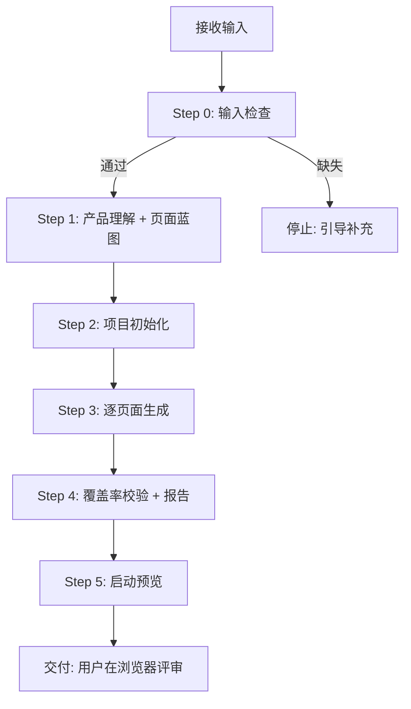
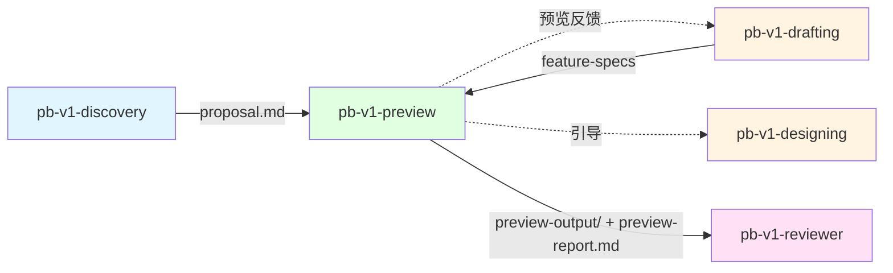

# pb-v1-preview

**版本**: 4.2.0
**状态**: 设计完成
**创建日期**: 2026-04-13
**最后更新**: 2026-04-14
**流程映射**: vNext Plan 阶段（UI 预览侧支）

---

**CRITICAL: 绝不以 Feature 为单元组织页面——Feature 组织模式会让预览变成规格文档的 UI 投影，用户无法评估真实体验。**

**CRITICAL: 绝不在页面中出现开发概念（Feature ID、维度标签、分类标签）——开发概念泄漏会让用户误以为这是技术文档而非产品预览。**

**CRITICAL: 页面模块必须齐全，不得遗漏蓝图中的模块——缺模块的预览会给用户传递错误的产品完整性信号。**

---

## 核心规则

以下 8 条规则替代所有哲学陈述，直接约束执行行为：

1. **真实用户页面优先** — preview-output 中展示的是最终用户会看到的真实页面，而不是评审讲解稿。页面主体只能包含直接服务用户目标的模块。所有评审说明、Feature 覆盖、模块来源、设计意图等信息，必须放在 preview-report.md 或调试模式中，不得默认展示给用户。
2. **产品定义驱动页面结构** — 页面从 proposal.md 的用户旅程推导，不从 Feature 列表推导。一个页面可能融合多个 Feature 的能力。
3. **页面蓝图是生成依据** — 页面蓝图是内部规划产物，不暂停确认，直接驱动代码生成。模块、元素、mock 数据、交互必须齐全。用户在浏览器中评审最终结果。
4. **模块齐全优于视觉精美** — 页面的每个功能模块和 UI 元素都必须存在且可交互。宁可样式粗糙，不可缺少模块。
5. **零开发概念** — 页面中不出现 Feature ID、维度标签、分类标签。所有文案使用产品语言。
6. **Mock 数据要像真的** — mock 数据必须贴近真实业务场景（合理的名称、数量、状态分布），跨页面实体一致。
7. **默认中文界面** — 所有页面文案、按钮、标签、提示信息默认使用中文，方便评审。
8. **评审信息与用户界面隔离** — Feature 覆盖、模块来源、设计意图等内部信息默认不出现在 preview-output 页面中。若确有需要，只能在调试模式下显示（如 `?preview_debug=1`），且默认关闭。正式预览以真实用户界面为准。

---

## 技术栈

- **框架**: Next.js (App Router)
- **样式**: Tailwind CSS
- **组件库**: Shadcn/UI + Radix UI（80% 需求用 Shadcn/UI 覆盖）
- **动效**: Framer Motion（页面切换和关键交互）
- **数据**: Mock Data only，纯前端，无后端依赖

---

## 输入协议

### 必需输入

| 产物 | 路径 | 来源 | 用途 |
|------|------|------|------|
| 产品定义 | `proposal.md` | pb-v1-discovery | 页面结构和用户旅程的设计驱动力 |
| 功能规格索引 | `feature-spec-index.md` | pb-v1-drafting | Feature 列表，用于覆盖率校验 |
| 功能规格卡片 | `feature-specs/*.md` | pb-v1-drafting | D-01~D-08 维度，用于页面模块推导和覆盖率校验 |

### 从输入中提取什么

**proposal.md** → 页面结构的来源：
- 产品定义、目标用户、产品类型
- 核心用户旅程（用户从进入到完成目标的路径）→ 直接决定有哪些页面
- 产品边界 → 决定不做什么

**feature-specs/*.md** → 页面模块的来源：
- D-02 输入规格 → 页面中的表单字段、筛选条件
- D-03 处理逻辑 → 用户操作后的状态切换（mock）
- D-04 输出规格 → 页面中的数据展示结构
- D-05 边界条件 → 空状态、错误状态、加载状态
- D-07 优先级 → P0 必须覆盖，P1 尽量覆盖

---

## 输出协议

### 产出结构

```
preview-output/                  # 真实用户可见页面
├── README.md                    # 启动指南
├── package.json
├── next.config.js
├── tailwind.config.ts
├── tsconfig.json
├── components.json              # Shadcn/UI 配置
├── app/
│   ├── layout.tsx               # 根布局（导航、侧边栏）
│   ├── page.tsx                 # 首页
│   └── [页面路由]/              # 根据内部页面蓝图生成
├── components/
│   └── ui/                      # Shadcn/UI 组件
├── lib/
│   ├── mock-data.ts             # Mock 数据（所有实体）
│   └── utils.ts                 # 工具函数
└── public/

preview-report.md                # 评审报告（承载覆盖率、模块来源、设计意图、问题清单）
```

### preview-report.md 格式

```markdown
# 预览报告

## 产品概要
- **产品**: [一句话定义]
- **目标用户**: [用户画像]
- **迭代范围**: [本次迭代做什么]

## 页面清单

| 页面 | 路径 | 用户目标 | 模块数 | 状态 |
|------|------|---------|--------|------|
| 工作台 | /dashboard | 查看当前状态，找到下一步操作 | 4 | ✓ 完成 |
| ... | ... | ... | ... | ... |

## 模块来源映射

### 工作台 (/dashboard)
- **统计卡片区**: 来自 F-001 (数据概览) D-04 输出规格
- **待办列表**: 来自 F-003 (任务管理) D-04 输出规格
- **快捷操作区**: 来自 F-005 (快速入口) D-02 输入规格
- **设计意图**: 将用户最关心的数据和操作集中在首页，减少跳转

### [其他页面]
...

## 用户旅程验证

| 旅程 | 步骤 | 页面 | 可跳转 | 备注 |
|------|------|------|--------|------|
| 核心流程 | 1. 登录 | /login | ✓ | |
| | 2. 进入工作台 | /dashboard | ✓ | |
| ... | ... | ... | ... | ... |

## Feature 覆盖率

| Feature | 优先级 | 覆盖 | 所在页面 | 备注 |
|---------|--------|------|---------|------|
| 用户登录 | P0 | ✓ | /login | |
| 数据导出 | P1 | - | - | Backend-only，无 UI |
| ... | ... | ... | ... | ... |

## 发现的问题
- [预览过程中发现的规格模糊点、缺失模块等]

## 启动说明
cd preview-output && npm install && npm run dev
# 访问 http://localhost:3000
```

---

## 执行流程

### 总流程



**核心变化**：直接从页面蓝图进入代码生成，无中间确认门禁，用户在浏览器中评审最终结果。

---

### Step 0: 输入检查

**检查项**:
1. `proposal.md` 是否存在 → 不存在则停止，引导执行 `/pb-v1-discovery`
2. `feature-spec-index.md` 是否存在 → 不存在则停止，引导执行 `/pb-v1-drafting`
3. `feature-specs/` 目录是否有文件 → 无文件则停止
4. 可选：检查 `review-logs/prd_review.md` → 不存在则警告（软门禁，不阻塞）

**产出**: 输入就绪确认

---

### Step 1: 产品理解 + 页面蓝图（内部规划，不暂停）

**目的**: 从产品定义推导出页面列表和用户旅程，作为内部规划直接驱动后续生成

**1.1 产品全貌**（从 proposal.md）
- 产品是什么、给谁用、解决什么问题
- 产品类型（B2B / C端 / 内部工具）→ 决定视觉风格
- 核心用户旅程：用户从进入到完成目标的完整路径

**1.2 页面列表**（从用户旅程推导）
- 旅程中的每个步骤 → 一个页面
- 为每个页面定义：路径、名称（产品语言）、用户目标
- 设计页面间的导航关系

**1.3 Feature 挂载**（最后做）
- 读取 feature-spec-index.md，识别 P0/P1 UI Feature
- 将 Feature 挂载到已有页面上（页面先于 Feature 存在）
- 记录未能挂载的 Feature（可能需要新增页面或标记为 Backend-only）

**1.4 Mock 数据实体设计**
- 从页面列表推导核心业务实体（用户、项目、订单等）
- 为每个实体定义字段结构和样本数据
- 确保跨页面实体一致（同一用户在所有页面中数据相同）

**产出**: 内部页面蓝图（页面列表 + 用户旅程 + Feature 挂载映射 + 实体结构）

**自检**: 
- 至少 2 个页面
- 至少 1 条用户旅程可走通
- 所有 P0 UI Feature 已挂载

**注意**: 此步骤产出为内部规划，不输出文件，不暂停确认，直接进入 Step 2。

---

### Step 2: 项目初始化

**目的**: 创建 Next.js 项目骨架

**执行内容**:
1. 创建 `preview-output/` 目录
2. 初始化 Next.js (App Router) + Tailwind CSS + Shadcn/UI
3. 安装常用 Shadcn/UI 组件（Button, Card, Input, Label, Select, Table, Dialog, Alert, Toast, Badge, Tabs, Separator, ScrollArea, Form, DropdownMenu, Sheet）
4. 创建根布局 `app/layout.tsx`（导航结构从页面列表推导）
5. 创建 `lib/mock-data.ts`（从 Step 1 的实体结构生成完整 mock 数据，使用中文）

**关键约束**:
- 最小骨架，不过度工程
- mock 数据必须贴近真实业务场景，使用中文名称
- 所有界面文案默认中文
- 根布局中不包含任何评审辅助入口

**产出**: 可运行的项目骨架 + mock 数据

---

### Step 3: 逐页面生成（核心步骤）

**目的**: 基于页面蓝图，为每个页面生成模块齐全、交互可走通的完整页面

**页面设计思路**:

对每个页面，按以下顺序思考并实现：

1. **用户场景**: 用户在什么情况下来到这个页面，要完成什么
2. **页面布局**: 为达成用户目标，页面需要哪些区域（导航、侧边栏、主内容区）
3. **逐模块设计**: 主内容区拆分为具体模块，每个模块包含：
   - 模块类型（统计卡片、数据表格、表单、操作区、图表区等）
   - 模块内的具体元素（按钮文案、表格列名、表单字段、状态枚举）
   - 模块使用的 mock 数据（具体的样本数据，不是占位符）
4. **交互行为**: 按钮点击去哪、表单提交后什么反馈、筛选如何工作
5. **边界状态**: 空状态、加载状态、错误状态

**模块必要性判定**:

每个页面模块必须满足以下至少一项，否则不得出现在页面主体：
1. 帮助用户理解产品价值
2. 帮助用户做出决策
3. 帮助用户完成当前任务
4. 帮助用户理解当前状态或下一步操作

不满足以上条件的说明性模块（如流程解说、Feature 覆盖说明、设计意图、评审摘要、内部标签）不得出现在页面主体。

**模块完整性标准**:
- 页面的每个功能区域都必须存在且可见
- 表格必须有列头、mock 数据行、操作按钮
- 表单必须有字段、标签、提交按钮
- 统计区必须有具体数值（不是占位符）
- 操作区必须有按钮且可点击
- 宁可样式粗糙，不可缺少模块

**交互实现标准**:
- 页面间导航：可点击跳转，不 404
- 表单提交：模拟 loading → 成功 toast → 状态切换
- 数据筛选/搜索：前端 mock 数据过滤
- 对话框/抽屉：可打开、可关闭、表单可填写
- 不实现：真实 API 调用、数据持久化、复杂状态管理

**零开发概念检查**:
- 页面中不出现 Feature ID（F-xxx）
- 页面中不出现维度标签（D-xx）
- 页面中不出现分类标签（UI Feature / Backend-only / P0 / P1）
- 所有文案使用产品语言

**中文界面标准**:
- 所有页面标题、按钮文案、表单标签、提示信息、空状态文案使用中文
- 导航菜单、侧边栏、面包屑使用中文
- Mock 数据中的名称、描述等文本字段使用中文（如"张三"而非"John Doe"）
- 仅技术性标识（URL 路径、代码变量名）保留英文

**产出**: 所有页面代码

---

### Step 4: 覆盖率校验 + 报告生成

**目的**: 校验 Feature 覆盖率，生成预览报告，承载所有评审视角信息

**4.1 Feature 覆盖率校验**
- 遍历所有 P0/P1 UI Feature
- 检查每个 Feature 的核心能力是否在某个页面中有体现
- 记录未覆盖的 Feature 及原因

**4.2 用户旅程完整性校验**
- 遍历每条用户旅程
- 检查每个步骤是否有对应页面且可跳转
- 记录断裂的步骤

**4.3 生成 preview-report.md**

报告必须包含以下评审视角信息（这些信息不得出现在页面主体中）：

- **产品概要**: 产品定义、目标用户、核心价值
- **页面清单**: 所有页面的路由、用途、覆盖的 Feature
- **模块来源映射**: 每个页面的每个模块来自哪个 Feature 的哪个维度
- **设计意图说明**: 为什么页面这样组织，为什么某些 Feature 合并到同一页面
- **用户旅程验证**: 每条旅程的完整性检查结果
- **Feature 覆盖率**: P0/P1 Feature 的覆盖情况，未覆盖项及原因
- **发现的问题**: 规格模糊点、缺失的边界条件、建议补充的内容

**产出**: preview-report.md（承载所有评审信息）

---

### Step 5: 启动预览并交付

**目的**: 启动 dev server，验证页面可访问，交付给用户评审

**执行内容**:
1. 使用 tmux 启动 dev server（后台持续运行）：
   ```bash
   tmux new-session -d -s pb-preview 'cd preview-output && npm install && npm run dev'
   ```
   - 端口冲突时先检查 `tmux ls`，复用或杀掉旧 session
   - 通过 `tmux capture-pane -t pb-preview -p` 检查启动状态
2. 确认 dev server 启动成功
3. 通过 `/pb-v1-brower` 连接浏览器，验证每个页面可访问（无 404、无白屏、无 JS 报错）
4. 通过 `/pb-v1-brower`（mode: verify）验证核心用户旅程可走通
5. 浏览器操作过程中的 CDP 命令直接执行，不逐条确认；链式操作统一使用 `browse chain '<JSON>'` 直接传参，不使用 heredoc / pipe；证据文件优先写入当前仓库或 /tmp

**异常处理**:
- 端口占用 → 先 `tmux ls` 检查已有 session，杀掉旧 session 后重试，或切换端口（3001, 3002）
- 依赖冲突 → 清理 node_modules 重装
- 3 次失败 → 交付代码但标注问题

**交付内容**:
- Dev server 地址（如 http://localhost:3000）
- 建议预览顺序：按核心用户旅程走一遍，逐页面检查模块完整性
- 预览报告路径：`preview-report.md`

**产出**: 可访问的预览应用 + 预览报告，用户在浏览器中评审最终结果
- 视觉风格是否需要调整？

**引导下一步**:

如果覆盖完整：
> 预览完成。建议执行 `/pb-v1-reviewer` 进行 preview_review 验证 Demo 质量，或执行 `/pb-v1-designing` 进入架构设计。

如果有未覆盖 Feature：
> 预览完成，{N} 个 Feature 未覆盖。建议执行 `/pb-v1-drafting` 补充规格后重新预览。

**关键说明**: preview-output/ 是编码前的效果确认工具，不被主流程消费，可安全删除。

---

## 职责边界

### 必须做
- 从 proposal.md 推导页面结构和用户旅程
- 基于内部页面蓝图直接生成页面，模块和元素齐全
- 使用贴近真实的 mock 数据
- 启动 dev server 供浏览器预览
- 生成预览报告
- 交付后由用户在浏览器中评审结果

### 禁止做
- 不以 Feature 为单元组织页面
- 不在页面中出现开发概念
- 不在页面主体中展示评审导向模块（覆盖率、模块来源、设计意图等）
- 不在页面默认状态下展示开发/评审辅助入口
- 不修改 proposal.md 和 feature-specs
- 不做架构设计或工程规划
- 不做后端实现
- 不将 preview-output/ 作为生产代码
- 不新增 feature-specs 中不存在的功能

---

## 异常处理

### proposal.md 缺少用户流程
1. 尝试从产品定义推导最小旅程
2. 推导失败 → 按功能模块分组为 Tab 布局
3. 报告中标注，建议补充 proposal.md

### feature-specs 缺失
停止执行，引导执行 `/pb-v1-drafting`

### Feature 维度描述模糊
1. 在页面对应位置使用占位符（灰色区块 + "待定义"文字）
2. 报告中标注，建议回 `/pb-v1-drafting` 澄清

### Shadcn/UI 组件不足
使用 Radix UI + Tailwind CSS 自定义，保持视觉一致

### Dev Server 启动失败
3 次尝试后交付代码，标注问题供用户手动排查

### 迭代中无 UI Feature
跳过页面生成，报告中标注"纯后端迭代"，建议直接进入架构设计

---

## 质量标准

### 完成定义

- [ ] 内部页面蓝图已完成（页面列表、用户旅程、Feature 挂载）
- [ ] preview-output/ 项目结构完整
- [ ] 每个页面的模块和元素与内部蓝图一致（无遗漏）
- [ ] 核心用户旅程可走通（页面间可跳转）
- [ ] 所有 P0 UI Feature 在某个页面中有体现
- [ ] Mock 数据贴近真实且跨页面一致
- [ ] 页面中无开发概念（Feature ID、维度标签等）
- [ ] Dev server 可启动，所有页面可访问
- [ ] preview-report.md 已生成（承载覆盖率、模块来源、设计意图等评审信息）
- [ ] 未修改任何上游产物
- [ ] 已交付给用户在浏览器中评审

**去评审化检查（否决项）**:
- [ ] 页面主体中不包含评审导向模块（如流程解说、覆盖率说明、设计意图、模块来源、Feature 列表）
- [ ] 页面文案中不出现内部过程词汇（如 MVP、核心闭环、Feature、Spec、P0/P1、维度标签、评审、预览）
- [ ] 页面默认状态下不展示开发/评审辅助入口
- [ ] 页面导航结构符合真实用户心智，而不是按评审流程排列

### 质量优先级

模块完整性 > 交互可走通 > mock 数据真实性 > 视觉保真度

---

## 与其他 Skill 的交互



| 交互方 | 方向 | 内容 | 触发条件 |
|-------|------|------|---------|
| pb-v1-discovery | 输入 | proposal.md | preview 开始 |
| pb-v1-drafting | 输入 | feature-spec-index.md + feature-specs/*.md | preview 开始 |
| pb-v1-drafting | 反馈 | 预览中发现的规格模糊点 | 报告有未覆盖项 |
| pb-v1-brower | 工具 | 浏览器验证，CDP 命令免确认；链式操作统一用 `browse chain '<JSON>'` | Step 5 启动预览验证 |
| pb-v1-reviewer | 输出 | preview-output/ + preview-report.md | preview 完成后 |
| pb-v1-designing | 引导 | 建议进入架构设计 | preview 完成后 |

---

## Safety

- 页面主体只包含服务用户目标的模块，评审信息进入 preview-report.md
- 只读 proposal.md 和 feature-specs，不修改上游产物
- 不做架构设计、工程规划、后端实现
- preview-output/ 不作为生产代码使用

---

**文档状态**: 设计完成  
**版本**: 4.2.0  
**创建日期**: 2026-04-13  
**最后更新**: 2026-04-14
