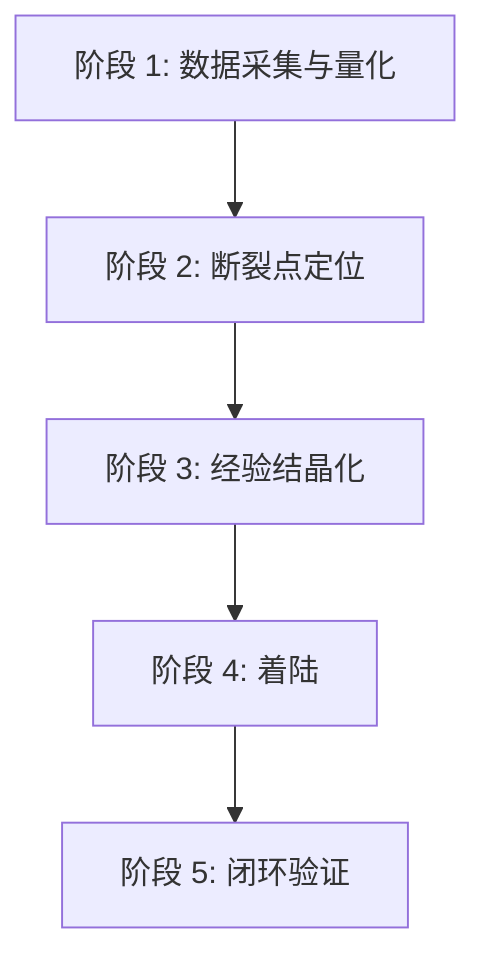

# pb-v1-retrospective 优化方案

**版本**: 1.0.0
**状态**: 方案设计
**创建日期**: 2026-04-02
**升级路径**: v1.0.0 → v2.0.0
**升级类型**: 结构性升级（遵循 skill-design-protocol.md 11.4 升级协议）

---

## 优化背景

### 驱动因素

**内部反馈**：
1. 当前 SKILL.md 是流程手册，不是哲学设计——写了 9 个 Step 的操作指令，缺少让模型自主判断的策略框架
2. 核心哲学虽然写了"复盘是经验的结晶化"，但停留在口号层面，未按五步提炼法展开
3. 缺少三大支柱的完整设计：策略哲学有雏形但不够闭合，工具边界缺失，事实说明与行为规则混杂
4. 全局经验库（`~/.powerby/`）的集成是机械追加的 Step 10，而非哲学的有机延伸

**外部借鉴**：
- skill-design-protocol.md 第二章三大支柱
- skill-design-protocol.md 第十七章核心哲学编写方法论
- pb-v1 体系其他 Skill 的哲学设计模式（discovery/drafting/implementing 等）

---

## 现状分析

### 三大支柱检查

| 支柱 | 当前状态 | 问题 |
|------|---------|------|
| **策略哲学** | ⚠️ 有雏形但不够闭合 | "先量化再定性""追根因""经验必须可执行"是好的原则，但它们是散列的规则，不是闭合的思考框架。缺少判断锚点（成功标准/切换条件/停止条件） |
| **最小完备工具集** | ❌ 完全缺失 | 没有识别复盘场景的原子化行为，没有工具边界说明。Step 1-9 是操作指令而非工具能力描述 |
| **事实说明** | ⚠️ 有内容但混杂 | "事实说明"section 有 5 条，但部分是行为规则（如"模型倾向于过度积极的复盘"），不是推理原料。缺少惰性知识补充 |

### 核心哲学检查（第十七章五步标准）

| 特征 | 当前状态 | 问题 |
|------|---------|------|
| **高度抽象** | ⚠️ | "复盘是经验的结晶化"方向正确，但未展开——删掉"复盘"后，"经验的结晶化"含义不明 |
| **反直觉** | ⚠️ | 惯性表有 4 行，但缺少对核心动词的重新定义。"复盘 ≠ 写总结文档"是对的，但"复盘 = 经验结晶化"还不够具体——结晶化到哪里？怎么验证？ |
| **可操作** | ❌ | 无法从当前哲学直接推导出判断锚点。"成功标准"写在判断锚点里但太模糊 |

### 七层结构检查

| 层级 | 当前状态 | 问题 |
|------|---------|------|
| **触发层** (frontmatter) | ✅ 基本完整 | description 包含能力和触发语境 |
| **定位层** (Purpose + Success criteria) | ❌ 缺失 | 没有独立的 Purpose 和 Success criteria section |
| **认知层** (Strategy) | ⚠️ 散列 | 思考框架和判断锚点分散在"策略哲学"中，不够闭合 |
| **执行层** (Tools) | ❌ 缺失 | 没有工具边界说明 |
| **约束层** (Facts) | ⚠️ 混杂 | 事实说明与行为规则混合 |
| **工作流** (Workflow) | ✅ 过度详细 | 9 个 Step 写得太细，是操作手册而非目标导向 |
| **安全层** (Safety) | ❌ 缺失 | "禁止做的事"在职责边界中，但没有独立的 Safety section |

---

## 优化点

### 优化点 1: 核心哲学重新设计（最关键）

**问题**: 
当前哲学"复盘是经验的结晶化"方向正确但不够完整。它没有回答关键问题：结晶化到哪里？如何验证结晶化的质量？为什么结晶化比记录更重要？

**五步提炼法应用**：

#### Step 1: 识别约束本质

复盘在 pb-v1 约束传递链中的位置：
```
office-hours → discovery → drafting → designing → planning → implementing → testing → shipping → retrospective
                                                                                                      ↓
                                                                                               下一轮 office-hours
```

复盘是约束链的**闭合点**——它的输出质量直接决定下一轮约束链的起点质量。

约束变换类型：**结晶化 + 着陆**
- 输入约束：本次迭代全流程的产物、审查记录、执行数据
- 变换：从一次性的项目经验中提取上下文无关的可复用模式
- 输出：着陆到两个位置——项目 constitution.md（项目级）和 `~/.powerby/experiences/`（全局级）

关键洞察：**经验不着陆就不存在**。复盘报告没人回头看，但 constitution.md 的每一行在下次迭代中被自动引用，全局经验库的每一条在新项目中被自动检索。着陆路径决定经验的存活期。

#### Step 2: 找到模型惯性

| 模型惯性 | 真实情况 |
|---------|---------|
| 复盘 = 写一份总结报告 | 报告的存活期为零。只有着陆到 constitution.md 或全局经验库的经验才会在下次迭代中被自动引用 |
| 改进建议越多越好 | 3 个有着陆路径的改进 > 20 个悬空的建议。没有着陆路径的建议在下次迭代中不会被任何机制自动触发 |
| 做得好的地方是锦上添花 | 成功同样需要结晶化。偶然的成功不可复制，只有理解"为什么做对了"才能将偶然变为必然 |
| 先写分析再想着陆 | 倒过来：先确定着陆路径（改什么文档/流程/工具），再倒推需要什么分析。无法着陆的分析是浪费 |
| 问题描述就是改进依据 | "Review 了 3 轮"是症状，不是根因。根因是上游某个约束缺失——追到约束缺失点才能修补约束链 |

#### Step 3: 构造核心句式

使用**重新定义式**：

> **复盘是约束链的修补：从执行数据中定位约束断裂点，将修补方案着陆到约束链中，让下一轮迭代的起点质量高于本轮。**

检验：删掉"复盘"→"从执行数据中定位约束断裂点，将修补方案着陆到约束链中"——这个描述在任何需要闭环改进的场景中都成立。✅

#### Step 4: 展开三段论

**为什么反直觉**：

常规理解中，复盘是"回顾+总结+建议"——产出是一份报告。但报告的存活期为零：没有任何机制会在下次迭代中自动引用一份 Markdown 报告。

真正有生命力的复盘产出，是着陆到约束链中的修补：更新 constitution.md 的一条原则、往全局经验库新增一条经验、修改某个 Skill 的模板。这些修补会被下次迭代的机制自动触发——它们是活的。

因此，复盘的核心不是"总结做了什么"，而是"定位约束链在哪里断裂了，把修补方案着陆到正确的位置"。

**判断锚点**：

- **成功标准**：每个改进建议都有明确的着陆路径（改哪个文件/流程/工具），着陆后能被下次迭代的某个机制自动触发
- **切换条件**：当发现问题根因超出项目级约束链（组织能力、工具缺陷），标注为"全局经验"而非"项目改进"
- **停止条件**：所有改进建议都已着陆（constitution.md 已更新、全局经验已写入），或用户明确跳过

#### Step 5: 验证闭环

- [x] **抽象度**：删掉"复盘"后仍成立——"从执行数据定位约束断裂点，着陆修补方案"
- [x] **反直觉性**：重新定义了核心动词："总结→修补"、"建议→着陆"
- [x] **可推导性**：能推导出对抗惯性表（5 行）和判断锚点（成功/切换/停止）
- [x] **约束连接**：明确说明了约束变换类型——结晶化 + 着陆
- [x] **体系一致性**：与 pb-v1 其他 Skill 的哲学在同一抽象层级（约束变换）
- [x] **场景无关性**：换项目/场景后依然有指导意义

**实施方式**: 替换当前的"核心哲学"和"策略哲学" section

---

### 优化点 2: 策略哲学重构（支柱一）

**问题**: 
当前的"思考框架"是 4 条散列规则，不是闭合的认知框架。缺少四段式认知框架和明确的判断锚点。

**优化**: 

采用四段式认知框架：

```
1. 定义着陆目标 — 改进建议要着陆到哪里？（constitution.md / 全局经验库 / Skill 模板 / 流程文档）
2. 从数据定位断裂点 — 哪些指标异常？异常背后的约束断裂在哪里？
3. 追根因到约束缺失 — 不是"做得不够好"，而是"哪个上游约束缺失导致下游表现异常"
4. 着陆即停止 — 修补方案写入目标文件后，不追加无意义的分析
```

**实施方式**: 替换当前的"思考框架" section，重写为闭合的四段式认知框架

---

### 优化点 3: 工具边界设计（支柱二）

**问题**: 
完全缺失。当前 SKILL.md 没有识别复盘场景的原子化行为。

**优化**: 

识别复盘的 4 个原子行为：

| 原子行为 | 描述 | 工具/方式 | 不适用场景 |
|---------|------|---------|----------|
| **采集** | 从迭代产物中收集执行数据 | 读取文件系统中的 Markdown/JSON 产物 | 不做主动采集（如跑测试、查日志），只消费已有产物 |
| **量化** | 将定性数据转化为可比较的指标 | 模型直接分析 | 不做精确统计（如代码行数变化），只做阶段级粗粒度量化 |
| **归因** | 从指标异常追溯到约束断裂点 | 模型推理 + 根因分析链 | 不做组织级归因（团队能力、工具缺陷） |
| **着陆** | 将修补方案写入目标文件 | 文件写入（constitution.md / `~/.powerby/experiences/`） | 不直接修改代码或 Skill 定义——只提建议 |

确定性下沉：
- 经验记录的 ID 生成和索引更新 → `powerby-exp` CLI 工具
- 经验模板渲染 → `~/.powerby/experiences/.template.md`

**实施方式**: 新增 "Tools and capability boundaries" section

---

### 优化点 4: 事实说明重构（支柱三）

**问题**: 
当前的"事实说明"混杂了行为规则（如"改进点数量至少等于亮点数量"是规则，不是事实）。

**优化**: 

区分事实（推理原料）和规则（行为约束），只保留事实：

1. **Review 轮次是约束链健康度的信号** — 首轮 PASS = 上游约束完整传递。3 轮才 PASS = 某个上游节点的约束缺失，导致下游反复修补。轮次数直接指向约束断裂点的位置。

2. **时间分布比总时间更重要** — 迭代总时间 5 天无信息量。Plan 占 40% 说明约束在"决策"阶段就已经不清晰——问题源头在上游，不在当前阶段。

3. **报告的存活期为零** — 没有任何机制会在下次迭代中自动引用一份 Markdown 复盘报告。只有 constitution.md 的原则（被每次迭代的 orchestrator 自动加载）和全局经验库的记录（被 office-hours 自动检索）是活的。

4. **跳步记录是风险评估的校准数据** — orchestrator 记录的跳步风险提醒，事后验证哪些风险实际发生、哪些没有。发生率偏差过大说明风险模型需要校准。

5. **模型天然倾向过度积极复盘** — 模型生成"亮点"的舒适度远高于"改进点"。这不是平衡问题——如果改进点少于亮点，大概率是模型在回避，不是真的没有改进空间。

6. **改进建议的粒度决定着陆可能性** — "加强 PRD 质量"无法着陆到任何文件。"在 pb-v1-drafting 的 D-05 维度增加强制清单：必须列出至少 3 种异常场景"可以直接着陆。粒度不够 = 无法着陆 = 无效建议。

**实施方式**: 重写 "Important facts and constraints" section

---

### 优化点 5: 七层结构对齐

**问题**: 
当前 SKILL.md 不符合七层结构框架，缺少 Purpose、Success criteria、Tools、Safety 等关键 section。

**优化**: 
按照 skill-design-protocol.md 第四章 4.2 完整 Section 列表重新组织：

```
frontmatter (name, description, compatibility)
→ 核心哲学（pb-v1 原子 Skill 特有）
→ 设计原则（pb-v1 原子 Skill 特有）
→ Strategy（对抗惯性表 + 思考框架 + 判断锚点）
→ Tools and capability boundaries
→ Important facts and constraints
→ 输入协议
→ 输出协议（含全局经验库输出）
→ Workflow（目标导向，不是操作手册）
→ 职责边界
→ 异常处理
→ 质量标准
→ Safety
→ 与其他 Skill 的交互
```

**实施方式**: 重新组织 SKILL.md 结构

---

### 优化点 6: 工作流精简与全局经验库有机集成

**问题**: 
1. 当前 9 + 1 个 Step 过度详细，是操作手册而非目标导向
2. Step 10（全局经验沉淀）是机械追加的，不是哲学的有机延伸

**优化**: 

将 10 个 Step 精简为 5 个目标导向的阶段，全局经验库作为"着陆"阶段的有机组成部分：



| 阶段 | 目标 | 当前对应 Step |
|------|------|-------------|
| **数据采集与量化** | 收集执行数据，量化关键指标 | Step 1 + 2 |
| **断裂点定位** | 从异常指标追溯到约束断裂点 | Step 3 + 4 |
| **经验结晶化** | 从断裂点和亮点中提取上下文无关的可复用模式 | Step 5 |
| **着陆** | 将修补方案写入 constitution.md 和全局经验库 | Step 6 + 8 + 10 |
| **闭环验证** | 验证上次改进效果，输出 Retro-Learn 清单 | Step 7 + 9 |

关键变化：
- 全局经验库不是 Step 10，而是"着陆"阶段的两个着陆路径之一
- "着陆"是哲学的核心概念——改进建议必须着陆才有生命力
- 用户确认融入"着陆"阶段，不单独成步

**实施方式**: 重写 Workflow section

---

### 优化点 7: 输出协议升级

**问题**: 
当前输出只有 project-retrospective.md 和 constitution.md 更新建议。缺少全局经验库输出的协议定义。

**优化**: 

新增全局经验输出协议：

**必需输出**：
1. `project-retrospective.md` — 项目级复盘报告（保留，但精简结构）
2. Constitution 更新建议 — 项目级着陆
3. 全局经验记录草稿 — 全局级着陆，写入 `~/.powerby/experiences/exp-{id}-{slug}.md`

**输出判断标准**：
- 每个改进建议必须标注着陆路径：`constitution` / `global-experience` / `skill-template` / `none`（需说明为何无法着陆）
- 标注为 `none` 的建议需要说明为什么无法着陆——如果原因是粒度不够，要细化到可着陆

**实施方式**: 重写 "输出协议" section

---

## 实施建议

### 实施方式

一次性重写 SKILL.md v2.0.0，不分阶段：
- 7 个优化点相互关联，分阶段会导致不一致
- 重写不影响其他 Skill（retrospective 是约束链的末端）
- 用户审核后一次性替换

### 验证方法

1. **三大支柱完备性**：检查 Strategy / Tools / Facts 三个 section 是否齐备且各自独立
2. **核心哲学可推导性**：从核心哲学能否直接推导出对抗惯性表和判断锚点
3. **七层结构对齐**：对照 skill-design-protocol.md 第四章 checklist 逐项检查
4. **场景无关性**：将策略哲学放到一个全新项目中，是否仍有指导意义

### 风险与缓解

| 风险 | 缓解 |
|------|------|
| 哲学过度抽象导致可操作性下降 | 判断锚点必须包含具体的成功/切换/停止条件 |
| 工作流精简过度导致步骤不清 | 每个阶段内部保留关键执行提示 |
| 全局经验库集成增加复杂度 | 经验库是着陆路径之一，不是额外流程 |

---

**文档状态**: 方案设计完成
**等待决策**: 用户确认方案
**预计工作量**: 重写 SKILL.md 约 300-400 行
