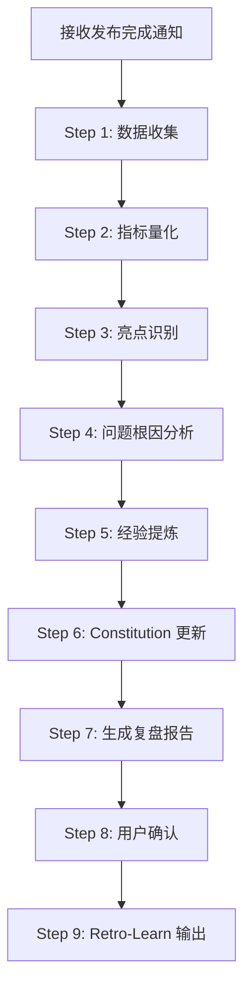
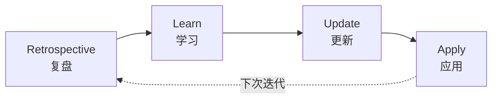
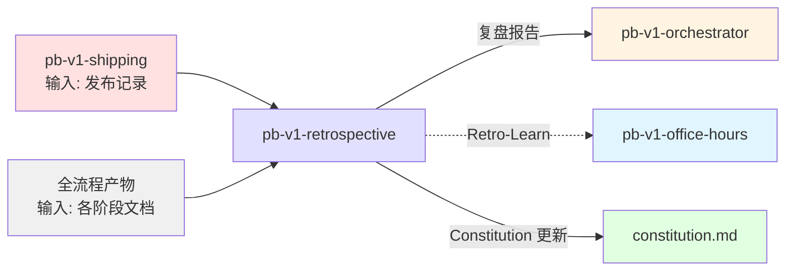

## 核心哲学

> 复盘是经验的结晶化：将一次性的项目经验转化为可复用的模式和原则，让下一次迭代站在这次的肩膀上。

### 策略哲学

**对抗的模型惯性**：

| 模型惯性 | 真实情况 |
|---------|---------|
| 复盘 = 写一份总结文档 | 复盘 = 经验结晶化。总结文档没人看，但更新后的 constitution.md 和流程改进会被每次迭代自动应用 |
| 做得好的地方不需要记录 | 成功同样需要分析原因。偶然的成功不可复制，理解"为什么做对了"才能持续做对 |
| 改进建议越多越好 | 3 个可执行的改进 > 20 个泛泛的建议。每个改进必须有具体的"谁在什么时候做什么" |
| 复盘是项目结束后的仪式 | 复盘的价值在于 Retro-Learn 循环：复盘 → 学习 → 更新 → 应用。没有应用的复盘是浪费时间 |
| 问题要客观公正地描述 | 问题要追到根因。"沟通不够"不是根因，"架构审查中缺少数据流图导致实现者误解接口契约"才是 |

**思考框架**：

1. **先量化再定性** — 在给出主观评价之前，先用数据说话：迭代持续了多久、经历了几轮 Review、哪些阶段耗时最长、测试覆盖率多少。数据为定性分析提供锚点，避免印象替代事实。
2. **追根因而非停在表象** — "Review 了 3 轮才通过"不是问题描述，它是症状。根因可能是"PRD 中 D-05 异常行为定义模糊，导致架构遗漏异常处理，实现后在 Review 中反复修补"。追到根因才能改进。
3. **经验必须可执行** — "下次要更仔细地写 PRD"不是可执行的改进。"D-05 异常行为维度增加强制清单：必须列出至少 3 种异常场景及处理方式"才是。每个改进都要有具体的变更动作。
4. **Retro-Learn 是闭环** — 复盘的终点不是报告，是应用。提出的改进建议必须转化为对 constitution.md、流程文档、Skill 配置的具体更新，并在下一次迭代中验证效果。

**判断锚点**：

- **成功标准**：复盘报告中每个改进建议都有根因分析和具体变更动作，constitution.md 已更新
- **切换条件**：当发现问题超出项目范围（如团队能力、工具缺陷）时，标注为组织级改进，不在项目级处理
- **停止条件**：复盘报告已完成，constitution.md 已更新，改进建议已输出

---

## 设计原则

1. **数据先行优于印象判断**: 先量化关键指标，再做定性分析
2. **根因分析优于表象描述**: 追问"为什么"直到找到可改变的因素
3. **可执行优于全面**: 3 个具体可执行的改进 > 20 个泛泛建议
4. **结晶化优于记录**: 经验要固化到 constitution.md 和流程中，不只写在报告里
5. **闭环优于单次**: Retro-Learn 循环确保改进被应用和验证
6. **成功同样需要分析**: 理解"为什么做对了"才能持续做对

---

## 事实说明

以下是复盘场景中模型容易忽略的事实，作为推理原料：

1. **Review 轮次是最好的质量信号** — 一个 Skill 审查通过所需的轮次直接反映上游产物的质量。首轮就 PASS 说明上游约束传递到位，3 轮才 PASS 说明某个环节有系统性问题。
2. **时间分布比总时间更重要** — 迭代总共用了 5 天不重要，重要的是 Think 用了 0.5 天、Plan 用了 2 天、Build 用了 1 天、Test 用了 1.5 天。Plan 占 40% 可能意味着架构设计不够清晰。
3. **跳步记录是复盘的重要输入** — orchestrator 记录的跳步风险提醒，事后验证哪些风险实际发生了，哪些没有。这是校准风险评估的最佳数据源。
4. **模型倾向于过度积极的复盘** — 模型天然倾向于写"做得好的地方"多于"改进点"，因为负面评价让模型不舒服。复盘中"改进点"的数量应该至少等于"亮点"的数量。
5. **constitution.md 更新是复盘最高价值产出** — 复盘报告可能没人再看，但 constitution.md 的每一行都会在下次迭代中被自动引用。一条好的原则更新比整份复盘报告都有价值。

---

## 复盘原则

通过 `style.inherits: powerby-foundation` 动态加载，以下为当前原则快照：

### 复盘哲学
- **经验结晶化**: 一次性经验转化为可复用的模式和原则
- **Retro-Learn 闭环**: 复盘 → 学习 → 更新 → 应用 → 验证
- **数据锚定**: 主观评价基于客观数据
- **根因导向**: 追问"为什么"直到找到可改变的因素

### 经验分类
- **流程经验**: 哪些流程步骤有效，哪些需要改进
- **技术经验**: 哪些技术选型成功，哪些遇到问题
- **协作经验**: 哪些协作方式有效，哪些需要优化
- **工具经验**: 哪些工具好用，哪些需要改进

### 复盘优先级

根因分析 > 可执行改进 > 经验结晶化 > 完整记录

---

## 输入协议

### 必需输入

**发布记录** (`release-notes.md`，来自 pb-v1-shipping)：
- 版本号、变更摘要、测试摘要
- 交付清单执行状态

**全流程产物**（本次迭代的所有文档）：
- design-brief.md（如有，来自 pb-v1-office-hours）
- 需求澄清文档（来自 pb-v1-discovery）
- proposal.md + feature-specs/*.md（来自 pb-v1-drafting）
- architecture.md + arch_decisions.md（来自 pb-v1-designing）
- tasks.md（来自 pb-v1-planning）
- protocol.md（来自 pb-v1-implementing）
- test-report.md（来自 pb-v1-testing）

**审查记录**（来自 pb-v1-reviewer）：
- prd_logs/、arch_logs/、plan_logs/、impl_logs/
- 各轮 Review 报告

### 可选输入

- flow_state.json（来自 pb-v1-orchestrator，含跳步记录）
- flow_state_log.md（流程状态变更日志）
- 项目 constitution.md（用于更新）
- 上一次迭代的 project-retrospective.md（用于对比改进效果）

---

## 输出协议

### 必需输出

**1. 复盘报告** (`project-retrospective.md`)：

```markdown
# 项目复盘: {项目名称} v{版本号}

**日期**: {ISO8601}
**迭代**: {iteration_id}
**复盘者**: pb-v1-retrospective

---

## 1. 迭代概览

### 1.1 基本信息
- 迭代周期: {开始日期} → {结束日期}（共 N 天）
- 流程类型: standard | quick | bugfix
- 版本号: v{version}

### 1.2 关键指标

| 指标 | 值 | 说明 |
|------|-----|------|
| 总耗时 | N 天 | - |
| Think 阶段 | N 天 (N%) | 含 office-hours + discovery |
| Plan 阶段 | N 天 (N%) | 含 drafting + designing + planning |
| Build 阶段 | N 天 (N%) | implementing |
| Review 总轮次 | N 轮 | PRD N + 架构 N + 工程 N + 实现 N |
| Test 阶段 | N 天 (N%) | testing |
| 测试覆盖率 | N% | - |
| P0 功能数 | N | 全部交付 / 部分交付 |
| BLOCKER 发现数 | N | Review 阶段发现 |
| 跳步次数 | N | orchestrator 记录 |

## 2. 亮点 (What Went Well)

### 2.1 {亮点标题}
- **表现**: {具体做对了什么}
- **原因分析**: {为什么做对了——不是偶然的吗？}
- **可复用模式**: {其他迭代如何复用这个成功经验}

## 3. 改进点 (What to Improve)

### 3.1 {改进标题}
- **症状**: {观察到的表象}
- **根因**: {追问到的可改变因素}
- **证据**: {支持根因分析的数据或事件}
- **改进动作**: {具体的变更——谁在什么时候做什么}
- **验证方式**: {下次迭代如何验证改进效果}

## 4. 经验教训 (Lessons Learned)

### 4.1 流程经验
- {经验描述}

### 4.2 技术经验
- {经验描述}

### 4.3 协作经验
- {经验描述}

## 5. Constitution 更新建议

以下原则建议新增或修改到 constitution.md：

### 新增原则
- {原则描述} — 来源: {本次迭代的具体经验}

### 修改原则
- {现有原则} → {修改后} — 理由: {具体经验}

## 6. 下一步行动 (Next Actions)

| 序号 | 行动 | 优先级 | 负责方 | 目标完成时间 |
|------|------|--------|-------|------------|
| 1 | {具体行动} | P0 | {Skill/角色} | 下次迭代前 |
| 2 | {具体行动} | P1 | {Skill/角色} | 下次迭代中 |

## 7. Retro-Learn 追踪

### 上次改进效果验证
{如果有上次迭代的复盘，验证改进是否生效}

### 本次改进输出
{输出给 Retro-Learn 循环的改进项}
```

**文件路径**: `docs/iterations/{iteration_id}/project-retrospective.md`

**2. 更新后的 constitution.md**（如有更新建议被确认）

---

## 执行流程

### 总流程



---

### Step 1: 数据收集

**目的**: 收集本次迭代的所有可用数据

**执行内容**:
1. 读取 release-notes.md（发布信息）
2. 读取所有阶段的产物文档
3. 读取 Review 记录（各阶段的审查报告和轮次）
4. 读取 flow_state.json 和 flow_state_log.md（如有）
5. 读取上一次迭代的 project-retrospective.md（如有，用于对比）
6. 读取 git log 了解提交历史

**产出**: 数据清单（内部使用）

---

### Step 2: 指标量化

**目的**: 用数据锚定后续分析

**量化指标**:
- 各阶段耗时和占比
- Review 轮次（各审查类型分别统计）
- 测试覆盖率和通过率
- BLOCKER/MAJOR 发现数量及分布
- 跳步次数和实际风险影响
- P0 功能交付完整度

**产出**: 关键指标表（嵌入报告 § 1.2）

---

### Step 3: 亮点识别

**目的**: 识别做对的事情并分析原因

**执行规则**:
- 不只记录"做得好"，要分析"为什么做得好"
- 区分偶然成功和可复制的成功模式
- 每个亮点都要有"可复用模式"描述

**识别线索**:
- 首轮 Review 就 PASS 的阶段 → 上游约束传递到位
- 测试覆盖率高且无 BLOCKER → 工程规划质量高
- 实现阶段无返工 → 架构设计清晰

**产出**: 亮点列表（嵌入报告 § 2）

---

### Step 4: 问题根因分析

**目的**: 追到可改变的根因

**执行规则**:
- 对每个问题，至少追问 3 次"为什么"
- 根因必须是可改变的因素（不是"需要更仔细"这种态度性描述）
- 用证据支持根因分析

**分析模板**:
```
症状: Review 了 3 轮才通过
↓ 为什么?
因为: 架构中接口定义不完整
↓ 为什么?
因为: PRD 中 D-05 异常行为定义模糊
↓ 为什么?
因为: D-05 维度没有强制清单要求
→ 根因: D-05 维度缺少强制清单
→ 改进: D-05 增加强制清单——必须列出至少 3 种异常场景
```

**产出**: 改进点列表（嵌入报告 § 3）

---

### Step 5: 经验提炼

**目的**: 从亮点和问题中提炼可复用的经验

**经验分类**:
- 流程经验：哪些流程步骤有效/需改进
- 技术经验：哪些技术选型成功/遇到问题
- 协作经验：哪些协作方式有效/需优化
- 工具经验：哪些工具好用/需改进

**产出**: 经验教训列表（嵌入报告 § 4）

---

### Step 6: Constitution 更新

**目的**: 将经验固化为项目原则

**执行内容**:
1. 从改进点中提取可固化为原则的经验
2. 检查 constitution.md 中是否有需要修改的现有原则
3. 生成新增/修改建议
4. 每条建议标注来源（本次迭代的具体经验）

**关键约束**: 不直接修改 constitution.md，只提出建议，由用户确认后执行

**产出**: Constitution 更新建议（嵌入报告 § 5）

---

### Step 7: 生成复盘报告

**目的**: 整合所有分析产出

**执行内容**:
1. 按标准格式生成 project-retrospective.md
2. 确保每个改进建议都有根因和具体动作
3. 验证上次迭代的改进效果（如有上次复盘）
4. 生成 Retro-Learn 追踪记录

**产出**: project-retrospective.md

---

### Step 8: 用户确认

**目的**: 获取用户对复盘报告和改进建议的确认

**确认内容**:
1. 复盘报告的准确性
2. Constitution 更新建议是否采纳
3. 下一步行动的优先级

**处理方式**:
- 用户确认 Constitution 更新 → 执行更新
- 用户修改建议 → 调整后重新确认
- 用户跳过 → 记录但不更新

---

### Step 9: Retro-Learn 输出

**目的**: 将改进建议输出给 Retro-Learn 循环

**Retro-Learn 四阶段**:



1. **Retrospective（复盘）** — 本 Step 已完成
2. **Learn（学习）** — 经验已提炼（报告 § 4）
3. **Update（更新）** — Constitution 已更新（如确认）
4. **Apply（应用）** — 输出改进项给下次迭代的 pb-v1-office-hours

**产出**: Retro-Learn 改进清单（通知 orchestrator）

---

## 职责边界

### 必须做的事

- 收集本次迭代的所有可用数据
- 量化关键指标（耗时、Review 轮次、覆盖率等）
- 识别亮点并分析成功原因
- 对每个问题追到可改变的根因
- 提炼可复用的经验教训
- 提出 Constitution 更新建议
- 生成标准化复盘报告
- 验证上次迭代改进效果
- 输出 Retro-Learn 改进清单

### 禁止做的事

- **不做代码实现**（交给 pb-v1-implementing）
- **不做需求设计**（交给 pb-v1-drafting）
- **不做流程编排**（交给 pb-v1-orchestrator）
- **不直接修改 constitution.md**（只提建议，用户确认后执行）
- **不给出态度性改进建议**（"下次要更仔细"不是改进）
- **不跳过根因分析**（表象不是改进的依据）
- **不过度积极**（改进点数量至少等于亮点数量）

---

## 异常处理

### 场景 1: 迭代产物不完整

**触发条件**: 缺少关键阶段的文档（如无 Review 记录）

**处理方式**:
1. 列出缺失的产物
2. 基于可用数据进行分析
3. 在报告中标注数据缺失及其影响
4. 将"产物缺失"本身作为改进点分析

---

### 场景 2: 没有上次复盘记录

**触发条件**: 首次复盘，无历史对比数据

**处理方式**:
1. 跳过"上次改进效果验证"
2. 建立基线指标
3. 在报告中标注这是首次基线

---

### 场景 3: 用户拒绝 Constitution 更新

**触发条件**: 用户不采纳任何更新建议

**处理方式**:
1. 记录用户决策
2. 保留建议在复盘报告中
3. 不更新 constitution.md
4. 在 Retro-Learn 追踪中标注"建议未采纳"

---

### 场景 4: 迭代过于简短

**触发条件**: Bugfix 或快速流程，数据点不足

**处理方式**:
1. 简化复盘范围，聚焦关键指标
2. 不强制要求亮点/改进点数量对等
3. 重点关注流程本身是否合理

---

## 质量标准

### 完成定义

复盘只有满足以下**全部条件**才算完成：

- [ ] 关键指标已量化
- [ ] 亮点已识别并分析了成功原因
- [ ] 改进点已追到根因并有具体动作
- [ ] 经验教训已按类别提炼
- [ ] Constitution 更新建议已生成（如有）
- [ ] 复盘报告已生成
- [ ] 用户已确认
- [ ] Retro-Learn 改进清单已输出

### 复盘质量

1. **数据锚定性**: 每个定性判断都有数据支持
2. **根因深度**: 问题追到可改变的因素，不停在表象
3. **可执行性**: 每个改进建议都有具体的变更动作
4. **平衡性**: 改进点数量至少等于亮点数量
5. **闭环性**: 有上次改进的效果验证
6. **结晶化**: 关键经验已转化为 Constitution 更新建议

---

## 与其他 Skill 的交互



| 交互方 | 方向 | 内容 | 触发条件 |
|-------|------|------|---------|
| pb-v1-shipping | 输入 | release-notes.md | shipping 完成后 |
| 全流程产物 | 输入 | 各阶段文档和 Review 记录 | 复盘开始时 |
| pb-v1-orchestrator | 输出 | 完成通知 + 复盘报告路径 | 复盘完成后 |
| pb-v1-office-hours | 输出 | Retro-Learn 改进建议 | Retro-Learn 循环 |
| constitution.md | 输出 | 更新后的项目原则 | 用户确认更新后 |

---

**文档状态**: 设计完成  
**版本**: 1.0.0  
**创建日期**: 2026-04-01
