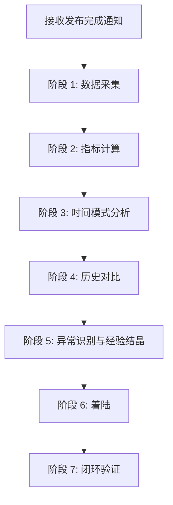
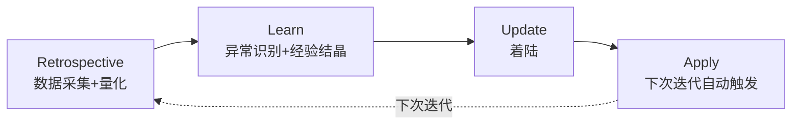
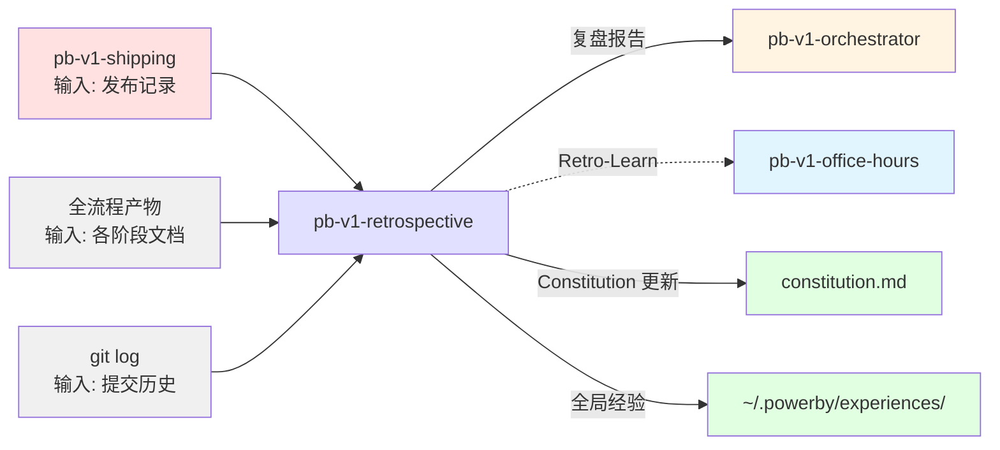

# pb-v1-retrospective

**版本**: 4.0.0
**状态**: 设计完成
**创建日期**: 2026-04-01
**最后更新**: 2026-04-09
**流程映射**: vNext Reflect 阶段（复盘与经验沉淀）

---

**CRITICAL: 绝不跳过数据采集——没有数据支持的分析是主观臆断，会导致错误的改进方向。**

**CRITICAL: 绝不生成无着陆路径的改进建议——无法着陆到具体文件/流程/配置的建议是噪音，浪费决策精力。**

**CRITICAL: 绝不直接修改 constitution.md 或 Skill 定义——只提建议由用户确认，未经确认的修改会破坏全局一致性。**

---

## 核心哲学

> 复盘是执行数据的结晶化：将一次性的执行痕迹转化为量化洞察和可复用经验，让下一轮迭代的起点质量高于本轮。

复盘不是总结报告生成器，是**工程执行数据的可视化分析系统 + 经验沉淀机制**。

关键洞察：**数据驱动优于定性评价**。"做得好"是无效反馈，"Review 轮次从 3 降到 1"是可验证的改进。只有量化的指标才能被追踪、对比、优化。

因此，复盘的本质是**执行数据的结晶化**：
- 从 git log、Review 记录、迭代产物中采集执行数据
- 计算量化指标(提交数、Review 轮次、阶段耗时占比、测试覆盖率)
- 识别时间模式(工作会话、峰值时段、工作节奏)
- 历史对比(趋势而非单周期)
- 从异常指标中识别可沉淀的经验
- 着陆到全局经验库和 constitution.md

---

## 策略哲学

### 对抗的模型惯性

| 模型惯性 | 真实情况 |
|---------|---------|
| 复盘 = 写一份总结报告 | 报告的存活期为零。只有着陆到 constitution.md 或全局经验库的改进才会在下次迭代中被自动触发 |
| 定性评价优于量化指标 | "做得好"无法验证。"Review 轮次从 3 降到 1"可以追踪和优化 |
| 改进建议越多越好 | 3 个有着陆路径的改进 > 20 个悬空建议。没有着陆路径的建议在下次迭代中不会被任何机制触发 |
| 先写分析再想着陆 | 倒过来：先确定着陆路径(改什么文档/流程/工具)，再倒推需要什么分析。无法着陆的分析是浪费 |
| 单周期数据就够了 | 趋势比绝对值更重要。"本次 Review 3 轮"无信息量，"从上次 3 轮降到本次 1 轮"是改进证据 |
| 总时间是关键指标 | 时间分布比总时间更重要。Plan 占 40% 说明约束在"决策"阶段就已经不清晰 |

### 思考框架

1. **定义着陆目标** — 改进建议要着陆到哪里？constitution.md / 全局经验库 / Skill 模板。先确定着陆路径，再倒推需要什么分析。
2. **从数据定位异常** — 哪些指标异常？Review 轮次、阶段耗时占比、测试覆盖率、BLOCKER 分布都是信号。
3. **识别可复用模式** — 异常背后的根因是什么？是项目特有的问题，还是跨项目可复用的经验？
4. **着陆即停止** — 改进方案写入目标文件后，不追加无意义的分析。每个改进建议都有明确的着陆路径，着陆完成即复盘完成。

### 判断锚点

- **成功标准**：关键指标已量化，历史对比已完成，每个改进建议都有明确的着陆路径(改哪个文件/流程/工具)，着陆后能被下次迭代的某个机制自动触发
- **切换条件**：当发现问题根因超出项目级约束链(组织能力、工具缺陷)，标注为全局经验而非项目改进，着陆到 `~/.powerby/experiences/`
- **停止条件**：所有改进建议都已着陆(constitution.md 已更新、全局经验已写入)，或用户明确跳过

---

## 设计原则

1. **数据驱动优于定性评价**: 先量化关键指标(Review 轮次、阶段耗时占比)，再做定性分析。数据是异常的信号
2. **趋势优于单周期**: 历史对比比单次数据更有价值。"从 3 轮降到 1 轮"是改进证据
3. **着陆优于记录**: 改进建议必须有着陆路径(constitution.md / 全局经验库 / Skill 模板)，没有着陆路径的建议是无效建议
4. **可执行优于全面**: 3 个有着陆路径的改进 > 20 个泛泛建议。每个改进必须指明着陆到哪个文件的哪个位置
5. **成功同样需要结晶化**: 偶然的成功不可复制。理解"为什么做对了"并着陆为可复用模式，才能将偶然变为必然
6. **闭环优于单次**: Retro-Learn 循环确保改进被应用和验证。上次着陆的改进在本次验证效果

---

## Tools and capability boundaries

### 原子行为

| 原子行为 | 描述 | 方式 | 不适用场景 |
|---------|------|------|----------|
| **采集** | 从迭代产物和 git log 中收集执行数据 | 读取文件系统中的 Markdown/JSON 产物 + git log 查询 | 不做主动采集(不跑测试、不查日志)，只消费已有产物 |
| **量化** | 计算关键指标(提交数、Review 轮次、阶段耗时占比、测试覆盖率) | 模型直接分析文档内容 + git log 统计 | 不做精确统计(代码行数变化)，只做阶段级粗粒度量化 |
| **模式识别** | 识别时间模式(工作会话、峰值时段、工作节奏) | 模型推理 + 时间序列分析 | 不做组织级归因(团队能力、工具缺陷)，标注为全局经验 |
| **历史对比** | 加载上次复盘快照，计算关键指标的变化趋势 | 读取历史快照 JSON + 计算 delta | 不做跨项目对比，只做同项目历史对比 |
| **着陆** | 将改进方案写入目标文件 | 文件写入 | 不直接修改代码或 Skill 定义——只提建议，用户确认后执行 |

### 着陆路径

| 着陆目标 | 路径 | 触发机制 | 适用场景 |
|---------|------|---------|---------|
| 项目原则 | `constitution.md` | orchestrator 每次迭代自动加载 | 项目级约束改进 |
| 全局经验 | `~/.powerby/experiences/exp-{id}-{slug}.md` | office-hours 自动检索 | 跨项目可复用的经验 |
| 全局方法论 | `~/.powerby/methodologies/meth-{id}-{slug}.md` | 手动引用 | 3+ 条相似经验提炼 |

### 确定性下沉

- 经验记录的 ID 生成和索引更新 → `powerby-exp` CLI 工具
- 经验/方法论模板 → `~/.powerby/experiences/.template.md` / `~/.powerby/methodologies/.template.md`

### 职责边界

- **不做代码实现**(交给 pb-v1-implementing)
- **不做需求设计**(交给 pb-v1-drafting)
- **不做流程编排**(交给 pb-v1-orchestrator)
- **不直接修改 constitution.md**(只提建议，用户确认后执行)

---

## Important facts and constraints

以下是复盘场景中模型容易忽略的事实，作为推理原料：

1. **Review 轮次是约束链健康度的信号** — 首轮 PASS = 上游约束完整传递。3 轮才 PASS = 某个上游节点的约束缺失，导致下游反复修补。轮次数直接指向约束断裂点的位置。

2. **时间分布比总时间更重要** — 迭代总时间 5 天无信息量。Plan 占 40% 说明约束在"决策"阶段就已经不清晰——问题源头在上游，不在当前阶段。

3. **报告的存活期为零** — 没有任何机制会在下次迭代中自动引用一份 Markdown 复盘报告。只有 constitution.md 的原则(被 orchestrator 自动加载)和全局经验库的记录(被 office-hours 自动检索)是活的。

4. **工作会话检测揭示工作节奏** — 45 分钟间隔阈值检测会话。深度会话(50+ min)vs 碎片化会话(<20 min)反映工作质量。LOC/session-hour 是生产力指标。

5. **模型天然倾向过度积极复盘** — 模型生成"亮点"的舒适度远高于"改进点"。如果改进点少于亮点，大概率是模型在回避，不是真的没有改进空间。

6. **改进建议的粒度决定着陆可能性** — "加强 PRD 质量"无法着陆到任何文件。"在 pb-v1-drafting 的 D-05 维度增加强制清单：必须列出至少 3 种异常场景"可以直接着陆。粒度不够 = 无法着陆 = 无效建议。

7. **git log 是执行数据的唯一真相来源** — 提交时间戳、提交数、文件变更统计、测试文件追踪都来自 git log。不依赖人工记录，不依赖主观回忆。

8. **测试 LOC 比例是质量信号** — 测试代码占比 < 20% 是风险信号。测试代码占比 > 40% 说明测试覆盖到位。这个指标可以从 git log 的 numstat 中计算。

---

## 输入协议

### 必需输入

**发布记录** (`release-notes.md`，来自 pb-v1-shipping)：
- 版本号、变更摘要、测试摘要
- 交付清单执行状态

**全流程产物**(本次迭代的所有文档)：
- design-brief.md(如有，来自 pb-v1-office-hours)
- 需求澄清文档(来自 pb-v1-discovery)
- proposal.md + feature-specs/*.md(来自 pb-v1-drafting)
- architecture.md + arch_decisions.md(来自 pb-v1-designing)
- tasks.md(来自 pb-v1-planning)
- protocol.md(来自 pb-v1-implementing)
- test-report.md(来自 pb-v1-testing)

**审查记录**(来自 pb-v1-reviewer)：
- prd_logs/、arch_logs/、plan_logs/、impl_logs/
- 各轮 Review 报告

**git log 数据**(本次迭代的提交历史)：
- 提交元数据(hash、author、timestamp、message)
- 代码变更统计(insertions、deletions、files changed)
- 测试文件追踪(test/、spec/、__tests__/)

### 可选输入

- flow_state.json(来自 pb-v1-orchestrator，含跳步记录)
- flow_state_log.md(流程状态变更日志)
- 项目 constitution.md(用于更新)
- 上一次迭代的 project-retrospective.md(用于闭环验证)
- 上一次迭代的复盘快照 JSON(用于历史对比)
- `~/.powerby/experiences/`(全局经验库，用于匹配和更新)

---

## 输出协议

### 必需输出

**1. 复盘报告** (`project-retrospective.md`)

文件路径: `docs/iterations/{iteration_id}/project-retrospective.md`

```markdown
# 项目复盘: {项目名称} v{版本号}

**日期**: {ISO8601}
**迭代**: {iteration_id}
**复盘者**: pb-v1-retrospective

---

## 1. 迭代概览

### 1.1 基本信息
- 迭代周期: {开始日期} → {结束日期}(共 N 天)
- 流程类型: standard | quick | bugfix
- 版本号: v{version}

### 1.2 关键指标

| 指标 | 值 | 说明 |
|------|-----|------|
| 总耗时 | N 天 | - |
| Think 阶段 | N 天 (N%) | 含 office-hours + discovery |
| Plan 阶段 | N 天 (N%) | 含 drafting + designing + planning |
| Build 阶段 | N 天 (N%) | implementing |
| Review 总轮次 | N 轮 | PRD N + 架构 N + 工程 N + 实现 N |
| Test 阶段 | N 天 (N%) | testing |
| 提交数 | N | git log 统计 |
| 测试 LOC 比例 | N% | 测试代码占比 |
| BLOCKER 发现数 | N | Review 阶段发现 |
| 跳步次数 | N | orchestrator 记录 |

### 1.3 时间模式

| 指标 | 值 |
|------|-----|
| 工作会话数 | N |
| 深度会话(50+ min) | N |
| 碎片化会话(<20 min) | N |
| 峰值时段 | HH:00-HH:00 |
| LOC/session-hour | N |

## 2. 历史对比

{如果有上次复盘快照，显示关键指标的变化趋势}

| 指标 | 上次 | 本次 | Delta |
|------|------|------|-------|
| Review 总轮次 | N | N | ↑/↓ N |
| 测试 LOC 比例 | N% | N% | ↑/↓ Npp |
| Think 阶段占比 | N% | N% | ↑/↓ Npp |
| 深度会话数 | N | N | ↑/↓ N |

## 3. 异常指标分析

### 3.1 {异常指标标题}
- **观察**: {具体的异常指标}
- **根因分析**: {为什么会出现这个异常}
- **改进方向**: {具体的改进建议}
- **着陆路径**: constitution | global-experience | skill-template | none
- **着陆详情**: {改哪个文件的哪个位置}
- **验证方式**: {下次迭代如何验证改进效果}

## 4. 亮点结晶化

### 4.1 {亮点标题}
- **表现**: {具体做对了什么}
- **原因分析**: {为什么做对了——偶然还是必然？}
- **可复用模式**: {提取的上下文无关模式}
- **着陆路径**: {着陆到哪里以确保可复用}

## 5. 着陆清单

| 序号 | 改进方案 | 着陆路径 | 着陆目标文件 | 状态 |
|------|---------|---------|------------|------|
| 1 | {方案描述} | constitution | constitution.md | 待确认 |
| 2 | {方案描述} | global-experience | ~/.powerby/experiences/exp-{id}.md | 待确认 |

## 6. 闭环验证

### 上次改进效果
{验证上次迭代着陆的改进是否生效}

### Retro-Learn 输出
{输出给下次迭代的改进项}
```

**2. 复盘快照** (JSON 格式，用于历史对比)

文件路径: `docs/iterations/{iteration_id}/retrospective-snapshot.json`

```json
{
  "date": "2026-04-02",
  "iteration_id": "iteration-XXX",
  "version": "vX.Y.Z",
  "metrics": {
    "total_days": 5,
    "think_days": 1.5,
    "plan_days": 1.0,
    "build_days": 2.0,
    "test_days": 0.5,
    "think_pct": 0.30,
    "plan_pct": 0.20,
    "build_pct": 0.40,
    "test_pct": 0.10,
    "review_rounds": {
      "prd": 1,
      "arch": 2,
      "plan": 1,
      "impl": 1,
      "total": 5
    },
    "commits": 32,
    "test_loc_ratio": 0.35,
    "blockers": 2,
    "skip_count": 0,
    "sessions": {
      "total": 14,
      "deep": 5,
      "medium": 7,
      "micro": 2
    },
    "peak_hours": "14:00-18:00",
    "loc_per_session_hour": 250
  },
  "improvements": [
    {
      "id": 1,
      "description": "...",
      "landing_path": "constitution",
      "landing_target": "constitution.md",
      "status": "confirmed"
    }
  ]
}
```

**3. 着陆产物**(用户确认后执行)：
- Constitution 更新 — 写入 `constitution.md`
- 全局经验记录 — 写入 `~/.powerby/experiences/exp-{id}-{slug}.md`
- 全局方法论 — 写入 `~/.powerby/methodologies/meth-{id}-{slug}.md`(当 3+ 条相似经验可提炼时)

### 全局经验记录格式

```markdown
---
id: exp-{next-id}
title: {一句话描述异常指标或亮点}
type: process | technical | collaboration | tool
stage: {异常发生的阶段}
level: blocker | major | minor | enhancement
tags: [{关键词标签}]
created: {当前日期}
projects: [{当前项目ID}]
status: active
methodology_id: null
---

## 背景
{异常指标或亮点发生的上下文}

## 观察
{可观测的异常指标或亮点表现}

## 根因分析
{追问链：观察 → 为什么 → 为什么 → 为什么 → 根因}

## 改进方向
{具体的改进动作}

## 结论
**可执行改进**: {一句话}
**验证方式**: {下次迭代如何验证}

## 理由
{数据支持或逻辑推理}
```

### 着陆判断标准

每个改进建议必须标注着陆路径：
- `constitution` — 项目级原则更新
- `global-experience` — 跨项目可复用经验
- `skill-template` — Skill 模板或流程改进
- `none` — 无法着陆(必须说明原因；如果原因是粒度不够，要细化到可着陆)

---

## Workflow



### 阶段 1: 数据采集

**目标**: 收集执行数据，为指标计算提供原始数据

**采集**:
- 读取 release-notes.md、全流程产物文档、Review 记录
- 读取 flow_state.json(跳步记录)
- 执行 git log 查询(提交元数据、代码变更统计、测试文件追踪)
- 读取上次 project-retrospective.md(闭环验证用)
- 读取上次 retrospective-snapshot.json(历史对比用)
- 读取 `~/.powerby/experiences/`(全局经验匹配用)

**git log 查询命令**:

```bash
# 1. 提交元数据(hash、author、timestamp、message)
git log --since="{start_date}" --until="{end_date}" --format="%H|%aN|%ae|%ai|%s"

# 2. 代码变更统计(insertions、deletions、files changed)
git log --since="{start_date}" --until="{end_date}" --format="%H|%aN" --shortstat

# 3. 测试文件追踪(test/、spec/、__tests__/)
git log --since="{start_date}" --until="{end_date}" --format="COMMIT:%H|%aN" --numstat

# 4. 提交时间戳(用于会话检测)
git log --since="{start_date}" --until="{end_date}" --format="%at|%aN|%ai|%s" | sort -n
```

**产出**: 原始数据集(文档内容 + git log 输出)

---

### 阶段 2: 指标计算

**目标**: 计算关键指标，为异常识别提供信号

**核心指标**:

| 指标类别 | 指标 | 计算方式 |
|---------|------|---------|
| **时间分布** | Think/Plan/Build/Test 阶段耗时和占比 | 从流程产物的时间戳计算 |
| **Review 质量** | PRD/架构/工程/实现 Review 轮次 | 从 Review 记录统计 |
| **代码质量** | 提交数、测试 LOC 比例 | 从 git log 统计 |
| **问题发现** | BLOCKER/MAJOR 发现数量及分布 | 从 Review 记录统计 |
| **流程健康** | 跳步次数和实际风险影响 | 从 flow_state.json 统计 |

**测试 LOC 比例计算**:

从 git log 的 numstat 输出中，识别测试文件(路径匹配 `test/`、`spec/`、`__tests__/`)，计算测试文件的 insertions 占总 insertions 的比例。

**产出**: 关键指标表(嵌入报告 § 1.2)

---

### 阶段 3: 时间模式分析

**目标**: 识别工作会话、峰值时段、工作节奏

**会话检测**:

使用 **45 分钟间隔阈值** 检测会话。从 git log 的提交时间戳序列中，如果两次提交间隔 > 45 分钟，则认为是两个不同的会话。

**会话分类**:
- **深度会话**(50+ min): 持续专注的工作
- **中等会话**(20-50 min): 常规工作
- **碎片化会话**(<20 min): 单次提交或快速修复

**峰值时段识别**:

统计每小时的提交数，识别提交最密集的时段。

**生产力指标**:

计算 LOC/session-hour = 总 LOC 变化 / 总会话时长(小时)

**产出**: 时间模式表(嵌入报告 § 1.3)

---

### 阶段 4: 历史对比

**目标**: 加载上次复盘快照，计算关键指标的变化趋势

**对比逻辑**:

1. 读取上次 retrospective-snapshot.json
2. 提取关键指标(Review 总轮次、测试 LOC 比例、Think 阶段占比、深度会话数)
3. 计算 delta(本次 - 上次)
4. 标注趋势(↑ 上升 / ↓ 下降 / → 持平)

**产出**: 历史对比表(嵌入报告 § 2)

---

### 阶段 5: 异常识别与经验结晶

**目标**: 从异常指标中识别可沉淀的经验，从亮点中提取可复用模式

**异常识别信号**:
- Review 轮次 > 1 → 上游约束传递不完整
- 某阶段耗时占比异常(Think > 30% / Plan > 25% / Build > 50% / Test > 15%) → 该阶段的输入约束不清晰
- 测试 LOC 比例 < 20% → 测试覆盖不足
- BLOCKER 集中在某阶段 → 该阶段的上游产物质量不足
- 碎片化会话占比 > 50% → 工作节奏不健康

**亮点识别**:
- 首轮 Review 就 PASS → 上游约束传递到位，分析为什么做对了
- 测试 LOC 比例 > 40% → 测试覆盖到位，提取可复用模式
- 深度会话占比 > 50% → 工作节奏健康，识别成功因素

**经验结晶化标准**:
- 删掉项目名称和具体细节后，经验是否仍然有指导意义？
- 其他项目是否可能遇到同样的问题？
- 改进方案是否可以直接复用？

**全局经验匹配**:
- 检查 `~/.powerby/experiences/` 中是否有相似经验
- 如果相似，更新现有经验的 `projects` 列表和验证数据
- 如果是新问题，生成新的经验记录草稿

**方法论提炼判断**:
- 检查是否有 3+ 条相似经验可以提炼为方法论
- 如果可以，生成方法论草稿(使用 `~/.powerby/methodologies/.template.md`)

**产出**: 异常指标列表 + 亮点列表 + 经验记录草稿 + 方法论草稿(如有)

---

### 阶段 6: 着陆

**目标**: 将改进方案写入目标文件，确保下次迭代能自动触发

**着陆执行**:

1. **Constitution 着陆**(项目级):
   - 从异常指标中提取可固化为原则的改进
   - 生成 constitution.md 新增/修改建议
   - 每条建议标注来源(本次迭代的具体异常指标)
   - 提交用户确认 → 确认后写入 constitution.md

2. **全局经验着陆**(跨项目级):
   - 展示经验记录草稿
   - 提交用户确认 → 确认后写入 `~/.powerby/experiences/exp-{id}-{slug}.md`
   - 展示方法论草稿(如有) → 确认后写入 `~/.powerby/methodologies/`

3. **着陆清单生成**:
   - 汇总所有着陆动作到报告 § 5
   - 标注为 `none` 的建议必须说明原因

**关键约束**: 不直接修改 constitution.md 或 Skill 定义，只提建议，用户确认后执行

**产出**: 着陆清单 + 已着陆的文件

---

### 阶段 7: 闭环验证

**目标**: 验证上次改进效果，输出 Retro-Learn 清单

**闭环验证**:
- 读取上次 project-retrospective.md 的着陆清单
- 逐项验证：上次着陆的改进在本次迭代中是否生效？
- 生效 → 标注为"已验证"
- 未生效 → 分析原因，作为本次新的异常指标

**Retro-Learn 输出**:



- 输出改进清单给 pb-v1-office-hours(下次迭代的风险参考)
- 通知 orchestrator 复盘完成

**产出**: 复盘报告(project-retrospective.md) + 复盘快照(retrospective-snapshot.json) + Retro-Learn 改进清单

---

## 异常处理

### 场景 1: 迭代产物不完整

**触发条件**: 缺少关键阶段的文档(如无 Review 记录)

**处理方式**:
1. 列出缺失的产物
2. 基于可用数据进行分析
3. 在报告中标注数据缺失及其影响
4. 将"产物缺失"本身作为异常指标分析——为什么产物会缺失？

---

### 场景 2: 没有上次复盘记录

**触发条件**: 首次复盘，无历史对比数据

**处理方式**:
1. 跳过历史对比
2. 建立基线指标
3. 在报告中标注这是首次基线

---

### 场景 3: 用户拒绝着陆

**触发条件**: 用户不采纳 constitution 更新或全局经验着陆

**处理方式**:
1. 记录用户决策和理由
2. 保留建议在复盘报告中
3. 在着陆清单中标注"用户跳过"
4. 不强制着陆——用户判断优先

---

### 场景 4: git log 数据不可用

**触发条件**: 项目不在 git 仓库中，或 git log 查询失败

**处理方式**:
1. 跳过 git log 相关指标(提交数、测试 LOC 比例、时间模式)
2. 基于文档产物进行分析
3. 在报告中标注数据来源限制

---

## 质量标准

### 完成定义

复盘只有满足以下**全部条件**才算完成：

- [ ] 关键指标已量化(时间分布、Review 轮次、代码质量、时间模式)
- [ ] 历史对比已完成(如有上次复盘快照)
- [ ] 异常指标已识别并分析了根因
- [ ] 亮点已识别并分析了成功原因
- [ ] 每个改进建议都有明确的着陆路径
- [ ] 着陆动作已执行(或用户明确跳过)
- [ ] 全局经验库已检查和更新(如有新经验)
- [ ] 上次改进效果已验证(如有上次复盘)
- [ ] 复盘报告已生成
- [ ] 复盘快照已保存
- [ ] Retro-Learn 改进清单已输出

### 质量检验

1. **着陆率**: 改进建议中有着陆路径的比例。目标 > 80%，标注为 `none` 的必须有理由
2. **数据完整性**: 关键指标是否都已量化，是否有缺失数据
3. **平衡性**: 改进点数量至少等于亮点数量。如果不等，检查是否在回避
4. **闭环性**: 有上次改进的效果验证
5. **粒度**: 每个改进方案具体到"改哪个文件的哪个位置"

---

## Safety

- 只提建议，不直接修改 constitution.md 或 Skill 定义
- 改进建议必须有数据支撑和可着陆路径
- 如果改进点少于亮点，主动检查是否在回避问题
- 不给出态度性建议（"下次要更仔细"不是改进）

---

## 与其他 Skill 的交互



| 交互方 | 方向 | 内容 | 触发条件 |
|-------|------|------|---------|
| pb-v1-shipping | 输入 | release-notes.md | shipping 完成后 |
| 全流程产物 | 输入 | 各阶段文档和 Review 记录 | 复盘开始时 |
| git log | 输入 | 提交历史数据 | 复盘开始时 |
| pb-v1-orchestrator | 输出 | 完成通知 + 复盘报告路径 | 复盘完成后 |
| pb-v1-office-hours | 输出 | Retro-Learn 改进建议 | Retro-Learn 循环 |
| constitution.md | 输出 | 更新后的项目原则 | 用户确认着陆后 |
| ~/.powerby/experiences/ | 输出 | 全局经验记录 | 用户确认着陆后 |
| ~/.powerby/methodologies/ | 输出 | 方法论文档 | 3+ 条相似经验提炼后 |

---

**文档状态**: 设计完成  
**版本**: 4.0.0  
**创建日期**: 2026-04-01  
**最后更新**: 2026-04-09
