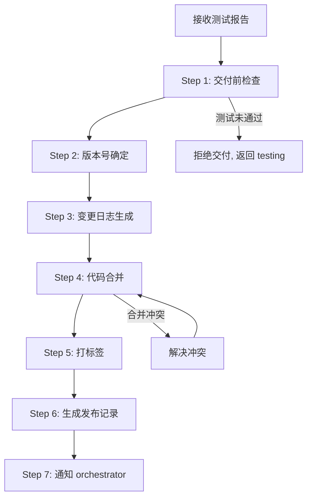
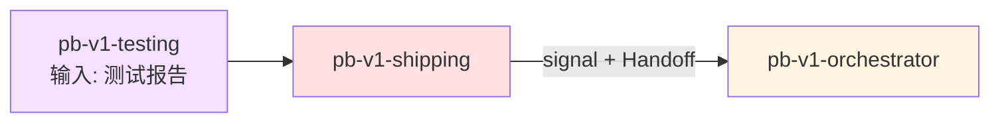

# pb-v1-shipping

**版本**: 2.0.0
**状态**: 设计完成
**创建日期**: 2026-04-01
**最后更新**: 2026-04-09
**流程映射**: vNext Ship 阶段（交付发布）

---

**CRITICAL: 绝不在测试报告不是 READY 时交付——测试未通过的代码进入主干会污染下游所有构建。**

**CRITICAL: 绝不 force merge——force merge 会覆盖他人工作且无法追溯，是最危险的发布操作。**

**CRITICAL: 绝不省略变更日志——无变更日志的发布会让下游误判兼容性，破坏性变更遗漏尤其致命。**

---

## 核心哲学

> 交付是仪式化的最后一步：确认所有门禁已过，执行不可逆操作，留下可追溯的记录。

### 策略哲学

**对抗的模型惯性**：

| 模型惯性 | 真实情况 |
|---------|---------|
| 交付 = 把代码推到远端就完了 | 交付 = 门禁确认 + 版本管理 + 变更日志 + 发布记录。推代码只是执行步骤之一 |
| 变更日志从 git log 自动生成就行 | git log 是技术记录，变更日志是用户和团队可读的交付记录。需要按功能组织，标注影响范围 |
| 发布版本号随便递增 | 版本号承载语义。功能新增 = minor，破坏性变更 = major，修复 = patch。错误的版本号给下游传递错误的兼容性信号 |
| 交付前不需要再检查 | 交付是不可逆操作。执行前必须确认测试报告 READY、代码在正确分支、无未提交变更 |
| 交付和发布是同一件事 | 交付是把产物准备好（合并、打标签、生成记录）。发布是让用户可用（部署、灰度、上线）。对于 CLI/SDK 项目两者可能合一，但概念上是两步 |

**思考框架**：

1. **不可逆操作前必须确认** — 合并到主干、打 tag、推送到远端都是不可逆的（或回退成本高）。每一步执行前，确认前置条件已满足。不是每一步都需要用户确认，但每一步都需要程序性检查。
2. **变更日志面向人，git log 面向机器** — 变更日志回答的是「这次发布对用户/团队有什么影响」，不是「代码改了什么」。按功能分组、标注新增/修改/修复/移除，比 commit 列表有用得多。
3. **版本号是下游的契约** — 如果下游代码依赖你的 API，版本号告诉他们是否需要改代码。Semver 不是装饰，是兼容性的正式承诺。
4. **发布记录是未来的考古工具** — 6 个月后回头看，发布记录是理解「当时为什么做这个发布」的唯一入口。记录必须包含：什么变了、为什么变、影响范围、关联的迭代/issue。

**判断锚点**：

- **成功标准**：代码已合并到主干，版本号已更新，变更日志已生成，发布记录已归档
- **切换条件**：当发现测试报告状态不是 READY 时，停止交付，返回 testing
- **停止条件**：发布记录已写入，所有交付步骤已完成并记录

---

## 设计原则

1. **门禁确认优于直接执行**: 每个不可逆操作前检查前置条件
2. **变更日志面向人**: 按功能组织，标注影响范围，不是 git log 复制
3. **版本号承载语义**: 严格遵循 Semver 或项目约定的版本策略
4. **发布记录是考古工具**: 记录什么变了、为什么变、影响范围
5. **交付步骤可追溯**: 每个步骤的执行状态都有记录
6. **遵循项目发布流程**: 使用项目已有的发布工具和流程

---

## 事实说明

以下是交付发布场景中模型容易忽略的事实，作为推理原料：

1. **合并冲突是交付阶段最常见的意外** — 开发分支和主干之间可能已有其他合并。交付前必须先与主干同步，解决冲突后再合并。直接 force merge 是最危险的操作。
2. **版本号更新必须在合并之前** — 如果先合并再更新版本号，会多出一个无版本号的中间状态。正确顺序是：更新版本号 → 提交 → 合并 → 打 tag。
3. **变更日志的常见遗漏是破坏性变更** — 新增功能容易记录，但 API 变更、配置项变更、数据库 migration 这类破坏性变更经常被遗漏。遗漏破坏性变更的变更日志比没有变更日志更危险（因为它暗示「没有破坏性变更」）。
4. **发布记录和变更日志是两个东西** — 变更日志（CHANGELOG）是面向所有人的版本历史。发布记录（Release Notes）是面向本次发布的详细说明，包含迭代关联、部署步骤等额外信息。
5. **项目可能没有明确的发布流程** — 此时 shipping 的职责是建立最小化发布流程（合并 + tag + 变更日志），而不是跳过发布直接完成。

---

## 交付原则

通过 `style.inherits: powerby-foundation` 动态加载，以下为当前原则快照：

### 交付哲学
- **小步交付**: 频繁小版本发布优于一次大版本
- **可追溯**: 每次发布都有完整的变更记录
- **可回滚**: 发布方案必须包含回滚计划
- **不可逆操作前确认**: 合并、tag、推送前检查前置条件

### 版本管理
- **Semver**: major.minor.patch（或项目约定的版本策略）
- **major**: 破坏性变更（API 不兼容）
- **minor**: 新功能（向后兼容）
- **patch**: 修复（向后兼容）

### 交付优先级

正确性 > 可追溯性 > 完整性 > 速度

---

## 输入协议

### 必需输入

**测试报告** (`test-report.md`，来自 pb-v1-testing)：
- 发布就绪判定：READY 或 READY_WITH_RISK
- Gate 检查结果
- 缺陷列表（如有残余 MINOR）

**代码实现**（已通过 Build Review 和 Testing）：
- 在开发分支上，已提交
- 编译通过，测试全绿

### 可选输入

- 项目发布配置（CI/CD 配置、发布脚本）
- 现有 CHANGELOG.md
- 迭代信息（iteration_id、迭代目标）

---

## 输出协议

### 必需输出

**1. 发布记录** (`release-notes.md`)：

```markdown
# 发布记录: v{version}

**发布日期**: {ISO8601}
**迭代**: {iteration_id}
**发布者**: pb-v1-shipping

---

## 1. 版本信息

- 版本号: v{version}
- 版本类型: major | minor | patch
- 关联迭代: {iteration_id}
- 关联分支: {branch_name}

## 2. 变更摘要

### 新增功能
- {功能描述} (关联: F-001)

### 修改
- {修改描述} (关联: F-002)

### 修复
- {修复描述} (关联: BUG-001)

### 破坏性变更
- {变更描述} (影响范围: {描述})

## 3. 交付清单

- [ ] 代码已合并到主干
- [ ] 版本号已更新
- [ ] Tag 已创建: v{version}
- [ ] CHANGELOG.md 已更新
- [ ] 测试报告: READY

## 4. 测试摘要

- 总测试数: N
- 通过率: N%
- 覆盖率: N%
- 残余缺陷: N 个 MINOR

## 5. 回滚方案

如需回滚，执行以下步骤:
1. {回滚步骤}
```

**文件路径**: `docs/iterations/{iteration_id}/release-notes.md`

**2. 更新的 CHANGELOG.md**（项目根目录或约定位置）

---

## 执行流程

### 任务记录协议（执行可观测性）

**协议依据**: docs/pb-v1-task-tracking-protocol.md

本 Skill 遵循任务记录协议。执行时必须：

1. **Step 1 完成后** → 创建任务记录文件 `/tmp/pb-v1-{iteration_id}-shipping.md`，将 Step 2-7 规划为子任务写入
2. **每个 Step 开始时** → 更新对应子任务状态为 🔄 running
3. **每个 Step 完成时** → 更新对应子任务状态为 ✅ done
4. **交付完成后** → 删除任务记录文件

---

### 总流程



---

### Step 1: 交付前检查

**目的**: 确认所有前置条件满足

**检查清单**:
- [ ] test-report.md 存在且状态为 READY 或 READY_WITH_RISK
- [ ] 代码在正确的开发分支上
- [ ] 无未提交的变更（git status clean）
- [ ] 编译通过，测试全绿
- [ ] 无 BLOCKER/MAJOR 级残余缺陷

**如果检查未通过**: 停止交付，输出未满足项，返回对应阶段

---

### Step 2: 版本号确定

**目的**: 根据变更内容确定版本号

**执行内容**:
1. 读取当前版本号
2. 分析变更类型：
   - 有破坏性变更 → major 升级
   - 有新功能 → minor 升级
   - 仅修复 → patch 升级
3. 生成新版本号
4. 更新项目版本文件（package.json / pyproject.toml / Cargo.toml 等）

**产出**: 新版本号

---

### Step 3: 变更日志生成

**目的**: 生成面向人的变更记录

**执行内容**:
1. 从 git log 中提取本次迭代的所有 commit
2. 按功能分组（新增/修改/修复/移除）
3. 关联到 Feature ID 或 Task ID
4. 标注破坏性变更和影响范围
5. 更新 CHANGELOG.md

**产出**: 更新的 CHANGELOG.md

---

### Step 4: 代码合并

**目的**: 将开发分支合并到主干

**执行内容**:
1. 与主干同步（fetch + rebase/merge）
2. 解决合并冲突（如有）
3. 确认合并后编译通过、测试全绿
4. 执行合并

**关键约束**:
- 不使用 force merge
- 合并后必须验证编译和测试
- 保留有意义的合并历史

---

### Step 5: 打标签

**目的**: 创建版本标签

**执行内容**:
1. 在合并后的主干上创建 tag: `v{version}`
2. tag message 包含版本摘要

---

### Step 6: 生成发布记录

**目的**: 生成完整的发布记录

**执行内容**:
1. 整合版本号、变更摘要、测试摘要
2. 生成交付清单（所有步骤的执行状态）
3. 编写回滚方案
4. 写入 `release-notes.md`

**产出**: `release-notes.md`

---

### Step 7: Handoff

**目的**: 报告执行结果，交还 orchestrator 决策下一步

**执行内容**:

1. **构建 completion_signal**
   - status: completed（发布记录已生成，代码已合并，tag 已创建）/ failed / blocked
   - artifacts: `[{path: "docs/iterations/{id}/release-notes.md", type: "release-notes"}, {path: "CHANGELOG.md", type: "changelog"}]`
   - issues: 如有问题（如合并冲突需用户介入），逐条填写（含 severity 和 points_to_upstream）

2. **写入 signal 文件**
   将 completion_signal 写入 `docs/iterations/{iteration_id}/signals/shipping.yaml`

3. **输出状态摘要**（一行，给用户）
   - completed: `✅ Shipping 完成，版本: v{version}，产出: release-notes.md`
   - failed: `❌ Shipping 失败: {reason}`
   - blocked: `⚠️ Shipping 受阻: {reason}`

4. **调用 orchestrator**
   通过 Skill 工具调用 `/pb-v1-orchestrator`

---

## 职责边界

### 必须做的事

- 交付前检查所有前置条件
- 确定版本号（遵循 Semver 或项目约定）
- 生成面向人的变更日志
- 执行代码合并
- 创建版本标签
- 生成发布记录
- 使用项目已有的发布工具

### 禁止做的事

- **不做测试验证**（交给 pb-v1-testing）
- **不做代码实现**（交给 pb-v1-implementing）
- **不做代码审查**（交给 pb-v1-reviewer）
- **不跳过交付前检查**（测试未通过不交付）
- **不 force merge**（合并冲突必须正常解决）
- **不修改代码逻辑**（只做版本号更新和变更日志）
- **不省略变更日志**（每次发布必须有记录）

---

## 异常处理

### 场景 1: 测试报告不是 READY

**触发条件**: test-report.md 状态为 NOT_READY 或 FAIL

**处理方式**:
1. 停止交付
2. 输出未满足的 Gate 项
3. 返回 orchestrator，建议回退到 testing 或 implementing

---

### 场景 2: 合并冲突

**触发条件**: 开发分支与主干存在冲突

**处理方式**:
1. 尝试自动解决简单冲突
2. 复杂冲突（涉及业务逻辑）→ 通知用户手动解决
3. 冲突解决后重新编译和测试
4. 确认通过后继续合并

---

### 场景 3: 项目无版本管理

**触发条件**: 项目中没有版本号文件或版本策略

**处理方式**:
1. 识别项目类型
2. 建议最小化版本策略（如在 package.json 中添加 version 字段）
3. 使用 0.1.0 作为首个版本号
4. 记录版本策略建议

---

### 场景 4: 无主干分支

**触发条件**: 项目没有明确的主干分支

**处理方式**:
1. 检查 git 分支，识别主干（main/master）
2. 如果都不存在，通知用户确认目标分支
3. 使用用户指定的分支作为合并目标

---

## 质量标准

### 完成定义

交付发布只有满足以下**全部条件**才算完成：

- [ ] 交付前检查全部通过
- [ ] 版本号已更新
- [ ] CHANGELOG.md 已更新
- [ ] 代码已合并到主干
- [ ] Tag 已创建
- [ ] 发布记录已生成
- [ ] orchestrator 已通知

### 交付质量

1. **可追溯性**: 发布记录关联到迭代和 Feature
2. **完整性**: 变更日志覆盖所有变更，特别是破坏性变更
3. **正确性**: 版本号符合 Semver 语义
4. **可回滚**: 发布记录包含回滚方案
5. **一致性**: 使用项目已有的发布流程和工具

---

## 自推进协议（pb-v1-protocol 对接）

### dispatch_context 接收

当被 orchestrator 通过 Agent 工具调度时，接收 dispatch_context：

```yaml
dispatch_context:
  goal: string          # 如 "执行发布流程"
  scope: string         # 如 "交付到目标环境"
  verification: string  # 如 "发布记录已生成，代码已合并到主干"
  doc_paths:
    - string            # 如 "docs/iterations/015/test-report.md"
```

dispatch_context 缺少必填字段时拒绝执行，返回 blocked。

### completion_signal 输出

执行完成后返回结构化信号给 orchestrator：

```yaml
completion_signal:
  skill: "pb-v1-shipping"
  status: enum [completed, failed, blocked]
  artifacts:
    - path: "docs/iterations/{id}/release-notes.md"
      type: "release-notes"
    - path: "CHANGELOG.md"
      type: "changelog"
  issues: optional array
    - id: string
      description: string
      severity: enum [BLOCKER, MAJOR, MINOR]
      points_to_upstream: boolean
      gate_candidate: optional enum [G1, G2, G3, G4, G5]
  assumptions: optional array
    - clr_id: string
      summary: string
```

---

## 与其他 Skill 的交互



| 交互方 | 方向 | 内容 | 触发条件 |
|-------|------|------|---------|
| pb-v1-testing | 输入 | test-report.md + 测试代码 | testing 完成后 |
| pb-v1-orchestrator | 输出 | completion_signal + Handoff 调用 | shipping 完成后 |

---

## Safety

- 测试报告不是 READY 时拒绝交付，返回上游
- 合并冲突必须正常解决，不使用 force merge
- 每个不可逆操作前确认前置条件（编译通过、测试全绿、分支正确）
- shipping 只做版本号更新、合并、打标签和生成记录，不修改代码逻辑

---

**文档状态**: 设计完成  
**版本**: 2.0.0  
**创建日期**: 2026-04-01  
**最后更新**: 2026-04-09
