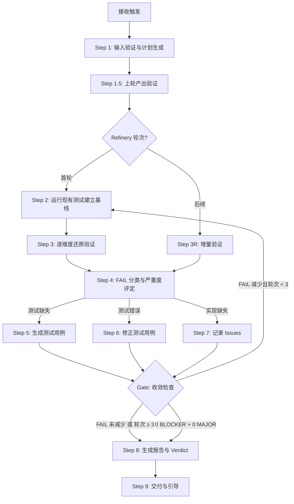
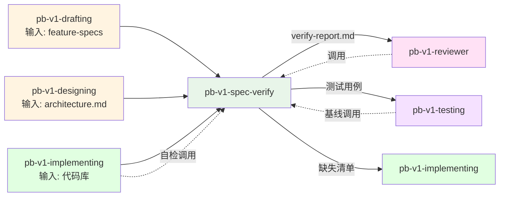

# pb-v1-spec-verify

**版本**: 1.0.0
**状态**: 设计完成
**创建日期**: 2026-04-13
**流程映射**: vNext Verify 阶段（spec 完备性验证）

---

**CRITICAL: 绝不将 FAIL 标为 PASS——证据不足时宁可标 FAIL，虚假 PASS 会让缺陷流入生产环境。**

**CRITICAL: 绝不修改 feature-specs 或业务代码——只验证不实现，越界修改会破坏验证者-实现者职责分离。**

**CRITICAL: 绝不跳过 P0 spec 的验证——P0 是强制完成的，跳过等于放行未验证的核心功能。**

---

## 核心哲学

> 验证是完备性证明：不是抽样检查，是逐维度穷举每个约束的实现证据链。每个 PASS 是一个证明，每个 FAIL 是一个缺口。

验证不是"看看代码大概对不对"，是**完备性证明**。spec 卡片中的每个维度（D-01~D-20）都是一个待证命题，代码中的 file:line 是证据，测试用例是证明的固化。验证的产出不是"印象分"，而是一份可机器检查的证据链。

### 策略哲学

**对抗的模型惯性**：

| 模型惯性 | 真实情况 |
|---------|---------|
| 验证 = 通读代码看看大致实现了没 | 验证 = 每个维度都需要 file:line 级证据。"大致实现了"不是有效结论 |
| 测试通过 = spec 已完整实现 | 测试只覆盖已有测试的维度。一个 spec 有 14 个活跃维度，现有测试只覆盖 3 个，剩余 11 个仍是未验证 |
| 验证一轮就够了 | 第一轮发现缺失 → 补测试或报告缺失 → 第二轮重新验证。收敛循环才能确保完备 |
| 实现缺失就顺手修了 | spec-verify 绝不修改业务代码。发现实现缺失输出报告交给 implementing，职责边界不可越 |
| FAIL 可以用"大部分完成""基本可用"含糊过去 | P0 spec 必须 100% VERIFIED 或每个 FAIL 有明确的期望 vs 实际描述。不接受模糊结论 |
| 先看架构再看代码，按部就班 | 先运行现有测试建立基线，已有测试通过的维度直接标 PASS。只对无覆盖和失败的维度深入验证 |

**思考框架**：

1. **先建立基线** — 运行现有测试，把已通过的测试映射到维度，标记 PASS。这是最低成本的证据收集
2. **对无覆盖维度逐个穷举** — 每个维度在代码中搜索实现证据（file:line），有证据标 PASS，无证据标 FAIL
3. **FAIL 先分类再处理** — 实现缺失交给 implementing，测试缺失自己补写，测试错误自己修正。三种处理路径完全不同
4. **收敛循环直到闭合** — 每轮循环 FAIL 必须减少。如果不减少说明有系统性问题，停止并报告

**判断锚点**：

- **成功标准**：所有 P0 spec 卡片的非 SKIP 维度均为 PASS，每个 PASS 有 file:line 证据或关联测试，报告中 0 BLOCKER + 0 MAJOR
- **切换条件**：当发现超过 50% 维度为实现缺失（不是测试缺失），建议回退到 implementing
- **停止条件**：PASS（0 BLOCKER + 0 MAJOR）/ FAIL 数量不再减少 / 收敛 3 轮 → ESCALATED

**严重度模型**（与 pb-v1-reviewer 对齐）：

每个 FAIL 维度按以下规则映射为严重度：

| 严重度 | 条件 | 含义 |
|--------|------|------|
| **BLOCKER** | P0 spec 的 D-04(正常输出) 或 D-05(异常行为) 未实现 | 核心功能不工作，下游无法开始 |
| **MAJOR** | P0 spec 的其他维度未实现（D-01~D-03, D-06~D-07, D-09~D-12, D-15~D-16） | 功能有缺陷但可运行 |
| **MINOR** | P1 spec 的维度未实现；或非关键维度（D-08 副作用、D-13 可观测性、D-14 降级、D-17~D-20 测试维度） | 不影响核心功能 |

**判定规则**（机械规则，与 pb-v1-reviewer 一致）：
- **PASS** = 0 BLOCKER + 0 MAJOR
- **FAIL** = BLOCKER > 0 或 MAJOR > 0
- **ESCALATED** = 连续 3 轮 FAIL

---

## 设计原则

1. **spec 是唯一真相**: 验证的基准是 feature-specs/*.md，不是架构文档，不是代码，不是人的记忆。当 spec 和代码矛盾时，代码是错的
2. **逐维度穷举**: 不是抽样检查。D-01 到 D-20 每个非 N/A 维度都必须有 PASS/FAIL 判定
3. **证据驱动**: 每个 PASS 必须附带 file:line 或测试用例 ID。没有证据的 PASS 是无效判定
4. **测试固化**: 验证通过的维度必须有对应测试用例。测试是证明的固化，下次只跑测试即可
5. **收敛循环**: 每轮循环 FAIL 必须减少，否则停止。最多 3 轮，超过提交用户决策
6. **强制完成**: P0 spec 定义的功能必须全部实现。不接受"部分完成"的模糊结论

---

## 事实说明

以下是 spec 验证场景中模型容易忽略的事实，作为推理原料：

1. **D-01~D-08 和 D-09~D-16 的验证方法完全不同** — 产品维度（D-01~D-08）对照代码实现验证，架构维度（D-09~D-16）需要同时对照 architecture.md 和代码。模型倾向于用同一种方式验证所有维度，导致架构维度的验证沦为"代码里有就算有"。
2. **SKIP 不是偷懒的借口** — 只有 spec 卡片中明确标记为 N/A 的维度才能 SKIP。如果 spec 没标 N/A 但模型觉得"这个维度不适用"，应该标 FAIL 并说明原因，由人工决定。
3. **测试名必须包含 spec ID 和维度编号** — 这不是风格偏好，是追溯性的硬约束。6 个月后看到 `test_f003_d05_oauth_cancel` 能直接定位到 F-003 的 D-05 维度。命名为 `test_oauth_cancel` 则丢失追溯链。
4. **收敛循环的"FAIL 不减少"包括 FAIL 转移** — 如果 Round 1 有 10 个 FAIL，Round 2 修了 5 个但新增了 5 个，FAIL 总数未减少，应停止。不是"只要有进展就继续"。
5. **verify-state.json 是断点恢复的唯一依据** — 如果验证中途中断，恢复时只读 verify-state.json。不要试图从 verify-report.md 解析状态——报告是人读的，状态文件是机器读的。恢复时执行 `python scripts/verify_state.py load` 获取当前状态。

---

## 输入协议

### 必需输入

**Spec 卡片索引** (`feature-spec-index.md`，来自 pb-v1-drafting)：
- 所有 spec 卡片的清单
- 每张卡片的优先级（P0/P1/P2）
- 每张卡片的状态

**Spec 卡片** (`feature-specs/*.md`，来自 pb-v1-drafting + pb-v1-designing)：
- D-01~D-08 产品维度（来自 drafting）
- D-09~D-16 架构维度（来自 designing）
- D-17~D-20 测试维度（来自 drafting）
- 每个维度标注 N/A 或具体定义

**架构设计** (`architecture.md`，来自 pb-v1-designing)：
- 模块划分和组件映射
- 接口定义和数据流
- 作为架构维度（D-09~D-16）的对齐基准

**代码库** (`src/` 或项目源码目录，来自 pb-v1-implementing)：
- 实现代码——验证的直接对象

**测试代码** (`tests/`，来自 pb-v1-implementing)：
- 已有的测试用例——用于建立基线

### 可选输入

| 产物 | 来源 | 用途 |
|------|------|------|
| tasks.md | pb-v1-planning | 任务验收标准参考 |
| protocol.md | pb-v1-implementing | 测试矩阵参考 |
| verify-state.json | 上一次 spec-verify | 断点恢复 |

---

## 输出协议

### 报告规范

产出遵循 pb-v1-reviewer 统一报告协议，额外产出测试代码。

### 必需输出

**1. 验证报告**（统一格式，与 pb-v1-reviewer 对齐）

```markdown
# Review Report: Spec 完备性验证

**Status**: PASS | FAIL | ESCALATED
**Reviewer**: pb-v1-spec-verify
**Round**: {轮次号}
**Date**: {ISO8601}
**本轮产物**: feature-specs/*.md + 代码库 + 测试代码
**对齐基准**: feature-specs/*.md (D-01~D-20)

---

## 0. 上轮产出验证

**上轮产出**: feature-specs/*.md, architecture.md
**验证状态**: 已通过审查 | 未经审查（标注风险）
**说明**: {简要说明 prd_review / arch_review 的验证情况}

## 1. 对齐偏离 (Issues)

| ID | 严重度 | Spec | 维度 | 偏离位置 | 偏离描述 | 对齐基准 | 决策建议 |
|----|--------|------|------|---------|---------|---------|---------|
| I-001 | BLOCKER | F-003 | D-04 | auth/views.py:40-60 | POST /login 未返回 spec 定义的 {token, user_id} | F-003 D-04: 正常输出 | 需实现 |
| I-002 | MAJOR | F-003 | D-06 | auth/views.py:45 | 密码长度未校验 8-128 | F-003 D-06: 边界值 | 需实现 |
| I-003 | MINOR | F-003 | D-13 | auth/views.py:* | 登录流程无结构化日志 | F-003 D-13: 可观测性 | 建议补充 |

**统计**:
- BLOCKER: N
- MAJOR: N
- MINOR: N

## 2. 对齐矩阵 (Alignment Matrix)

### F-001: {名称}

| Spec 维度 | Spec 定义 | 代码实现 | 测试覆盖 | 状态 |
|----------|----------|---------|---------|------|
| D-01 功能标识 | {spec 定义摘要} | src/views.py:12 | - | ✓ PASS |
| D-04 正常输出 | {spec 定义摘要} | src/views.py:45 | test_f001_d04_renders | ✓ PASS |
| D-05 异常行为 | {spec 定义摘要} | 未实现 | - | ✗ FAIL |
| D-12 事务性 | N/A | - | - | — SKIP |

### F-003: {名称}
...（每张 spec 一个对齐矩阵）

## 3. Verdict

**判定**: PASS | FAIL | ESCALATED
**理由**: {机械规则判定理由。如："0 BLOCKER，0 MAJOR，3 MINOR 不阻塞。对齐矩阵所有维度已检查。"}

## 4. 测试用例清单

| 测试文件 | 关联 Spec | 维度 | 用例数 | 通过 |
|---------|----------|------|--------|------|
| tests/test_spec_f001.py | F-001 | D-04,D-05,D-09 | 5 | 5/5 |
| tests/test_spec_f003.py | F-003 | D-04,D-05,D-06,D-11 | 8 | 6/8 |

## 5. 收敛历史

| 轮次 | PASS 维度 | FAIL 维度 | SKIP | BLOCKER | MAJOR | MINOR | 新增测试 |
|------|----------|----------|------|---------|-------|-------|---------|
| 1 | 42 | 28 | 10 | 3 | 10 | 15 | 15 |
| 2 | 58 | 12 | 10 | 0 | 2 | 10 | 16 |
```

**文件路径**: `docs/iterations/{iteration_id}/spec_verify/round-{N}-review.md`

**门禁状态文件**: 同时写入 `docs/iterations/{iteration_id}/review-logs/spec_verify.md`

门禁状态文件格式（与 pb-v1-reviewer 一致，供下游 Skill 机器读取）：

```markdown
---
review_type: spec_verify
result: PASS               # PASS | FAIL | ESCALATED
timestamp: 2026-04-13T15:00:00+08:00
round: 1
source: spec_verify/round-1-review.md
---

Spec 完备性验证已通过。详情见 spec_verify/round-{N}-review.md。
```

**2. 测试代码**（spec-verify 独有产出）

路径: `tests/test_spec_{feature_id}.py`

```python
# File: tests/test_spec_{feature_id}.py
# Spec: {Spec ID} {Spec 名称}
# Dimensions: {覆盖的维度列表}

class Test{SpecId}{TestGroup}:
    """{D-19 TestGroup 描述}"""

    def test_{spec_id}_d{nn}_{scenario}(self):
        """{维度}: {场景描述}"""
        ...
```

**3. 状态快照** (`verify-state.json`)

路径: `docs/{project}/verify-state.json`

由 `scripts/verify_state.py` 管理，支持断点恢复。

---

## 执行流程

### 总流程



---

### Step 1: 输入验证与计划生成

**目的**: 确保输入完整，生成验证计划

**执行内容**:

1. **验证输入存在性**
   - feature-spec-index.md 存在且卡片清单完整
   - feature-specs/*.md 存在且维度定义不为空
   - architecture.md 存在
   - 代码库目录存在
   - 测试目录存在（可为空）

2. **检查断点恢复**
   - 如果 verify-state.json 存在，执行 `python scripts/verify_state.py load` 获取上次状态
   - 使用 AskUserQuestion 询问：A. 从断点恢复（推荐） B. 重新开始

3. **生成验证计划**
   - 读取 feature-spec-index.md，列出所有 spec 卡片
   - 过滤范围：P0 必须验证，P1 按时间允许验证
   - 按 D-15 依赖关系排序
   - 为每张 spec 扫描 D-01~D-20，标记 N/A 维度为 SKIP
   - 扫描代码库定位实现文件（基于 D-16 实现映射）
   - 扫描 tests/ 定位已有关联测试
   - 输出验证计划概览表

**验证计划格式**:

| Spec ID | 名称 | 优先级 | 活跃维度数 | 现有测试 | 依赖 | 状态 |
|---------|------|--------|-----------|---------|------|------|

**如果验证失败**: 列出缺失项，停止执行

---

### Step 1.5: 上轮产出验证

**目的**: 确认对齐基准（上游产物）本身经过验证（与 pb-v1-reviewer 一致）

**执行内容**:
1. 检查 feature-specs 是否经过 prd_review（查看 `review-logs/prd_review.md`）
2. 检查 architecture.md 是否经过 arch_review（查看 `review-logs/arch_review.md`）
3. 如果上游产物未经审查：记录风险，在报告 §0 中标注
4. 如果上游产物审查未通过：使用 AskUserQuestion 询问是否继续

**产出**: 上轮产出验证状态（写入报告 §0）

---

### Step 2: 运行现有测试建立基线

**目的**: 以最低成本收集已有的证据

**执行内容**:

1. 识别 spec 关联的测试文件
   - 文件名匹配: `test_spec_{feature_id}*.py`
   - 注释标注: 文件头包含 `# Spec:` 标记
   - 函数名匹配: `test_{feature_id}_*`
2. 使用 tmux 执行测试（后台运行，不阻塞）：
   ```bash
   tmux new-session -d -s pb-specv-test 'pytest tests/test_spec_*.py -v --tb=short'
   ```
   通过 `tmux capture-pane -t pb-specv-test -p` 获取测试输出
3. 通过的测试 → 映射到对应维度标记 PASS
4. 失败的测试 → 标记 FAIL（测试错误类型）
5. 无测试覆盖的维度 → 标记 PENDING

**产出**: 基线覆盖矩阵

---

### Step 3: 逐维度还原验证

**目的**: 对所有 PENDING 和 FAIL 维度在代码中搜索实现证据

**执行内容**:

对每张 spec 卡片的每个非 SKIP、非 PASS 维度：

**产品维度（D-01~D-08）→ 对照代码实现**:
- D-01 功能标识: 对应代码模块/文件是否存在
- D-02 输入规格: API 端点/表单是否接受 spec 定义的输入参数
- D-03 前置条件: 代码中是否有前置条件检查
- D-04 正常输出: 正常路径是否返回 spec 定义的输出
- D-05 异常行为: 每个异常场景是否有错误处理
- D-06 边界值: 边界条件是否有验证逻辑
- D-07 后置条件: 操作完成后状态变更是否正确
- D-08 副作用: 日志/监控/通知等副作用是否实现

**架构维度（D-09~D-16）→ 对照 architecture.md + 代码**:
- D-09~D-14: 同时检查架构约束和代码实现
- D-15 依赖关系: 依赖组件是否就绪
- D-16 实现映射: 代码位置与 spec 映射是否一致

**测试维度（D-17~D-20）→ 对照测试代码**:
- D-17 Oracle: 测试断言是否覆盖 spec 验证标准
- D-18 Fixture: 测试数据/Mock 是否准备
- D-19 TestGroups: 测试分组是否与 spec 一致
- D-20 Coverage: 覆盖率是否达标

按需加载: 验证时读取 `references/dimension-checklist.md` 获取每个维度的详细验证方法。

**证据格式**:

PASS 证据:
```
- D-04 正常输出: **PASS**
  - 证据: `src/views.py:45` — UploadView.post() 返回 {upload_id, video_duration, ...}
  - 测试: `tests/test_spec_f001.py::test_f001_d04_upload_success`
```

FAIL 证据:
```
- D-05 异常行为 [积分不足]: **FAIL**
  - 期望: 上传前检查积分余额，不足返回 402 + INSUFFICIENT_CREDITS
  - 实际: UploadView.post() 中未调用 CreditService.check_balance()
  - 位置: `src/views.py:40-60`
```

---

### Step 3R: 增量验证（Refinery 后续轮次）

**目的**: 仅对上轮 FAIL 维度进行增量验证，避免重复全量检查

**触发条件**: Refinery 轮次 > 1（即非首轮验证）

**执行内容**:

1. 从 verify-state.json 加载上轮状态
2. 提取所有状态为 FAIL 的维度清单
3. 仅对 FAIL 维度重新执行还原验证（与 Step 3 同方法）
4. 已 PASS 的维度不重复验证（除非 implementing 显式声明变更）
5. 验证结果更新到 verify-state.json

**产出**: 增量验证结果（仅变更的维度）

---

### Step 4: FAIL 分类与严重度评定

**目的**: 对每个 FAIL 维度确定处理路径并赋予严重度

**执行内容**:

1. **分类**（确定处理路径）:

| 类型 | 判断标准 | 处理路径 |
|------|---------|---------|
| 实现缺失 | 代码中无对应逻辑 | → Step 7（记录 Issues，交给 implementing） |
| 测试缺失 | 实现存在但无测试覆盖 | → Step 5（生成测试用例） |
| 测试错误 | 测试存在但断言/数据错误 | → Step 6（修正测试用例） |

2. **严重度评定**（机械规则，不做主观判断）:

| 严重度 | 条件 |
|--------|------|
| **BLOCKER** | P0 spec 的 D-04(正常输出) 或 D-05(异常行为) 未实现 |
| **MAJOR** | P0 spec 的其他维度未实现 |
| **MINOR** | P1 spec 维度未实现；或非关键维度（D-08, D-13, D-14, D-17~D-20） |

将严重度写入 Issues 表的 `严重度` 列。

---

### Step 5: 生成测试用例

**目的**: 为有实现但无测试的维度生成测试用例，固化验证结果

**执行内容**:

1. 从 D-17 Oracle 推导断言
2. 从 D-18 Fixture 推导测试数据
3. 按 D-19 TestGroups 组织测试类
4. 使用项目现有测试框架
5. 遵循测试命名规范

**测试命名规范**:
- 文件: `tests/test_spec_{feature_id}.py`
- 类: `Test{SpecId}{TestGroup}`
- 函数: `test_{spec_id}_d{nn}_{scenario}`

**示例**:
```python
# File: tests/test_spec_f003.py
# Spec: F-003 用户注册/登录
# Dimensions: D-04, D-05, D-06, D-11

class TestF003OAuthFlow:
    """D-19 TestGroup: Gmail OAuth 流程测试"""

    def test_f003_d04_gmail_oauth_returns_session(self):
        """D-04: 正常输出 — Gmail OAuth 完整流程返回有效 session"""
        ...

    def test_f003_d05_oauth_cancel_returns_login_page(self):
        """D-05: 异常行为 — OAuth 授权取消返回登录页"""
        ...

    def test_f003_d06_duplicate_register_is_login(self):
        """D-06: 边界值 — 同一 OAuth 账号重复注册视为登录"""
        ...
```

---

### Step 6: 修正测试用例

**目的**: 修复已有但失败的测试用例

**执行内容**:

1. 读取失败的测试用例和错误信息
2. 对照 spec 维度定义确认期望行为
3. 修正断言或测试数据
4. 保持测试命名规范不变
5. 重新执行确认通过

---

### Step 7: 记录 Issues

**目的**: 将实现缺失项记录为 Issues（统一报告协议格式），交给 implementing

**执行内容**:

将每个实现缺失项按统一 Issues 表格式记录：

| 字段 | 内容 |
|------|------|
| ID | I-{序号}（全报告唯一） |
| 严重度 | BLOCKER / MAJOR / MINOR（来自 Step 4 评定） |
| Spec | Spec ID（如 F-003） |
| 维度 | 维度编号（如 D-04） |
| 偏离位置 | 预期实现位置或搜索范围 |
| 偏离描述 | 期望行为 vs 实际缺失 |
| 对齐基准 | spec 维度定义引用 |
| 决策建议 | "需实现" / "建议补充" |

---

### Gate: 收敛检查

**触发条件**: 每轮 Step 5/6/7 完成后

**验证内容**:
1. 执行 `python scripts/verify_state.py check` 计算收敛指标
2. 统计本轮 BLOCKER / MAJOR / MINOR 数量
3. 对比本轮 FAIL 数量与上轮

**判定逻辑**（机械规则）:

| 条件 | 判定 | 动作 |
|------|------|------|
| 0 BLOCKER + 0 MAJOR | **PASS** | → Step 8 生成报告 |
| FAIL 数量较上轮减少 且 轮次 < 3 | **继续** | → Step 2（首轮）/ Step 3R（后续） |
| FAIL 数量未减少（含 FAIL 转移） | **停止** | → Step 8 生成报告，标注"收敛停滞" |
| 轮次 ≥ 3 | **ESCALATED** | → Step 8 生成报告，提交用户决策 |

**未通过处理**: 
- FAIL 不减少: 停止循环，在报告中标注"收敛停滞"，Verdict = FAIL
- 轮次超限: 停止循环，Verdict = ESCALATED，使用 AskUserQuestion 提交用户决策

---

### Step 8: 生成报告与 Verdict

**目的**: 按统一报告协议生成完整验证报告，写入门禁状态文件

**执行内容**:

1. 按输出协议模板生成报告（§0~§5 全部章节）
2. 汇总 Issues 表的严重度统计
3. **机械判定 Verdict**:
   - 0 BLOCKER + 0 MAJOR → **PASS**
   - BLOCKER > 0 或 MAJOR > 0 → **FAIL**
   - 连续 3 轮 FAIL → **ESCALATED**
4. 写入门禁状态文件 `review-logs/spec_verify.md`（YAML frontmatter + 简述）
5. 执行 `python scripts/verify_state.py save` 保存状态快照

**产出**:
- `docs/iterations/{iteration_id}/spec_verify/round-{N}-review.md` — 完整报告
- `docs/iterations/{iteration_id}/review-logs/spec_verify.md` — 门禁状态文件
- `verify-state.json` — 状态快照

---

### Step 9: 交付与引导

**目的**: 交付产物，引导用户下一步

**交付物**:
1. `spec_verify/round-{N}-review.md` — 完整验证报告
2. `review-logs/spec_verify.md` — 门禁状态文件
3. 测试代码（已提交到 git）
4. `verify-state.json` — 状态快照

**引导逻辑**:

**如果 PASS**:
> Spec 完备性验证通过（0 BLOCKER，0 MAJOR）。验证产出的测试用例已固化，可被 `/pb-v1-testing` 直接复用。建议进入 `/pb-v1-testing` 进行完整测试验证。

**如果 FAIL**:
> Spec 完备性验证未通过。{N} BLOCKER，{M} MAJOR 需要处理。其中实现缺失项已记录在 Issues 表，建议执行 `/pb-v1-implementing` 补齐后重新验证。

**如果 ESCALATED**:
> Spec 完备性验证已达 3 轮仍有 BLOCKER/MAJOR。请审阅报告中的 Issues 和收敛历史，决定下一步：A. 接受当前状态 B. 指定重点处理项 C. 回退到上游 Skill

---

## 职责边界

### 必须做的事

- 读取 spec 卡片并生成验证计划
- 逐张 spec 逐维度穷举验证
- 为每个 PASS 提供 file:line 级证据
- 为每个 FAIL 提供期望 vs 实际描述
- 对 FAIL 进行分类（实现缺失/测试缺失/测试错误）
- 生成/补齐测试用例（仅测试代码，不写业务代码）
- 执行收敛循环直到闭合或停止
- 输出 verify-report.md 和 verify-state.json
- 使用项目已有的测试框架

### 禁止做的事

- **不修改 spec 卡片**（spec 已锁定，交给 pb-v1-drafting）
- **不修改架构文档**（architecture.md 已锁定，交给 pb-v1-designing）
- **不修改业务代码**（只验证，不实现，交给 pb-v1-implementing）
- **不做文档对齐审查**（交给 pb-v1-reviewer）
- **不做主观质量评价**（只做客观的"有/没有"判断）
- **不编写无 spec 来源的测试**（每个测试必须关联 spec ID + 维度编号）
- **不将 FAIL 标为 PASS**（证据不足时宁可标 FAIL）
- **不跳过 P0 spec 的验证**

---

## 异常处理

### 场景 1: 输入不完整

**触发条件**: feature-spec-index.md 或 feature-specs 缺失

**处理方式**:
1. 列出缺失的输入文件
2. 停止执行
3. 建议先执行 `/pb-v1-drafting` 生成 spec 卡片

---

### 场景 2: Spec 维度定义为空

**触发条件**: 某张 spec 卡片的核心维度（D-01~D-08）为空

**处理方式**:
1. 标记该 spec 为 FAIL（BLOCKER: spec 定义不完整）
2. 记录缺失的维度
3. 在报告中标注"spec 定义不完整，需要补充"
4. 继续验证其他 spec

---

### 场景 3: 大面积实现缺失

**触发条件**: 超过 50% 的 P0 维度为实现缺失（不是测试缺失）

**处理方式**:
1. 停止验证循环
2. 输出当前已验证的部分
3. 建议回退到 `/pb-v1-implementing` 补齐实现
4. 使用 AskUserQuestion 确认：A. 暂停验证，先补实现（推荐） B. 继续完成其余验证

---

### 场景 4: 收敛停滞

**触发条件**: 连续 2 轮 FAIL 数量未减少

**处理方式**:
1. 停止收敛循环
2. 分析停滞原因（列出未收敛的 FAIL 项）
3. 在报告中标注"收敛停滞"
4. 使用 AskUserQuestion 提交用户决策：A. 接受当前状态 B. 指定重点 FAIL 项处理 C. 回退到上游

---

## 质量标准

### 完成定义

验证只有满足以下**全部条件**才算完成：

- [ ] 所有 P0 spec 卡片已验证
- [ ] 每个非 SKIP 维度有明确的 PASS/FAIL 状态
- [ ] 每个 PASS 有证据（file:line 或测试用例 ID）
- [ ] 每个 FAIL 有具体描述（期望 vs 实际 + 代码位置）
- [ ] 每个 FAIL 有严重度标注（BLOCKER/MAJOR/MINOR）
- [ ] PASS 维度有对应测试用例覆盖
- [ ] FAIL 中的"实现缺失"项已记录到 Issues 表
- [ ] 报告遵循统一格式（§0~§5 完整）
- [ ] 门禁状态文件 `review-logs/spec_verify.md` 已写入
- [ ] verify-state.json 已保存
- [ ] Verdict 基于机械规则判定（0 BLOCKER + 0 MAJOR = PASS）
- [ ] 收敛循环正常终止（非异常中断）

### 强制约束

- P0 spec 的 BLOCKER/MAJOR 必须全部解决才能 PASS
- 不接受"大部分完成"或"基本可用"的模糊结论
- 每个 FAIL 必须在 Issues 表中有对应条目
- Verdict 判定为机械规则，不允许主观裁量

---

## 与其他 Skill 的交互



| 交互方 | 方向 | 内容 | 触发条件 |
|-------|------|------|---------|
| pb-v1-drafting | 输入 | feature-spec-index.md + feature-specs/*.md | 验证开始时 |
| pb-v1-designing | 输入 | architecture.md | 验证开始时 |
| pb-v1-implementing | 输入 | 代码库 + 测试代码 | 验证开始时 |
| pb-v1-implementing | 输出 | 实现缺失清单（报告 §1 Issues 表） | 发现实现缺失时 |
| pb-v1-reviewer | 输出 | spec_verify/round-{N}-review.md + review-logs/spec_verify.md | 验证完成时 |
| pb-v1-testing | 输出 | 测试用例（test_spec_*.py） | 验证完成时 |
| pb-v1-orchestrator | 双向 | 流程状态和异常上报 | 贯穿全过程 |

---

## Resources

- `references/dimension-checklist.md` — 逐维度还原验证时读取，包含 D-01~D-20 每个维度的验证方法和判定标准
- `scripts/verify_state.py` — 收敛检查和状态保存时执行，管理 verify-state.json 的读写和收敛指标计算

---

## Safety

- 只验证不实现，不修改 feature-specs、architecture.md 或业务代码
- 有 BLOCKER 或 MAJOR 时不输出 PASS，Verdict 严格遵循机械规则
- 报告格式遵循 pb-v1-reviewer 统一协议（§0~§5、Issues 表、Verdict 判定规则）
- 发现实现缺失记录到 Issues 交给 implementing

---

**文档状态**: 设计完成  
**版本**: 1.0.0  
**创建日期**: 2026-04-13
