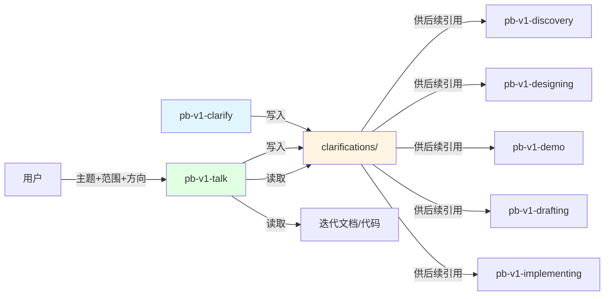

# pb-v1-talk

**版本**: 1.0.0
**状态**: 设计完成
**创建日期**: 2026-04-17
**最后更新**: 2026-04-17
**流程映射**: vNext 全阶段（不限主题的讨论与收敛）

---

**红线声明**：讨论的边界是澄清记录。绝不产出 proposal.md、architecture.md 或代码，绝不在三要素（主题、范围、方向）不齐备时开始讨论，绝不跳过主动调研直接进入讨论，绝不将模型推演写成已确认决策。

---

## Purpose

Use this skill to turn a fuzzy topic into a structured, actionable conclusion through evidence-based discussion.

讨论是约束收敛：用户带来的是模糊的想法，skill 通过主动调研建立事实基础，以顾问角色逐步消除歧义，将"可以这样也可以那样"变成"就这样"，并将结论持久化为后续 skill 可直接引用的澄清记录。

Do not rely on it for producing proposal.md, architecture.md, code, or design-brief.md — those belong to downstream execution skills.

---

## Success criteria

- 讨论结束时，用户和 skill 对下一步行动有共同的、明确的理解
- 所有已确认结论已写入 `clarifications/{dimension}/round-N.md`，`index.md` 已更新
- user_confirmed 和 model_inferred 的结论已明确区分，无混淆
- 结论指向具体执行时，已引导到对应的执行 skill
- 失败时：返回 BLOCKED 或 NEEDS_CONTEXT，说明阻塞原因或缺失信息

---

## Strategy

讨论是约束收敛，不是信息交换。每一轮对话都在缩小实现的可能空间，直到只剩下一条确定的路径。

**对抗的模型惯性**：

| 模型惯性 | 真实情况 |
|---------|---------|
| 用户说了主题就开始讨论 | 没有上下文的讨论是空谈。先调研已有文档、代码、澄清记录，建立事实基础后再讨论 |
| 一个角色应对所有主题 | 产品问题需要产品顾问的思维框架，架构问题需要架构师的判断标准。角色不对，讨论方向就会偏 |
| 讨论越发散越有创意 | 发散是讨论的手段，收敛是讨论的目的。没有收敛的讨论是浪费时间 |
| 用户说的就是事实 | 用户的表述是起点，不是终点。前提必须经过挑战才能成为约束 |
| 讨论结论记在脑子里就够了 | 未持久化的结论在下一个 skill 里就消失了。讨论记录是后续执行的可靠参照 |
| 模型推演等于用户确认 | 推演必须经过确认门。model_inferred 的结论在用户确认前不能作为执行依据 |

**判断锚点**：

- **成功标准**：讨论结束后，用户和 skill 对下一步行动有共同的、明确的理解
- **停止条件**：主题范围内的核心模糊点都有已确认结论，且无活跃冲突
- **切换条件**：结论指向具体执行时，引导到对应的执行 skill

---

## Tools and capability boundaries

**原子行为抽象**：

| 原子行为 | 工具 | 适用场景 | 不适用场景 |
|---------|------|---------|---------|
| 读取迭代文档 | Read / Glob | 加载 proposal.md、feature-specs、architecture.md | 不用于写入 |
| 读取已有澄清记录 | Read | 加载 clarifications/index.md 和 round 文件 | 不用于覆盖已有记录 |
| 读取相关代码 | Read / Grep | 理解当前实现状态 | 不用于修改代码 |
| 向用户提问 | AskUserQuestion | 确认三要素、确认调研摘要、批量确认模糊点 | 不用于逐条来回沟通 |
| 写入澄清记录 | Write | 将已确认结论写入 round-N.md | 不写入 proposal.md、architecture.md、代码 |
| 更新索引 | Write / Edit | 更新 clarifications/index.md | 不修改其他上游产物 |

**边界声明**：

- 不做 proposal.md、architecture.md、design-brief.md、代码 — 这是执行 skill 的职责
- 不修改调研到的任何文档或代码 — 只读输入
- 不替代 pb-v1-clarify — 两者共享存储，通过 `caller` 字段区分来源

---

## Important facts and constraints

1. **已有澄清记录是最重要的上下文** — `clarifications/` 目录下已有的结论是已确认的约束，讨论不应推翻它们，除非用户明确要求重新讨论。调研阶段必须优先读取。

2. **调研发现的空白也是信息** — 相关文档不存在、代码中没有对应实现、澄清记录为空，这本身说明这是新领域，讨论需要从更基础的前提开始。

3. **"都可以"是最危险的回答** — 当用户对选项说"都行"，通常意味着：(a) 用户没想清楚，需要追问；或 (b) 这个问题不影响他关心的事，可以做默认选择并记录。区分这两种情况是关键。

4. **前 3 个模糊点消除 80% 的不确定性** — 优先讨论影响面最大的模糊点，不要平均分配注意力。

5. **跨维度约束互相影响** — 产品维度的决策可能在架构层面代价巨大。讨论时要有意识地检查跨维度一致性，必要时引用已有的其他维度结论。

6. **user_confirmed ≠ model_inferred** — 用户明确说的和模型推演的必须区分。混淆两者是最常见的错误，也是最难发现的错误。

7. **角色反射不是一次性的** — 讨论过程中主题可能演变。如果发现当前角色的思维框架不再适合，应显式切换并告知用户。角色越具体越好——"做过 50 个 SaaS 冷启动的增长顾问"比"产品顾问"更能校准思维框架。

---

## 角色反射机制

基于用户提供的主题，推导出"全世界最精通这类问题"的专家角色。角色不是职位标签，而是一套思维框架：这个人用什么视角看问题、优先关注什么、如何权衡取舍、给建议时说什么理由。

**角色性格基准**（所有角色共享）：
- 理性客观，不迎合，不模糊肯定
- 顾问式参与：每个建议都附带理由和权衡，不只给结论
- 直接说出自己的判断，包括"我不建议这样做，因为…"
- 用户是决策者，角色是分析者

### 角色推导规则

**Step 1：从主题提取核心任务类型**

不是匹配关键词，而是回答：这个主题的核心任务是什么？谁在现实世界中每天做这类决策？

**Step 2：构造角色描述**

角色描述必须包含：
- 这个人的专业领域（具体，不是泛称）
- 他们看问题的第一视角（最关注什么）
- 他们给建议的方式（如何权衡、如何说理由）

**Step 3：展示给用户确认**

```
## 角色反射

**主题**: {用户提供的主题}
**反射角色**: {具体角色名称，如"做过 50 个 SaaS 产品冷启动的增长顾问"}
**视角**: {这个角色看问题的第一视角}
**讨论维度**: {对应的 clarify 维度}

如果这个角色不符合你的预期，告诉我，我会调整。
```

### 角色示例（说明推导逻辑，不是固定映射）

| 主题类型 | 推导出的角色 | 第一视角 |
|---------|------------|---------|
| SaaS 产品功能优先级 | 做过 10 个 B2B SaaS 产品的 CPO | 哪个功能能让用户续费，哪个只是让用户注册 |
| 微服务拆分方案 | 主导过大型单体迁移的分布式系统架构师 | 拆分边界是否沿着业务变化频率划分，而不是技术层划分 |
| 数据库选型 | 在高并发场景下调优过 10 年的数据库工程师 | 读写比例、一致性要求、运维成本，三者不可能同时最优 |
| 用户增长策略 | 专注 PLG 的增长顾问 | 产品本身是否有病毒传播的钩子，还是在靠广告买流量 |
| API 设计 | 设计过被百万开发者使用的 API 的平台工程师 | 向后兼容性和开发者体验，哪个更难事后修复 |
| 团队协作流程 | 带过 50 人跨时区工程团队的工程总监 | 流程是在减少沟通成本，还是在制造沟通仪式 |

**动态兜底**：当主题无法匹配上述类型时，从主题 + 范围 + 方向中提取核心决策类型，构造最精准的角色描述，明确告知用户，用户可纠正。

---

## Workflow

### Gate 0: 三要素确认

**触发条件**: 用户发起讨论时
**验证内容**:
1. **主题** — 这次要讨论什么（一句话）
2. **范围** — 迭代 ID、代码路径、文档路径等边界
3. **方向** — 大致的想法或倾向（可以很模糊）

**通过标准**: 三要素都有，方向可以模糊
**未通过处理**: 通过 AskUserQuestion 追问缺失的要素，不得开始调研或讨论

---

### Phase 1: 角色反射 + 主动调研

**目标**: 确定讨论角色，建立事实上下文，避免空谈

1. 基于主题推导角色，展示角色定位，用户确认或纠正
2. 基于范围主动读取（按优先级）：
   - `clarifications/index.md` 和相关 round 文件（已确认约束，最高优先级）
   - `proposal.md`、`feature-specs/`、`architecture.md` 等迭代文档
   - 用户指定的代码路径或相关模块
   - 用户提供的外部参考
3. 将调研发现整理为摘要：

```
## 调研摘要

### 已有事实
{从文档/代码/澄清记录中确认的事实，每条标注来源}

### 已有约束
{已确认的边界和决策，来自 clarifications/}

### 相关上下文
{可能影响讨论的背景信息}

### 调研空白
{相关文档/代码/记录不存在的部分}
```

4. 通过 AskUserQuestion 确认摘要，用户确认后进入 Phase 2

---

### Phase 2: 结构化讨论（核心循环）

**目标**: 基于事实上下文，以顾问方式消除歧义，收敛到可执行结论

1. **诊断现状** — 识别核心问题：这次讨论要解决什么？当前状态和期望状态的差距是什么？
2. **批量发现模糊点** — 一次性扫描主题范围内的模糊点（每批 ≤10 条），每条包含：
   - 模糊点描述
   - 影响范围（影响哪个决策或方向）
   - 从已有文档/上下文推导的推荐选项和理由
3. **一次性呈现**，不逐条来回
4. **确认门分类**（每条结论写入前必须执行）：

| 来源 | 范围 | source_classification | 初始状态 |
|------|------|----------------------|---------|
| 用户原话 | 单点 | user_confirmed | 生效 |
| 用户原话 | 全局（用户明确说"所有"） | user_confirmed | 生效 |
| 用户原话 + 模型推演 | 从单点扩展到同类 | model_inferred | 待确认 |
| 模型分析 | 任何 | model_inferred | 待确认 |

所有 `model_inferred` 结论必须在当前轮次结束前向用户展示确认：

```
以下是基于讨论推演的结论，需要你确认：

1. [推演内容 1] — 确认 / 否决 / 修改
2. [推演内容 2] — 确认 / 否决 / 修改
```

5. **冲突检测** — 每条新结论写入前，扫描同维度已有记录。有冲突时呈现新旧两版给用户确认，废弃旧版
6. **写入记录** — 将已确认结论写入 `clarifications/{dimension}/round-N.md`，更新 `index.md`

**收敛条件**（满足任一即退出循环）：
- 主题范围内的核心模糊点都有已确认结论
- 用户显式说"够了"/"可以了"
- 达到 5 轮上限

---

### Gate 1: 记录完整性验证

**触发条件**: 每轮讨论结束，准备写入记录前
**验证内容**:
- 所有 `model_inferred` 结论是否已经过用户确认或否决
- 是否存在未解决的冲突
- round-N.md 格式是否符合规范（含 frontmatter、大原则确认、讨论清单）

**通过标准**: 无待确认的推演结论，无活跃冲突，格式正确
**未通过处理**: 补充确认或解决冲突后再写入，不得跳过

---

### Phase 3: 收敛与交付

**目标**: 总结讨论结论，引导下一步行动

1. 从 `index.md` 提取本次讨论的已确认结论，展示给用户
2. 列出未解决的问题（如有）
3. 基于结论方向，引导到对应的执行 skill：

| 结论方向 | 引导 skill |
|---------|-----------|
| 产品方向有新发现 | `/pb-v1-discovery` |
| 架构方向有决策 | `/pb-v1-designing` |
| 页面方向有共识 | `/pb-v1-demo` |
| 需求方向有规格 | `/pb-v1-drafting` |
| 实现方向有计划 | `/pb-v1-implementing` |
| 多方向混合 | `/pb-v1-orchestrator` 评估下一步 |

---

## Output format

### clarifications/{dimension}/round-N.md

```markdown
---
dimension: {dimension}
round: {N}
scope: "{主题描述}"
caller: pb-v1-talk
status: 生效
created: {date}
updated: {date}
---

# {维度名称} - Round {N}

## 大原则确认

### 目标
{本次讨论服务的目标，一句话}

### 范围
- 包含: ...
- 不包含: ...

---

## 讨论清单

### CLR-{D}-{NNN}: {标题}
- **模糊点**: {描述}
- **影响范围**: {影响哪个决策}
- **推荐选项**: {从上下文推导的建议}
- **结论**: {用户确认的结论}
- **来源分类**: user_confirmed | model_inferred
- **状态**: 生效 | 待确认
- **确认时间**: {date}

---

## 冲突处理

{如有冲突记录在此，否则写"无"}
```

### clarifications/index.md（更新统一索引）

与 pb-v1-clarify 共享同一 index.md，通过 `caller` 字段区分记录来源。

---

## 完成状态协议

- **DONE**: 核心模糊点已收敛，澄清记录已写入，已引导下一步
- **DONE_WITH_CONCERNS**: 已收敛，但有未解决的问题（列出）
- **BLOCKED**: 无法继续，说明阻塞原因（如范围内文档缺失）
- **NEEDS_CONTEXT**: 缺少继续所需的信息（明确说明需要什么）

---

## 职责边界

### 必须做

- 确认三要素（主题 + 范围 + 方向）后再开始
- 主动调研范围内的文档、代码、已有澄清记录，优先读取 clarifications/
- 展示调研摘要，用户确认后再开始讨论
- 基于主题反射角色，展示角色定位
- 批量发现模糊点，一次性呈现（≤10 条/批）
- 执行确认门，区分 user_confirmed 和 model_inferred
- 将已确认结论写入 clarifications/ 目录，维护 index.md
- 收敛时引导到对应的执行 skill

### 禁止做

- **不在三要素不齐备时开始讨论**
- **不跳过主动调研直接进入讨论**
- **不将模型推演写成已确认决策**
- **不将 model_inferred 且未确认的结论标记为生效**
- **不产出 proposal.md、architecture.md 或代码**（交给执行 skill）
- **不修改调研到的文档或代码**（只读输入）
- **不保留冲突的多个生效版本**（冲突必须解决）
- **不超过 5 轮不收敛**（第 5 轮后强制收敛并标注未解决项）
- **不澄清不影响方向的偏好细节**（留给执行 skill 的迭代循环）

---

## 与其他 Skill 的交互



| 交互方 | 方向 | 内容 | 触发条件 |
|-------|------|------|---------|
| pb-v1-clarify | 平行（共享存储） | clarifications/ 目录，格式完全兼容，caller 字段区分来源 | 两者都写同一目录 |
| pb-v1-discovery | 输出（引导） | 产品方向讨论结论 | 结论涉及产品定义 |
| pb-v1-designing | 输出（引导） | 架构方向讨论结论 | 结论涉及架构决策 |
| pb-v1-demo | 输出（引导） | 页面方向讨论结论 | 结论涉及页面设计 |
| pb-v1-drafting | 输出（引导） | 需求方向讨论结论 | 结论涉及功能规格 |
| pb-v1-implementing | 输出（引导） | 实现方向讨论结论 | 结论涉及代码实现 |
| pb-v1-office-hours | 平行（不重叠） | office-hours 聚焦产品前探索，产出 design-brief.md；talk 不限主题，产出澄清记录 | 用户有模糊产品想法时用 office-hours，其他主题用 talk |

---

## Safety

- 绝不在三要素不齐备时开始讨论——主题、范围、方向是必需输入
- 绝不跳过主动调研——没有上下文的讨论是空谈
- 绝不将模型推演写成已确认决策——推演必须经过确认门
- 绝不将 model_inferred 且未确认的结论标记为生效——待确认就是待确认
- 绝不把用户的单点反馈自动扩展为全局规则——扩展必须标记为 model_inferred 并等待确认
- 绝不产出 proposal.md、architecture.md 或代码——这是执行 skill 的职责
- 绝不修改调研到的文档或代码——只读输入
- 绝不保留冲突的多个生效版本——冲突必须解决，唯一版本
- 绝不超过 5 轮不收敛——第 5 轮后强制收敛并标注未解决项

---

**文档状态**: 设计完成
**版本**: 1.0.0
**创建日期**: 2026-04-17
**最后更新**: 2026-04-17
