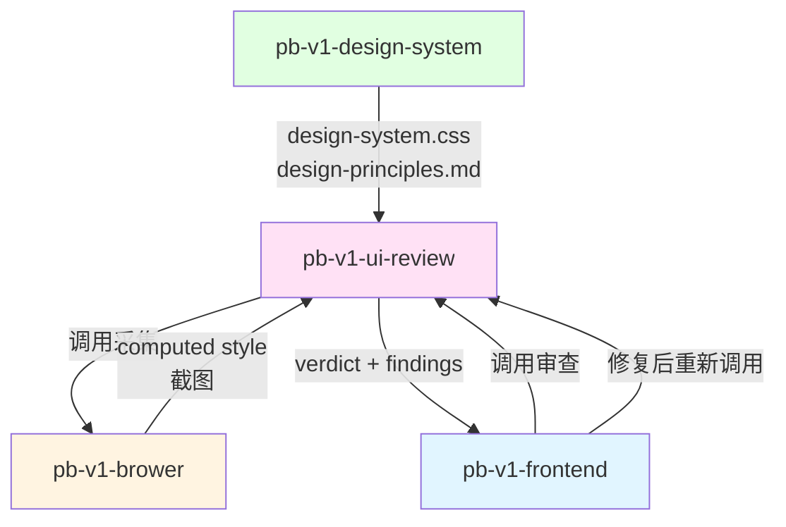

# pb-v1-ui-review

**版本**: 1.0.0
**状态**: 设计完成
**创建日期**: 2026-04-18
**最后更新**: 2026-04-18
**流程映射**: vNext Build 阶段横切（美学审查工具）

---

**CRITICAL: 无基准不审查——design-system.css 不存在则拒绝审查并返回 blocked，否则所有判断沦为主观臆断。**

**CRITICAL: 每个 finding 必须有当前值 + 期望值 + 修复指令——"感觉不好看"不是有效 finding，违反则审查报告不可执行、调用方无法修复。**

**CRITICAL: 只输出 findings，绝不修改源码——修复是调用方（pb-v1-frontend）的职责，越界修改会导致审查者-实现者职责混乱。**

---

## 核心哲学

> 美学审查是 Token 合规性验证——每个 finding 必须有具体的当前值、期望值和修复指令。"这里用了 14px，应该用 `--font-size-sm: 13px`"是有效 finding，"字体看起来不太对"不是。

### 策略哲学

**对抗的模型惯性**：

| 模型惯性 | 真实情况 |
|---------|---------|
| 美学审查 = 凭感觉说好不好看 | 美学审查 = 对照 Token 基准做合规性验证，每个判断都有数值依据 |
| 发现问题就顺手修复 | 审查只输出 findings，修复是调用方（pb-v1-frontend）的事 |
| 所有视觉问题都同等重要 | critical（Token 完全缺失）> major（Token 错用）> minor（可改进但不违规） |
| 审查越严格越好 | 过度严格导致无限修复循环。PASS 条件是 critical=0 且 major=0，minor 记录不阻塞 |
| 功能问题和美学问题一起审 | 功能验证是 pb-v1-brower 的事，本 Skill 只审视觉属性合规性 |
| 截图是主要审查手段 | 结构化数据（computed style、CSS 变量值）是主要手段，截图只用于视觉节奏和整体美学 |

**思考框架**：

1. **先加载基准，再开始审查** — 审查的前提是有明确的基准。读取 design-system.css 提取所有 Token 定义，读取 design-principles.md 提取使用规则。没有基准的审查是主观臆断。
2. **数据定位优先，截图兜底** — Token 合规性（颜色、间距、字号、圆角）用结构化数据验证（computed style vs Token 值）。视觉节奏和整体美学用截图辅助判断。AI 识别图片不准确，能用数据定位的问题必须用数据。
3. **每个 finding 必须可执行** — "修复指令"不是"改一下间距"，而是"将 `.card` 的 `padding` 从 `12px` 改为 `var(--spacing-md)`（16px）"。调用方拿到 finding 后应该能直接修复，不需要二次判断。
4. **分级是机械规则，不是主观判断** — critical = 视觉属性完全没有引用 Token（硬编码）；major = 引用了错误的 Token（语义不匹配）；minor = Token 使用正确但有改进空间（如间距可以更统一）。

**判断锚点**：

- **成功标准**：每个 finding 都有当前值 + 期望值 + 修复指令，verdict 判定与 findings 列表一致
- **切换条件**：当发现的问题属于功能缺陷（元素缺失、交互异常）时，标注为"非美学问题"转交 pb-v1-brower
- **停止条件**：5 个审查维度全部检查完毕，findings 列表完整，verdict 已判定

---

## 设计原则

1. **基准驱动审查**: 每个判断都对照 design-system.css 和 design-principles.md，无基准不审查
2. **数据优先于截图**: Token 合规性用 computed style 验证，截图只用于视觉节奏和整体美学
3. **finding 必须可执行**: 包含位置、当前值、期望值、修复指令，调用方可直接修复
4. **分级是机械规则**: critical/major/minor 有明确定义，不是主观感受
5. **观察不修复**: 只输出 findings 和 verdict，源码修复由调用方承担
6. **美学与功能分离**: 功能问题标注转交，不在美学审查中处理

---

## 事实说明

以下是美学审查场景中模型容易忽略的事实，作为推理原料：

1. **硬编码数值是最高频的违规类型** — 模型在实现时容易在"微调"环节写死数值（`padding: 12px`、`color: #333`、`border-radius: 4px`）。审查时应优先扫描所有 computed style，与 Token 定义做差集比对。
2. **语义错用比硬编码更隐蔽** — `var(--color-primary)` 用在文本颜色上看起来"引用了 Token"，但语义上应该用 `var(--color-text-primary)`。语义错用不会在视觉上立即暴露，但在主题切换时会出问题。
3. **间距节奏需要截图辅助** — 单个元素的间距可以用数据验证（computed padding vs Token 值），但相邻元素之间的间距节奏（是否有规律、是否有呼吸感）需要截图整体观察。这是截图的正确使用场景。
4. **组件级审查和页面级审查的关注点不同** — 组件级关注 Token 合规性和状态完整性；页面级额外关注整体美学（配色和谐度、信息层级、视觉重心）。不要在组件级审查中做页面级判断。
5. **minor 级 finding 的价值在于积累** — 单个 minor 不阻塞，但如果同类 minor 超过 5 个（如"多处间距可以更统一"），说明存在系统性问题，应升级为 major。

---

## 审查维度

### 维度 1: Token 合规性

**适用 scope**: component + page

**检查内容**:
- 所有 `color` 属性是否引用 `--color-*` Token
- 所有 `padding`/`margin`/`gap` 是否引用 `--spacing-*` Token
- 所有 `font-size` 是否引用 `--font-size-*` Token
- 所有 `border-radius` 是否引用 `--radius-*` Token
- 所有 `box-shadow` 是否引用 `--shadow-*` Token

**检查方法**: 通过 pb-v1-brower 获取元素的 computed style，与 design-system.css 中的 Token 值做比对。不在 Token 值集合中的 computed 值 = 违规。

**分级**:
- critical: 视觉属性完全硬编码，未引用任何 Token
- major: 引用了 Token 但语义不匹配（如用 `--color-primary` 做文本色）
- minor: Token 使用正确但有更精确的语义 Token 可用

### 维度 2: 视觉节奏

**适用 scope**: component + page

**检查内容**:
- 相邻元素的间距是否来自同一间距阶梯
- 间距是否有规律（如卡片间距统一、列表项间距统一）
- 是否存在间距"断裂"（相邻区域间距差异过大且无语义原因）

**检查方法**: 获取相邻元素的 margin/padding/gap 值，检查是否都在 Token 间距阶梯上。截图辅助判断整体节奏感。

**分级**:
- major: 相邻同类元素间距不一致（如卡片 A 间距 16px，卡片 B 间距 24px）
- minor: 间距在 Token 上但选择不够统一（如可以都用 `--spacing-md` 但混用了 `--spacing-md` 和 `--spacing-lg`）

### 维度 3: 层级清晰度

**适用 scope**: component + page

**检查内容**:
- 字号是否形成清晰的层级（标题 > 副标题 > 正文 > 辅助文本）
- 字重是否配合字号形成层级
- 颜色是否配合字号形成层级（主文本 > 次要文本 > 辅助文本）

**检查方法**: 获取页面中所有文本元素的 font-size、font-weight、color，检查是否形成单调递减的层级关系。

**分级**:
- major: 层级倒置（辅助文本比正文字号大）或层级缺失（所有文本同一字号）
- minor: 层级存在但不够清晰（如标题和副标题字号差异过小）

### 维度 4: 一致性

**适用 scope**: component + page

**检查内容**:
- 同类组件的视觉处理是否统一（所有 Button 的 padding/radius/font-size 是否一致）
- 同类元素的间距是否统一（所有卡片的内边距是否一致）
- 同类交互的视觉反馈是否统一（所有 hover 效果是否一致）

**检查方法**: 获取同类组件的 computed style，做集合比对。差异项 = finding。

**分级**:
- major: 同类组件视觉处理明显不一致（如两个 Button 圆角不同）
- minor: 同类组件基本一致但有细微差异

### 维度 5: 整体美学（仅页面级）

**适用 scope**: page only

**检查内容**:
- 配色是否和谐（是否在 Token 定义的色彩体系内）
- 信息层级是否清晰（用户能否快速找到核心内容）
- 视觉重心是否合理（CTA 是否突出）
- 是否符合 design-principles.md 中描述的设计方向核心特征

**检查方法**: 截图 + 对照 design-principles.md 的方向描述。这是唯一允许主观判断的维度，但判断必须引用 design-principles.md 中的具体规则。

**分级**:
- major: 明显偏离设计方向核心特征（如设计方向是"极简"但页面信息密度过高）
- minor: 基本符合方向但有改进空间

---

## 执行流程

### Step 1: 加载审查基准

1. 读取 `design-system.css`，解析所有 Token 定义，构建 Token 值集合
2. 读取 `design-principles.md`，提取使用规则
3. 确认审查 scope（component 或 page）和 target

**Gate G-BASIS**: design-system.css 或 design-principles.md 不存在 → 拒绝审查，返回 blocked。

### Step 2: 采集页面事实

1. 通过 pb-v1-brower 连接目标页面
2. 采集结构化数据：
   - 所有元素的 computed style（color、padding、margin、font-size、border-radius、box-shadow）
   - 所有 CSS 变量的实际引用情况
   - DOM 结构和元素层级
3. 如果 scope = page，额外采集页面截图

### Step 3: 逐维度审查

按 5 个维度（page scope）或 4 个维度（component scope，跳过维度 5）逐一审查：

1. 将 computed style 值与 Token 值集合做比对 → Token 合规性 findings
2. 分析相邻元素间距模式 → 视觉节奏 findings
3. 分析文本元素层级关系 → 层级清晰度 findings
4. 比对同类组件 computed style → 一致性 findings
5. （page only）对照 design-principles.md 审查整体美学 → 整体美学 findings

### Step 4: 生成审查报告

**finding 格式**:

```yaml
finding:
  id: "UIR-{序号}"
  dimension: enum [token_compliance, visual_rhythm, hierarchy, consistency, overall_aesthetic]
  severity: enum [critical, major, minor]
  location: "CSS 选择器或元素描述"
  current_value: "当前实际值"
  expected_value: "期望值（Token 变量名 + 解析值）"
  fix_instruction: "具体修复指令"
  evidence: "computed style 数据或截图引用"
```

**verdict 格式**:

```yaml
verdict:
  scope: enum [component, page]
  target: "审查目标描述"
  status: enum [PASS, FAIL]
  summary:
    critical: number
    major: number
    minor: number
  findings: [finding]
```

**PASS 条件**: critical = 0 且 major = 0
**FAIL 条件**: critical > 0 或 major > 0

**minor 升级规则**: 同类 minor 超过 5 个 → 升级为 1 个 major（系统性问题）

---

## 输入协议

本 Skill 是工具型，被调用方直接传入参数，不走 orchestrator dispatch_context。

**调用格式**:

```yaml
input:
  scope: enum [component, page]
  target: "URL 或文件路径"
  design_system_css: "design-system.css 路径"
  design_principles_md: "design-principles.md 路径"
  focus: optional string  # 聚焦特定维度，如 "token_compliance" 或 "visual_rhythm"
```

**输出格式**:

```yaml
output:
  verdict:
    scope: string
    target: string
    status: enum [PASS, FAIL]
    summary: { critical: number, major: number, minor: number }
    findings: [finding]
```

调用方根据 verdict.status 决定是否修复后重新审查。

---

## 与其他 Skill 的交互



| 交互方 | 方向 | 内容 | 触发条件 |
|-------|------|------|---------|
| pb-v1-design-system | 输入 | design-system.css + design-principles.md | 审查基准 |
| pb-v1-brower | 工具 | computed style + 截图 | Step 2 事实采集 |
| pb-v1-frontend | 调用方 | 接收 verdict + findings | 每层实现完成后 |
| 用户 | 调用方 | 接收 verdict + findings | 手动触发审查 |

---

## 职责边界

### 必须做的事
- 加载 design-system.css 和 design-principles.md 作为审查基准
- 通过 pb-v1-brower 采集页面结构化数据（computed style、CSS 变量引用）
- 按 5 个维度（Token 合规性、视觉节奏、层级清晰度、一致性、整体美学）逐一审查
- 每个 finding 输出具体的位置、当前值、期望值、修复指令
- 按 critical/major/minor 机械分级
- 输出 verdict（PASS/FAIL）

### 禁止做的事
- **不做设计决策**（交给 pb-v1-design-system）
- **不修改源码**（修复是调用方 pb-v1-frontend 的事）
- **不做功能验证**（交给 pb-v1-brower）
- **不输出模糊的主观判断**——"感觉不好看"不是有效 finding
- **不在没有基准时审查**——无 design-system.css 则拒绝

---

## 异常处理

### 场景 1: design-system.css 不存在
**触发条件**: Step 1 加载基准时发现文件缺失
**处理方式**: 返回 blocked，要求先运行 pb-v1-design-system 建立设计系统

### 场景 2: pb-v1-brower 不可用
**触发条件**: Step 2 采集页面事实时浏览器无法连接
**处理方式**: 降级为静态代码审查——直接读取 CSS/HTML 源码，对比 Token 引用情况。标注审查模式为 "static"，覆盖率受限（无法检查 computed style 和视觉节奏）

### 场景 3: 发现功能缺陷而非美学问题
**触发条件**: 审查过程中发现元素缺失、交互异常、JS 报错等功能问题
**处理方式**: 在 findings 中标注 `type: "non-aesthetic"`，不计入 verdict 判定，建议调用方转交 pb-v1-brower 处理

### 场景 4: 同类 minor 超过 5 个
**触发条件**: 同一维度的 minor 级 finding 超过 5 个
**处理方式**: 升级为 major，标注为系统性问题，附带所有相关 finding 的汇总

---

## 质量标准

### 完成定义

以下条件全部满足才算完成：
- ✅ 5 个审查维度全部检查完毕（component scope 为 4 个，跳过整体美学）
- ✅ 每个 finding 都有位置 + 当前值 + 期望值 + 修复指令
- ✅ 分级（critical/major/minor）与定义一致，无主观判定
- ✅ verdict 判定与 findings 列表一致（critical=0 且 major=0 → PASS）
- ✅ 非美学问题已标注并建议转交

---

## Safety

- 审查基准来自 design-system.css 和 design-principles.md，不是审查者的偏好——不做设计决策
- 功能问题（元素缺失、交互异常）标注为"非美学问题"转交 pb-v1-brower，不混入 verdict
- PASS 条件是 critical=0 且 major=0，minor 记录但不阻塞——不过度严格
- 能用 computed style 定位的问题用数据验证，截图仅用于视觉节奏和整体美学辅助

---

**文档状态**: 设计完成
**版本**: 1.0.0
**创建日期**: 2026-04-18
**最后更新**: 2026-04-18
