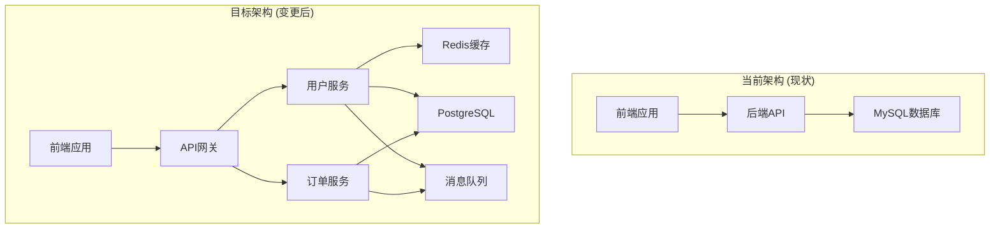

# 架构变更点说明章节模板

## 变更点说明

### 变更概述
基于PRD中的功能需求分析，当前架构需要进行以下主要变更：
- [ ] [变更原因1：例如：现有单体架构无法满足性能要求]
- [ ] [变更原因2：例如：需要支持微服务架构以提高可扩展性]
- [ ] [变更原因3：例如：引入缓存层提升响应速度]

### 架构变更对比

#### 当前架构 (现状)
[描述现有系统架构，例如：]
- 单体应用架构
- 单一数据库 (MySQL)
- 直接前端到后端API调用
- 无缓存层

#### 目标架构 (变更后)
[描述变更后系统架构，例如：]
- 微服务架构
- 多数据库支持 (PostgreSQL + Redis)
- API网关模式
- 引入缓存层和消息队列

#### 架构变更对比图

### 具体变更点清单

| 变更类型 | 组件/模块 | 变更描述 | 影响范围 | 风险等级 |
|---------|---------|---------|---------|---------|
| **NEW** | [缓存层] | 新增Redis缓存提升性能 | 全局性能提升 | 中 |
| **NEW** | [消息队列] | 引入消息队列处理异步任务 | 异步处理能力 | 中 |
| **NEW** | [API网关] | 新增API网关统一入口 | 统一API管理 | 中 |
| **MODIFIED** | [数据层] | 从MySQL迁移到PostgreSQL | 数据存储层 | 高 |
| **MODIFIED** | [服务层] | 从单体服务拆分为微服务 | 整个后端系统 | 高 |
| **REMOVED** | [单体API] | 移除单体API接口 | 直接API访问 | 低 |

### 技术影响分析

#### 新增技术栈
- **Redis**: 缓存层
  - 用途：提升查询性能，减少数据库压力
  - 学习成本：团队已有使用经验
  - 维护成本：中等

- **PostgreSQL**: 替代MySQL
  - 用途：主数据存储，支持更复杂的查询
  - 学习成本：团队熟悉SQL，迁移成本低
  - 维护成本：需要数据迁移

- **消息队列**: [例如 RabbitMQ/Kafka]
  - 用途：处理异步任务和解耦服务
  - 学习成本：需要团队学习
  - 维护成本：中等

#### 性能影响
- **改进点**:
  - [缓存层提升响应速度30%]
  - [微服务架构支持水平扩展]
  - [消息队列提升吞吐量]

- **风险点**:
  - [数据迁移期间可能存在停机时间]
  - [微服务间网络调用增加延迟]
  - [新引入的组件可能成为性能瓶颈]

#### 依赖变更
- **新增依赖**:
  - Redis服务 (v6.0+)
  - PostgreSQL服务 (v13+)
  - 消息队列服务

- **升级依赖**:
  - 无

- **移除依赖**:
  - MySQL (迁移完成后)

#### 安全影响
- **新增安全措施**:
  - [API网关提供统一的安全策略]
  - [缓存层需要数据加密]
  - [消息队列需要访问控制]

- **安全风险**:
  - [微服务间通信需要加密]
  - [新增攻击面需要防护]

### 风险评估

#### 高风险变更 ⚠️
- [ ] **数据层迁移**
  - 影响范围：整个数据存储层
  - 发生概率：中等
  - 影响程度：高
  - 缓解措施：制定详细迁移计划，分批迁移，准备回滚方案
  - 回滚方案：保留MySQL作为备份，必要时回滚到原架构

- [ ] **微服务拆分**
  - 影响范围：整个后端系统
  - 发生概率：中等
  - 影响程度：高
  - 缓解措施：逐步拆分，先拆分核心服务，充分测试
  - 回滚方案：保留单体应用作为备选方案

#### 中风险变更 ⚡
- [ ] **缓存层引入**
  - 影响范围：全局性能
  - 缓解措施：监控缓存命中率，及时调整策略

- [ ] **消息队列引入**
  - 影响范围：异步处理
  - 缓解措施：监控消息积压，设置告警阈值

#### 低风险变更 ✅
- [ ] **API网关引入**
  - 影响范围：API访问
  - 缓解措施：灰度发布，逐步切换流量

### 实施建议

#### 实施优先级
- **P0**: API网关 (基础架构)
- **P0**: 缓存层 (性能关键)
- **P1**: 微服务拆分 (核心功能)
- **P2**: 数据层迁移 (长期优化)
- **P2**: 消息队列 (异步处理)

#### 实施顺序
1. **阶段1**: 引入API网关，建立统一入口
2. **阶段2**: 引入缓存层，提升性能
3. **阶段3**: 微服务拆分，从边缘服务开始
4. **阶段4**: 数据层迁移，确保数据一致性
5. **阶段5**: 引入消息队列，处理异步任务

#### 迁移策略
- **蓝绿部署**: 采用蓝绿部署策略，降低停机风险
- **灰度发布**: 新功能灰度发布，逐步扩大范围
- **回滚策略**: 保留单体架构作为备选，确保快速回滚能力

---

**注意**: 本章节需要根据实际项目情况调整具体内容。确保变更点描述准确、影响分析全面、风险评估合理。
