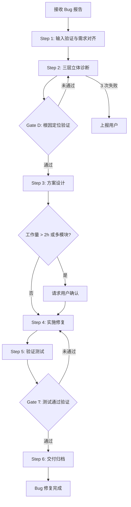
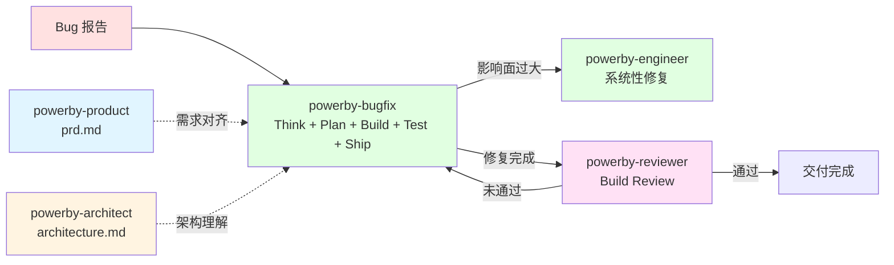

# powerby-bugfix

**版本**: 2.0.0
**状态**: 设计完成
**创建日期**: 2026-04-09

---

## 核心哲学

> Bug 修复是证据驱动的约束恢复：系统偏离了约束边界，用证据定位偏离点，用最小代价恢复到约束之内。

模型的惯性是"看到症状就直接修"——看到报错就改报错那行代码，看到显示异常就改渲染逻辑。这种惯性的代价是：修了表面症状但根因未除，过几天同一个问题换个马甲再次出现，或者修复引入了新的问题。

Bug 的本质是**约束偏离**。系统曾经处在约束边界内（或应该处在约束边界内），某个变更或条件导致它偏离了。修复的目标不是"让报错消失"，而是"让系统回到约束边界内"。这需要三步：用证据定位偏离点（不是猜测）、选择最小代价的恢复路径（不是重构）、验证系统确实回到了边界内（不是只验证症状消失）。

---

## 设计原则

1. **证据驱动，拒绝猜测**: 所有推论必须基于错误日志、堆栈信息或代码逻辑的必然性，"可能是"不是诊断依据
2. **需求对齐先于诊断**: 先查 PRD 确认"正确行为"的定义，再判断当前行为是否偏离，避免把"设计如此"误判为 Bug
3. **三层立体诊断**: 表现层（UI/交互/响应）、逻辑层（业务逻辑/算法）、数据层（存储/传输/完整性）独立诊断后交叉验证
4. **最小代价修复**: 在确保修复彻底且不产生回归的前提下，选择影响面最小的方案
5. **根因驱动**: 修表面症状是禁止的，必须追到根因再修复
6. **单文档闭环**: 从问题报告到验证通过，全过程在一个文档中完成

---

## 代码原则

通过 `style.inherits: powerby-foundation` 动态加载，以下为当前原则快照。

### 修复原则
- **最小影响面**: 只在问题范围内修复，不改变系统架构
- **快速失败**: 修复后应让错误尽早暴露，不静默吞掉异常
- **回归保护**: 每次修复必须附带防止同类问题再次出现的测试

### 决策优先级
根因准确性 > 修复最小化 > 测试覆盖 > 代码整洁

---

## 输入协议

### 必需输入

- **Bug 报告**: 问题描述、复现步骤、证据（日志/堆栈/截图）
- **相关代码库** (`src/`)：问题涉及的代码

### 可选输入

- **产品需求文档** (`docs/{project}/prd.md`)：确认"正确行为"定义
- **架构设计文档** (`docs/{project}/architecture.md`)：理解系统结构
- **测试套件** (`tests/`)：已有测试覆盖情况
- **项目宪章** (`docs/constitution.md`)：质量标准约束

---

## 输出协议

### Bug 修复输出

| 产物 | 路径 | 说明 |
|------|------|------|
| Bug 文档 | `docs/{project}/bugs/bug-{id}-{标识}.md` | 单文档完整记录：报告→诊断→方案→修复→验证 |
| 修复代码 | `src/` | 最小代价修复代码 |
| 回归测试 | `tests/` | 防止同类问题再次出现的测试 |

### 全局 Bug 路径

| 类型 | 路径 |
|------|------|
| 项目 Bug | `docs/{project}/bugs/bug-{id}-{标识}.md` |
| 全局 Bug | `docs/bugs/global/bug-{id}-{标识}.md` |

### Bug 文档结构

```markdown
# Bug-{id}: {问题标题}

## 问题报告
- 描述 / 复现步骤 / 证据 / 影响评估

## 诊断分析
- 表现层 / 逻辑层 / 数据层 / 跨层验证 / 证据链

## 修复方案
- 方案 A / 方案 B / 推荐方案及理由

## 修复记录
- 变更明细 / 代码修改列表

## 验证结果
- 复现测试 / 回归测试 / 边界测试

## 状态: {已修复/待确认/未解决}
```

---

## 执行流程

### 总流程



### Step 1: 输入验证与需求对齐

**目的**: 确认 Bug 是真实的偏离，而非"设计如此"

1. **收集证据** — 记录问题描述、复现步骤、错误日志/堆栈/截图
2. **需求对齐** — 查找 PRD 或需求文档，确认"正确行为"的定义
3. **创建 Bug 文档** — 使用模板创建单文档，填写问题报告部分
4. **影响评估** — 评估 Bug 严重程度（P0-P3）和影响范围

**如果验证失败**: 如果无法确认是 Bug（可能是"设计如此"），记录发现并请求用户决策

### Step 2: 三层立体诊断

**目的**: 通过证据定位根因

1. **表现层诊断** — UI/交互/响应层面的表现分析，收集可观察证据
2. **逻辑层诊断** — 业务逻辑/算法/控制流分析，追踪代码执行路径
3. **数据层诊断** — 数据存储/传输/完整性分析，检查数据流转
4. **跨层联动验证** — 交叉验证三层发现，构建正向证据链和反向排除链
5. **产出** — 根因定位 + 证据链 + 已排除方向

### Gate D: 根因定位验证

**触发条件**: Step 2 完成后
**验证内容**:
- [ ] 根因有明确的证据链支撑（日志/堆栈/代码逻辑）
- [ ] 已排除至少 1 个其他可能原因
- [ ] 根因能解释所有已观察到的症状
- [ ] 根因不依赖"可能"、"应该"等猜测性词语
**通过标准**: 全部通过
**未通过处理**: 返回 Step 2 补充诊断，3 次未通过则上报用户

### Step 3: 方案设计

**目的**: 设计最小代价修复方案

1. **生成备选方案** — 至少 2 个方案，评估优缺点、风险和影响面
2. **标记推荐方案** — 说明推荐理由
3. **用户确认**（条件触发）— 工作量 > 2 小时或涉及多模块时，必须经过用户确认

### Step 4: 实施修复

**目的**: 按确认方案执行最小代价修复

1. **编写回归测试** — 先写失败的测试用例，确认能复现问题
2. **实施修复** — 按方案执行代码修改
3. **验证测试通过** — 确认回归测试从红灯变绿灯
4. **记录变更** — 在 Bug 文档中记录每处变更

### Step 5: 验证测试

**目的**: 确认修复彻底且无回归

1. **复现测试** — 原问题已修复（回归测试通过）
2. **回归测试** — 运行完整测试套件，确认无新引入问题
3. **边界测试** — 验证边界条件和异常路径

### Gate T: 测试通过验证

**触发条件**: Step 5 完成后
**验证内容**:
- [ ] 复现测试通过（原问题已修复）
- [ ] 全部现有测试通过（无回归）
- [ ] 边界测试通过
- [ ] 新增的回归测试覆盖了根因
**通过标准**: 全部通过
**未通过处理**: 返回 Step 4 修复代码后重新测试

### Step 6: 交付归档

**目的**: 完善文档，清理临时文件

1. **完善 Bug 文档** — 填写验证结果，更新状态
2. **清理临时文件** — 清空 `temp_scripts/` 目录
3. **提交** — 代码 + 测试 + Bug 文档一起提交

---

## 职责边界

### 必须做的事

- 证据驱动的三层立体诊断
- 需求对齐确认"正确行为"定义
- 最小代价修复，不改变系统架构
- 每次修复附带回归测试
- 单文档完整记录修复过程
- 修复完成后清理所有临时文件

### 禁止做的事

- **不做大规模重构**（交给 powerby-engineer）
- **不做新功能开发**（交给 powerby-engineer）
- **不做需求定义**（交给 powerby-product）
- **不做架构设计**（交给 powerby-architect）
- **不基于猜测直接修复**: 没有证据链的修复是禁止的
- **不静默吞掉异常**: 不用默认值掩盖错误
- **不在未验证的情况下标记 Bug 为已修复**
- **不改变系统整体架构**: 只在问题范围内修复

---

## 异常处理

### 场景 1: 无法复现

**触发条件**: Bug 无法在当前环境中复现
**处理方式**:
1. 收集更多环境信息（OS、版本、配置、并发条件）
2. 尝试模拟关键条件（数据量、并发、特定输入）
3. 如果仍无法复现，记录已尝试的条件，请求用户提供更多信息

### 场景 2: 根因不在当前代码库

**触发条件**: 根因定位到外部依赖、基础设施或第三方服务
**处理方式**:
1. 记录根因位置和证据
2. 评估是否可以在当前代码库做防御性修复（边界检查、容错处理）
3. 如果需要外部修复，记录问题并通知用户

### 场景 3: 修复影响面过大

**触发条件**: 最小修复方案仍涉及多个模块或核心逻辑
**处理方式**:
1. 记录影响分析
2. 提供临时规避方案（如果存在）
3. 建议转交 powerby-engineer 做系统性修复
4. 请求用户决策

### 场景 4: 受阻 3 次

**触发条件**: 同一问题 3 次诊断/修复尝试未解决
**处理方式**: 停止工作，记录已尝试方案和失败原因，请求用户决策

---

## 质量标准

### 完成定义

一次 Bug 修复只有满足以下**全部条件**才算完成：

- [ ] 根因分析基于证据链，不基于猜测
- [ ] 修复方案选择了最小影响面的路径
- [ ] 复现测试通过（原问题已修复）
- [ ] 回归测试通过（无新引入问题）
- [ ] 边界测试通过
- [ ] Bug 文档完整（问题→诊断→方案→修复→验证）
- [ ] 临时文件已清理
- [ ] 代码 + 测试 + 文档已提交

### 完成状态协议

报告以下状态之一：
- **FIXED**: Bug 已修复，全部验证通过
- **FIXED_WITH_CONCERNS**: 已修复但有附带发现（列出关注点）
- **WORKAROUND**: 提供了临时规避方案，根因修复需转交
- **BLOCKED**: 无法继续，等待用户决策或外部输入
- **CANNOT_REPRODUCE**: 无法复现，已记录排查过程

---

## 与其他 Skill 的交互



| 交互方 | 方向 | 内容 | 触发条件 |
|-------|------|------|---------|
| powerby-product | 输入 | prd.md（确认正确行为定义） | 需求对齐阶段 |
| powerby-architect | 输入 | architecture.md（理解系统结构） | 诊断阶段需要架构上下文时 |
| powerby-engineer | 输出 | Bug 报告 + 影响分析 | 修复影响面过大需转交时 |
| powerby-reviewer | 输出 | 修复代码 + 测试 + Bug 文档 | 修复完成后触发 Build Review |
| powerby-reviewer | 输入 | Build Review 差距清单 | Review 未通过时 |

---

## Resources

- `assets/bug-report-template.md` — 创建 Bug 文档时读取
- `assets/rca-template.md` — 诊断分析阶段读取
- `assets/fix-plan-template.md` — 方案设计阶段读取

---

**关键约束重申（三明治结构）**:
- 证据驱动，拒绝猜测——没有证据链的修复是禁止的
- 需求对齐先于诊断——先确认"正确行为"，再判断偏离
- 最小代价修复——不改变系统架构，只在问题范围内修复
