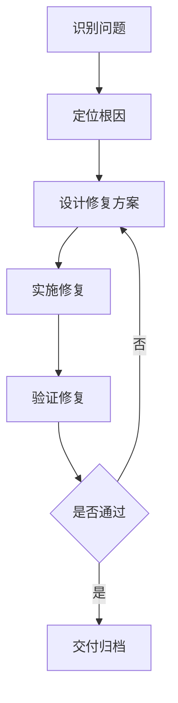
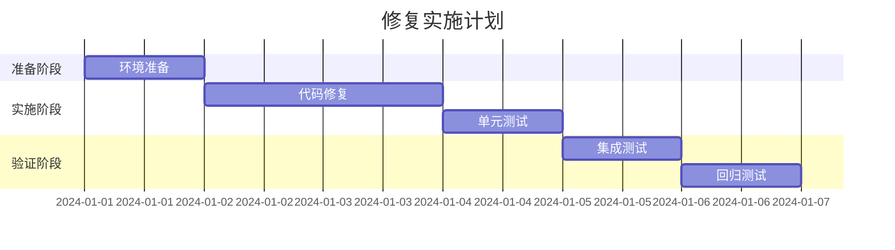

# 修复方案模板

## 三、修复方案确认

### 3.1 问题总结

#### 3.1.1 问题概述
[用1-2句话概括问题本质]

#### 3.1.2 影响范围
- **影响模块**：[列出所有受影响的模块]
- **影响用户**：[影响哪些用户群体]
- **严重程度**：P0/P1/P2/P3
- **紧急程度**：高/中/低

#### 3.1.3 根本原因
[根因分析：用因果关系说明为什么会出现这个问题]

---

### 3.2 修复逻辑

#### 3.2.1 逻辑链路

**修复流程图**：


**修复步骤**：
1. [步骤1：具体描述]
2. [步骤2：具体描述]
3. [步骤3：具体描述]

#### 3.2.2 关键决策点
- **决策点1**：[描述需要决策的问题]
  - 选项A：[描述]
  - 选项B：[描述]
  - 建议：[推荐选项及理由]
- **决策点2**：[描述需要决策的问题]
  - 选项A：[描述]
  - 选项B：[描述]
  - 建议：[推荐选项及理由]

#### 3.2.3 预期效果
- **功能恢复**：[描述功能恢复到什么状态]
- **性能改善**：[如果涉及性能，描述改善程度]
- **用户体验**：[描述用户体验的改善]

---

### 3.3 修复方案

#### 方案A：[方案名称]

**思路**：
[简要描述方案思路，1-2段话]

**技术实现**：
- **修改文件**：
  - `src/path/to/file1.js` - [修改内容]
  - `src/path/to/file2.js` - [修改内容]
- **核心代码**：
  ```javascript
  // 修复代码示例
  function fixedFunction() {
    // 新的实现
  }
  ```

**优点**：
- ✅ [优点1]
- ✅ [优点2]
- ✅ [优点3]

**缺点**：
- ❌ [缺点1]
- ❌ [缺点2]

**工作量**：X小时
- 编码：X小时
- 测试：X小时
- 文档：X小时

**风险等级**：低/中/高

**风险说明**：
- **技术风险**：[描述技术风险]
- **业务风险**：[描述业务风险]
- **时间风险**：[描述时间风险]

**依赖项**：
- [ ] 依赖1：[描述]
- [ ] 依赖2：[描述]

---

#### 方案B：[方案名称]

**思路**：
[简要描述方案思路，1-2段话]

**技术实现**：
- **修改文件**：
  - `src/path/to/file1.js` - [修改内容]
  - `src/path/to/file2.js` - [修改内容]
- **核心代码**：
  ```javascript
  // 修复代码示例
  function alternativeFunction() {
    // 另一种实现
  }
  ```

**优点**：
- ✅ [优点1]
- ✅ [优点2]
- ✅ [优点3]

**缺点**：
- ❌ [缺点1]
- ❌ [缺点2]

**工作量**：X小时
- 编码：X小时
- 测试：X小时
- 文档：X小时

**风险等级**：低/中/高

**风险说明**：
- **技术风险**：[描述技术风险]
- **业务风险**：[描述业务风险]
- **时间风险**：[描述时间风险]

**依赖项**：
- [ ] 依赖1：[描述]
- [ ] 依赖2：[描述]

---

#### 方案C：[方案名称]（可选）

**思路**：
[简要描述方案思路，1-2段话]

**技术实现**：
- **修改文件**：
  - `src/path/to/file1.js` - [修改内容]
- **核心代码**：
  ```javascript
  // 修复代码示例
  function thirdOption() {
    // 第三种实现
  }
  ```

**优点**：
- ✅ [优点1]
- ✅ [优点2]

**缺点**：
- ❌ [缺点1]
- ❌ [缺点2]

**工作量**：X小时

**风险等级**：低/中/高

**风险说明**：
[描述风险]

**依赖项**：
- [ ] 依赖1：[描述]

---

### 3.4 推荐方案

#### 推荐：方案A

**推荐理由**：
1. [理由1：技术层面]
2. [理由2：业务层面]
3. [理由3：成本层面]

**选择依据**：
- ✅ 符合项目优先级
- ✅ 技术风险可控
- ✅ 实施成本合理
- ✅ 最小代价修复原则
- ✅ 不改变系统整体架构

**替代方案**：
如果方案A不可行，建议选择：**方案B**

**原因**：
[为什么选择方案B作为备选]

---

### 3.5 风险评估

#### 3.5.1 技术风险

| 风险 | 影响 | 概率 | 缓解措施 |
|------|------|------|----------|
| 风险1：[描述] | 高/中/低 | 高/中/低 | [如何避免] |
| 风险2：[描述] | 高/中/低 | 高/中/低 | [如何避免] |

#### 3.5.2 业务风险

| 风险 | 影响 | 概率 | 缓解措施 |
|------|------|------|----------|
| 风险1：[描述] | 高/中/低 | 高/中/低 | [如何避免] |
| 风险2：[描述] | 高/中/低 | 高/中/低 | [如何避免] |

#### 3.5.3 时间风险

| 风险 | 影响 | 概率 | 缓解措施 |
|------|------|------|----------|
| 风险1：[描述] | 高/中/低 | 高/中/低 | [如何避免] |

---

### 3.6 实施计划

#### 3.6.1 任务分解

- [ ] **任务1**：[描述] - 预计X小时
  - 负责人：[姓名]
  - 依赖：[依赖项]
  - 验收标准：[标准]

- [ ] **任务2**：[描述] - 预计X小时
  - 负责人：[姓名]
  - 依赖：[依赖项]
  - 验收标准：[标准]

- [ ] **任务3**：[描述] - 预计X小时
  - 负责人：[姓名]
  - 依赖：[依赖项]
  - 验收标准：[标准]

#### 3.6.2 时间安排

**关键里程碑**：
- **M1**：[里程碑1] - [日期]
- **M2**：[里程碑2] - [日期]
- **M3**：[里程碑3] - [日期]

**甘特图**：


#### 3.6.3 验收标准

- [ ] **标准1**：[具体描述可量化的标准]
- [ ] **标准2**：[具体描述可量化的标准]
- [ ] **标准3**：[具体描述可量化的标准]
- [ ] **标准4**：[具体描述可量化的标准]

---

### 3.7 资源需求

#### 3.7.1 人力资源
- **主要负责人**：[姓名/角色]
- **协助人员**：[姓名/角色]
- **审核人员**：[姓名/角色]
- **测试人员**：[姓名/角色]

#### 3.7.2 技术资源
- **开发环境**：[需求说明]
- **测试环境**：[需求说明]
- **第三方服务**：[需求说明]
- **工具/库**：[需求说明]

#### 3.7.3 测试资源
- **测试数据**：[数据需求]
- **测试用例**：[用例数量]
- **测试环境**：[环境配置]

---

### 3.8 决策点

#### 需要您确认的问题

**问题1**：[具体描述]
- 选项A：[描述]
- 选项B：[描述]
- **建议**：[建议选择及理由]

**问题2**：[具体描述]
- 选项A：[描述]
- 选项B：[描述]
- **建议**：[建议选择及理由]

---

### 3.9 请您决策

请选择：
- [ ] ✅ 采用推荐方案A，立即实施
- [ ] 🔄 修改方案：[说明修改要求]
- [ ] ⏸️ 暂缓修复：[说明原因]
- [ ] 💡 其他：[说明具体要求]

**您的意见**：
[请在此填写您的意见和建议]

---

**方案设计完成时间**：YYYY-MM-DD HH:MM
**方案设计人员**：[姓名/角色]
