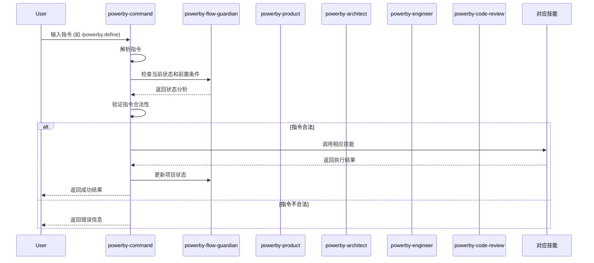

# PowerBy Command Skill - 指令管理技能

**技能名称**: `powerby-command`
**技能类型**: 核心技能 (Core Skill)
**版本**: v1.0.0
**创建日期**: 2025-12-18
**设计师**: Claude

---

## 一、技能概述

### 1.1 设计理念

`powerby-command` 是PowerBy生态的指令管理技能，负责：
- 解析和执行PowerBy指令
- 调用对应的核心技能完成任务
- 管理项目流程状态
- 提供流程维护和指导

这个技能将所有PowerBy指令集成到统一的skill调用接口中，通过触发不同的核心技能（powerby-product、powerby-architect等）来执行相应的工作。

### 1.2 核心价值

**🎯 指令解析**: 理解用户输入的PowerBy指令并转化为具体操作
**🔄 技能调用**: 自动调用对应的核心技能完成任务
**📊 状态管理**: 跟踪和管理项目流程状态
**🛡️ 流程维护**: 确保严格遵循P0-P8生命周期

### 1.3 技能定位

```mermaid
graph TB
    subgraph "PowerBy Skills 生态"
        PM[powerby-product<br/>产品经理]
        ARCH[powerby-architect<br/>架构师]
        ENG[powerby-engineer<br/>工程师]
        CR[powerby-code-review<br/>代码审查]
        FG[powerby-flow-guardian<br/>流程守护者]
        CMD[powerby-command<br/>指令管理] ⭐新增
    end

    subgraph "指令调用"
        INIT[/powerby.initialize]
        DEFINE[/powerby.define]
        CLARIFY[/powerby.clarify]
        RESEARCH[/powerby.research]
        DESIGN[/powerby.design]
        PLAN[/powerby.plan]
        IMPLEMENT[/powerby.implement]
        REVIEW[/powerby.review]
    end

    %% 指令到CMD的关系
    INIT --> CMD
    DEFINE --> CMD
    CLARIFY --> CMD
    RESEARCH --> CMD
    DESIGN --> CMD
    PLAN --> CMD
    IMPLEMENT --> CMD
    REVIEW --> CMD

    %% CMD到技能的映射
    CMD --> PM
    CMD --> ARCH
    CMD --> ENG
    CMD --> CR

    %% 流程维护
    CMD -.-> FG

    classDef commandSkill fill:#4caf50,stroke:#388e3c,stroke-width:3px,color:#fff
    class CMD commandSkill
```

---

## 二、指令映射表

### 2.1 指令到技能的映射

| 指令 | 对应技能 | 执行阶段 | 主要职责 |
|------|---------|---------|---------|
| `/powerby.initialize` | powerby-command (内部) | P0 | 项目初始化和宪章建立 |
| `/powerby.define` | powerby-product | P1 | 需求定义和功能点清单 |
| `/powerby.clarify` | powerby-product | P2 | 需求澄清和边界明确 |
| `/powerby.research` | powerby-architect | P3 | 技术调研和方案确认 |
| `/powerby.design` | powerby-architect | P4 | 架构设计和方案确认 |
| `/powerby.plan` | powerby-engineer | P5 | 任务规划和方案确认 |
| `/powerby.implement` | powerby-engineer | P6 | 开发实现和交付 |
| `/powerby.review` | powerby-code-review | P7-P8 | 代码审查和项目交付 |

### 2.2 指令执行流程



---

## 三、技能实现设计

### 3.1 指令解析器

```python
class PowerByCommandParser:
    """PowerBy指令解析器"""

    def parse_command(self, user_input: str) -> Optional[Command]:
        """解析用户输入的指令"""
        # 支持多种指令格式
        # 1. /powerby.command [参数]
        # 2. powerby command [参数]
        # 3. use powerby-command skill with command [参数]

        command_patterns = [
            r'/powerby\.(\w+)',  # /powerby.command
            r'powerby\s+(\w+)',  # powerby command
            r'use\s+powerby-command\s+skill\s+with\s+(\w+)'  # skill调用格式
        ]

        for pattern in command_patterns:
            match = re.search(pattern, user_input, re.IGNORECASE)
            if match:
                command_name = match.group(1)
                return self._create_command(command_name, user_input)

        return None

    def _create_command(self, name: str, original_input: str) -> Command:
        """创建指令对象"""
        command_map = {
            'initialize': InitializeCommand,
            'define': DefineCommand,
            'clarify': ClarifyCommand,
            'research': ResearchCommand,
            'design': DesignCommand,
            'plan': PlanCommand,
            'implement': ImplementCommand,
            'review': ReviewCommand
        }

        command_class = command_map.get(name.lower())
        if not command_class:
            raise UnknownCommandError(f"未知指令: {name}")

        return command_class(original_input)
```

### 3.2 技能调用器

```python
class SkillInvoker:
    """技能调用器"""

    def __init__(self):
        self.skill_registry = {
            'powerby-product': PowerByProductSkill(),
            'powerby-architect': PowerByArchitectSkill(),
            'powerby-engineer': PowerByEngineerSkill(),
            'powerby-code-review': PowerByCodeReviewSkill(),
            'powerby-flow-guardian': PowerByFlowGuardianSkill()
        }

    async def invoke_skill(self, skill_name: str, task: str, context: Dict) -> Dict:
        """调用指定技能执行任务"""
        skill = self.skill_registry.get(skill_name)
        if not skill:
            raise SkillNotFoundError(f"技能未找到: {skill_name}")

        try:
            result = await skill.execute(task, context)
            return {
                'success': True,
                'result': result,
                'skill': skill_name
            }
        except Exception as e:
            return {
                'success': False,
                'error': str(e),
                'skill': skill_name
            }
```

### 3.3 指令执行器

```python
class PowerByCommandExecutor:
    """PowerBy指令执行器"""

    def __init__(self):
        self.parser = PowerByCommandParser()
        self.invoker = SkillInvoker()
        self.state_manager = ProjectStateManager()
        self.flow_guardian = PowerByFlowGuardian()

    async def execute(self, user_input: str) -> Dict:
        """执行指令"""
        try:
            # 1. 解析指令
            command = self.parser.parse_command(user_input)
            if not command:
                return {
                    'success': False,
                    'error': '无法解析指令，请使用 /powerby.command 格式'
                }

            # 2. 检查前置条件
            prereq_check = self._check_prerequisites(command)
            if not prereq_check['valid']:
                return {
                    'success': False,
                    'error': f'前置条件不满足: {prereq_check["reason"]}',
                    'recommendations': prereq_check.get('recommendations', [])
                }

            # 3. 获取上下文
            context = self._gather_context(command)

            # 4. 调用对应技能
            skill_result = await self.invoker.invoke_skill(
                command.skill_name,
                command.task_name,
                context
            )

            if not skill_result['success']:
                return skill_result

            # 5. 更新状态
            self._update_project_state(command, skill_result)

            # 6. 返回结果
            return {
                'success': True,
                'command': command.name,
                'phase': command.phase,
                'output': skill_result['result'],
                'next_steps': self._get_next_steps(command)
            }

        except Exception as e:
            return {
                'success': False,
                'error': f'指令执行失败: {str(e)}'
            }

    def _check_prerequisites(self, command: Command) -> Dict:
        """检查前置条件"""
        current_phase = self.state_manager.get_current_phase()
        expected_phase = command.prerequisites

        if current_phase != expected_phase:
            return {
                'valid': False,
                'reason': f'当前阶段是{current_phase}，需要{expected_phase}阶段才能执行此指令',
                'recommendations': [f'请先完成{expected_phase}阶段']
            }

        # 检查文档完整性
        required_docs = self._get_required_documents(command)
        missing_docs = [doc for doc in required_docs if not Path(doc).exists()]

        if missing_docs:
            return {
                'valid': False,
                'reason': f'缺少必需文档: {", ".join(missing_docs)}',
                'recommendations': ['请先创建缺少的文档或执行前置指令']
            }

        return {'valid': True}

    def _gather_context(self, command: Command) -> Dict:
        """收集执行上下文"""
        context = {
            'command': command.name,
            'phase': command.phase,
            'parameters': command.parameters,
            'project_path': self.state_manager.project_path
        }

        # 添加相关文档
        if hasattr(command, 'input_documents'):
            context['input_documents'] = self._read_documents(command.input_documents)

        return context

    def _update_project_state(self, command: Command, result: Dict):
        """更新项目状态"""
        # 更新当前阶段
        self.state_manager.set_current_phase(command.phase)

        # 更新门禁状态
        if hasattr(command, 'gate_id') and command.gate_id >= 0:
            self.state_manager.update_gate(command.gate_id, 'PASSED')

        # 记录执行历史
        self.state_manager.add_execution_record({
            'command': command.name,
            'timestamp': datetime.now().isoformat(),
            'result': result
        })

    def _get_next_steps(self, command: Command) -> List[str]:
        """获取下一步建议"""
        next_phase = self._get_next_phase(command.phase)
        if not next_phase:
            return ['项目已完成所有阶段！']

        next_command = self._get_command_for_phase(next_phase)
        return [
            f'建议执行: {next_command}',
            f'下个阶段: {next_phase}',
            '使用 /powerby-flow-guardian analyze 查看当前状态'
        ]
```

---

## 四、指令定义

### 4.1 InitializeCommand

```python
class InitializeCommand(Command):
    """项目初始化指令"""

    name = 'initialize'
    phase = 'P0'
    gate_id = -1
    skill_name = 'powerby-command'  # 内部处理
    task_name = 'initialize_project'
    prerequisites = None  # P0没有前置条件

    def __init__(self, user_input: str):
        super().__init__(user_input)
        self.parameters = self._parse_parameters(user_input)

    def _parse_parameters(self, user_input: str) -> Dict:
        """解析初始化参数"""
        # 支持多种格式：
        # /powerby.initialize my-project "项目描述" --team "张三,李四" --tech-stack "Python+React"
        # use powerby-command skill with initialize project="my-project" description="项目描述"

        # 解析项目名称
        project_name_match = re.search(r'project\s*=\s*["\']([^"\']+)["\']', user_input)
        if project_name_match:
            project_name = project_name_match.group(1)
        else:
            # 从用户输入中提取
            parts = user_input.split()
            if len(parts) >= 2:
                project_name = parts[1]
            else:
                project_name = 'my-project'

        # 解析其他参数
        description = self._extract_parameter(user_input, 'description', '这是一个PowerBy项目')
        team = self._extract_parameter(user_input, 'team', '')
        tech_stack = self._extract_parameter(user_input, 'tech-stack', '')

        return {
            'project_name': project_name,
            'description': description,
            'team': team,
            'tech_stack': tech_stack
        }

    async def execute(self, context: Dict) -> Dict:
        """执行初始化"""
        # 创建项目结构
        self._create_project_structure(context['project_path'])

        # 创建项目宪章
        constitution_path = self._create_constitution(context)

        # 创建项目元数据
        metadata_path = self._create_project_metadata(context)

        # 初始化Git仓库
        self._init_git_repository(context['project_path'])

        return {
            'success': True,
            'phase': 'P0',
            'output_documents': [
                constitution_path,
                metadata_path
            ],
            'message': '项目初始化完成'
        }
```

### 4.2 DefineCommand

```python
class DefineCommand(Command):
    """需求定义指令"""

    name = 'define'
    phase = 'P1'
    gate_id = 1
    skill_name = 'powerby-product'
    task_name = 'define_requirements'
    prerequisites = 'P0'

    def __init__(self, user_input: str):
        super().__init__(user_input)
        self.parameters = self._parse_parameters(user_input)
        self.input_documents = ['docs/constitution.md', '.powerby/project.json']

    def _parse_parameters(self, user_input: str) -> Dict:
        """解析需求定义参数"""
        # 提取产品想法
        product_idea = self._extract_product_idea(user_input)

        # 解析其他参数
        user_group = self._extract_parameter(user_input, 'user-group', '')
        problem = self._extract_parameter(user_input, 'problem', '')
        timeline = self._extract_parameter(user_input, 'timeline', '')
        constraints = self._extract_parameter(user_input, 'constraints', '')

        return {
            'product_idea': product_idea,
            'user_group': user_group,
            'problem': problem,
            'timeline': timeline,
            'constraints': constraints
        }

    async def execute(self, context: Dict) -> Dict:
        """调用powerby-product执行需求定义"""
        # 构建任务描述
        task_description = f"""
        基于以下信息执行需求定义：
        - 产品想法: {self.parameters['product_idea']}
        - 目标用户: {self.parameters['user_group']}
        - 核心问题: {self.parameters['problem']}
        - 预期时间: {self.parameters['timeline']}
        - 约束条件: {self.parameters['constraints']}

        请生成完整的PRD和功能点清单。
        """

        # 调用powerby-product
        result = await self.invoker.invoke_skill(
            'powerby-product',
            task_description,
            context
        )

        return result
```

### 4.3 其他指令类

类似地，为每个指令创建对应的Command类：

- `ClarifyCommand` → 调用 `powerby-product`
- `ResearchCommand` → 调用 `powerby-architect`
- `DesignCommand` → 调用 `powerby-architect`
- `PlanCommand` → 调用 `powerby-engineer`
- `ImplementCommand` → 调用 `powerby-engineer`
- `ReviewCommand` → 调用 `powerby-code-review`

---

## 五、使用示例

### 5.1 基本使用

```bash
# 用户输入指令
/powerby.initialize my-project "这是一个示例项目" --team "张三,李四"

# 系统处理
1. powerby-command 解析指令
2. 检查前置条件 (P0无前置条件)
3. 调用内部初始化逻辑
4. 返回结果
```

```bash
# 用户输入指令
/powerby.define "我想构建一个任务管理系统" --user-group "团队成员"

# 系统处理
1. powerby-command 解析指令
2. 检查前置条件 (需要P0完成)
3. 调用 powerby-product 执行需求定义
4. 返回结果
```

### 5.2 技能调用格式

```bash
# 标准指令格式
/powerby.command [参数]

# 技能调用格式
use powerby-command skill with command [参数]

# 简化格式
powerby [command] [参数]
```

### 5.3 完整流程示例

```bash
# 1. 项目初始化
/powerby.initialize my-app "任务管理应用"

# 2. 需求定义
/powerby.define "我想构建一个任务管理系统，帮助团队更好地协作"

# 3. 需求澄清
/powerby.clarify

# 4. 技术调研
/powerby.research

# 5. 架构设计
/powerby.design

# 6. 任务规划
/powerby.plan

# 7. 开发实现
/powerby.implement --tdd

# 8. 代码审查
/powerby.review
```

---

## 六、流程维护集成

### 6.1 与Flow Guardian的协作

```python
class PowerByCommandWithFlowGuardian:
    """集成Flow Guardian的指令执行器"""

    def __init__(self):
        self.executor = PowerByCommandExecutor()
        self.flow_guardian = PowerByFlowGuardian()

    async def execute_with_guidance(self, user_input: str) -> Dict:
        """执行指令并提供流程指导"""
        # 1. 解析指令
        command = self.executor.parser.parse_command(user_input)

        # 2. 获取当前状态
        current_state = self.flow_guardian.analyze_current_state()

        # 3. 提供状态反馈
        guidance = self._generate_guidance(command, current_state)

        # 4. 执行指令
        result = await self.executor.execute(user_input)

        # 5. 更新状态和建议
        if result['success']:
            result['guidance'] = guidance
            result['current_state'] = self.flow_guardian.analyze_current_state()

        return result

    def _generate_guidance(self, command: Command, state: Dict) -> Dict:
        """生成流程指导"""
        guidance = {
            'current_phase': state.get('current_phase'),
            'health_score': state.get('health_score', 0),
            'recommendations': [],
            'next_steps': []
        }

        # 检查指令合法性
        if not self._is_command_valid(command, state):
            guidance['recommendations'].append(
                f'当前阶段: {state.get("current_phase")}, '
                f'建议指令: {self._get_recommended_command(state)}'
            )

        # 提供下一步建议
        next_steps = self.executor._get_next_steps(command)
        guidance['next_steps'] = next_steps

        return guidance
```

### 6.2 流程状态可视化

```bash
# 查看当前状态
/powerby-flow-guardian analyze

# 执行指令
/powerby.define "产品想法"

# 查看执行结果和下一步建议
# 系统会自动显示：
# ✅ P1阶段完成
# 📍 当前状态: P1_COMPLETED
# 🎯 下一步: /powerby.clarify
# 📊 健康度: 85/100
```

---

## 七、最佳实践

### 7.1 指令使用原则

1. **严格遵循流程**: 不跳过前置阶段
2. **提供完整信息**: 尽量提供所有必要参数
3. **及时检查状态**: 使用Flow Guardian查看当前状态
4. **关注错误提示**: 仔细阅读错误信息和解决建议

### 7.2 错误处理

```python
# 前置条件错误
❌ 当前阶段是P0，需要P1阶段才能执行此指令
💡 建议: 请先执行 /powerby.initialize 完成项目初始化

# 文档缺失错误
❌ 缺少必需文档: docs/constitution.md
💡 建议: 请先执行 /powerby.initialize 创建项目宪章

# 指令格式错误
❌ 无法解析指令，请使用 /powerby.command 格式
💡 建议: 使用 /powerby.help 查看可用指令
```

### 7.3 性能优化

1. **缓存机制**: 缓存常用的文档和状态信息
2. **并行处理**: 独立任务可以并行执行
3. **增量更新**: 只更新变更的部分
4. **智能提示**: 根据历史记录提供智能建议

---

## 八、总结

通过将PowerBy指令集成到skill体系中，我们实现了：

1. **统一的调用接口**: 所有指令通过powerby-command skill统一管理
2. **技能协作**: 自动调用对应的核心技能完成任务
3. **流程保障**: 集成Flow Guardian确保流程合规
4. **用户友好**: 提供清晰的状态反馈和操作指导

这个设计完全符合PowerBy生态的skill标准，通过技能协作的方式实现了完整的开发流程管理。

**下一步**: 开始实现这个skill设计，将指令功能集成到现有的技能体系中。
