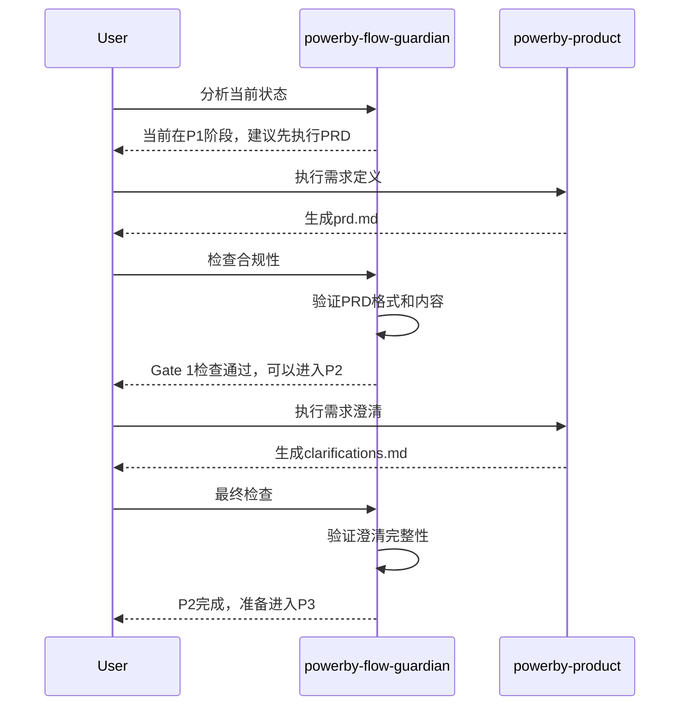
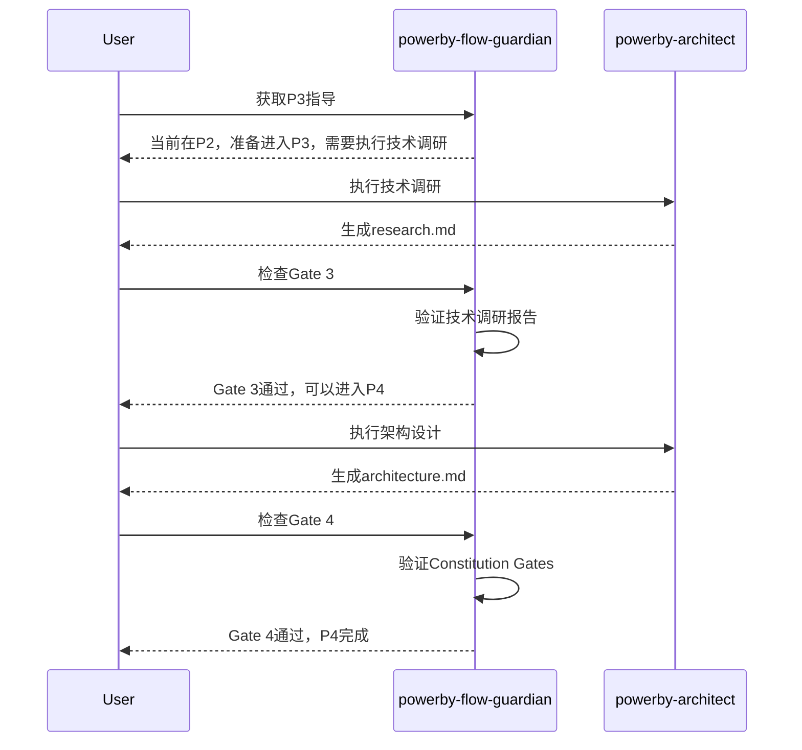
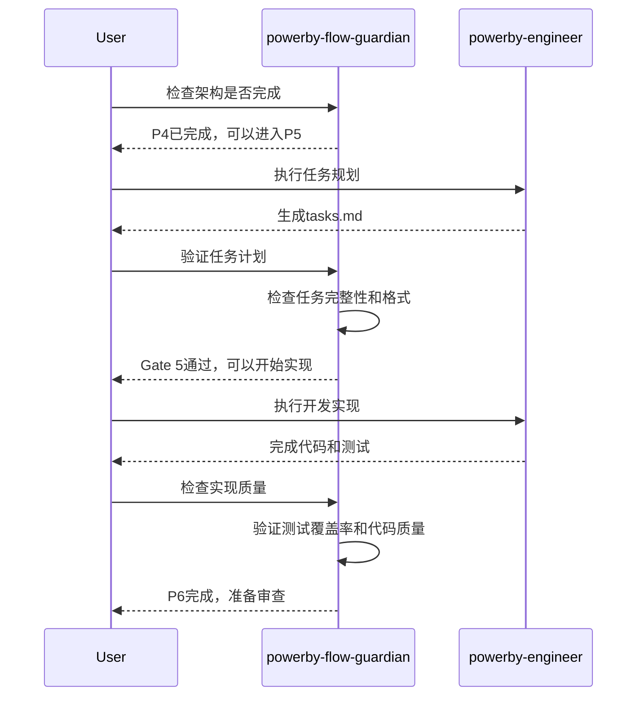
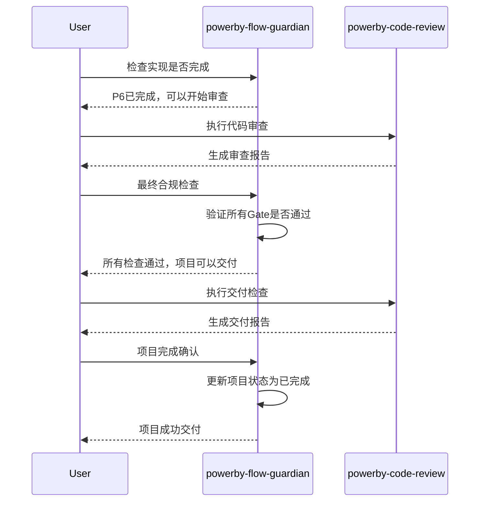

# PowerBy Flow Guardian - 集成指南

**版本**: v1.0.0
**创建日期**: 2025-12-18
**相关文档**:
- [Flow Guardian 技能文档](./powerby-flow-guardian.md)
- [Flow Guardian 概述](./powerby-flow-guardian-overview.md)
- [Flow Guardian 实现代码](../implementations/powerby_flow_guardian.py)

---

## 一、集成概览

`powerby-flow-guardian` 是PowerBy技能生态系统的最新成员，作为流程守护者，它与其他核心技能形成互补关系，确保项目严格遵循P0-P8生命周期标准。

### 技能生态关系图

```mermaid
graph TB
    subgraph "PowerBy Skills 核心层"
        PM[powerby-product<br/>产品经理]
        ARCH[powerby-architect<br/>架构师]
        ENG[powerby-engineer<br/>工程师]
        CR[powerby-code-review<br/>代码审查]
        FG[powerby-flow-guardian<br/>流程守护者] ⭐新增
    end

    subgraph "生命周期阶段"
        P0[P0: 初始化]
        P1[P1: 需求定义]
        P2[P2: 需求澄清]
        P3[P3: 技术调研]
        P4[P4: 架构设计]
        P5[P5: 任务规划]
        P6[P6: 开发实现]
        P7[P7: 代码审查]
        P8[P8: 发布交付]
    end

    subgraph "原子技能层"
        RA[requirement-alignment<br/>需求对齐]
        SE[solution-evaluation<br/>方案评估]
        MA[mermaid-architecture<br/>架构可视化]
        TSD[test-spec-design<br/>测试设计]
        MVP[mvp-prioritization<br/>MVP优先级]
    end

    %% 角色与阶段的关系
    PM --> P1
    PM --> P2
    ARCH --> P3
    ARCH --> P4
    ENG --> P5
    ENG --> P6
    CR --> P7

    %% 流程守护者与所有阶段的关系
    FG -.-> P0
    FG -.-> P1
    FG -.-> P2
    FG -.-> P3
    FG -.-> P4
    FG -.-> P5
    FG -.-> P6
    FG -.-> P7
    FG -.-> P8

    %% 流程守护者与其他角色的协作
    FG -.-> PM
    FG -.-> ARCH
    FG -.-> ENG
    FG -.-> CR

    %% 原子技能与核心技能的关系
    RA --> PM
    RA --> ARCH
    RA --> ENG
    SE --> ARCH
    SE --> ENG
    MA --> ARCH
    TSD --> ENG
    MVP --> PM

    classDef guardian fill:#ff9800,stroke:#f57c00,stroke-width:3px,color:#fff
    class FG guardian
```

---

## 二、与现有技能的协作模式

### 2.1 与 powerby-product 的协作

**协作场景**: P1-P2 需求阶段



**协作要点**:
- Flow Guardian在P1开始前检查项目宪章是否存在
- 在P1完成后验证PRD是否符合标准
- 在P2完成后确认所有模糊点已澄清
- 提供需求阶段的操作指导和下一步建议

**集成示例**:
```python
# 在 powerby-product 内部调用 Flow Guardian
class PowerByProduct:
    def check_prerequisites(self):
        guardian = PowerByFlowGuardian()
        state = guardian.analyze_current_state()
        if state["current_phase"] != "P0":
            raise Exception("必须在P0完成后才能开始P1")
        if not guardian._document_exists("docs/constitution.md"):
            raise Exception("缺少项目宪章，请先执行 /powerby.initialize")
```

### 2.2 与 powerby-architect 的协作

**协作场景**: P3-P4 技术阶段



**协作要点**:
- Flow Guardian确保P3阶段完成后再进入P4
- 检查技术调研报告的完整性和质量
- 在P4阶段验证Constitution Gates是否通过
- 提供技术决策的合规性检查

**集成示例**:
```python
# 在 powerby-architect 内部调用 Flow Guardian
class PowerByArchitect:
    def validate_prerequisites(self):
        guardian = PowerByFlowGuardian()
        state = guardian.analyze_current_state()
        if state["current_phase"] not in ["P2", "P3"]:
            raise Exception("架构设计必须在P2或P3阶段执行")

        # 检查前置条件
        if not guardian._document_exists("docs/iterations/*/clarifications.md"):
            raise Exception("缺少需求澄清记录")
```

### 2.3 与 powerby-engineer 的协作

**协作场景**: P5-P6 执行阶段



**协作要点**:
- Flow Guardian在P5开始前验证架构设计是否通过Gate 4
- 检查任务计划的完整性和格式规范
- 在P6实现过程中监控进度和质量
- 确保所有P0任务完成并通过测试

**集成示例**:
```python
# 在 powerby-engineer 内部调用 Flow Guardian
class PowerByEngineer:
    def validate_architecture(self):
        guardian = PowerByFlowGuardian()
        state = guardian.analyze_current_state()

        # 检查架构文档
        if not guardian._document_exists("docs/iterations/*/architecture.md"):
            raise Exception("缺少架构设计文档")

        # 检查Gate 4
        gates = guardian._check_all_gates()
        if gates.get(4).status != GateStatus.PASSED:
            raise Exception("必须通过Gate 4才能开始任务规划")
```

### 2.4 与 powerby-code-review 的协作

**协作场景**: P7-P8 审查和交付阶段



**协作要点**:
- Flow Guardian在P7开始前验证P6是否真正完成
- 检查所有门禁是否已通过
- 在P8阶段确保交付完整性
- 最终确认项目状态并更新元数据

**集成示例**:
```python
# 在 powerby-code-review 内部调用 Flow Guardian
class PowerByCodeReview:
    def pre_review_check(self):
        guardian = PowerByFlowGuardian()
        state = guardian.analyze_current_state()

        if state["current_phase"] != "P6":
            raise Exception("代码审查只能在P6阶段执行")

        # 检查实现报告
        if not guardian._document_exists("docs/iterations/*/implementation-report.md"):
            raise Exception("缺少实现报告")
```

---

## 三、集成实施指南

### 3.1 在现有技能中添加 Flow Guardian 调用

#### 步骤1: 导入依赖

```python
# 在现有技能文件中添加
from powerby_flow_guardian import PowerByFlowGuardian, GateStatus, Phase
```

#### 步骤2: 添加前置条件检查

```python
class PowerByProduct:
    def execute(self, **kwargs):
        # 在执行前检查前置条件
        self._check_flow_prerequisites()

        # 执行业务逻辑
        result = self._execute_business_logic(**kwargs)

        # 执行后验证
        self._validate_output(result)

    def _check_flow_prerequisites(self):
        """检查流程前置条件"""
        guardian = PowerByFlowGuardian()
        state = guardian.analyze_current_state()

        # 检查当前阶段
        expected_phase = "P1"
        if state["current_phase"] != expected_phase:
            raise Exception(f"当前阶段是{']}，应该在state['current_phase{expected_phase}阶段执行此操作")

        # 检查必需文档
        required_docs = ["docs/constitution.md"]
        for doc in required_docs:
            if not guardian._document_exists(doc):
                raise Exception(f"缺少必需文档: {doc}")

        # 检查前置门禁
        gates = state.get("gate_status", {})
        if gates.get("gate_0", {}).get("status") != "PASSED":
            raise Exception("必须通过Gate 0才能开始此阶段")
```

#### 步骤3: 添加后置验证

```python
def _validate_output(self, result):
    """验证输出质量"""
    guardian = PowerByFlowGuardian()

    # 检查输出文档
    expected_docs = ["docs/iterations/*/prd.md", "docs/iterations/*/function-points.md"]
    for doc in expected_docs:
        if not guardian._document_exists(doc):
            raise Exception(f"输出验证失败: 缺少文档 {doc}")

    # 验证文档质量
    for doc in expected_docs:
        if not guardian._validate_document(Path(doc)):
            raise Exception(f"输出验证失败: 文档格式不正确 {doc}")
```

### 3.2 创建集成测试

#### 技能协作测试

```python
def test_product_flow_guardian_integration():
    """测试 powerby-product 与 Flow Guardian 的集成"""
    guardian = PowerByFlowGuardian()

    # 1. 模拟项目初始化
    create_mock_project()

    # 2. 检查初始状态
    state = guardian.analyze_current_state()
    assert state["current_phase"] == "P0"
    assert state["health_score"] > 0

    # 3. 执行产品工作流程
    product = PowerByProduct()
    product.execute(product_idea="测试产品")

    # 4. 验证状态更新
    new_state = guardian.analyze_current_state()
    assert new_state["current_phase"] == "P1"
    assert "prd.md" in new_state["document_status"]

    # 5. 检查合规性
    compliance = guardian.audit_compliance(Phase.P1)
    assert compliance["compliance_score"] >= 70
```

### 3.3 配置管理

#### Flow Guardian 配置

```python
# config/flow_guardian_config.yaml
flow_guardian:
  enabled: true
  auto_check: true
  strict_mode: false

  checks:
    document_completeness: true
    gate_validation: true
    naming_conventions: true
    dependency_order: true

  thresholds:
    health_score_warning: 60
    compliance_score_warning: 70

  notifications:
    enabled: true
    methods: ["console", "log"]
```

---

## 四、最佳实践

### 4.1 集成原则

**✅ 推荐做法**:
1. **前置检查**: 在每个核心技能开始前调用Flow Guardian检查前置条件
2. **后置验证**: 在每个核心技能完成后调用Flow Guardian验证输出
3. **状态同步**: 保持项目状态与实际进度同步
4. **早期预警**: 利用Flow Guardian的预警功能及早发现问题

**❌ 避免做法**:
1. **过度依赖**: 不要完全依赖Flow Guardian，保留人工判断
2. **忽略警告**: 忽视Flow Guardian的警告可能导致严重问题
3. **跳过检查**: 不要跳过前置条件检查直接执行操作
4. **孤立使用**: Flow Guardian应该与核心技能配合使用

### 4.2 错误处理

#### 优雅降级

```python
def safe_flow_check(func):
    """安全检查装饰器"""
    def wrapper(*args, **kwargs):
        try:
            guardian = PowerByFlowGuardian()
            return func(*args, guardian=guardian, **kwargs)
        except Exception as e:
            logger.warning(f"Flow Guardian检查失败: {e}")
            # 继续执行，但记录警告
            logger.warning("继续执行，但请手动检查流程合规性")
            return func(*args, **kwargs)
    return wrapper
```

#### 强制合规模式

```python
class StrictFlowMode:
    """严格模式：在严格模式下，所有流程违规都会抛出异常"""

    def __init__(self, enabled=False):
        self.enabled = enabled

    def enforce(self, check_result):
        """强制执行检查"""
        if not self.enabled:
            return

        violations = check_result.get("violations", [])
        if violations:
            critical_violations = [v for v in violations if v["severity"] == "critical"]
            if critical_violations:
                raise Exception(f"发现严重流程违规: {critical_violations[0]['description']}")
```

### 4.3 性能优化

#### 缓存机制

```python
from functools import lru_cache

class CachedFlowGuardian(PowerByFlowGuardian):
    @lru_cache(maxsize=128)
    def analyze_current_state_cached(self):
        """带缓存的状态分析"""
        return self.analyze_current_state()

    def clear_cache(self):
        """清除缓存"""
        self.analyze_current_state_cached.cache_clear()
```

#### 异步检查

```python
import asyncio

async def async_flow_check():
    """异步流程检查"""
    guardian = PowerByFlowGuardian()

    # 并行执行多个检查
    tasks = [
        guardian.analyze_current_state(),
        guardian.audit_compliance(),
        guardian.diagnose_problems()
    ]

    results = await asyncio.gather(*tasks)
    return {
        "state": results[0],
        "compliance": results[1],
        "problems": results[2]
    }
```

---

## 五、监控和度量

### 5.1 关键指标

**流程健康度指标**:
- 项目整体健康度分数
- 各阶段完成率
- 门禁通过率
- 返工频率

**合规性指标**:
- 流程违规次数
- 文档完整性分数
- 命名规范遵守率
- 依赖关系正确率

**效率指标**:
- 阶段平均耗时
- 问题解决时间
- 阻塞点识别准确率
- 指导建议采纳率

### 5.2 报告生成

#### 定期健康报告

```python
def generate_health_report(guardian: PowerByFlowGuardian) -> str:
    """生成项目健康报告"""
    state = guardian.analyze_current_state()
    compliance = guardian.audit_compliance()
    problems = guardian.diagnose_problems()

    report = f"""
# 项目健康报告

## 当前状态
- 阶段: {state['current_phase']}
- 健康度: {state['health_score']}/100

## 合规性
- 合规分数: {compliance['compliance_score']}/100
- 违规数量: {len(compliance['violations'])}

## 问题总结
- 严重问题: {problems['severity_summary']['critical']}
- 主要问题: {problems['severity_summary']['major']}
- 次要问题: {problems['severity_summary']['minor']}

## 建议
{chr(10).join(compliance['recommendations'])}
"""
    return report
```

---

## 六、故障排除

### 6.1 常见问题

**Q1: Flow Guardian报告"项目未初始化"但项目已存在**
```
原因: .powerby/project.json 文件缺失或格式错误
解决: 重新执行 /powerby.initialize 或手动创建正确的project.json
```

**Q2: 门禁状态显示错误**
```
原因: 门禁状态未正确更新
解决: 手动更新project.json中的gates字段，或重新执行相应阶段
```

**Q3: 文档验证失败**
```
原因: 文档格式不符合标准或内容为空
解决: 检查文档格式，使用标准模板重新生成
```

### 6.2 调试技巧

**启用详细日志**:
```python
import logging
logging.basicConfig(level=logging.DEBUG)

guardian = PowerByFlowGuardian()
guardian.set_verbose(True)
```

**使用JSON输出进行调试**:
```bash
/powerby-flow-guardian analyze --json > debug_output.json
```

**分步检查**:
```bash
# 1. 检查项目状态
/powerby-flow-guardian analyze

# 2. 检查特定阶段
/powerby-flow-guardian audit --phase P4

# 3. 检查特定门禁
/powerby-flow-guardian check --gate 3 --detailed

# 4. 诊断问题
/powerby-flow-guardian diagnose --verbose
```

---

## 七、总结

`powerby-flow-guardian` 与现有PowerBy技能生态系统的集成将为项目开发带来显著价值：

### 7.1 核心价值

1. **流程透明化**: 让每个团队成员都清楚当前在流程中的位置
2. **质量保障**: 确保每个阶段都符合标准和规范
3. **问题预防**: 提前识别和解决潜在问题
4. **效率提升**: 减少返工和迷茫时间

### 7.2 集成收益

- **减少返工**: 通过早期检查避免后续阶段返工
- **提高质量**: 确保每个输出都符合标准
- **加速决策**: 提供清晰的行动指导
- **降低风险**: 通过合规检查降低项目风险

### 7.3 实施建议

1. **渐进式集成**: 先在单个技能中试点，逐步推广到所有技能
2. **配置优化**: 根据团队实际情况调整Flow Guardian配置
3. **培训先行**: 确保团队理解Flow Guardian的价值和使用方法
4. **持续改进**: 基于使用反馈不断优化集成方式

通过合理集成Flow Guardian，PowerBy框架将变得更加强大和易用，为团队提供更好的流程保障和开发体验。

---

**集成状态**: ✅ 设计完成
**下一步**: 在现有技能中实现集成
**优先级**: 高
**预计集成时间**: 1-2周
