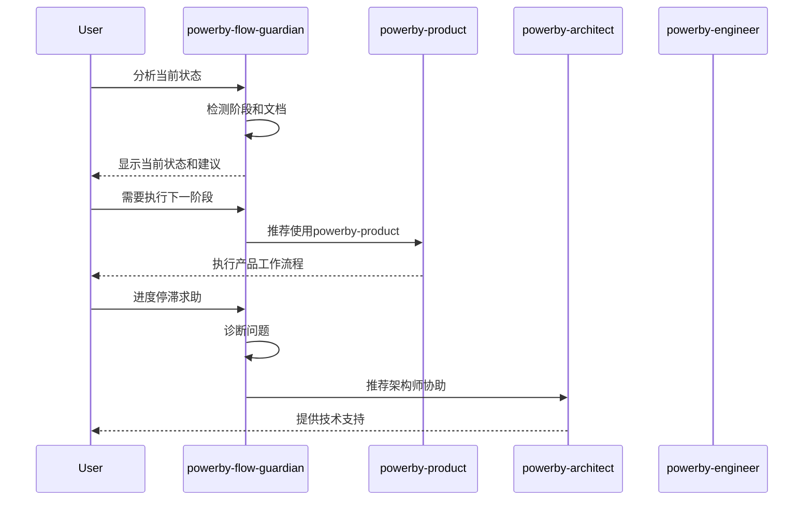

# PowerBy Flow Guardian 技能文档

**技能名称**: `powerby-flow-guardian`
**技能类型**: 核心技能 (Core Skill)
**版本**: v2.0.0
**创建日期**: 2025-12-18
**最后更新**: 2025-12-19
**维护者**: PowerBy Skills Team
**更新说明**: v2.0.0 - MVP精简优化：移除周期预估和瓶颈分析，专注流程合规

---

## 一、技能概述

### 1.1 设计理念

`powerby-flow-guardian` 是PowerBy框架的流程守护者，专门负责：
- 监控项目流程状态
- 诊断流程问题
- 提供操作指导
- 确保合规执行

借鉴"流程警察"和"导航助手"的概念，这个技能将成为您开发过程中的贴心管家，确保每个步骤都严格遵循PowerBy标准。

### 1.2 核心价值

**🔍 状态透明**: 清晰显示当前项目在P0-P8生命周期中的位置
**📋 行动指南**: 提供具体的、可执行的当前和下一步操作建议
**🚨 问题预警**: 提前识别流程风险和合规问题
**🎯 流程守护**: 防止流程跳跃，确保质量门禁

### 1.3 技能定位

```mermaid
graph TB
    subgraph "PowerBy Skills 生态"
        PM[powerby-product<br/>产品经理]
        ARCH[powerby-architect<br/>架构师]
        ENG[powerby-engineer<br/>工程师]
        CR[powerby-code-review<br/>代码审查]
        FG[powerby-flow-guardian<br/>流程守护者] ⭐新增
    end

    subgraph "角色职责"
        A[定义做什么]
        B[设计如何做]
        C[实现做出来]
        D[确保做得好]
        E[确保按流程做] ⭐
    end

    PM --> A
    ARCH --> B
    ENG --> C
    CR --> D
    FG --> E

    %% 流程守护者与其他角色的协作
    FG -.-> PM
    FG -.-> ARCH
    FG -.-> ENG
    FG -.-> CR

    classDef guardian fill:#ff9800,stroke:#f57c00,stroke-width:3px
    class FG guardian
```

---

## 二、核心功能模块

### 2.1 状态感知引擎 (Status Awareness Engine)

#### 功能描述
实时监控和诊断项目的当前状态，包括阶段、文档、门禁等各个维度。

#### 核心能力

**1. 项目状态检测**
```python
class ProjectStatusDetector:
    def detect_current_phase(self) -> PhaseStatus:
        """检测当前阶段"""
        # 读取project.json
        # 分析iterations.json
        # 检查文档状态
        # 确定当前阶段

    def check_gate_status(self, gate_id: int) -> GateStatus:
        """检查特定门禁状态"""
        # 验证门禁前置条件
        # 检查门禁通过状态
        # 分析失败原因

    def analyze_iteration_health(self, iteration_id: str) -> HealthReport:
        """分析迭代健康度"""
        # 文档完整性检查
        # 流程合规性审计
        # 依赖关系验证
```

**2. 文档完整性扫描**
```python
class DocumentIntegrityScanner:
    def scan_required_documents(self, phase: str) -> DocumentReport:
        """扫描必需文档"""
        required_docs = self.get_phase_requirements(phase)
        existing_docs = self.scan_existing_documents()
        return self.compare_and_report(required_docs, existing_docs)

    def validate_document_structure(self, doc_path: str) -> ValidationResult:
        """验证文档结构"""
        # 检查文档格式
        # 验证模板合规性
        # 分析内容完整性
```

#### 输出格式

```json
{
  "current_phase": "P4",
  "current_status": "P4_IN_PROGRESS",
  "gate_status": {
    "gate_0": {"status": "PASSED", "checked_at": "2025-12-18"},
    "gate_1": {"status": "PASSED", "checked_at": "2025-12-18"},
    "gate_2": {"status": "PASSED", "checked_at": "2025-12-18"},
    "gate_3": {"status": "PENDING", "reason": "等待技术调研完成"},
    "gate_4": {"status": "NOT_REACHED", "reason": "尚未到达此门禁"}
  },
  "document_status": {
    "constitution.md": "✅ 存在",
    "prd.md": "✅ 存在",
    "clarifications.md": "✅ 存在",
    "research.md": "❌ 缺失",
    "architecture.md": "❌ 缺失"
  },
  "iteration_health": {
    "overall_score": 65,
    "issues": [
      {"type": "missing_document", "doc": "research.md", "severity": "critical"},
      {"type": "missing_document", "doc": "architecture.md", "severity": "critical"}
    ]
  }
}
```

### 2.2 流程分析器 (Process Analyzer)

#### 功能描述
深度分析项目流程，识别问题、风险和改进机会。

#### 核心能力

**1. 依赖关系分析**
```python
class DependencyAnalyzer:
    def analyze_command_dependencies(self) -> DependencyReport:
        """分析指令依赖关系"""
        commands = self.get_executed_commands()
        for i, cmd in enumerate(commands):
            if not self.has_valid_prerequisites(cmd, commands[:i]):
                self.report_violation(cmd)

    def identify_bottlenecks(self) -> List[Bottleneck]:
        """识别流程瓶颈"""
        # 分析阶段耗时
        # 识别重复返工
        # 检测阻塞点
```

**2. 合规性审计**
```python
class ComplianceAuditor:
    def audit_process_compliance(self) -> ComplianceReport:
        """审计流程合规性"""
        violations = []
        # 检查是否跳过阶段
        # 验证门禁是否通过
        # 确认文档完整性
        return violations

    def check_naming_conventions(self) -> List[NamingIssue]:
        """检查命名规范"""
        issues = []
        # 检查分支命名
        # 验证文档路径
        # 确认迭代编号
        return issues
```

#### 输出格式

```json
{
  "dependency_analysis": {
    "violations": [
      {
        "type": "command_out_of_sequence",
        "current": "/powerby.design",
        "expected_prerequisite": "/powerby.research",
        "severity": "critical"
      }
    ]
  },
  "compliance_status": {
    "overall_score": 75,
    "violations": [
      {
        "rule": "gate_3_required_before_design",
        "description": "P4阶段前必须通过Gate 3",
        "status": "VIOLATED",
        "recommendation": "先完成技术调研"
      }
    ]
  }
}
```

### 2.3 指导建议生成器 (Guidance Generator)

#### 功能描述
基于当前状态和最佳实践，生成具体的、可执行的指导建议。

#### 核心能力

**1. 当前阶段操作建议**
```python
class CurrentPhaseGuidance:
    def generate_immediate_actions(self, current_phase: str) -> ActionPlan:
        """生成即时行动建议"""
        if current_phase == "P4":
            return ActionPlan(
                priority="high",
                actions=[
                    {
                        "action": "完成技术调研",
                        "command": "/powerby.research",
                        "estimated_time": "1-2天",
                        "blocking_issues": ["技术选型未确定"]
                    },
                    {
                        "action": "通过Gate 3检查",
                        "requirement": "所有P0功能的技术可行性已评估",
                        "verification_method": "review research.md"
                    }
                ]
            )
```

**2. 下一步预测和建议**
```python
class NextStepPredictor:
    def predict_next_command(self, current_phase: str) -> CommandRecommendation:
        """预测下一步指令"""
        phase_to_command = {
            "P0": "/powerby.initialize",
            "P1": "/powerby.define",
            "P2": "/powerby.clarify",
            "P3": "/powerby.research",
            "P4": "/powerby.design",
            "P5": "/powerby.plan",
            "P6": "/powerby.implement",
            "P7": "/powerby.review"
        }
        return self.get_command_details(phase_to_command[current_phase])

    def generate_roadmap(self, current_phase: str) -> Roadmap:
        """生成完整路线图"""
        remaining_phases = self.get_remaining_phases(current_phase)
        return self.create_roadmap(remaining_phases)
```

#### 输出格式

```markdown
# 🔍 当前状态分析

## 当前位置
- **阶段**: P4 - 架构设计 (进行中)
- **健康度**: 65/100 ⚠️
- **门禁状态**: Gate 3 待通过

## 📋 即时行动建议 (优先级: 高)

### 1. 立即执行: 完成技术调研
- **指令**: `/powerby.research`
- **预计耗时**: 1-2天
- **阻塞问题**: 技术选型未确定
- **所需文档**:
  - ✅ prd.md (已存在)
  - ✅ clarifications.md (已存在)

### 2. 然后执行: 通过Gate 3检查
- **要求**: 所有P0功能的技术可行性已评估
- **验证方式**: review research.md
- **通过标准**:
  - [ ] 技术选型已完成决策
  - [ ] 风险评估报告完成
  - [ ] 备选方案对比清晰

## 🎯 下一步预测

**接下来应该**: `/powerby.design`
- **时机**: Gate 3通过后
- **预计耗时**: 2-5天
- **主要产出**: architecture.md, data-model.md, contracts/

## 🗺️ 完整路线图

```
当前 (P4) → /powerby.research → /powerby.design → /powerby.plan → /powerby.implement → /powerby.review
   ↓            ↓                ↓               ↓              ↓              ↓
  1-2天        2-5天            1-2天           N天            0.5-1天
```

## ⚠️ 发现的问题

### 严重问题 (需立即解决)
1. **缺失文档**: research.md
   - 影响: 无法进行架构设计
   - 解决方案: 立即执行 `/powerby.research`

### 改进建议
1. **优化建议**: 考虑在P3阶段增加技术预研
   - 收益: 减少P4阶段的决策时间
   - 实施: 为未来迭代提前规划

## 📊 流程健康度分析

- **文档完整性**: 60% (3/5 必需文档存在)
- **门禁合规性**: 50% (1/2 已通过门禁)
- **依赖关系**: 80% (轻微违规)
- **整体评分**: 65/100 ⚠️
```

### 2.4 问题诊断器 (Problem Diagnoser)

#### 功能描述
主动识别流程问题、风险和合规违规，提供根因分析和解决建议。

#### 核心能力

**1. 问题识别引擎**
```python
class ProblemIdentifier:
    def identify_missing_elements(self) -> List[MissingElement]:
        """识别缺失元素"""
        issues = []
        # 检查缺失文档
        # 识别缺失Gate检查
        # 发现缺失指令执行
        return issues

    def detect_compliance_violations(self) -> List[Violation]:
        """检测合规违规"""
        violations = []
        # 检查流程跳跃
        # 验证门禁绕过
        # 确认命名规范
        return violations

    def analyze_flow_anomalies(self) -> List[Anomaly]:
        """分析流程异常"""
        anomalies = []
        # 检测异常耗时
        # 发现重复返工
        # 识别瓶颈点
        return anomalies
```

**2. 根因分析器**
```python
class RootCauseAnalyzer:
    def analyze_problem_root_cause(self, problem: Problem) -> RootCauseReport:
        """分析问题根因"""
        # 收集相关数据
        # 应用分析规则
        # 生成因果链
        # 提供解决建议
```

#### 输出格式

```markdown
# 🚨 问题诊断报告

## 严重问题 (Critical)

### 1. 流程跳跃违规
**问题**: 尝试从P2直接跳转到P4，跳过了P3阶段
**影响**: 可能导致技术选型不当
**根因**:
- 对P3阶段重要性认识不足
- 缺乏流程约束机制提醒
**解决建议**:
- 立即执行 `/powerby.research`
- 完成技术调研后再进行架构设计
- 启用Flow Guardian的主动提醒功能

### 2. 缺失Gate 2检查
**问题**: P2阶段完成后未通过Gate 2检查
**影响**: 可能存在未澄清的需求模糊点
**根因**:
- 需求澄清不够充分
- 覆盖度分析未完成
**解决建议**:
- 重新执行 `/powerby.clarify`
- 确保11大类覆盖度分析完成
- 将澄清结果同步到PRD

## 改进机会 (Improvement)

### 1. 文档标准化提升
**发现**: 文档格式不统一
**建议**: 启用模板自动生成功能
**收益**: 提高文档质量和一致性

### 2. 门禁检查优化
**发现**: Gate检查被动触发
**建议**: 启用主动门禁监控
**收益**: 及时发现和解决问题
```

---

## 三、使用场景和示例

### 3.1 场景1: 新项目启动检查

```bash
# 用户输入
"我刚创建了新项目，想知道现在应该做什么"

# 技能执行
/powerby-flow-guardian analyze --current-status

# 输出示例
🔍 流程状态分析

📍 当前状态: 项目尚未初始化
- 项目结构: 未创建
- Git仓库: 未初始化
- 文档状态: 无

✅ 建议立即执行:
1. 创建项目目录结构
2. 初始化Git仓库
3. 运行 /powerby.initialize 建立项目宪章

📋 下一步操作:
/powerby.initialize my-project "项目描述"
```

### 3.2 场景2: 流程合规检查

```bash
# 用户输入
"我的项目在P4阶段，想检查是否有合规问题"

# 技能执行
/powerby-flow-guardian audit --phase P4

# 输出示例
🚨 合规检查报告

✅ 通过的检查项:
- 项目宪章存在且完整
- PRD文档格式正确
- 需求澄清记录完整

❌ 违规项:
1. 缺失Gate 3检查
   - 要求: 通过技术调研验收
   - 现状: research.md不存在
   - 建议: 执行 /powerby.research

2. 文档结构不合规
   - 要求: architecture.md必须包含Mermaid图
   - 现状: 架构文档未包含可视化
   - 建议: 使用 mermaid-architecture 技能

⚠️ 风险提醒:
- 当前违规可能导致后续阶段返工
- 建议立即修复后再继续
```

### 3.3 场景3: 流程指导和路线图

```bash
# 用户输入
"我在P3阶段完成技术调研，现在不知道接下来做什么"

# 技能执行
/powerby-flow-guardian guidance --next-step

# 输出示例
🎯 流程指导

📍 当前位置: P3完成，准备进入P4

✅ 恭喜！您已完成:
- 技术调研报告 (research.md)
- 技术选型决策
- 风险评估

🎯 下一步: P4 架构设计
- **推荐指令**: `/powerby.design`
- **预计耗时**: 2-5天
- **主要产出**:
  - architecture.md (技术架构图)
  - data-model.md (数据模型)
  - contracts/ (API契约)

📋 执行前检查清单:
- [ ] 已确认技术选型
- [ ] 已完成风险评估
- [ ] 已准备架构设计工具

🛡️ 质量门禁提醒:
- Gate 4: Constitution Gates
  - Simplicity Gate (方案简单性)
  - Anti-Abstraction Gate (避免过度抽象)
  - Integration-First Gate (优先复用)

💡 优化建议:
- 在architecture.md中包含Mermaid架构图
- 使用powerby-architect的完整流程
- 考虑邀请工程师参与架构评审
```

### 3.4 场景4: 问题诊断和修复

```bash
# 用户输入
"我的项目进度停滞，不知道卡在哪里了"

# 技能执行
/powerby-flow-guardian diagnose --stuck

# 输出示例
🔍 问题诊断

🚨 发现阻塞点:

1. **主要阻塞**: Gate 3 未通过
   - 位置: P3 → P4 过渡
   - 原因: 技术调研报告不符合标准
   - 影响: 无法进入架构设计阶段
   - 解决: 完善research.md，增加备选方案对比

2. **次要问题**: 文档格式不统一
   - 位置: PRD文档
   - 原因: 未使用标准模板
   - 影响: 可能影响后续文档生成
   - 解决: 重新生成PRD或手动格式化

📊 流程健康度:
- 整体进度: 40%
- 当前阶段耗时: 7天 (建议: 1-2天)
- 建议: 优先解决Gate 3问题

🛠️ 修复方案:
1. 立即修复 (预计1天)
   - 完善技术调研报告
   - 完成Gate 3检查

2. 优化改进 (预计0.5天)
   - 统一文档格式
   - 更新项目元数据

3. 继续推进
   - 执行 /powerby.design
   - 进入架构设计阶段

⏱️ 预计修复时间: 1-2天
```

---

## 四、指令格式和参数

### 4.1 完整指令格式

```bash
/powerby-flow-guardian [操作模式] [参数选项]
```

### 4.2 操作模式

| 模式 | 说明 | 示例 |
|-----|------|------|
| `analyze` | 分析当前状态 | `/powerby-flow-guardian analyze` |
| `audit` | 合规性审计 | `/powerby-flow-guardian audit --phase P4` |
| `guidance` | 生成操作指导 | `/powerby-flow-guardian guidance --next-step` |
| `diagnose` | 问题诊断 | `/powerby-flow-guardian diagnose --stuck` |
| `check` | 快速检查 | `/powerby-flow-guardian check --gate 3` |
| `report` | 生成完整报告 | `/powerby-flow-guardian report --full` |

### 4.3 参数选项

#### 通用参数
- `--project-path`: 项目路径 (默认: 当前目录)
- `--iteration-id`: 迭代ID (默认: 当前活跃迭代)
- `--verbose`: 详细输出模式
- `--json`: JSON格式输出

#### 特定模式参数
```bash
# analyze 模式
/powerby-flow-guardian analyze [--include-health] [--include-dependencies]

# audit 模式
/powerby-flow-guardian audit --phase P[0-8] [--check-naming] [--check-templates]

# guidance 模式
/powerby-flow-guardian guidance --next-step [--include-roadmap] [--estimated-time]

# diagnose 模式
/powerby-flow-guardian diagnose --stuck [--root-cause] [--priority high|medium|low]

# check 模式
/powerby-flow-guardian check --gate [0-8] [--detailed]

# report 模式
/powerby-flow-guardian report --full [--output-path] [--format md|json|html]
```

---

## 五、核心算法设计

### 5.1 状态检测算法

```python
def detect_current_phase(project_path: str) -> PhaseStatus:
    """
    检测当前阶段算法
    """
    # 1. 读取项目元数据
    project_metadata = read_project_metadata(project_path)
    current_status = project_metadata.get('current_phase', 'UNKNOWN')

    # 2. 验证文档存在性
    required_docs = get_phase_required_documents(current_status)
    existing_docs = scan_existing_documents(project_path)

    # 3. 检查门禁状态
    gate_status = check_gate_status(project_path, current_status)

    # 4. 综合判断
    if is_phase_completed(current_status, required_docs, gate_status):
        return PhaseStatus(
            phase=current_status,
            status="COMPLETED",
            next_phase=get_next_phase(current_status)
        )
    else:
        return PhaseStatus(
            phase=current_status,
            status="IN_PROGRESS",
            blockers=identify_blockers(required_docs, existing_docs)
        )
```

### 5.2 合规检查算法

```python
def audit_compliance(project_path: str) -> ComplianceReport:
    """
    合规检查算法
    """
    violations = []

    # 1. 检查指令序列
    executed_commands = get_executed_commands(project_path)
    for i, cmd in enumerate(executed_commands):
        if not has_valid_prerequisites(cmd, executed_commands[:i]):
            violations.append(CommandSequenceViolation(cmd))

    # 2. 检查门禁绕过
    for gate_id in range(0, 9):
        if is_gate_supposed_to_be_checked(gate_id, executed_commands):
            if not is_gate_passed(gate_id, project_path):
                violations.append(GateBypassViolation(gate_id))

    # 3. 检查文档完整性
    current_phase = get_current_phase(project_path)
    required_docs = get_phase_required_documents(current_phase)
    for doc in required_docs:
        if not document_exists(doc, project_path):
            violations.append(MissingDocumentViolation(doc))

    return ComplianceReport(
        violations=violations,
        score=calculate_compliance_score(violations)
    )
```

### 5.3 指导建议生成算法

```python
def generate_guidance(current_phase: str, context: dict) -> GuidanceReport:
    """
    指导建议生成算法
    """
    # 1. 分析当前状态
    phase_analysis = analyze_phase_state(current_phase, context)

    # 2. 生成即时行动
    immediate_actions = []
    if phase_analysis.has_blockers:
        immediate_actions = generate_unblock_actions(phase_analysis.blockers)
    elif not phase_analysis.is_completed:
        immediate_actions = generate_completion_actions(current_phase)

    # 3. 预测下一步
    next_command = predict_next_command(current_phase)
    next_requirements = get_command_requirements(next_command)

    # 4. 生成路线图
    remaining_phases = get_remaining_phases(current_phase)
    roadmap = generate_roadmap(remaining_phases)

    return GuidanceReport(
        current_phase=current_phase,
        immediate_actions=immediate_actions,
        next_command=next_command,
        next_requirements=next_requirements,
        roadmap=roadmap,
        estimated_time=estimate_total_time(remaining_phases)
    )
```

---

## 六、输出格式规范

### 6.1 标准输出格式

所有模式都支持两种输出格式：
1. **Markdown格式** (默认) - 人类友好
2. **JSON格式** - 机器可读

### 6.2 Markdown输出模板

```markdown
# 🔍 [标题]

## 当前状态
- **阶段**: {phase}
- **状态**: {status}
- **健康度**: {health_score}/100 {emoji}

## {主要章节}
{content}

## 📋 行动建议
{actions}

## ⚠️ 问题清单
{issues}

## 🗺️ 下一步
{next_steps}
```

### 6.3 JSON输出结构

```json
{
  "timestamp": "2025-12-18T10:30:00Z",
  "project_path": "/path/to/project",
  "analysis_type": "analyze|audit|guidance|diagnose",
  "current_state": {
    "phase": "P4",
    "status": "IN_PROGRESS",
    "health_score": 75
  },
  "findings": {
    "violations": [...],
    "recommendations": [...],
    "blockers": [...]
  },
  "guidance": {
    "immediate_actions": [...],
    "next_command": "/powerby.design",
    "estimated_time": "2-5天"
  }
}
```

---

## 七、集成和协作

### 7.1 与其他技能的协作



### 7.2 主动提醒机制

```python
class ProactiveNotifier:
    def __init__(self):
        self.reminders = []

    def check_gate_due(self, project_path: str):
        """检查门禁到期提醒"""
        current_phase = get_current_phase(project_path)
        if is_gate_supposed_to_be_checked(current_phase):
            self.send_reminder(f"请完成Gate {current_phase[-1]}检查")

    def detect_long_inactivity(self, project_path: str):
        """检测长期不活跃"""
        last_activity = get_last_activity_time(project_path)
        if is_inactive_too_long(last_activity):
            self.send_reminder("项目进度停滞，建议检查阻塞问题")
```

---

## 八、最佳实践

### 8.1 使用时机

**✅ 推荐使用**:
- 项目启动时检查初始状态
- 阶段转换前验证前置条件
- 进度停滞时诊断问题
- 代码审查前确保合规
- 定期流程健康检查

**❌ 不推荐**:
- 正在执行核心技能时频繁调用
- 仅为了好奇心而无具体问题
- 在没有项目的情况下使用

### 8.2 配合其他技能

**与powerby-product协作**:
- 在P1-P2阶段提供状态检查
- 帮助识别需求模糊点
- 确保PRD符合标准

**与powerby-architect协作**:
- 在P3-P4阶段提供架构指导
- 检查技术调研完整性
- 验证架构设计合规性

**与powerby-engineer协作**:
- 在P5-P6阶段提供任务指导
- 检查实现进度
- 确保代码质量

**与powerby-code-review协作**:
- 在P7-P8阶段提供最终检查
- 验证交付完整性
- 生成审查报告

### 8.3 高级功能

**1. 流程基准分析**
```bash
# 对比历史项目性能
/powerby-flow-guardian benchmark --project-type e-commerce
```

**2. 流程优化建议**
```bash
# 基于AI分析的优化建议
/powerby-flow-guardian optimize --ai-powered
```

**3. 自定义规则**
```bash
# 添加自定义合规规则
/powerby-flow-guardian config --add-rule custom-rule.yaml
```

---

## 九、常见问题解答

### Q1: Flow Guardian和代码审查技能有什么区别？
**A**: Flow Guardian专注于**流程合规**，代码审查技能专注于**代码质量**。Flow Guardian检查您是否按正确顺序执行了正确的步骤，代码审查检查您的代码是否符合质量标准。

### Q2: 可以完全依赖Flow Guardian来保证流程合规吗？
**A**: Flow Guardian是强大的辅助工具，但不能完全替代人工判断。它提供建议和提醒，但最终的决策和执行需要团队共同负责。

### Q3: 如果Flow Guardian发现严重违规，应该怎么办？
**A**: 严重违规通常意味着需要返工。建议：
1. 立即停止当前工作
2. 按照Flow Guardian的建议修复问题
3. 重新验证后再继续
4. 总结经验避免再次发生

### Q4: Flow Guardian能预测项目完成时间吗？
**A**: 可以基于历史数据和当前进度估算，但仅供参考。实际时间取决于团队能力、技术难度、问题复杂度等因素。

### Q5: 如何让Flow Guardian更准确地了解我的项目？
**A**:
1. 保持项目元数据更新
2. 使用标准文档模板
3. 定期运行健康检查
4. 及时更新项目状态

---

## 十、总结

`powerby-flow-guardian` 作为PowerBy框架的流程守护者，将成为您开发过程中的得力助手。它不仅能帮助您识别当前状态、发现问题、提供建议，还能主动预防流程违规，确保项目始终沿着正确的轨道前进。

**核心价值**:
- 🔍 **状态透明**: 让您始终清楚自己在流程中的位置
- 📋 **行动明确**: 提供具体的下一步操作指南
- 🚨 **风险预警**: 提前发现和预防问题
- 🛡️ **流程守护**: 确保严格遵循PowerBy标准

通过合理使用这个技能，您将能够显著提升项目管理的效率和质量，减少返工和风险，确保每个迭代都能高质量地完成。

---

**技能状态**: ✅ 设计完成
**下一步**: 实现开发
**优先级**: 高
**预计开发时间**: 3-5天
