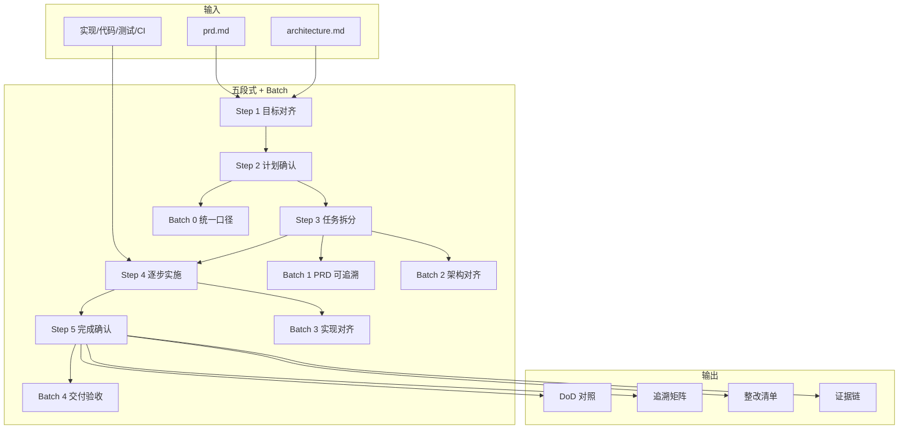

```mermaid
flowchart TB
    subgraph Inputs[输入]
        PRD[prd.md]
        ARCH[architecture.md]
        IMPL[实现/代码/测试/CI]
    end

    subgraph Process[五段式 + Batch]
        S1[Step 1 目标对齐]
        S2[Step 2 计划确认]
        S3[Step 3 任务拆分]
        S4[Step 4 逐步实施]
        S5[Step 5 完成确认]
        B0[Batch 0 统一口径]
        B1[Batch 1 PRD 可追溯]
        B2[Batch 2 架构对齐]
        B3[Batch 3 实现对齐]
        B4[Batch 4 交付验收]
    end

    subgraph Outputs[输出]
        DOD[DoD 对照]
        MATRIX[追溯矩阵]
        FIX[整改清单]
        EVID[证据链]
    end

    PRD --> S1
    ARCH --> S1
    IMPL --> S4

    S1 --> S2 --> S3 --> S4 --> S5
    S2 --> B0
    S3 --> B1
    S3 --> B2
    S4 --> B3
    S5 --> B4

    S5 --> DOD
    S5 --> MATRIX
    S5 --> FIX
    S5 --> EVID
```
