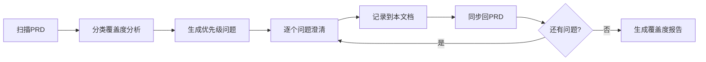

# 需求澄清记录 (Requirement Clarifications)

**项目名称**: [项目名称]
**文档版本**: v1.0.0
**创建日期**: YYYY-MM-DD
**最后更新**: YYYY-MM-DD
**负责人**: [Product Manager姓名]
**生命周期阶段**: P2 - 需求澄清

---

## 文档状态

| 状态 | 日期 | 备注 |
|-----|------|------|
| 📝 进行中 | YYYY-MM-DD | 澄清流程启动 |
| ✅ 已完成 | - | Gate 2通过 |

---

## 澄清流程概览

### 流程说明



### 11大类覆盖度分析

| 类别 | 状态 | 说明 |
|-----|------|------|
| 1. 功能范围与边界 | 🟢 Clear | - |
| 2. 数据模型与实体 | 🟡 Partial | 需澄清唯一性规则 |
| 3. 交互与UX流程 | 🟢 Clear | - |
| 4. 非功能属性 | 🔴 Missing | 缺少性能目标 |
| 5. 集成与外部依赖 | 🟡 Partial | 第三方API故障处理未定义 |
| 6. 边界情况与失败处理 | 🔴 Missing | 无明确异常处理策略 |
| 7. 约束与权衡 | 🟢 Clear | - |
| 8. 术语一致性 | 🟢 Clear | - |
| 9. 完整性信号 | 🟡 Partial | 部分验收标准不可量化 |
| 10. 待办项/占位符 | 🟢 Clear | - |
| 11. 安全与隐私 | 🔴 Missing | 无安全需求定义 |

**图例**:
- 🟢 Clear: 覆盖完整
- 🟡 Partial: 部分覆盖,需补充
- 🔴 Missing: 缺失,需澄清

---

## 澄清会话记录

### 会话 1: YYYY-MM-DD

#### 问题 Q1: [问题主题]

**类别**: [11大类中的哪一类]
**优先级**: ⭐⭐⭐ (高) / ⭐⭐ (中) / ⭐ (低)

**问题描述**:
```
[详细描述需要澄清的问题]

示例:
当用户查询的代币对在某个DEX上不存在时,系统应该如何处理?
```

**问题来源**:
- PRD章节: [章节编号]
- 原文引用: "[引用原文]"

**为何需要澄清**:
```
[说明为什么这个问题需要澄清,它会影响什么]

示例:
这个问题影响错误处理逻辑的设计,如果处理不当,会导致用户体验差或系统崩溃。
```

**推荐答案**:
```
[基于最佳实践和上下文,提供推荐的答案]

示例:
推荐: 显示友好的错误提示"该代币对在此DEX上不可用",并建议用户尝试其他DEX。
理由: 符合用户预期,不会让用户困惑,且技术实现简单。
```

**备选方案**:

| 选项 | 描述 | 优点 | 缺点 |
|------|------|------|------|
| A | [方案A描述] | [优点] | [缺点] |
| B | [方案B描述] | [优点] | [缺点] |
| C | [方案C描述] | [优点] | [缺点] |

**示例**:

| 选项 | 描述 | 优点 | 缺点 |
|------|------|------|------|
| A | 显示错误提示并建议其他DEX | 用户体验好 | 需维护DEX列表 |
| B | 静默跳过该DEX | 实现简单 | 用户可能困惑为何没有该DEX |
| C | 返回技术错误信息 | 开发成本低 | 用户体验差 |

**最终决策**:
- **选择**: [推荐/A/B/C/自定义]
- **决策人**: [姓名]
- **决策日期**: YYYY-MM-DD
- **最终答案**: "[详细答案]"
- **理由**: "[决策理由]"

**同步到PRD**:
- ✅ 已同步到 prd.md § [章节编号]
- 更新时间: YYYY-MM-DD HH:MM

---

#### 问题 Q2: [问题主题]

[重复上述结构...]

---

### 会话 2: YYYY-MM-DD

[如有后续会话,继续记录...]

---

## 问题汇总统计

### 按类别统计

| 类别 | 问题数 | 已澄清 | 待澄清 |
|-----|-------|-------|-------|
| 功能范围与边界 | 2 | 2 | 0 |
| 数据模型与实体 | 3 | 2 | 1 |
| 交互与UX流程 | 1 | 1 | 0 |
| 非功能属性 | 4 | 3 | 1 |
| **总计** | **10** | **8** | **2** |

### 按优先级统计

| 优先级 | 问题数 | 已澄清 | 待澄清 |
|-------|-------|-------|-------|
| ⭐⭐⭐ 高 | 3 | 3 | 0 |
| ⭐⭐ 中 | 5 | 4 | 1 |
| ⭐ 低 | 2 | 1 | 1 |
| **总计** | **10** | **8** | **2** |

---

## 覆盖度评估报告

### 最终覆盖度状态

| 类别 | 初始状态 | 最终状态 | 提升 |
|-----|---------|---------|------|
| 1. 功能范围与边界 | 🟢 Clear | 🟢 Clear | - |
| 2. 数据模型与实体 | 🟡 Partial | 🟢 Clear | ✅ |
| 3. 交互与UX流程 | 🟢 Clear | 🟢 Clear | - |
| 4. 非功能属性 | 🔴 Missing | 🟡 Partial | ⚠️ |
| 5. 集成与外部依赖 | 🟡 Partial | 🟢 Clear | ✅ |
| 6. 边界情况与失败处理 | 🔴 Missing | 🟡 Partial | ⚠️ |
| 7. 约束与权衡 | 🟢 Clear | 🟢 Clear | - |
| 8. 术语一致性 | 🟢 Clear | 🟢 Clear | - |
| 9. 完整性信号 | 🟡 Partial | 🟢 Clear | ✅ |
| 10. 待办项/占位符 | 🟢 Clear | 🟢 Clear | - |
| 11. 安全与隐私 | 🔴 Missing | 🟡 Partial | ⚠️ |

**核心类别覆盖率**: 8/11 = 72.7% → 10/11 = 90.9% ✅

### 遗留问题清单

> **说明**: 未在本次澄清中解决的问题,推迟到后续阶段

| 问题ID | 问题描述 | 推迟理由 | 计划解决阶段 |
|-------|---------|---------|-------------|
| Q9 | [问题描述] | [理由] | P3-技术调研 |
| Q10 | [问题描述] | [理由] | P4-架构设计 |

**示例**:

| 问题ID | 问题描述 | 推迟理由 | 计划解决阶段 |
|-------|---------|---------|-------------|
| Q9 | 具体选择哪个区块链节点服务商 | 需要技术调研对比 | P3-技术调研 |
| Q10 | API响应时间的具体SLA | 需要技术方案确定后评估 | P4-架构设计 |

---

## Gate 2 验收检查

### 验收标准

- [ ] 11大类覆盖度分析已完成
- [ ] 高优先级(⭐⭐⭐)问题已全部澄清
- [ ] 中优先级(⭐⭐)问题已澄清≥80%
- [ ] 所有澄清已同步回prd.md对应章节
- [ ] 核心类别(1-6类)覆盖率≥80%
- [ ] 遗留问题已明确推迟计划

### 验收结果

**Gate 2状态**: ⏳ 待验收 / ✅ 通过 / ❌ 不通过

**验收意见**:
```
[验收人的评审意见]
```

**验收人**: [姓名]
**验收日期**: YYYY-MM-DD

---

## 澄清质量自评

### 问题质量

- **问题总数**: [数量]
- **问题限制**: ≤5个 (符合: ✅ / 超出: ❌)
- **问题有效性**: [被采纳的问题数] / [总问题数] = [百分比]

### 答案质量

- **提供推荐答案比例**: [百分比]
- **推荐答案被采纳比例**: [百分比]
- **自定义答案比例**: [百分比]

### 同步质量

- **PRD同步完整性**: [已同步数] / [总澄清数] = [百分比]
- **同步及时性**: [24小时内同步] / [总澄清数] = [百分比]

---

## 附录

### A. 澄清方法论

#### 11大类说明

1. **功能范围与边界**: 核心目标、Out-of-scope声明、用户角色区分
2. **数据模型与实体**: Entities、属性、关系、唯一性规则、状态转换、数据量假设
3. **交互与UX流程**: 关键用户旅程、错误/空/加载状态、可访问性
4. **非功能属性**: 性能(延迟/吞吐量)、可扩展性、可靠性、可观测性、安全、合规
5. **集成与外部依赖**: 外部服务/API、故障模式、数据格式、协议/版本
6. **边界情况与失败处理**: 负面场景、限流、冲突解决
7. **约束与权衡**: 技术约束、明确权衡、被拒绝的替代方案
8. **术语一致性**: 规范术语、避免同义词
9. **完整性信号**: 验收标准可测试性、可量化的Definition of Done
10. **待办项/占位符**: TODO标记、未解决决策、模糊形容词
11. **安全与隐私**: 认证/授权、数据保护、威胁假设

#### 问题生成规则

- **最多5个问题**: 强制优先级排序
- **优先级**: 范围 > 安全 > UX > 技术细节
- **格式**: 每个问题必须:
  - 影响MVP实现或验收
  - 有推荐答案 + 2-3个备选项
  - 可用≤5词回答或选择多选项

### B. PRD更新清单

以下是本次澄清需要同步回PRD的章节:

| 澄清问题 | PRD章节 | 更新状态 | 更新时间 |
|---------|---------|---------|---------|
| Q1 | § 2.2 交互流程 | ✅ 已更新 | YYYY-MM-DD |
| Q2 | § 2.4 非功能需求 | ✅ 已更新 | YYYY-MM-DD |
| Q3 | § 2.3 范围边界 | ⏳ 待更新 | - |

### C. 变更历史

| 版本 | 日期 | 变更内容 | 修订人 |
|-----|------|---------|-------|
| v1.0.0 | YYYY-MM-DD | 初始版本,完成5个问题澄清 | [姓名] |
| v1.1.0 | YYYY-MM-DD | [变更说明] | [姓名] |

---

**文档状态**: 📝 进行中 / ✅ 已完成
**下一阶段**: P3 - 技术调研
**相关文档**:
- `docs/{project}/prd.md`
- `docs/{project}/research.md` (待创建)
