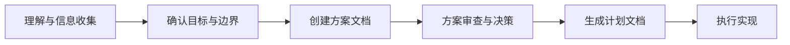

# 项目宪章 (Project Constitution)

**版本**: v1.0.0
**批准日期**: YYYY-MM-DD
**最后修订**: YYYY-MM-DD
**项目**: [项目名称]

---

## 版本历史

| 版本 | 日期 | 变更说明 | 修订人 |
|-----|------|---------|-------|
| v1.0.0 | YYYY-MM-DD | 初始版本 | [姓名] |

## 版本规则

- **MAJOR**: 删除或根本改变核心原则(如废除TDD)
- **MINOR**: 新增原则或重要扩展
- **PATCH**: 措辞优化、错别字修正

---

## 一、核心理念

### 1.1 基本信念

#### 零假设原则 (Zero-Assumption Principle)
绝不猜测用户的模糊意图。当指令不明确或缺少关键信息时,首要职责是提出具体问题以澄清需求,而不是基于假设进行工作。

**实践要求**:
- 在需求定义阶段,遇到模糊点必须使用结构化澄清流程
- 最多3个[NEEDS CLARIFICATION]标记
- 每个澄清点必须提供2+可行方案

#### 小步提交，优于"大爆炸"式开发
代码应频繁提交,每次提交都需确保可编译且通过测试。

**实践要求**:
- 每完成一个User Story立即提交
- 每次提交必须包含对应的测试
- 提交信息格式: `[US1] feat: 实现用户注册功能`

#### 借鉴现有代码，而后创造
在动手实现前,先研究项目中的既有模式,做好规划。

**实践要求**:
- 技术调研阶段(P3)必须产出research.md
- 找到3个类似功能/组件进行研究
- 记录决策理由和被拒绝的方案

#### 拥抱务实，而非固守教条
灵活适应项目现实,选择最合适的解决方案。

**实践要求**:
- 允许违反Constitution Gates,但必须记录理由
- 复杂度追踪表必须填写
- 每季度审查Constitution适用性

#### 意图清晰，优于炫技代码
编写"无聊"且一目了然的代码。

**实践要求**:
- 代码审查时优先检查可读性
- 函数/类命名必须清晰表达意图
- 避免使用魔法数字和缩写

### 1.2 何谓简单

#### 单一职责
每个函数/类的目标专一。

**验收标准**:
- 每个函数只做一件事
- 类的公共方法数量 ≤ 10个

#### 避免过早抽象
只在必要时进行抽象。

**验收标准**:
- 代码重复3次以上才考虑抽象
- 抽象层级 ≤ 3层

#### 拒绝奇技淫巧
永远选择最直接、最易懂的方案。

**验收标准**:
- 避免使用高级语言特性(除非显著提升可读性)
- 代码审查时新人能理解

#### 无需解释
如果一段代码需要注释才能看懂,那它就太复杂了。

**验收标准**:
- 注释说明"为什么",不说明"是什么"
- 代码自文档化

---

## 二、工作流程

### 2.1 任务处理总流程

从接收一个新任务到开始编码,必须遵循以下顾问式流程:



#### 阶段1: 理解与信息收集
全面了解现有服务和相关代码,获取执行任务所必需的所有背景信息。

**产出**: 无正式文档,为下一阶段做准备

#### 阶段2: 确认目标与边界
向用户提交对任务目标、范围和边界的理解,并等待确认。

**产出**: 口头或文字确认

#### 阶段3: 创建方案文档
基于已确认的理解,创建一份包含深度分析的方案文档。

**方案文档必须包含**:
- **A. 现状分析 (Current State)**: 使用Markdown + Mermaid清晰描述系统当前相关部分
- **B. 分析思考 (Analysis)**: 阐述对问题的分析、关键挑战和核心矛盾
- **C. 方案选项 (Solution Options)**: 必须提供至少两种可行方案
  - 方案描述: 具体做什么,如何做
  - 优点 (Pros): 该方案能带来什么好处
  - 缺点 (Cons): 可能的风险、成本或技术折衷
- **D. 建议 (Recommendation)**: 明确指出推荐哪种方案并解释原因

**产出**: 技术方案文档(可在architecture.md或decisions.md中)

#### 阶段4: 方案审查与决策
用户审查方案文档,选择一个方案或提出调整意见。必须在方案获得明确批准后,才能进入下一步。

**产出**: 批准记录

#### 阶段5: 生成计划文档
方案一经确认,立即根据被选定的方案创建详细的任务计划。

**产出**: tasks.md (或更新已有tasks.md)

#### 阶段6: 执行实现
严格依据计划文档进行开发。

**产出**: 代码 + 测试 + 工作日志

### 2.2 规划阶段：任务计划文档

对于复杂任务,将其拆解为按User Story组织的任务,并记录在tasks.md文件中。

**任务格式**:
```markdown
- [ ] [T001] [P] [US1] Create User model (src/models/user.py)
```

**实时更新原则**:
- 任务完成后立即标记[x]
- 遇到障碍立即记录到implementation/blockers-{id}.md
- 每日更新work-log.md

### 2.3 实现流程

遵循TDD五步法:

1. **理解 (Understand)**: 研究代码库中的现有模式
2. **测试 (Test)**: 编写失败的测试(红灯)
3. **实现 (Implement)**: 编写最精简的代码,让测试通过(绿灯)
4. **重构 (Refactor)**: 在测试的保护下,清理和优化代码
5. **提交 (Commit)**: 撰写清晰的提交信息,并关联到开发计划

### 2.4 受阻时怎么办 (3次尝试失败后)

**关键原则**: 针对同一问题,最多尝试3次。如果依然无法解决,立刻停止。

**自动触发场景**:
1. **3次尝试规则**: 针对同一问题已尝试3种不同方法均失败
2. **2小时卡点**: 在同一任务上卡住超过2小时无进展
3. **文档冲突**: 发现prd/architecture/tasks之间存在矛盾
4. **依赖阻塞**: 发现依赖的外部服务/库不可用或不满足需求
5. **技术债务**: 发现必须修复的现有代码问题才能继续

**障碍解决步骤**:

1. **记录失败过程**:
   - 你尝试了什么?
   - 具体的错误信息是什么?
   - 你认为失败的原因是什么?

2. **研究替代方案**:
   - 寻找2-3个类似的实现案例
   - 注意并记录它们采用了哪些不同的方法

3. **反思基本问题**:
   - 当前的抽象层级是否正确?
   - 能否将问题拆分得更小?
   - 是否存在一个更简单的整体方案?

4. **尝试不同角度**:
   - 能否使用其他库/框架特性?
   - 能否采用不同的架构模式?
   - 是不是应该减少抽象,而不是增加?

**产出**: `docs/{project}/implementation/blockers-{id}.md`

---

## 三、技术标准

### 3.1 架构原则

#### SOLID原则
遵循五大设计原则(单一职责、开闭、里氏替换、接口隔离、依赖倒置),构建高内聚、低耦合的模块。

**验收方式**: 通过架构设计阶段的Constitution Gates

#### DRY原则 (Don't Repeat Yourself)
消除重复,将通用逻辑抽象为单一、权威的实现。

**验收方式**: 代码审查时检查重复代码

#### 奥卡姆剃刀原则 (Occam's Razor)
如无必要,勿增实体。永远选择能解决问题的最简单的方案。

**验收方式**: Simplicity Gate检查

#### 演进式架构原则 (Evolutionary Architecture)
支持增量、引导式的架构变更,使其能适应未来的需求演化。

**实践要求**:
- 模块化设计
- 接口隔离
- 依赖注入

#### 组合优于继承
优先使用依赖注入。

**实践要求**:
- 继承层级 ≤ 2层
- 优先使用组合和接口

#### 接口优于单例
确保代码的可测试性和灵活性。

**实践要求**:
- 禁止使用全局单例(除配置对象)
- 使用依赖注入容器

#### 显式优于隐式
保持数据流和依赖关系的清晰。

**实践要求**:
- 函数参数显式传递
- 避免隐式全局状态

#### 测试驱动开发
尽可能采用TDD,绝不禁用测试,而是修复它们。

**实践要求**:
- 单元测试覆盖率 ≥ 80%
- 关键路径必须有集成测试

### 3.2 代码质量

#### 每次提交都必须:
- [ ] 成功编译
- [ ] 通过所有现有测试
- [ ] 为新功能添加测试
- [ ] 符合项目的格式化/Linting规范

#### 提交前的检查清单:
- [ ] 运行格式化和Linter工具
- [ ] 自我审阅(Self-review)代码变更
- [ ] 确保提交信息解释了"为什么"要这么做

#### 提交信息规范:
```
[US1] type: subject

body (optional)

footer (optional)
```

**type类型**:
- `feat`: 新功能
- `fix`: Bug修复
- `refactor`: 重构
- `test`: 测试相关
- `docs`: 文档更新
- `chore`: 构建/工具相关

### 3.3 错误处理

#### 原则:
- 快速失败,并提供有描述性的错误信息
- 包含调试上下文,方便定位问题
- 在合适的层级处理错误
- 绝不静默地"吞掉"异常

#### 实践要求:
- 使用自定义异常类型
- 错误信息包含context
- 记录错误堆栈
- 对外API统一错误格式

---

## 四、决策与集成

### 4.1 决策框架

当存在多个合理方案时,按以下优先级进行选择:

1. **可测试性**: 我能轻松地测试这个方案吗?
2. **可读性**: 6个月后,其他人能看懂这段代码吗?
3. **一致性**: 这是否符合项目现有的模式?
4. **简单性**: 这是能解决问题的最简单的方案吗?
5. **可逆性**: 如果未来发现决策错误,修改它的成本有多高?

### 4.2 融入项目

#### 学习代码库
- 找到3个类似的功能/组件进行研究
- 识别并遵循通用的模式和约定
- 尽可能复用项目中已有的库和工具
- 遵循现有的测试模式

#### 工具使用
- 使用项目已有的构建系统
- 使用项目已有的测试框架
- 使用项目已有的格式化/Linter配置
- 在没有充分理由前,不要引入新工具

---

## 五、质量门禁

### 5.1 "完成"的定义 (Definition of Done)

**功能级别**:
- [ ] 测试已编写并通过
- [ ] 代码遵循项目约定
- [ ] 无Linter/Formatter警告
- [ ] 提交信息清晰明确
- [ ] 实现与计划相符
- [ ] 没有未关联Issue编号的TODO
- [ ] Checklist已更新

**User Story级别**:
- [ ] 所有关联任务已完成
- [ ] 功能验收测试通过
- [ ] 代码审查已通过
- [ ] 文档已更新

**项目级别**:
- [ ] 所有P0 User Stories已完成
- [ ] 生产环境部署成功
- [ ] 用户文档已发布
- [ ] 项目总结已完成

### 5.2 测试准则

#### 测试原则:
- 测试行为,而非实现细节
- 尽可能做到一个测试只包含一个断言
- 测试名称应清晰描述测试场景
- 使用项目中已有的测试工具/辅助函数
- 测试必须是确定性的,无随机或不稳定的结果

#### 测试覆盖率要求:
| 类型 | 覆盖率目标 | 强制性 |
|-----|----------|-------|
| 单元测试 | ≥ 80% | 是 |
| 集成测试 | 关键路径100% | 是 |
| E2E测试 | P0 User Stories | 否 |

---

## 六、重要提醒

### 【绝不】

- ❌ 使用 `--no-verify` 绕过提交钩子
- ❌ 禁用测试来代替修复
- ❌ 提交无法编译的代码
- ❌ 做出假设 — 用现有代码去验证
- ❌ 自动编写文档 — 除非用户明确要求
- ❌ 自动编写测试 — 除非用户明确要求或遵循TDD
- ❌ 自动启动开发服务器 — 除非用户明确要求

### 【务必】

- ✅ 增量式地提交可工作的代码
- ✅ 随时更新任务计划文档
- ✅ 从现有实现中学习
- ✅ 在3次失败的尝试后,停止并重新评估
- ✅ 记录所有技术决策
- ✅ 保持文档与代码同步

---

## 七、项目特定配置

> **说明**: 以下部分需要根据具体项目进行定制

### 7.1 技术栈

| 类别 | 技术选型 | 版本 | 理由 |
|-----|---------|------|------|
| 编程语言 | [填写] | [填写] | [填写] |
| 框架 | [填写] | [填写] | [填写] |
| 数据库 | [填写] | [填写] | [填写] |
| 测试框架 | [填写] | [填写] | [填写] |

### 7.2 团队约定

#### 工作时间
- 核心工作时间: [填写]
- 代码审查响应时限: [填写]
- 障碍上报时限: [填写]

#### 沟通渠道
- 日常沟通: [填写]
- 紧急问题: [填写]
- 文档协作: [填写]

#### 会议节奏
- 每日站会: [填写]
- 代码审查会: [填写]
- 项目回顾会: [填写]

### 7.3 质量指标

| 指标 | 目标值 | 测量方式 |
|-----|-------|---------|
| 测试覆盖率 | ≥ 80% | 自动化工具 |
| 代码审查通过率 | 首次≥70% | 人工统计 |
| Bug修复时间 | ≤ 2天 | Issue跟踪 |
| 部署频率 | ≥ 1次/周 | CI/CD记录 |

---

## 八、修订与治理

### 8.1 修订流程

1. **提出修订请求**: 任何团队成员都可以提出Constitution修订建议
2. **评审**: 由Tech Lead组织评审会议
3. **投票**: 需要>50%团队成员同意
4. **版本更新**: 根据变更类型更新版本号
5. **通知**: 向全体成员通知变更

### 8.2 定期审查

- **频率**: 每季度一次
- **负责人**: Tech Lead
- **议程**:
  - Constitution适用性审查
  - 违反情况统计
  - 改进建议收集
  - 版本更新决策

### 8.3 违反处理

**轻微违反** (如提交信息格式不符):
- 代码审查时指出
- 修改后通过

**严重违反** (如禁用测试、提交无法编译代码):
- 拒绝PR
- 要求修复后重新提交
- 记录到团队KPI

**多次违反**:
- 组织培训
- 更新工具/流程防止再次发生
- 考虑修订Constitution

---

## 附录

### A. 相关文档

- 生命周期框架: `docs/powerby-lifecycle-framework.md`
- Spec-Kit对比: `docs/spec-kit-vs-powerby-comparison.md`
- 原始Constitution: `docs/powerby-consitution.md`

### B. 变更日志

| 日期 | 版本 | 变更类型 | 变更内容 | 修订人 |
|-----|------|---------|---------|-------|
| YYYY-MM-DD | v1.0.0 | 创建 | 初始版本创建 | [姓名] |

---

**文档状态**: ✅ 生效中
**维护者**: [团队名称]
**审批人**: [审批人姓名]
**下次审查日期**: [YYYY-MM-DD]
