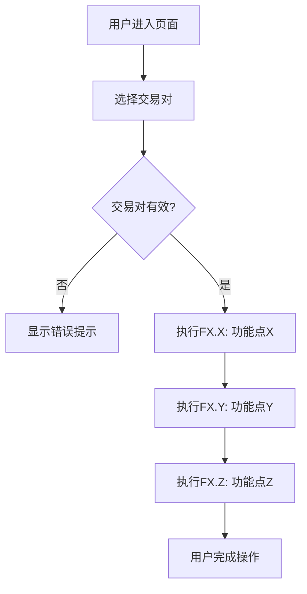

# 产品需求文档 (Product Requirements Document)

**项目名称**: [项目名称]
**文档版本**: v1.0.0
**创建日期**: YYYY-MM-DD
**最后更新**: YYYY-MM-DD
**负责人**: [Product Manager姓名]
**生命周期阶段**: P1 - 需求定义

---

## 文档状态

| 状态 | 日期 | 备注 |
|-----|------|------|
| 📝 草稿 | YYYY-MM-DD | 初始创建 |
| 🔍 审阅中 | - | - |
| ✅ 已批准 | - | Gate 1通过 |

---

## 第一部分：需求原始输入

> **说明**: 本部分由用户/业务方提供,记录原始的产品想法和业务需求

### 1.1 产品背景

**业务问题**:
```
[描述当前存在的业务问题或机会]
示例: 用户在多个DEX上查询代币价格时,需要手动切换不同平台,效率低下且容易错过最佳交易时机。
```

**目标用户**:
```
[描述主要目标用户群体]
示例: 加密货币交易员、DeFi用户、套利者
```

**核心价值主张**:
```
[用一句话描述产品的核心价值]
示例: 为用户提供一站式多DEX价格聚合查询,帮助用户快速找到最优交易价格。
```

### 1.2 初步功能描述

**用户期望功能** (原始描述):
```
[用户自己的语言描述期望的功能]

示例:
- 我希望能在一个页面上看到Uniswap、SushiSwap、PancakeSwap的价格
- 能够自动计算手续费和滑点
- 显示哪个DEX价格最优
- 能够一键跳转到对应DEX进行交易
```

### 1.3 约束与限制

**技术约束**:
- [列出已知的技术限制]

**时间约束**:
- 预期上线时间: [YYYY-MM-DD]
- MVP交付时间: [YYYY-MM-DD]

**资源约束**:
- 开发人员: [人数]
- 预算: [如适用]

---

## 第二部分：功能规格框架

> **说明**: 本部分由Product Manager基于原始输入和AI分析,结构化整理的功能规格

### 2.1 功能模块化拆解

#### 功能模块X: [模块名称]

**模块概述**: [模块要解决的核心问题和提供的价值]

**用户故事驱动拆解**:

> "[用户角色]，[需求描述]" (US-X)

拆解为以下原子功能点：

##### FX.X [功能点名称] [优先级]
**需求来源**: US-X
**功能描述**: [用1-2句话清晰描述功能要做什么]
**用户输入**:
- [输入项1]: [类型] ([必选/可选], 默认值)
- [输入项2]: [类型] ([必选/可选], 默认值)
**系统输出**:
- [输出项1]: [类型] ([描述])
- [输出项2]: [类型] ([描述])
**关键约束**:
- [约束条件1]
- [约束条件2]
**验收标准**:
- [ ] [可验证的标准1]
- [ ] [可验证的标准2]
- [ ] [可验证的标准3]
**依赖关系**: [无 / 功能点A / 功能点A, B]
**预估工时**: X人天

##### FX.Y [功能点名称] [优先级]
[同样的结构...]

### 功能点优先级汇总

| 模块 | P0功能 | P1功能 | P2功能 | 总计 |
|------|-------|-------|-------|------|
| [模块1] | X | X | X | X |
| [模块2] | X | X | X | X |
| [模块3] | X | X | X | X |
| **合计** | **X** | **X** | **X** | **X** |

### 功能依赖关系图

```
[功能点依赖关系图，使用ASCII字符绘制]
```

**依赖关系说明**:
- [说明各功能点之间的依赖关系]

---

### 2.2 交互流程与规则

#### 主流程: [流程名称]



**流程说明**:
1. **步骤1**: 用户访问页面，执行[操作]
2. **步骤2**: 系统执行FX.X [功能点名称]，获取[数据]
3. **步骤3**: 系统执行FX.Y [功能点名称]，完成[处理]
4. **步骤4**: 系统执行FX.Z [功能点名称]，输出[结果]
5. **步骤5**: 用户查看结果并完成[操作]

**异常处理**:
- **异常1**: [异常描述] → 执行FX.X时显示"[错误信息]"，[处理方式]
- **异常2**: [异常描述] → 执行FX.Y时显示"[错误信息]"，[处理方式]

#### 业务规则

| 规则ID | 规则描述 | 关联功能点 | 优先级 |
|-------|---------|-----------|-------|
| BR-001 | [业务规则1] | FX.X, FX.Y | P0 |
| BR-002 | [业务规则2] | FX.Z | P1 |

---

### 2.3 模块三：范围边界

#### In-Scope (包含在此次范围内)

✅ **必须包含**:
- [明确列出本次必须实现的功能]
- [明确列出本次必须支持的场景]

**示例**:
- ✅ 支持Ethereum主网的3个主流DEX
- ✅ 支持ERC-20代币价格查询
- ✅ 显示手续费和滑点计算
- ✅ 提供最优价格排序

#### Out-of-Scope (明确不包含)

❌ **本次不包含**:
- [明确列出本次不实现的功能]
- [说明为什么不包含,以及何时可能包含]

**示例**:
- ❌ 自动执行交易功能 (P2阶段考虑)
- ❌ 支持其他公链 (暂不支持,用户需求不强)
- ❌ 历史价格趋势图 (MVP不必要)
- ❌ 移动端App (本次仅Web版)

#### 边界条件

**支持的边界**:
- 最大查询代币对数量: [数量]
- 并发查询数量: [数量]
- 价格精度: [小数位数]

**不支持的边界**:
- [明确说明不支持的边界情况]

---

### 2.4 非功能需求

#### 性能要求

| 指标 | 目标值 | 测量方式 |
|-----|-------|---------|
| 页面加载时间 | < 2秒 | 用户视角,主流浏览器 |
| 价格查询响应时间 | < 3秒 | 从点击到显示结果 |
| 并发用户数 | ≥ 100 | 压力测试 |

#### 安全要求

- [ ] [安全要求1]
- [ ] [安全要求2]

**示例**:
- [ ] API密钥不得暴露在前端代码
- [ ] 用户输入必须经过XSS过滤
- [ ] 价格数据来源必须可验证

#### 可用性要求

- [ ] [可用性要求1]
- [ ] [可用性要求2]

**示例**:
- [ ] 支持中英文双语
- [ ] 移动端响应式设计
- [ ] 关键操作必须有加载状态提示

#### 兼容性要求

**浏览器兼容性**:
- [ ] Chrome (最新版本)
- [ ] Firefox (最新版本)
- [ ] Safari (最新版本)
- [ ] Edge (最新版本)

**设备兼容性**:
- [ ] 桌面端 (必须)
- [ ] 平板 (可选)
- [ ] 手机 (可选)

---

## 第三部分：AI分析与建议

> **说明**: 本部分由AI (Product Manager角色)生成,提供MVP功能分解和待决策清单

### 3.1 MVP核心价值定义

**一句话核心价值**:
```
[用一句话定义MVP为用户解决的唯一、最核心的问题]
```

**示例**:
```
为加密货币交易员提供多DEX价格快速对比,帮助其找到最优交易价格。
```

### 3.2 建议的MVP功能点清单

> **说明**: 将第二部分的宏观功能,分解为原子级功能点,并标记优先级

#### 📊 功能类别1: [模块名称,如:核心报价能力]

| ID | 功能点 | 优先级 | 说明 | 可推迟理由 |
|----|-------|-------|------|----------|
| FX.1 | [功能点名称] | [P0] | [功能描述] | [为什么必须包含] |
| FX.2 | [功能点名称] | [P1] | [功能描述] | [为什么可以推迟] |
| FX.3 | [功能点名称] | [P2] | [功能描述] | [为什么可以推迟] |

#### 💰 功能类别2: [模块名称]

[同样的表格结构...]

#### 🔗 功能类别3: [模块名称]

[同样的表格结构...]

---

### 3.3 待决策清单

> **说明**: 列出需要用户/团队决策的关键问题,每个问题提供2+可行方案

#### 决策点 1: [决策主题]

**问题描述**:
```
[简明扼要描述需要决策的问题]
```

**逻辑阐述 ([为何重要] & [影响范围])**:
```
[解释为什么这个决策重要]
[说明它会影响哪些方面:技术架构/用户体验/开发周期/成本等]
```

**建议方案**:

**方案A**: [方案名称]
- **描述**: [方案的具体内容]
- **实现复杂度**: [低/中/高]
- **优点**:
  - ✅ [优点1]
  - ✅ [优点2]
- **缺点**:
  - ❌ [缺点1]
  - ❌ [缺点2]
- **MVP适用性**: [最适合MVP / 适合MVP / 不适合MVP]

**方案B**: [方案名称]
- **描述**: [方案的具体内容]
- **实现复杂度**: [低/中/高]
- **优点**:
  - ✅ [优点1]
  - ✅ [优点2]
- **缺点**:
  - ❌ [缺点1]
  - ❌ [缺点2]
- **MVP适用性**: [最适合MVP / 适合MVP / 不适合MVP]

**⭐ 推荐方案**: [方案A/B]

**推荐理由**:
```
[解释为什么推荐该方案,特别说明它如何以最快方式满足MVP核心需求]
```

**决策记录**:
- **决策人**: [姓名]
- **决策日期**: [YYYY-MM-DD]
- **最终选择**: [方案A/B/其他]
- **理由**: [决策理由]

---

#### 决策点 2: [决策主题]

[重复上述结构...]

---

### 3.4 MVP范围确认

#### 功能统计

| 类别 | P0功能数 | P1功能数 | P2功能数 | 总计 |
|-----|---------|---------|---------|------|
| [类别1] | X | X | X | X |
| [类别2] | X | X | X | X |
| **合计** | **X** | **X** | **X** | **X** |

#### MVP范围建议

**建议包含** (P0功能):
- [P0功能1]
- [P0功能2]
- [P0功能3]

**建议推迟** (P1/P2功能):
- [P1功能1] - 推迟理由: [...]
- [P1功能2] - 推迟理由: [...]
- [P2功能1] - 推迟理由: [...]

#### 预估工作量

| 阶段 | 预估工时 | 说明 |
|-----|---------|------|
| 需求澄清 | 4-8h | P2阶段 |
| 技术调研 | 8-16h | P3阶段 |
| 架构设计 | 16-24h | P4阶段 |
| 开发实现 | 80-120h | P6阶段(仅P0功能) |
| 测试与审查 | 16-24h | P7阶段 |
| **总计** | **124-192h** | **约3-4周(2人)** |

---

## 附录

### A. 用户故事清单

> **说明**: 从功能点提炼出的完整User Stories列表,用于后续tasks.md组织

| ID | User Story | 优先级 | 功能点关联 |
|----|-----------|-------|-----------|
| US1 | 作为[角色],我想[需求描述] | P0 | FX.X, FX.Y |
| US2 | 作为[角色],我想[需求描述] | P1 | FX.Y, FX.Z |
| US3 | 作为[角色],我想[需求描述] | P0 | FX.X, FX.Z |

### B. 术语表

| 术语 | 定义 |
|-----|------|
| DEX | Decentralized Exchange,去中心化交易所 |
| 滑点 | Slippage,实际成交价格与预期价格的差异 |
| [术语] | [定义] |

### C. 参考资料

- [相关文档链接]
- [竞品分析链接]
- [市场调研报告]

### D. 变更历史

| 版本 | 日期 | 变更内容 | 修订人 |
|-----|------|---------|-------|
| v1.0.0 | YYYY-MM-DD | 初始版本 | [姓名] |
| v1.1.0 | YYYY-MM-DD | [变更说明] | [姓名] |

---

## 审批记录

| 角色 | 姓名 | 审批状态 | 日期 | 备注 |
|-----|------|---------|------|------|
| Product Manager | [姓名] | ✅ 已批准 | YYYY-MM-DD | - |
| Tech Lead | [姓名] | ⏳ 待审批 | - | - |
| Stakeholder | [姓名] | ⏳ 待审批 | - | - |

---

**文档状态**: 📝 草稿 / 🔍 审阅中 / ✅ 已批准
**下一阶段**: P2 - 需求澄清
**相关文档**:
- `docs/{project}/clarifications.md` (待创建)
- `docs/constitution.md`
